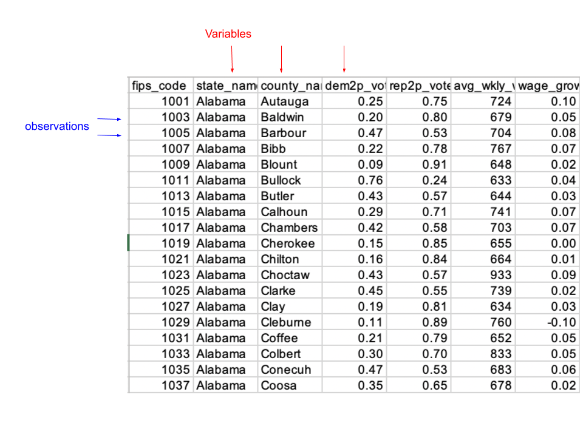

## Overview {#main-content}

In Tutorial 1 you learned the fundamental building blocks of R: objects, vectors, functions, and packages. This tutorial puts them to work on real data.

Every analysis begins the same way. You open a file, find out what is in it, and get oriented before doing anything else. What follows is that sequence, walked through once and slowly. The individual commands matter, but the routine matters more --- it is what you will repeat every time you open a data set you have not seen before.

In this tutorial you will learn:

* How to read R data files (.RData) into R using the `load()` function
* How to read comma-separated (.csv), Excel (.xlsx), and tab-delimited (.txt) files using the `import()` function from the [rio]{.package-name} package
* How to explore the structure of a data frame using `class()`, `nrow()`, `ncol()`, `names()`, `head()`, `str()`, and `summary()`
* How to access variables in a data frame using the `$` operator
* How to identify and count missing values using `is.na()` and `sum()`
* How to compare values using `==`, `>`, and `<`, and count the results with `sum()`
* How to summarize variables using `mean()`, `min()`, `max()`, and `range()`
* How to identify observations with the maximum or minimum value of a variable using `which()`
* How to create new variables and store them in a data frame
* How to save objects to an .RData file using `save()`

```{r setup, include=FALSE}
library(learnr)
library(learnrhash)
library(gradethis)
library(knitr)
library(rio)
data("unFBposts", package = "QPATutorialsCourse")
data("counties", package = "QPATutorialsCourse")
# One comments_count value is set to NA on purpose, so the Missing Values
# section can show what a gap does to a summary function. The row chosen is the
# one closest to the median, leaving the most- and least-commented posts intact.
unFBposts$comments_count[which.min(abs(unFBposts$comments_count -
                                   median(unFBposts$comments_count)))] <- NA
tutorial_options(exercise.checker = gradethis::grade_learnr, exercise.completion = FALSE)
options(help_type = "text")
knitr::opts_chunk$set(error = TRUE)
```

## Data Files

In Tutorial 1 all of the data were entered by hand. In practice, data almost always arrive as a file created by someone else --- a spreadsheet, a statistical software file, or a plain text file. Regardless of format, the data sets you will work with share a common structure: each row contains one [**observation**]{.important-text} (all the values recorded for a single case) and each column contains one [**variable**]{.important-text} (all the values of a single measurement across all cases). This is the same structure you would see in a spreadsheet. Once you start seeing data this way --- observations in rows, variables in columns --- many R commands become easier to understand. Not all data arrive arranged this way --- text, networks, and deeply nested records have shapes of their own --- but this rectangular form is the standard one for statistical analysis, and every technique in these tutorials assumes it.

The image below shows an example: each row is a county in the 2016 presidential election and each column is a variable measured for that county.

{width="70%" fig.alt="Screenshot of a data spreadsheet showing county-level election data with rows representing individual counties and columns showing variables like county name, state, population, and vote counts for the 2016 presidential election."}

R can read many common types of data file. This tutorial covers the two approaches you will use most often. The `load()` function handles R's own file format (.RData). The `import()` function from the [rio]{.package-name} package handles everything else --- comma-delimited (.csv), Excel (.xls and .xlsx), Stata (.dta), and tab-delimited (.txt) files. Separate functions exist in R for reading each of these formats individually, but `import()` handles all of them in a single consistent way, which is why we use it here.

## Loading R Data Files (Extension .RData)

R has its own file format with the extension .RData, .rdata, or .rda. Use the `load()` function to read these files into R.

::: {.important-note}
**Important:** When you load an .RData file, R creates the objects it contains automatically --- you do not assign the result of `load()` to a new object. Assigning it does not change what gets loaded --- `load()` returns only a character vector of the names of the objects it created, which is rarely useful. A file can contain more than one object, because whoever saved it can store several at once --- so it is worth finding out what is in there. To find out what objects the file contains, include `verbose = TRUE` as an argument inside `load()`.
:::

If the data file is in the same directory as your code, no path is required. If it is elsewhere on your computer, you will need to specify the full path to its location.

```{r data-loading-setup, echo=FALSE}
save(counties, file = "counties2016.RData")
```

**Run and observe 1: Load a data file**

Use the "Run Code" button to load the file and see what it contains:

```{r data-loading, exercise=TRUE, exercise.setup="data-loading-setup", exercise.cap="Run and observe 1"}
load("counties2016.RData", verbose = TRUE)
```

The `verbose = TRUE` argument is what produced that output --- without it, `load()` is completely silent. This matters in practice: if you call `load()` without `verbose = TRUE` and nothing appears to happen, R has still created the object; you just were not told its name. Using `verbose = TRUE` is a simple way to make R show the name, which is essential --- if you don't know the names of the objects a file contains, you cannot do anything with them!

Now that you know this file contains a single object called **counties**, you can examine it by typing its name. This gives you a way to check the complete contents of the data frame and make sure it is what you expect.

**Run and observe 2: Display the data**

```{r data-viewing, exercise=TRUE, exercise.cap="Run and observe 2"}
counties
```

You can navigate the output: the arrow control in the table header reveals additional variables, and the numbered page links below the table move through more observations.

## Importing Other File Types

For all other file formats, we will use the `import()` function from the [rio]{.package-name} package. It determines the file type from the extension and handles the details for you --- so the same syntax works for .csv, .xlsx, .dta, and .txt files alike.

Unlike `load()`, you must assign the result of `import()` to an object.

Because [rio]{.package-name} is not part of base R, remember to load it with `library(rio)` before calling `import()`.

The next three subsections show the file types you will encounter most often. Work through them in order the first time, then treat this section as a reference you can return to.

### Comma-Separated Files

The code below imports the file unitednations.csv, assigns it to the object **unFBposts**, and prints the contents of the object. You could name the object anything you like as long as it does not start with a number or include reserved characters like `$` and `#`.

```{r data-import-csv-setup, echo=FALSE}
write.csv(unFBposts, "unitednations.csv", row.names = FALSE)
```

**Run and observe 3: Import a CSV file**

```{r data-import-csv, exercise=TRUE, exercise.setup="data-import-csv-setup", exercise.cap="Run and observe 3"}
library(rio)
unFBposts <- import("unitednations.csv")
unFBposts
```

Notice the pattern: `import()` reads the file, `<-` stores the result in an
object, and typing the object name prints the imported data.

### Excel Files

Importing an Excel file works exactly the same way. Here the object is named **df**, short for data frame, but any valid name will do. If you want to try a different name, replace both occurrences in the code below.

```{r data2-import-csv-setup, echo=FALSE}
library(writexl)
tmp.df2 <- data.frame(
  name = c("John", "Jane", "Bob"),
  age = c(25, 30, 35),
  score = c(85, 92, 78)
)
write_xlsx(tmp.df2, "example_data.xlsx")
```

**Run and observe 4: Import an Excel file**

```{r data2-import-csv, exercise=TRUE, exercise.setup="data2-import-csv-setup", exercise.cap="Run and observe 4"}
library(rio)
df <- import("example_data.xlsx")
df
```

The code is the same as the CSV example except for the filename. This is the
main advantage of `import()`: the file extension tells R how to read the file.

### Tab-Delimited Files

Tab-delimited files have the extension .txt.

```{r data4-import-csv-setup, echo=FALSE}
txt_data <- 'year\tVEP\tVAP\ttotal\tANES\tfelons\tnoncit\toverseas\tosvoters
1980\t159635\t164445\t86515\t71\t802\t5756\t1803\tNA
1982\t160467\t166028\t67616\t60\t960\t6641\t1982\tNA
1984\t167702\t173995\t92653\t74\t1165\t7482\t2361\tNA
1986\t170396\t177922\t64991\t53\t1367\t8362\t2216\tNA
1988\t173579\t181955\t91595\t70\t1594\t9280\t2257\tNA
1990\t176629\t186159\t67859\t47\t1901\t10239\t2659\tNA
1992\t179656\t190778\t104405\t75\t2183\t11447\t2418\tNA
1994\t182623\t195258\t75106\t56\t2441\t12497\t2229\tNA
1996\t186347\t200016\t96263\t73\t2586\t13601\t2499\tNA
1998\t190420\t205313\t72537\t52\t2920\t14988\t2937\tNA
2000\t194331\t210623\t105375\t73\t3083\t16218\t2937\tNA
2002\t198382\t215462\t78382\t62\t3168\t17237\t3308\tNA
2004\t203483\t220336\t122295\t77\t3158\t18068\t3862\tNA
2008\t213314\t230872\t131304\t78\t3145\t19392\t4972\t263'
writeLines(txt_data, "turnout2.txt")
```

**Practice 5: Import a tab-delimited file**

Load [rio]{.package-name}, import "turnout2.txt", assign it to an object called **TO**, and print it. Three hints are available. Click "Submit Answer" to check your work.

```{r data4-import-csv, exercise=TRUE, exercise.setup="data4-import-csv-setup", exercise.cap="Practice 5"}

```

```{r data4-import-csv-hint-1}
# Hint 1 of 3
# You want the turnout figures held in an object you can
# come back to, and then shown on screen so you can see what
# arrived. Those are two separate steps, and the second one
# does not happen on its own.
```

```{r data4-import-csv-hint-2}
# Hint 2 of 3
# Load the package before you call import() --- rio is not
# part of base R, so its functions are not available until
# you attach it. Assign the result to TO using <-, then
# print TO by putting it on a line of its own.
```

```{r data4-import-csv-hint-3}
# Hint 3 of 3: fill in the blanks
library(___)
TO <- import("___")
TO
```

```{r data4-import-csv-check}
grade_this({
  code <- paste(.user_code, collapse = "\n")
  code_no_comments <- gsub("#[^\r\n]*", "", code)
  if (!grepl("library\\s*\\(\\s*rio\\s*\\)", code_no_comments)) {
    fail("Load the rio package first with library(rio).")
  }
  if (!grepl("import\\s*\\(", code_no_comments)) {
    fail("Use the import() function to read the file.")
  }
  if (!grepl("TO\\s*<-", code_no_comments)) {
    fail("Assign the imported data to an object named TO using <-.")
  }
  if (!grepl("TO\\s*$", trimws(code_no_comments))) {
    fail("Make sure you display TO by typing its name on the last line so the grader can check it.")
  }
  if (!inherits(.result, "data.frame")) {
    fail("Make sure you display TO by typing its name on the last line, and that you used import() to read turnout2.txt.")
  }
  if (!all(c("year", "VEP", "VAP", "total") %in% names(.result))) {
    fail("TO does not contain the expected variables. Make sure you imported turnout2.txt.")
  }
  pass("Correct! The turnout data covers US voter eligibility and turnout figures from 1980 to 2008.")
})
```

::: {.caution}
**Key distinction:** 
 Unlike `load()`, which creates objects automatically, `import()` returns a data frame that you must assign to an object yourself. Mixing these up is one of the most common early mistakes.
:::

## Learning about the Data

The first step after loading a data set is to get oriented: What kind of object is it? How large is it? What variables does it contain? We will work with **unFBposts**, which contains information about social media posts published on the United Nations Facebook page during 2015.

**Practice 6: Identify the class of unFBposts**

Three hints are available. Click "Submit Answer" to check your work.

```{r data-explore-class, exercise=TRUE, exercise.cap="Practice 6"}

```

```{r data-explore-class-hint-1}
# Hint 1 of 3
# You used this function in Tutorial 1 to check
# whether an object was numeric, character, or function.
# The same function works on any R object.
```

```{r data-explore-class-hint-2}
# Hint 2 of 3
# The function is class().
# Pass it the name of the data frame.
```

```{r data-explore-class-hint-3}
# Hint 3 of 3: fill in the blank
___(unFBposts)
```

```{r data-explore-class-check}
grade_this({
  code <- paste(.user_code, collapse = "\n")
  code_no_comments <- gsub("#[^\r\n]*", "", code)

  if (!grepl("class\\s*\\(", code_no_comments)) {
    fail("Use the class() function to check what kind of object unFBposts is.")
  }
  if (!grepl("class\\s*\\(\\s*unFBposts\\s*\\)", code_no_comments)) {
    fail("Apply class() to unFBposts. Make sure you have spelled the object name correctly.")
  }
  if (!"data.frame" %in% .result) {
    fail("Apply class() to unFBposts. The result should tell you that unFBposts is a data.frame.")
  }
  pass("Good work! Data sets read into R this way have the class data.frame.")
})
```

A [**data frame**]{.important-text} is a two-dimensional object in which each column contains values of one variable and each row contains one observation --- exactly like the spreadsheet image at the beginning of this tutorial. This is the form every data set in these tutorials will take.

### Viewing the Contents of a Data Frame

You can view a data frame by typing its name, as you have done already. In a regular RStudio session you can also use the `View()` function or double-click the object name in the Global Environment pane to open the data in a spreadsheet-style window. Note that `View()` begins with a capital letter.

**Example code: View a data frame**

This code cannot be run inside the tutorial, but shows the syntax you would use on your own machine. It opens **unFBposts** in a spreadsheet-style window.

```{r data-view, exercise=FALSE, eval=FALSE}
View(unFBposts)
```

### Determining the Number of Rows and Columns

Each row of a data frame contains one observation --- here, a unique Facebook post. The `nrow()` function returns the number of rows. We *pass it* the name of the data frame by placing the data frame name inside the parentheses.

**Run and observe 7: Count the rows**

```{r data-structure-rows, exercise=TRUE, exercise.cap="Run and observe 7"}
nrow(unFBposts)
```

Each row is one Facebook post, so this tells you how many posts the UN published in 2015. You will reach for `nrow()` constantly --- it is how you confirm a file loaded correctly and how you know how many cases you have to work with.

**Practice 8: Calculate average posts per day**

Calculate how many posts were published on average per day in 2015, assuming 365 days in the year. Let R count the posts rather than typing the number you just saw --- a calculation that reads the count from the data frame still works if the data change. Three hints are available. Click "Submit Answer" to check your work.

```{r data-howmanyposts, exercise=TRUE, exercise.cap="Practice 8"}

```

```{r data-howmanyposts-hint-1}
# Hint 1 of 3
# Each row is one post. To get the average per day
# you need the total number of posts and the number
# of days. What function counts rows in a data frame?
```

```{r data-howmanyposts-hint-2}
# Hint 2 of 3
# Use nrow() to get the total number of posts.
# Then divide by 365 to get the daily average.
```

```{r data-howmanyposts-hint-3}
# Hint 3 of 3: fill in the blank
___(unFBposts) / 365
```

```{r data-howmanyposts-check}
grade_this({
  code <- paste(.user_code, collapse = "\n")
  code_no_comments <- gsub("#[^\r\n]*", "", code)

  if (!grepl("nrow\\s*\\(", code_no_comments)) {
    fail("Use nrow() to count the number of posts, then divide by 365.")
  }
  if (!grepl("nrow\\s*\\(\\s*unFBposts\\s*\\)", code_no_comments)) {
    fail("Apply nrow() to unFBposts.")
  }
  if (!grepl("365", code_no_comments)) {
    fail("Divide the number of posts by 365 to get the daily average.")
  }
  if (is.null(.result)) {
    fail("Make sure your code produces a result the grader can check.")
  }
  if (!is.numeric(.result) || length(.result) != 1) {
    fail("Your result should be a single number.")
  }
  if (!isTRUE(all.equal(as.numeric(.result), nrow(unFBposts) / 365))) {
    fail("Check that you are dividing the number of rows in unFBposts by 365.")
  }
  pass(paste0("Correct! The UN published an average of ",
              round(nrow(unFBposts) / 365, 1),
              " posts per day on Facebook in 2015."))
})
```

Each column contains one variable. The `ncol()` function returns the number of columns in the same way that `nrow()` returns the number of rows. Knowing how many variables a data set contains is a quick sanity check: if you expected 10 variables and `ncol()` returns 7, something went wrong. It also tells you the scope of what is available before you start deciding which variables are relevant to your question.

**Practice 9: Count the columns in unFBposts**

Find out how many variables **unFBposts** contains. Three hints are available. Click "Submit Answer" to check your work.

```{r data-structure-columns, exercise=TRUE, exercise.cap="Practice 9"}

```

```{r data-structure-columns-hint-1}
# Hint 1 of 3
# You just used a function to count rows.
# There is a matching function that counts columns.
```

```{r data-structure-columns-hint-2}
# Hint 2 of 3
# The function is ncol().
# Apply it to the data frame, not to a single variable.
```

```{r data-structure-columns-hint-3}
# Hint 3 of 3: fill in the blank
___(unFBposts)
```

```{r data-structure-columns-check}
grade_this({
  code <- paste(.user_code, collapse = "\n")
  code_no_comments <- gsub("#[^\r\n]*", "", code)

  if (!grepl("ncol\\s*\\(", code_no_comments)) {
    fail("Use ncol() with the data frame name inside the parentheses.")
  }
  if (!grepl("ncol\\s*\\(\\s*unFBposts\\s*\\)", code_no_comments)) {
    fail("Apply ncol() to unFBposts. Make sure you have spelled the object name correctly.")
  }
  if (is.null(.result)) {
    fail("Make sure your code produces a result the grader can check.")
  }
  if (!is.numeric(.result) || length(.result) != 1) {
    fail("Your result should be a single number.")
  }
  if (!isTRUE(all.equal(as.numeric(.result), as.numeric(ncol(unFBposts))))) {
    fail("Apply ncol() to unFBposts. Make sure you have spelled the object name correctly.")
  }
  pass(paste0("Right! unFBposts has ", ncol(unFBposts), " variables. You will work with most of them in the exercises ahead."))
})
```

### Determining Variable Names

Before you can work with a variable you need to know two things: that it is in the data set at all, and exactly how its name is spelled. Real data rarely uses the names you would have chosen. Variables arrive abbreviated, inconsistently capitalized, or named by whoever assembled the file, and R will insist on the exact spelling when you come to use one. The `names()` function returns the column names of a data frame, which is why it is usually the first thing you run after loading one.

**Practice 10: Display the variable names in unFBposts**

Three hints are available. Click "Submit Answer" to check your work.

```{r data-explore-names, exercise=TRUE, exercise.cap="Practice 10"}

```

```{r data-explore-names-hint-1}
# Hint 1 of 3
# You want to see the names of all variables stored
# in the data frame.
```

```{r data-explore-names-hint-2}
# Hint 2 of 3
# The function is names().
# Pass it the name of the data frame.
```

```{r data-explore-names-hint-3}
# Hint 3 of 3: fill in the blank
___(unFBposts)
```

```{r data-explore-names-check}
grade_this({
  code <- paste(.user_code, collapse = "\n")
  code_no_comments <- gsub("#[^\r\n]*", "", code)

  if (!grepl("names\\s*\\(", code_no_comments)) {
    fail("Use names() on unFBposts to display the variable names.")
  }
  if (!grepl("names\\s*\\(\\s*unFBposts\\s*\\)", code_no_comments)) {
    fail("Apply names() to unFBposts. Make sure you have spelled the object name correctly.")
  }
  if (!identical(.result, names(unFBposts))) {
    fail("Apply names() to unFBposts. The result should list the variable names in the data frame.")
  }
  pass("These variable names are the handles you will use with $ throughout the rest of this tutorial.")
})
```


The table below describes what each variable measures. It is worth a close look before you proceed --- the exercises in the rest of this tutorial ask questions about these variables, and knowing what each one records will help you interpret the results.

```{r post-fields-table, results="asis", echo=FALSE}
cat('
<table id="post-fields-table" aria-labelledby="post-fields-caption">
  <caption id="post-fields-caption">
    Data set fields for social media posts: names and descriptions.
  </caption>
  <thead>
    <tr>
      <th scope="col">Name</th>
      <th scope="col">Description</th>
    </tr>
  </thead>
  <tbody>
    <tr>
      <th scope="row">type</th>
      <td>Type of post (e.g., link, photo, video).</td>
    </tr>
    <tr>
      <th scope="row">date</th>
      <td>Date when the post was published.</td>
    </tr>
    <tr>
      <th scope="row">likes_count</th>
      <td>Total number of likes on the post.</td>
    </tr>
    <tr>
      <th scope="row">comments_count</th>
      <td>Total number of comments on the post.</td>
    </tr>
    <tr>
      <th scope="row">shares_count</th>
      <td>Total number of shares of the post.</td>
    </tr>
    <tr>
      <th scope="row">month</th>
      <td>Numeric month when the post was published (1–12).</td>
    </tr>
    <tr>
      <th scope="row">url</th>
      <td>Direct URL of the post.</td>
    </tr>
    <tr>
      <th scope="row">message</th>
      <td>Text content of the post; <code>NA</code> if no text.</td>
    </tr>
  </tbody>
</table>
')
```

### The `head()` Function

After checking the size and names of a data set, the next step is to peek inside. The `head()` function displays the first few rows of a data frame. This is particularly useful for confirming the data frame contains what you expect it to contain! By default it shows 6 rows; use the `n` argument to request a different number if you want to see more of the data.

**Run and observe 11: Display the first few rows**

```{r data-explore-head1, exercise=TRUE, exercise.cap="Run and observe 11"}
head(unFBposts, n = 5)
```

When you run `head()`, check three things: first, that the column names match what you expect; second, that the values look reasonable (no obviously garbled text or impossible numbers); and third, whether any `NA` values appear in the first few rows, which would signal missing data worth investigating. Here the data look clean, but you will not always be so fortunate.

### The `str()` Function

The `str()` function displays the structure of the data frame: the number of observations and variables, the name of each variable, its type, and the first few values. The labels you will see most often are `int` (integer), `num` (numeric, which may include decimals), `chr` (character string), `Date` (a true date object), and `Factor` (a categorical variable with a fixed set of levels).

Checking variable types before you start analyzing is important because many R functions behave differently depending on whether a variable is numeric, character, or factor. A variable that looks like a number may be stored as text, and you need to know that before you try to compute a mean.

**Run and observe 12: Display the structure of unFBposts**

```{r data-explore-head2, exercise=TRUE, exercise.cap="Run and observe 12"}
str(unFBposts)
```

In the `str()` output, each variable appears on its own line. The abbreviation after the colon tells you the variable type, and the values after that show a preview of what is stored in the column. Most variables here are what you would expect: **likes_count**, **comments_count**, **shares_count**, and **month** are all `int` (integer). But look closely at `date` --- its type abbreviation may surprise you.

**Practice 13: Read a variable type from `str()` output**

```{r str-question, echo=FALSE}
question("Look at the `str()` output from the exercise above. Find the row for the **date** variable and read the type abbreviation listed next to it. What type does R report for **date**?",
  answer("chr", correct = TRUE,
         message = "This is a very common situation in real data. Dates often arrive as character strings, which means R treats them as text and cannot do arithmetic on them --- you cannot subtract one **date** from another or extract the year without first converting the variable using `as.Date()` or a similar function. `str()` is the fastest way to catch this problem before it causes unexpected errors in your analysis."),
  answer("int",
         message = "int means integer --- whole numbers, like the counts stored in likes_count. This variable holds **date** information stored as text, not as a number."),
  answer("num",
         message = "num means numeric, a value that may include decimals. This variable holds **date** information stored as text, not as a number of any kind."),
  answer("Date",
         message = "Date is what you would see if these values had been read in as true dates, and it is what you would want --- R could then subtract one **date** from another or pull out the year. That is not what happened here."),
  correct = "Right --- the **date** variable is stored as chr, plain text rather than a true **date** object.",
  allow_retry = TRUE,
  random_answer_order = TRUE,
  try_again = "Hint: Look at the `str()` output you just ran. Find the line for the **date** variable and read the abbreviation that appears immediately after the dollar sign and variable name."
)
```

### The `summary()` Function

The `summary()` function provides basic descriptive information about every variable in a data frame. For numeric variables it reports the minimum, 1st quartile (25th percentile), median, mean, 3rd quartile (75th percentile), and maximum. For character variables it reports only the length and type. Running `summary()` on a new data set gives you a quick diagnostic: you can spot impossible values (a minimum age of -3, say), confirm the scale of numeric variables, and see at a glance which variables have missing values reported as NAs in the summary output.

**Run and observe 14: Summarize unFBposts**

```{r data-explore-summary, exercise=TRUE, exercise.cap="Run and observe 14"}
summary(unFBposts)
```

Look at the numeric variables and compare the median to the mean. For **likes_count**, **shares_count**, and **comments_count**, the mean is substantially higher than the median --- a sign that a small number of posts received extremely high engagement, pulling the mean upward. 

**Practice 15: Interpret `summary()` output**

```{r summary-question, echo=FALSE}
question("Which of the following does `summary()` NOT report for a numeric variable?",
  answer("Minimum and maximum",
         message = "`summary()` does report both the minimum and maximum --- look for 'Min.' and 'Max.' in the output you just ran."),
  answer("Median",
         message = "`summary()` does report the median --- look for 'Median' in the output. The median is the middle value when all observations are sorted."),
  answer("Standard deviation", correct = TRUE,
         message = "`summary()` does not report the standard deviation. It gives you the five-number summary (min, 1st quartile, median, 3rd quartile, max) plus the mean --- enough to get an initial sense of its center, spread, and possible skew. But if you need a measure of spread, you will have to call `sd()` separately. This matters in practice: the mean and standard deviation together are the inputs to many of the statistical tests you will meet later."),
  answer("Mean",
         message = "`summary()` does report the mean for numeric variables --- look for 'Mean' in the output you just ran."),
  answer("1st and 3rd quartiles",
         message = "`summary()` does report these --- they appear as '1st Qu.' and '3rd Qu.' in the output. These mark the 25th and 75th percentiles of the data."),
  correct = "Right --- `summary()` covers center and range but omits spread measures.",
  allow_retry = TRUE,
  random_answer_order = TRUE,
  try_again = "Hint: Look at the `summary()` output you just ran and find what is listed for each numeric variable. Then check each answer option against what you see."
)
```


## Working with Variables in a Data Frame

Once you know what variables are available, you need a way to pull out the one you want to work with. To access a specific variable in a data frame, we use the [**dollar-sign operator**]{.important-text}, written `$`. The syntax is `data_frame_name$variable_name`. For example, to access the variable **type** in **unFBposts** we write `unFBposts$type`. This tells R to look inside **unFBposts** and return the column named **type**. The spelling has to be exact, including capitalization: if you ask for a variable that does not exist --- `unFBposts$Type`, say --- R returns `NULL` rather than an error message. `NULL` is R's way of representing nothing at all: not a zero, not an empty piece of text, but the absence of any object. Nothing appears to go wrong at that moment, but every calculation you build on it afterwards will fail or give nonsense, so it is worth checking the name against `names()` when a result surprises you.

**Run and observe 16: Access a variable using $**

```{r data-explore-type, exercise=TRUE, exercise.cap="Run and observe 16"}
unFBposts$type
```

Here we can see that the variable **type** records whether a post contains a note, link, photo, event, or video.

**Practice 17: Access the likes_count variable**

Use the `$` operator to print the contents of the **likes_count** variable in **unFBposts**. Recall that this variable counts the number of times a post is liked. Three hints are available. Click "Submit Answer" to check your work.

```{r data-explore-dollar, exercise=TRUE, exercise.cap="Practice 17"}

```

```{r data-explore-dollar-hint-1}
# Hint 1 of 3
# You want to access one specific variable inside
# the data frame. What operator connects the data
# frame name to the variable name?
```

```{r data-explore-dollar-hint-2}
# Hint 2 of 3
# The operator is $. Place it between the data frame
# name and the variable name, with no spaces.
```

```{r data-explore-dollar-hint-3}
# Hint 3 of 3: fill in the blanks
unFBposts$___
```

```{r data-explore-dollar-check}
grade_this({
  code <- paste(.user_code, collapse = "\n")
  code_no_comments <- gsub("#[^\r\n]*", "", code)
  if (!grepl("\\$", code_no_comments)) {
    fail("Use the $ operator to access the variable. The syntax is data_frame_name$variable_name.")
  }
  if (!grepl("unFBposts\\s*\\$\\s*likes_count", code_no_comments)) {
    fail("Make sure you are accessing the likes_count variable using unFBposts$likes_count.")
  }
  if (!identical(.result, unFBposts$likes_count)) {
    fail("Access likes_count from unFBposts using the $ operator.")
  }
  pass("The $ operator extracts the entire column as a vector --- that long list of numbers is every likes_count value in the data set, one per row. From here you can pass it to any function that works on vectors, like mean() or max().")
})
```

**Practice 18: Retrieve the first post**

Use the `$` operator and square bracket indexing together to retrieve the text of the first post (**message**) in **unFBposts**. Three hints are available. Click "Submit Answer" to check your work.

```{r text, exercise=TRUE, exercise.cap="Practice 18"}

```

```{r text-hint-1}
# Hint 1 of 3
# You need one specific value from one specific variable.
# How do you access a variable inside a data frame?
# How do you then select a single element from it?
```

```{r text-hint-2}
# Hint 2 of 3
# Use $ to access the message variable.
# Then use square bracket indexing to select
# the first element.
```

```{r text-hint-3}
# Hint 3 of 3: fill in the blank
unFBposts$message[___]
```

```{r text-check}
grade_this({
  code <- paste(.user_code, collapse = "\n")
  code_no_comments <- gsub("#[^\r\n]*", "", code)
  if (!grepl("\\$", code_no_comments)) {
    fail("Use the $ operator to access the message variable in unFBposts.")
  }
  if (!grepl("message", code_no_comments)) {
    fail("Access the message variable using unFBposts$message.")
  }
  if (!grepl("\\[\\s*1\\s*\\]", code_no_comments)) {
    fail("Use [1] to select the first element of the message variable.")
  }
  if (!identical(.result, unFBposts$message[1])) {
    fail("Access unFBposts$message and use [1] to retrieve the first entry.")
  }
  pass("Good --- combining $ with [ ] lets you pinpoint any single value in a data frame: one variable, one row.")
})
```

The first UN Facebook post in 2015 was a happy new year message. More importantly, the `$` and `[ ]` syntax gives you a way to look up any value in your data: you name the variable and the position, and R returns the result. Later you will see how to replace the fixed position with a condition --- for instance, asking for the row where likes_count is highest --- which is how you will typically use this in your own analyses.

## Missing Values

When working with real data, some observations will not have a recorded value for one or more variables. R represents these [**missing values**]{.important-text} as `NA`. Do not confuse `NA` with the `NULL` you saw earlier: `NA` marks a hole inside something that exists --- the variable is there, but one of its values was never recorded --- while `NULL` means there is nothing there at all, which is what R gives you when you ask for a variable that does not exist. You will encounter `NA` in almost every real data set you work with. That is normal; the important thing is to notice missing values and handle them deliberately.

The `is.na()` function checks each element of a vector and returns `TRUE` if the value is missing and `FALSE` if it is not. For example, `is.na(unFBposts$message)` returns a [**logical vector**]{.important-text} of TRUE and FALSE values --- one for each post --- indicating which posts have no message text.

**Run and observe 19: Check for missing values**

```{r data-explore-NAvalue, exercise=TRUE, exercise.cap="Run and observe 19"}
is.na(unFBposts$message)
```

The output is a long vector of TRUE and FALSE values. To count how many are TRUE --- that is, how many posts have no message text --- we wrap `sum()` around `is.na()`. This works because R treats TRUE as 1 and FALSE as 0 in arithmetic: `sum(c(TRUE, FALSE, TRUE, TRUE))` returns 3, just as if you had written `sum(c(1, 0, 1, 1))`. So when `sum()` is applied to a logical vector, it counts the TRUEs.

Checking for missing values is standard practice at the start of any analysis.

**Practice 20: Count missing values in the message variable**

Count how many posts are missing a value for **message**. Three hints are available. Click "Submit Answer" to check your work.

```{r data-handle-summation, exercise=TRUE, exercise.cap="Practice 20"}

```

```{r data-handle-summation-hint-1}
# Hint 1 of 3
# You need two functions working together: one to
# identify which values are missing, and one to
# count how many TRUE values that produces.
```

```{r data-handle-summation-hint-2}
# Hint 2 of 3
# R treats TRUE as 1 and FALSE as 0 in arithmetic.
# So if you have a vector of TRUE/FALSE values,
# what function would count the number of TRUEs?
```

```{r data-handle-summation-hint-3}
# Hint 3 of 3: fill in the blanks
sum(is.na(unFBposts$___))
```

```{r data-handle-summation-check}
grade_this({
  code <- paste(.user_code, collapse = "\n")
  code_no_comments <- gsub("#[^\r\n]*", "", code)

  if (!grepl("is\\.na\\s*\\(", code_no_comments)) {
    fail("You need a way to test each value for whether it is missing.")
  }
  if (!grepl("sum\\s*\\(", code_no_comments)) {
    fail("You have a way to identify the missing values --- now you need to count how many there are.")
  }
  if (!grepl("unFBposts\\s*\\$\\s*message", code_no_comments)) {
    fail("Apply this to the message variable in unFBposts.")
  }
  if (is.null(.result)) {
    fail("Make sure your code produces a result the grader can check.")
  }
  if (!is.numeric(.result) || length(.result) != 1) {
    fail("Your result should be a single number.")
  }
  if (!isTRUE(all.equal(as.numeric(.result), as.numeric(sum(is.na(unFBposts$message)))))) {
    fail("Use sum(is.na(unFBposts$message)) to count the missing values in the message variable.")
  }
  pass(paste0("Right! ", sum(is.na(unFBposts$message)),
              " posts have no message text --- these are posts that contained only an image or link with no written content."))
})
```

It is worth checking even when you expect none. A variable that appears complete may have `NA` values introduced during data cleaning or merging that you did not anticipate.

**Practice 21: Count missing values in comments_count**

Three hints are available. Click "Submit Answer" to check your work.

```{r data-handle-summation2, exercise=TRUE, exercise.cap="Practice 21"}

```

```{r data-handle-summation2-hint-1}
# Hint 1 of 3
# This follows exactly the same pattern as the
# previous exercise. Only the variable name changes.
```

```{r data-handle-summation2-hint-2}
# Hint 2 of 3
# Think about what you need to do in two steps:
# first identify which values are missing,
# then count how many. What function counts?
```

```{r data-handle-summation2-hint-3}
# Hint 3 of 3: fill in the blank
sum(___(unFBposts$___))
```

```{r data-handle-summation2-check}
grade_this({
  code <- paste(.user_code, collapse = "\n")
  code_no_comments <- gsub("#[^\r\n]*", "", code)

  if (!grepl("is\\.na\\s*\\(", code_no_comments)) {
    fail("You need a way to test each value for whether it is missing.")
  }
  if (!grepl("sum\\s*\\(", code_no_comments)) {
    fail("You have a way to identify the missing values --- now you need to count how many there are.")
  }
  if (!grepl("unFBposts\\s*\\$\\s*comments_count", code_no_comments)) {
    fail("Apply this to the comments_count variable in unFBposts.")
  }
  if (is.null(.result)) {
    fail("Make sure your code produces a result the grader can check.")
  }
  if (!is.numeric(.result) || length(.result) != 1) {
    fail("Your result should be a single number.")
  }
  if (!isTRUE(all.equal(as.numeric(.result), as.numeric(sum(is.na(unFBposts$comments_count)))))) {
    fail("Use sum(is.na(unFBposts$comments_count)) to count the missing values.")
  }
  pass(paste0("Good --- comments_count has ", sum(is.na(unFBposts$comments_count)),
              " missing value out of 1,643 posts. Small gaps are easy to overlook, which is why counting them is the first thing to do rather than the last."))
})
```

You can also count the number of values that are *not* missing. In R, the `!` symbol is the logical NOT operator --- it flips `TRUE` to `FALSE` and `FALSE` to `TRUE`. So `!TRUE` returns `FALSE` and `!FALSE` returns `TRUE`.

**Run and observe 22: See the NOT operator in action**

```{r data-not-operator, exercise=TRUE, exercise.cap="Run and observe 22"}
!TRUE
!FALSE
```

Placing `!` in front of `is.na()` flips the results --- now `TRUE` means the value is *present* and `FALSE` means it is missing. Wrapping `sum()` around that counts the non-missing values.

**Practice 23: Count non-missing values in comments_count**

Count how many posts have a recorded value for **comments_count**. Three hints are available. Click "Submit Answer" to check your work.

```{r data-handle-summation3, exercise=TRUE, exercise.cap="Practice 23"}

```

```{r data-handle-summation3-hint-1}
# Hint 1 of 3
# You want to count the values that are NOT missing.
# You have a function that identifies missing values.
# How do you reverse its output?
```

```{r data-handle-summation3-hint-2}
# Hint 2 of 3
# You just saw that ! flips TRUE to FALSE and vice
# versa. If is.na() returns TRUE for missing values,
# what does !is.na() return for missing values?
# And what does that mean for counting?
```

```{r data-handle-summation3-hint-3}
# Hint 3 of 3: fill in the blank
___(___(unFBposts$___))
```

```{r data-handle-summation3-check}
grade_this({
  code <- paste(.user_code, collapse = "\n")
  code_no_comments <- gsub("#[^\r\n]*", "", code)

  if (!grepl("!", code_no_comments)) {
    fail("Use the ! operator in front of is.na() to flip missing to non-missing.")
  }
  if (!grepl("is\\.na\\s*\\(", code_no_comments)) {
    fail("Use !is.na() to identify non-missing values.")
  }
  if (!grepl("sum\\s*\\(", code_no_comments)) {
    fail("Wrap sum() around !is.na() to count the non-missing values.")
  }
  if (!grepl("unFBposts\\s*\\$\\s*comments_count", code_no_comments)) {
    fail("Apply this to the comments_count variable in unFBposts.")
  }
  if (is.null(.result)) {
    fail("Make sure your code produces a result the grader can check.")
  }
  if (!is.numeric(.result) || length(.result) != 1) {
    fail("Your result should be a single number.")
  }
  if (!isTRUE(all.equal(as.numeric(.result), as.numeric(sum(!is.na(unFBposts$comments_count)))))) {
    fail("Use sum(!is.na(unFBposts$comments_count)) to count the non-missing values.")
  }
  pass(paste0("Exactly! ", sum(!is.na(unFBposts$comments_count)),
              " posts have a recorded comments_count value. Notice that this plus the number of missing values equals the total number of rows."))
})
```

### Handling Missing Values in Summary Functions

You met `na.rm = TRUE` in Tutorial 1, on a five-element vector you built by hand. You have just counted the gaps in two real variables: 173 in **message**, one in **comments_count**. Now see what that single gap does.

**Run and observe 24: What one missing value does**

```{r data-handle-NAvalue, exercise=TRUE, exercise.cap="Run and observe 24"}
mean(unFBposts$comments_count)
```

The result is `NA`. R is not failing --- it is declining to report a mean it cannot compute from incomplete data, and one absent value out of 1,643 was enough to trigger that. R would rather tell you it cannot answer than quietly average whatever happens to be there.

`na.rm = TRUE` is how you get a number anyway: it tells R to set the missing case aside and average the rest. What is worth pausing over is what the resulting number then describes. It is the mean among the 1,642 posts that have a recorded count, not among all 1,643 --- a small difference here, but the same argument applied to **message** would describe 1,470 posts rather than 1,643. That is why counting the gaps first is worth the few seconds it takes.

**Practice 25: Mean comments**

How many comments (**comments_count**) did posts receive on average? Include `na.rm = TRUE`. Three hints are available. Click "Submit Answer" to check your work.

```{r comments, exercise=TRUE, exercise.cap="Practice 25"}

```

```{r comments-hint-1}
# Hint 1 of 3
# You want the arithmetic average across all posts ---
# the sum of the counts divided by how many there are.
# What function computes that?
```

```{r comments-hint-2}
# Hint 2 of 3
# Use mean() on the comments_count variable.
# Access the variable using $ and include na.rm = TRUE.
```

```{r comments-hint-3}
# Hint 3 of 3: fill in the blank
___(unFBposts$___, na.rm = ___)
```

```{r comments-check}
grade_this({
  code <- paste(.user_code, collapse = "\n")
  code_no_comments <- gsub("#[^\r\n]*", "", code)

  if (!grepl("mean\\s*\\(", code_no_comments)) {
    fail("You need the function that returns an arithmetic average.")
  }
  if (!grepl("unFBposts\\s*\\$\\s*comments_count", code_no_comments)) {
    fail("Make sure the function is applied to unFBposts$comments_count.")
  }
  if (!grepl("na\\.rm\\s*=\\s*TRUE", code_no_comments)) {
    fail("Include na.rm = TRUE, as the prompt asks.")
  }
  if (is.null(.result)) {
    fail("Make sure your code produces a result the grader can check.")
  }
  if (!is.numeric(.result) || length(.result) != 1) {
    fail("Your result should be a single number.")
  }
  if (!isTRUE(all.equal(as.numeric(.result), mean(unFBposts$comments_count, na.rm = TRUE)))) {
    fail("Use mean(unFBposts$comments_count, na.rm = TRUE).")
  }
  pass(paste0("Good work! Posts received an average of ",
              round(mean(unFBposts$comments_count, na.rm = TRUE), 1),
              " comments among the posts that have a recorded value. That is what na.rm = TRUE gives you --- the mean across the cases with values, not across all 1,643 posts."))
})
```

**Practice 26: The smallest, largest, and full range of comments**

Find the smallest and largest number of comments (**comments_count**) any post received, and then get both at once. Put each function call on its own line, including `na.rm = TRUE` in each. Three hints are available. Click "Submit Answer" to check your work.

```{r practice-min-max-range-comments, exercise=TRUE, exercise.lines=5, exercise.cap="Practice 26"}

```

```{r practice-min-max-range-comments-hint-1}
# Hint 1 of 3
# You need three separate calls on the same variable:
# one that returns the smallest value, one that returns
# the largest, and one that returns both endpoints
# together. You met all three in Tutorial 1.
```

```{r practice-min-max-range-comments-hint-2}
# Hint 2 of 3
# The three functions are min(), max(), and range().
# Each takes unFBposts$comments_count as its first argument
# and na.rm = TRUE as its second. Put each call on its
# own line.
```

```{r practice-min-max-range-comments-hint-3}
# Hint 3 of 3: fill in the blanks
min(unFBposts$___, ___ = ___)
___(unFBposts$comments_count, na.rm = TRUE)
___(unFBposts$comments_count, na.rm = TRUE)
```

```{r practice-min-max-range-comments-check}
grade_this({
  code <- paste(.user_code, collapse = "\n")
  code_no_comments <- gsub("#[^\r\n]*", "", code)

  for (fn in c("min", "max", "range")) {
    call_pattern <- paste0("\\b", fn,
                           "\\s*\\(\\s*unFBposts\\s*\\$\\s*comments_count\\s*,\\s*na\\.rm\\s*=\\s*TRUE\\s*\\)")
    if (!grepl(paste0("\\b", fn, "\\s*\\("), code_no_comments)) {
      fail(paste0("Include a call to ", fn, "() for comments_count."))
    }
    if (!grepl(call_pattern, code_no_comments)) {
      fail(paste0("Check your ", fn,
                  "() call --- it should be applied to unFBposts$comments_count with na.rm = TRUE."))
    }
  }
  if (is.null(.result)) {
    fail("Make sure your code produces a result the grader can check.")
  }
  if (!is.numeric(.result) || length(.result) != 2) {
    fail("Put range() on the last line so the grader sees two values: the minimum and the maximum.")
  }
  if (!isTRUE(all.equal(.result, range(unFBposts$comments_count, na.rm = TRUE)))) {
    fail("Check that each call uses comments_count and na.rm = TRUE.")
  }
  pass(paste0("Exactly! Comments ran from ",
              min(unFBposts$comments_count, na.rm = TRUE), " to ",
              max(unFBposts$comments_count, na.rm = TRUE),
              ". Notice that range() returned those same two numbers in one call --- and that a zero here means no recorded comments, not necessarily no reaction of any kind."))
})
```

## Comparison Operators

In the previous section you saw that `is.na()` returns a logical vector --- one TRUE or FALSE for every element --- and that wrapping `sum()` around it counts the TRUEs. That pattern is far more general than missing data. Any comparison you can write produces a logical vector, and `sum()` counts it the same way.

R provides a family of [**comparison operators**]{.important-text} for asking these questions:

- `==` tests whether two values are equal
- `>` and `<` test whether one value is greater than or less than another
- `>=` and `<=` test greater-or-equal and less-or-equal

The [**equality operator**]{.important-text} `==` deserves particular attention because it is easy to confuse with `=`, which assigns a value. Writing `x == 5` asks "is x equal to 5?" Writing `x = 5` sets x to 5. Using one where you meant the other is a common source of errors that R cannot warn you about, because both are valid code.

Comparisons work on whole variables the same way arithmetic did in Tutorial 1: R applies the comparison to every element and returns one TRUE or FALSE per observation. So `unFBposts$shares_count > unFBposts$likes_count` returns TRUE for every post where shares outnumber likes, and `sum()` counts how many posts that is.

**Run and observe 27: Compare two variables**

```{r comparison-operators, exercise=TRUE, exercise.cap="Run and observe 27"}
head(unFBposts$shares_count > unFBposts$likes_count)
sum(unFBposts$shares_count > unFBposts$likes_count, na.rm = TRUE)
```

The first line shows the logical vector itself for the first six posts; the second counts the TRUEs across all of them. Note the `na.rm = TRUE`: a comparison involving `NA` returns `NA` rather than TRUE or FALSE, so without it the count would be `NA` whenever any value is missing.

Comparison operators become far more useful once they are combined with `which()`, which is where the next section begins.

## Indexing in a Data Frame

In Tutorial 1 you learned to index vectors using a single number inside square brackets. Data frames add one extra layer because they have rows and columns, so indexing requires two numbers separated by a comma: `data_frame[row, column]`. The row number comes first, the column number second.

**Run and observe 28: Access a single cell**

The code below returns the value in row 3, column 2 of **unFBposts**. Use the "Run Code" button to see what it returns.

```{r data-explore-index1, exercise=TRUE, exercise.cap="Run and observe 28"}
unFBposts[3, 2]
```

The variable `date` is in column 2, so this returns the date of the third post in the data set.

To retrieve all values of a variable you can leave the row position blank, which tells R "give me all rows." You can also specify a range of rows using a colon, and you can use the variable name in quotes instead of the column number.

**Run and observe 29: Access a range of rows from a named column**

```{r data-explore-index2, exercise=TRUE, exercise.cap="Run and observe 29"}
unFBposts[10:15, "type"]
```

Notice that the output labels the first result `[1]` even though you extracted rows 10 through 15. R always relabels the output starting from `[1]` regardless of which rows you selected --- the content is correct even though the position labels reset.

## Finding the Case with the Highest or Lowest Value

You will often want to find the specific observation that has the highest or lowest value of some variable --- for example, which Facebook post received the most likes. This requires combining three ideas you already know: `max()` to find the maximum value, `==` to test equality, and square bracket indexing to extract the result.

The key idea is: first find the row you want, then retrieve the variable you
want from that row or rows.

Recall from the previous section that `==` tests whether two values are equal, returning TRUE or FALSE for every element it is applied to.

The `which()` function takes a logical vector of TRUE and FALSE values and returns the index positions where the value is TRUE. So `which(x == 5)` returns the positions in x where the value equals 5.

Putting it together, the code below finds the message that received the most likes:

```
unFBposts$message[which(unFBposts$likes_count == max(unFBposts$likes_count, na.rm = TRUE))]
```

When code is nested like this, read it from the inside out: first find the maximum, then find the row or rows with that maximum, then retrieve the message from there. Note that `which()` returns every position where the condition is TRUE, not just the first. If two posts tie for the most likes, both messages come back --- so this pattern gives you all the matching cases, which is not always a single one. Here is what each part does:

- `max(unFBposts$likes_count, na.rm = TRUE)` finds the largest value in the likes_count column, ignoring any missing values.
- `unFBposts$likes_count == max(...)` compares every value in likes_count to that maximum, producing a vector of TRUE and FALSE values --- TRUE wherever the value matches the maximum.
- `which(...)` extracts the row index or indices where that comparison is TRUE --- that is, the row(s) where likes_count equals its maximum.
- `unFBposts$message[which(...)]` uses those row indices to retrieve the corresponding message text.

**Run and observe 30: Find the most-liked message**

```{r data-explore-index3, exercise=TRUE, exercise.cap="Run and observe 30"}
unFBposts$message[which(unFBposts$likes_count == max(unFBposts$likes_count, na.rm = TRUE))]
```

The code has connected a numerical extreme back to the case it describes. You will use this pattern frequently to identify which state, country, or other case has the highest or lowest value of a given variable.

**Practice 31: Find the most-shared message**

Now retrieve the message text of the post or posts with the most shares. Use **shares_count** to identify the row and **message** to retrieve the text. Three hints are available. Click "Submit Answer" to check your work.

```{r data-explore-index4_1, exercise=TRUE, exercise.cap="Practice 31"}

```

```{r data-explore-index4_1-hint-1}
# Hint 1 of 3
# You want the message text from the post with the
# most shares. Think about what you need to find first
# before you can retrieve the message.
```

```{r data-explore-index4_1-hint-2}
# Hint 2 of 3
# The pattern from the Run and observe above applies here.
# You need to identify which row has the maximum
# shares_count, then use that row to get the message.
# Which variable tells you the number of shares?
# Which variable contains the text?
```

```{r data-explore-index4_1-hint-3}
# Hint 3 of 3: fill in the blanks
unFBposts$___[which(unFBposts$___ == max(unFBposts$___, na.rm = TRUE))]
```

```{r data-explore-index4_1-check}
grade_this({
  correct <- unFBposts$message[which(unFBposts$shares_count == max(unFBposts$shares_count, na.rm = TRUE))]

  code <- paste(.user_code, collapse = "\n")
  code_no_comments <- gsub("#[^\r\n]*", "", code)

  if (!grepl("which\\s*\\(", code_no_comments)) {
    fail("Use which() to find the row with the maximum shares_count.")
  }
  if (!grepl("max\\s*\\(", code_no_comments)) {
    fail("You need the largest value of shares_count before you can locate its row.")
  }
  if (!grepl("unFBposts\\s*\\$\\s*shares_count", code_no_comments)) {
    fail("Use shares_count to identify the row with the most shares.")
  }
  if (!grepl("unFBposts\\s*\\$\\s*message", code_no_comments)) {
    fail("Retrieve the message variable to get the text of the post.")
  }
  if (!identical(.result, correct)) {
    fail("Check that you are using shares_count to find the row and message to retrieve the text.")
  }
  pass("Well done! Notice the subject matter of the most-shared post. Sharing can indicate active circulation in a way that liking does not, so shares and likes may tell somewhat different stories about engagement.")
})
```

To find the number of shares that post received rather than its text, we apply the same row-selection logic but retrieve **shares_count** instead of **message**.

**Run and observe 32: Find the maximum shares value**

```{r data-explore-index4_2, exercise=TRUE, exercise.cap="Run and observe 32"}
unFBposts$shares_count[which(unFBposts$shares_count == max(unFBposts$shares_count, na.rm = TRUE))]
```

Here the variable used to find the row and the variable retrieved from it are the same one, so `max()` on its own would have returned that number directly. The row-selection pattern earns its keep when the two differ --- when you want the value of one variable from the row identified by another.

**Practice 33: Find the likes_count for the most-shared post**

Using the same row-selection logic, find the number of likes received by the post or posts with the most shares. This time retrieve **likes_count** instead of **shares_count**. Three hints are available. Click "Submit Answer" to check your work.

```{r data-explore-index4_3, exercise=TRUE, exercise.cap="Practice 33"}

```

```{r data-explore-index4_3-hint-1}
# Hint 1 of 3
# You want to know how many likes the most-shared post
# received. You already know how to find which row has
# the most shares. What changes when you want likes
# instead of the message text?
```

```{r data-explore-index4_3-hint-2}
# Hint 2 of 3
# The row-finding logic stays the same --- you still
# use shares_count to identify the row.
# Only the variable you retrieve at the start changes.
```

```{r data-explore-index4_3-hint-3}
# Hint 3 of 3: fill in the blank
unFBposts$___[___(unFBposts$shares_count == ___(unFBposts$shares_count, na.rm = TRUE))]
```

```{r data-explore-index4_3-check}
grade_this({
  correct <- unFBposts$likes_count[which(unFBposts$shares_count == max(unFBposts$shares_count, na.rm = TRUE))]

  code <- paste(.user_code, collapse = "\n")
  code_no_comments <- gsub("#[^\r\n]*", "", code)

  if (!grepl("which\\s*\\(", code_no_comments)) {
    fail("You need to identify which row holds the maximum shares_count.")
  }
  if (!grepl("max\\s*\\(", code_no_comments)) {
    fail("You need the maximum value of shares_count before you can locate its row.")
  }
  if (!grepl("unFBposts\\s*\\$\\s*shares_count", code_no_comments)) {
    fail("Check that shares_count is the variable used to locate the row.")
  }
  if (!grepl("unFBposts\\s*\\$\\s*likes_count", code_no_comments)) {
    fail("Retrieve likes_count to find how many likes that post received.")
  }
  if (!isTRUE(all.equal(.result, correct))) {
    fail("Check which variable you are retrieving and which one you are using to locate the row.")
  }
  pass(paste0("Exactly! The most-shared post received ",
              unFBposts$shares_count[which(unFBposts$shares_count == max(unFBposts$shares_count, na.rm = TRUE))],
              " shares and ",
              correct,
              " likes. A post can be widely shared without being widely liked --- sharing and liking measure different kinds of engagement."))
})
```

## Creating a New Variable in a Data Frame

You can create a new variable inside an existing data frame using the `$` operator combined with `<-`. The syntax is `data_frame$new_variable <- expression`. The expression on the right side can combine any variables already in the data frame, as long as each one is also referenced with `$`. This is one of the places where R starts to feel genuinely useful: you are no longer just inspecting data, you are constructing the variables your research question actually requires. 

The code below creates a variable called **like.or.share** that adds likes and shares together for each post. Note that no output appears --- assignment never prints a result.

```{r prepare-like-or-share, echo=FALSE}
unFBposts$like.or.share <- unFBposts$likes_count + unFBposts$shares_count
```

**Run and observe 34: Create a new variable**
  
```{r data-create-variable1, exercise=TRUE, exercise.setup="prepare-like-or-share", exercise.cap="Run and observe 34"}
unFBposts$like.or.share <- unFBposts$likes_count + unFBposts$shares_count
```

We can check the first few values of the new variable using `head()`.

**Run and observe 35: Inspect the new variable**
  
```{r data-create-variable2, exercise=TRUE, exercise.setup="prepare-like-or-share", exercise.cap="Run and observe 35"}
head(unFBposts$like.or.share)
```

This check confirms that the new variable exists and that R calculated one value
for each row of the data frame.

**Practice 36: Create an attention variable**

Create a variable called **attention** inside **unFBposts** that adds together likes (**likes_count**) and comments (**comments_count**) --- the two forms of engagement that happen directly on the post itself, as opposed to sharing it elsewhere. Then display the first few values using `head()`. Three hints are available. Click "Submit Answer" to check your work.

```{r data-create-variable, exercise=TRUE, exercise.cap="Practice 36"}

```

```{r data-create-variable-hint-1}
# Hint 1 of 3
# You want a new variable stored inside the data frame,
# not a separate object. How do you refer to a variable
# inside a data frame? How do you create a new one?
```

```{r data-create-variable-hint-2}
# Hint 2 of 3
# Use the $ operator to both create the new variable
# and to access the two existing variables.
# The new variable name goes on the left of <-.
# The two variables to add go on the right.
```

```{r data-create-variable-hint-3}
# Hint 3 of 3: fill in the blanks
unFBposts$attention <- unFBposts$___ + unFBposts$___
head(unFBposts$attention)
```

```{r data-create-variable-check}
grade_this({
  correct_attention <- unFBposts$likes_count + unFBposts$comments_count

  code <- paste(.user_code, collapse = "\n")
  code_no_comments <- gsub("#[^\r\n]*", "", code)

  if (!grepl("unFBposts\\s*\\$\\s*attention\\s*(<-|=[^=])", code_no_comments)) {
    fail("Create the new variable as unFBposts$attention using the $ operator.")
  }
  if (!grepl("unFBposts\\s*\\$\\s*likes_count", code_no_comments)) {
    fail("Make sure you are including likes_count in your sum.")
  }
  if (!grepl("unFBposts\\s*\\$\\s*comments_count", code_no_comments)) {
    fail("Make sure you are including comments_count in your sum.")
  }
  if (grepl("shares_count", code_no_comments)) {
    fail("attention should combine likes and comments only --- shares_count is not included here.")
  }
  if (!grepl("head\\s*\\(", code_no_comments)) {
    fail("Display the first few values using head() after creating the variable.")
  }
  if (length(.result) == 0) {
    fail("Your code returned nothing at all. That usually means a variable name does not match --- check that the name you create is spelled exactly the same as the name you use afterwards.")
  }
  if (!isTRUE(all.equal(.result, head(correct_attention)))) {
    fail("attention should equal likes_count + comments_count for each post. Check your formula.")
  }
  pass("Nicely done! Now you have three engagement variables: like.or.share (likes + shares), attention (likes + comments), and later you will create full.engagement (all three). Each captures a slightly different aspect of how posts connect with audiences.")
})
```


## Saving the Data

Objects you create in an R session exist only in the current workspace. When you close R, they disappear unless you save them explicitly. R will ask whether you want to save the workspace when you exit --- always say no. Saving the entire workspace with `save.image()` creates clutter, makes your work hard to reproduce, and can cause confusion when you return to a project after a break. Instead, save only the specific objects you need using the `save()` function.

`save()` takes the names of one or more objects to save, and a `file` argument specifying the name and location of the output file.

**Example code: Save a data frame**

This code cannot be run inside the tutorial, but shows the syntax you would use on your own machine. Replace the file path with the location where you want to save your file.

```{r data-save, exercise=FALSE, eval=FALSE}
save(unFBposts, file = "my_data.RData")
```

Note that `save()` only saves the objects you name explicitly. If you created other objects in your session that are not listed, they will not be included in the file. To save several at once, list them all before the `file` argument --- `save(unFBposts, counties, file = "my_data.RData")` --- which is why a single .RData file can contain more than one object.

## Check Your Understanding

The following exercises ask you to combine skills from across this tutorial. Each one requires you to connect more than one idea --- there is no single line from the tutorial that serves as a direct template. That is the point: real data work usually means recognizing which pieces belong together.

**Apply 37: Count the posts with the fewest comments**

How many posts tied for the fewest comments (**comments_count**) of any post in the data set? This one needs `na.rm = TRUE` twice, in two different calls --- work out where each belongs and why. Three hints are available. Click "Submit Answer" to check your work.

```{r apply-least-liked, exercise=TRUE, exercise.cap="Apply 37"}

```

```{r apply-least-liked-hint-1}
# Hint 1 of 3
# You need two things: the smallest value that
# comments_count takes, and a count of how many posts
# have exactly that value. You have already counted
# the TRUEs in a logical vector earlier in this tutorial.
```

```{r apply-least-liked-hint-2}
# Hint 2 of 3
# Comparing comments_count to its own smallest value
# produces a logical vector --- TRUE for every post
# that matches. Wrapping that comparison in a
# counting function gives you the answer.
```

```{r apply-least-liked-hint-3}
# Hint 3 of 3: fill in the blanks
sum(unFBposts$___ == min(unFBposts$___, na.rm = TRUE), na.rm = TRUE)
# Read the parentheses to see which call each na.rm belongs to.
# The inner one is inside min(), so min() ignores the gap when
# finding the smallest value. The outer one is inside sum() but
# outside min(), because the comparison returns NA for the post
# with no recorded count, and sum() would otherwise return NA too.
```

```{r apply-least-liked-check}
grade_this({
  correct <- sum(unFBposts$comments_count == min(unFBposts$comments_count, na.rm = TRUE), na.rm = TRUE)
  fewest  <- min(unFBposts$comments_count, na.rm = TRUE)

  code <- paste(.user_code, collapse = "\n")
  code_no_comments <- gsub("#[^\r\n]*", "", code)

  if (!grepl("sum\\s*\\(", code_no_comments)) {
    fail("You need a way to count how many posts meet a condition.")
  }
  if (!grepl("min\\s*\\(", code_no_comments)) {
    fail("You need the smallest value of comments_count before you can count how many posts match it.")
  }
  if (!grepl("unFBposts\\s*\\$\\s*comments_count", code_no_comments)) {
    fail("Use comments_count --- that is the variable holding the number of comments.")
  }
  if (length(gregexpr("na\\.rm\\s*=\\s*TRUE", code_no_comments)[[1]]) < 2 ||
      gregexpr("na\\.rm\\s*=\\s*TRUE", code_no_comments)[[1]][1] == -1) {
    fail("This one needs na.rm = TRUE twice --- once inside min(), and once inside sum() but outside min().")
  }
  if (is.null(.result)) {
    fail("Make sure your code produces a result the grader can check.")
  }
  if (!is.numeric(.result) || length(.result) != 1) {
    fail("Your result should be a single number. If you are seeing NA, check whether both na.rm arguments are in place.")
  }
  if (!isTRUE(all.equal(as.numeric(.result), as.numeric(correct)))) {
    fail("Check that you are comparing comments_count to its own smallest value.")
  }
  pass(paste0("Exactly --- ", correct, " posts tied at ", fewest,
              " comments. Both na.rm arguments earned their place here: without the inner one min() returns NA, and without the outer one the comparison against the post with no recorded count leaves sum() returning NA as well."))
})
```


**Apply 38: Find the month of the most-commented post**

In which month (**month**) was the most-commented post (**comments_count**) published? Retrieve the **month** value for the post or posts with the maximum **comments_count**. Include `na.rm = TRUE`. Three hints are available. Click "Submit Answer" to check your work.

```{r apply-month-comments, exercise=TRUE, exercise.cap="Apply 38"}

```

```{r apply-month-comments-hint-1}
# Hint 1 of 3
# You want to know the month of a specific post ---
# the one with the most comments. You need to find
# which row has the maximum comments_count, then
# retrieve month from that row.
```

```{r apply-month-comments-hint-2}
# Hint 2 of 3
# The which() + max() pattern identifies the row.
# But this time you retrieve a different variable
# (month) than the one used to find the row
# (comments_count). You have done exactly this
# in an earlier exercise.
```

```{r apply-month-comments-hint-3}
# Hint 3 of 3
# The structure is:
# variable_you_want[which(selection_variable == max(selection_variable, na.rm = TRUE))]
# What variable do you want? What variable do you
# use to find the row?
```


```{r apply-month-comments-check}
grade_this({
  correct <- unFBposts$month[which(unFBposts$comments_count == max(unFBposts$comments_count, na.rm = TRUE))]

  code <- paste(.user_code, collapse = "\n")
  code_no_comments <- gsub("#[^\r\n]*", "", code)

  if (!grepl("which\\s*\\(", code_no_comments)) {
    fail("You need to identify which row holds the maximum comments_count.")
  }
  if (!grepl("max\\s*\\(", code_no_comments)) {
    fail("Use max() to find the largest value of comments_count.")
  }
  if (!grepl("unFBposts\\s*\\$\\s*comments_count", code_no_comments)) {
    fail("Use comments_count inside which() to identify the most-commented post.")
  }
  if (!grepl("unFBposts\\s*\\$\\s*month", code_no_comments)) {
    fail("Retrieve the month variable to find when the post was published.")
  }
  if (!grepl("na\\.rm\\s*=\\s*TRUE", code_no_comments)) {
    fail("Include na.rm = TRUE, as the prompt asks.")
  }
  if (!isTRUE(all.equal(.result, correct))) {
    fail("Check that you are using comments_count inside which() and retrieving month.")
  }
  pass(paste0("Nice work! The most-commented post was published in month ",
              correct,
              ". This cross-variable retrieval pattern --- find the row with one variable, retrieve a different variable --- is one you will use frequently with state and country data."))
})
```

**Apply 39: Create a variable and find its maximum**

Create a new variable called `full.engagement` in **unFBposts** that sums **likes_count**, **shares_count**, and **comments_count**. Then retrieve the **message** text of the post or posts with the highest total engagement. Include `na.rm = TRUE` in your `max()` call. Three hints are available. Click "Submit Answer" to check your work.

```{r apply-total-engagement, exercise=TRUE, exercise.cap="Apply 39"}

```

```{r apply-total-engagement-hint-1}
# Hint 1 of 3
# This exercise needs two lines of code:
# one to create the new variable and one
# to retrieve the message.
# You have done both tasks separately earlier ---
# now you need to chain them together.
```

```{r apply-total-engagement-hint-2}
# Hint 2 of 3
# Part 1: create full.engagement as the sum of
# the three engagement variables using $ and <-.
# Part 2: use which() and max() on full.engagement
# to retrieve the message text.
```

```{r apply-total-engagement-hint-3}
# Hint 3 of 3
# Part 1 structure:
# unFBposts$full.engagement <- unFBposts$___ + unFBposts$___ + unFBposts$___
# Part 2: use the which() + max() pattern from earlier in the tutorial
# variable_you_want[which(selection_variable == max(selection_variable, na.rm = TRUE))]
```


```{r apply-total-engagement-check}
grade_this({
  expected_engagement <- unFBposts$likes_count + unFBposts$shares_count + unFBposts$comments_count
  correct <- unFBposts$message[which(expected_engagement == max(expected_engagement, na.rm = TRUE))]

  code <- paste(.user_code, collapse = "\n")
  code_no_comments <- gsub("#[^\r\n]*", "", code)

  if (!grepl("unFBposts\\s*\\$\\s*full\\.engagement\\s*(<-|=[^=])", code_no_comments)) {
    fail("Create a variable called full.engagement inside unFBposts using $.")
  }
  if (!grepl("unFBposts\\s*\\$\\s*likes_count", code_no_comments)) {
    fail("Include likes_count in the sum for full.engagement.")
  }
  if (!grepl("unFBposts\\s*\\$\\s*shares_count", code_no_comments)) {
    fail("Include shares_count in the sum for full.engagement.")
  }
  if (!grepl("unFBposts\\s*\\$\\s*comments_count", code_no_comments)) {
    fail("Include comments_count in the sum for full.engagement.")
  }
  if (!grepl("which\\s*\\(", code_no_comments)) {
    fail("You need to identify which row holds the maximum full.engagement.")
  }
  if (!grepl("max\\s*\\(", code_no_comments)) {
    fail("Use max() to find the largest value of full.engagement.")
  }
  if (!grepl("unFBposts\\s*\\$\\s*message", code_no_comments)) {
    fail("Retrieve the message variable to get the text of the post.")
  }
  if (!grepl("na\\.rm\\s*=\\s*TRUE", code_no_comments)) {
    fail("Include na.rm = TRUE, as the prompt asks.")
  }
  if (length(.result) == 0) {
    fail("Your code returned nothing at all. That usually means a variable name does not match --- check that the name you create is spelled exactly the same as the name you use afterwards.")
  }
  if (!identical(.result, correct)) {
    fail("Check that full.engagement sums all three variables, and that you are locating the row with its largest value.")
  }
  pass("Well done! That is the post with the highest combined engagement across all three measures. You just created a variable and immediately used it --- exactly what you will do when recoding and analyzing variables in real data sets.")
})
```

**Apply 40: Count posts where shares exceed likes**

How many posts received more shares (**shares_count**) than likes (**likes_count**)? Combine `>` with `sum()` to count them, and include `na.rm = TRUE`. Two hints are available. Click "Submit Answer" to check your work.

```{r apply-shares-exceed-likes, exercise=TRUE, exercise.cap="Apply 40"}

```

```{r apply-shares-exceed-likes-hint-1}
# Hint 1 of 2
# You need a count of posts meeting a condition.
# Earlier you used sum(is.na(...)) to count TRUE
# values in a logical vector. The same idea applies
# here, but the condition is different.
# Order matters: which variable goes on the left of
# the > depends on which one you want to be larger.
```

```{r apply-shares-exceed-likes-hint-2}
# Hint 2 of 2: fill in the blanks
sum(unFBposts$___ > unFBposts$___, na.rm = TRUE)
```

```{r apply-shares-exceed-likes-check}
grade_this({
  correct <- sum(unFBposts$shares_count > unFBposts$likes_count, na.rm = TRUE)

  code <- paste(.user_code, collapse = "\n")
  code_no_comments <- gsub("#[^\r\n]*", "", code)

  if (!grepl("sum\\s*\\(", code_no_comments)) {
    fail("Use sum() to count the posts meeting the condition.")
  }
  if (!grepl(">", code_no_comments)) {
    fail("Use the > operator to compare shares_count and likes_count.")
  }
  if (!grepl("unFBposts\\s*\\$\\s*shares_count", code_no_comments)) {
    fail("Include shares_count in your comparison.")
  }
  if (!grepl("unFBposts\\s*\\$\\s*likes_count", code_no_comments)) {
    fail("Include likes_count in your comparison.")
  }
  if (!grepl("na\\.rm\\s*=\\s*TRUE", code_no_comments)) {
    fail("Include na.rm = TRUE so missing values are ignored.")
  }
  if (is.null(.result)) {
    fail("Make sure your code produces a result the grader can check.")
  }
  if (!is.numeric(.result) || length(.result) != 1) {
    fail("Your result should be a single number.")
  }
  if (!isTRUE(all.equal(as.numeric(.result), as.numeric(correct)))) {
    fail("Check the order of your comparison --- shares_count > likes_count means shares on the left, likes on the right.")
  }
  pass(paste0("Correct! Only ", correct, " posts received more shares than likes --- sharing is far rarer than liking. ",
              "The > operator combined with sum() is a powerful pattern for counting observations that meet any numeric condition."))
})
```

The remaining questions ask you to step back from writing code and reason about what R is doing. In each one the code runs --- the problem is that the result is not what the person thinks it is.

Start with the distinction between the two ways of getting data into R.

**Apply 41: Diagnose a failed load**

```{r question-load-vs-import, echo=FALSE}
question("A student runs `counties <- load(\"counties2016.RData\")` and then runs `nrow(counties)`, which returns `NULL` instead of a number. What went wrong?",
  correct = "Right. The result of `load()` should not be assigned.",
  answer("The assignment replaced the loaded data frame with the name that `load()` returns.", correct = TRUE,
         message = "`load()` did its job and created a data frame called **counties**. But it also returns the *name* of what it created, as text, and the assignment stored that text under the same name --- so **counties** now holds a character string, and `nrow()` returns `NULL` because a string has no rows. Nothing is lost: the file is untouched, and running `load(\"counties2016.RData\")` without the assignment brings the data frame back. Remember the rule as: `load()` you run, `import()` you assign."),
  answer("The file did not contain a data frame, so there was nothing for `nrow()` to count.",
         message = "The file did contain a data frame. If it had not, `load()` would still have created whatever objects were inside it, and `verbose = TRUE` would have shown you their names."),
  answer("The result of `load()` still needs `import()` applied to it before it can be used.",
         message = "These two functions are alternatives, not steps in a sequence. `import()` reads non-R file formats such as .csv and .dta; it is never applied to the result of `load()`."),
  answer("`verbose = TRUE` was missing, so R did not finish reading the file.",
         message = "`verbose = TRUE` only controls whether `load()` prints the names of the objects it created. It has no effect on whether the file is read or the objects are created."),
  allow_retry = TRUE,
  random_answer_order = TRUE,
  try_again = "Think about what `load()` returns, and about what the assignment operator stores. Note that the object created by `load()` and the object named on the left of the arrow happen to share a name here."
)
```

Next, look closely at what an expression is actually retrieving.

**Apply 42: Diagnose a retrieval that returns the wrong thing**

```{r question-cross-variable-retrieval, echo=FALSE}
question("A student wants to know the **month** of the most-shared post and writes `unFBposts$shares_count[which(unFBposts$shares_count == max(unFBposts$shares_count, na.rm = TRUE))]`. The code runs and returns a number. Why is that number not the answer?",
  correct = "Right. The expression retrieves from the wrong variable.",
  answer("The variable in front of the brackets should be **month**, not **shares_count**.", correct = TRUE,
         message = "This pattern has two slots and they do different jobs. The variable inside `which()` locates the row --- that is the variable whose maximum you care about. The variable in front of the brackets is what gets retrieved from that row, and it can be any variable in the data frame. Here both slots hold **shares_count**, so the code correctly finds the most-shared post and then reports its share count, which the student already knew. Changing only the first slot to **month** gives the answer."),
  answer("`which()` returns a row number, so the expression returns the position of the post rather than its month.",
         message = "`which()` does return a row number, but that number is used inside the square brackets to select from a variable. What comes back is the value stored at that position --- here a share count, not a position."),
  answer("`which()` is unnecessary, since `max()` already returns the value the student wants.",
         message = "`max()` returns the largest share count, which is not what the student wants either. `which()` is what converts a maximum value into the row where it occurs, and the row is what lets you retrieve a different variable."),
  answer("The comparison should use `>` rather than `==`.",
         message = "`>` would return every row above some threshold rather than the rows holding the maximum. `==` is correct here: it matches whichever row or rows have a value equal to the maximum."),
  allow_retry = TRUE,
  random_answer_order = TRUE,
  try_again = "Separate the variable used to locate the row from the variable whose value is retrieved."
)
```

Finally, check the mapping between the shape of a data frame and what its numbers mean.

**Apply 43: Evaluate a claim about a data set**

```{r question-rows-vs-columns, echo=FALSE}
question("A student loads a new data set, runs `ncol()`, gets 15, and writes: \"This data set contains 15 observations.\" What is wrong with that sentence?",
  correct = "Right. `ncol()` counts variables, not observations.",
  answer("`ncol()` counts columns, which are variables. Observations are rows, counted with `nrow()`.", correct = TRUE,
         message = "Rows are cases and columns are measurements --- that mapping underlies everything else you will do with data. A data set of 15 variables might have 50 observations or 50,000, and `ncol()` says nothing about which. It is worth running both functions whenever you open a new file: `nrow()` tells you how many cases you have to work with, and `ncol()` tells you how many measurements are available on each one."),
  answer("The number is right; the student should have written \"cases\" rather than \"observations.\"",
         message = "\"Cases\" and \"observations\" mean the same thing, so that substitution would not fix anything. The problem is the number itself: 15 is the count of variables."),
  answer("`ncol()` excludes the identifying first column, so the data set actually has 14 observations.",
         message = "`ncol()` counts every column, including any identifier. And whatever it counts, it is counting variables --- adjusting the number would not turn it into a count of observations."),
  answer("Nothing is wrong --- R reports the variable count first, so 15 is the number of observations.",
         message = "There is no such reversal. `nrow()` returns rows and `ncol()` returns columns, and rows are the observations. `str()` shows both at once if you want to check quickly."),
  allow_retry = TRUE,
  random_answer_order = TRUE,
  try_again = "Recall what rows and columns represent in a data frame."
)
```

## The Takeaways

This tutorial introduced you to the core skills of working with real data in R --- loading files, exploring structure, accessing variables, comparing and counting values, handling missing values, creating new variables, and saving your work. These steps form the opening sequence of every data analysis task you will undertake.

Every data set you work with in these tutorials will be a [**data frame**]{.important-text}: a rectangle in which each row holds one [**observation**]{.important-text} --- a single case --- and each column holds one [**variable**]{.important-text} --- one measurement recorded across all cases. That mapping is worth fixing in your mind now, because it determines what each function here is counting. `nrow()` counts cases; `ncol()` counts measurements. Confusing the two is the quickest way to misdescribe a data set.

How you **load data** depends on the file type, and the distinction is worth committing to memory. R data files (.RData) are loaded with `load()`, which creates objects in your workspace automatically --- you do not assign the result. The other formats covered here are imported with `import()` from the [rio]{.package-name} package, and you must assign the result to an object yourself using `<-`. Mixing up these two approaches is one of the most common early mistakes: if you try to assign the result of `load()`, what you get is the names of the objects rather than the data; if you forget to assign the result of `import()`, the data are printed but not stored in an object you can use later.

**Exploring a new data set** always begins with the same set of functions. Think of these as your standard opening checklist:

- `class()` --- confirms the object is a data frame
- `nrow()` and `ncol()` --- tell you how many observations and variables you have
- `names()` --- lists the variable names
- `head()` --- shows the first few rows
- `str()` --- shows variable types and a preview of values
- `summary()` --- provides descriptive statistics for every variable at once

Running these functions at the start of any new project takes only a minute and saves you from surprises later.

The [**dollar-sign operator**]{.important-text} `$` is how you access a variable inside a data frame: `data_frame$variable_name`. The spelling must be exact --- ask for a variable that does not exist and R returns `NULL` rather than an error.

[**Missing values**]{.important-text} are represented as `NA` in R. Use `is.na()` to identify them, `sum(is.na(...))` to count them, and `sum(!is.na(...))` to count non-missing values. The `!` operator flips TRUE to FALSE and FALSE to TRUE --- a simple idea that comes up constantly in data work.

Once you have a variable, you can apply summary functions to it directly. The four you used here --- `mean()`, `min()`, `max()`, and `range()` --- all accept `na.rm = TRUE`. You will need it whenever a variable has any missing values, but remember what the result then describes: the summary among the cases that have values, not among all of them.

[**Comparison operators**]{.important-text} like `>` (greater than), `<` (less than), and `==` (equal to) return logical vectors of TRUE and FALSE. Wrapping `sum()` around a comparison counts the number of TRUE values --- a simple but powerful pattern for counting observations that meet any condition.

**Finding specific observations** requires combining `which()` with a logical condition. The pattern `variable[which(variable == max(variable, na.rm = TRUE))]` identifies the case or cases with the highest value and retrieves whatever you ask for from those rows. The retrieved variable does not have to be the same as the one used to find the row --- you can find the row using **shares_count** and retrieve **month**, for example. You will use this cross-variable retrieval pattern frequently when working with state- or country-level data.

**Creating new variables** follows the syntax `data_frame$new_variable <- expression`, where the expression can combine any existing variables using arithmetic. Always use `$` to reference variables on both sides of `<-` so R knows where to find them and where to store the result.

**Saving your work** is deliberate rather than automatic. Objects exist only in the current session, and `save()` writes the ones you name to an .RData file: `save(object, file = "name.RData")`. Save the specific objects you need rather than the whole workspace, and decline when R offers to save the workspace on exit.

If this felt like a lot of small steps, that is exactly right. Data analysis begins with small checks: load the file, inspect the object, look at the variables, check for missing values, and only then start creating or analyzing variables. With practice, this opening routine will become familiar.

## Submit Your Work

When you have completed all exercises in this tutorial, generate your submission code using the button below. Copy the full code that appears and paste it into the Canvas submission box for this tutorial. The code can be long --- make sure you have copied all of it before submitting.

```{r encode-logic-02, context="server"}
learnrhash::encoder_logic()
```

```{r encode-ui-02, echo=FALSE}
learnrhash::encoder_ui(
  ui_before = shiny::div(
    shiny::p("Click the button below to generate your submission code.
              Copy the full code and paste it into Canvas.")
  )
)
```

```{r tutorial-success-banner-02, results="asis", echo=FALSE}
cat('
<p class="tutorial-complete"
   role="status"
   aria-label="Good work! You are building real data skills.">
  <span aria-hidden="true">🎉</span>
  Good work! You are building real data skills.
</p>
')
```
