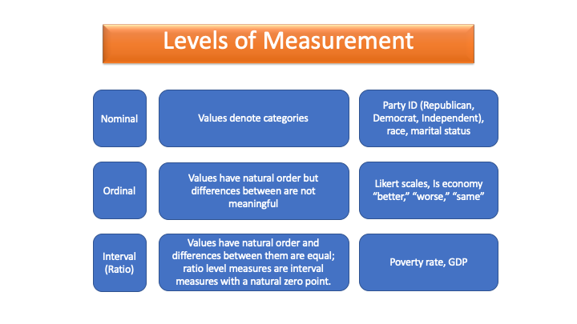

## Overview {#main-content}

Unlike the other tutorials in this series, this tutorial contains no coding exercises. Instead, it uses multiple-choice questions to help you learn and practice identifying the level of measurement of a variable. Read each section carefully before attempting the question that follows. You can retry any question as many times as you like. The goal is not to memorize a label for each example, but to practice asking what the values of a variable actually mean.

::: {.important-note}
**Why this matters:** Every analytical decision you make this semester --- how to describe a variable, which summary statistics to compute, which hypothesis test to use --- depends on correctly identifying the level of measurement of the variables involved. Time spent here will pay off in every tutorial that follows, because this is one of the first decisions analysts make before choosing a method.
:::

In this tutorial you will learn:

* The definition of a variable
* How to define the levels of measurement
* How to recognize the level of measurement of a variable
* How to distinguish a concept from the variable that measures it
* Why analysts sometimes treat ordinal variables as interval, and what that assumes

```{r setup, include=FALSE}
library(learnr)
library(learnrhash)
library(knitr)
knitr::opts_chunk$set(error = TRUE)
```

## Variables

The purpose of data analysis is to find meaning in data and use it to answer questions. In this class, we usually take data sets as given, but every data set reflects earlier choices about what to measure and how to measure it. Those choices matter. A data set is useful only to the extent that its variables capture the concepts we care about. The variables in these data sets are the building blocks for every analysis we will do.

What is a variable? A [**variable**]{.important-text} is a measured characteristic that represents part of a broader concept we care about. For example, the concept of political participation might be measured with variables such as whether someone voted, how often they attend meetings, or how much they donated to a campaign. A variable has a name and must take multiple values across cases; otherwise, it is a constant. The values are often numeric, even when those numbers stand in for labels. Variables may be classified by their level of measurement.


## Levels of Measurement

Over the course of this semester, we will describe individual variables and analyze relationships between variables. The appropriate method depends on how each variable is measured. The [**level of measurement**]{.important-text} tells us what the values of a variable mean: whether they are unordered categories, ordered categories, or numbers with equal distances between them. Generally, we distinguish between three levels of measurement: **nominal**, **ordinal**, and **interval**. (Interval variables that have a true zero point are sometimes called ratio variables, but in this course we treat ratio as a subtype of interval and use the term interval throughout.)


## Nominal Variables

[**Nominal variables**]{.important-text} take qualitative values that denote categories. A nominal variable's values are labels or names that categorize observations with respect to the attribute being measured. *There is no intrinsic order to the categories.* If rearranging the categories would not change their meaning, you are probably looking at a nominal variable.

A variable that measures individual partisan status as "Democrat," "Independent," "Republican," or "Other/None" is an example of a nominal variable. Note that you can code nominal variables with numbers, but the numbers themselves are meaningless, and the order they are assigned is arbitrary: if we labeled the values of partisan status 1, 2, 3, and 4, respectively, it would not imply "Democrat" is less than "Independent" or "Republican" is less than "Other/None."

Two-category nominal variables, such as whether a respondent in a survey voted for president in the most recent election (coded "yes" or "no"), are often referred to as [**binary**]{.important-text} or [**dichotomous**]{.important-text} variables.

**Practice 1: Identify the nominal-level variables**

```{r nominal-variable-question, echo=FALSE}
question("Which of the following variables are nominal level measures? Select all that apply.",
  correct = "Right. Nominal variables take values that are unordered category labels. The key test is whether rearranging the categories would change their meaning. For electoral outcomes (Trump vs. Clinton) and government types (parliamentary, presidential, mixed, not democratic), no arrangement carries any inherent meaning --- the categories are simply different, not ranked.",
  answer("Whether an individual has not completed high school, has a high school degree, has attended some college, has a college degree, or has a postgraduate degree.",
         message = "The education variable is not nominal --- its categories are rank-ordered, with each representing a higher level of attainment than the one before it. That makes education level an ordinal variable."),
  answer("Whether a state's electoral votes were assigned to Donald Trump or Hillary Clinton", correct = TRUE,
         message = "The Trump/Clinton electoral vote variable is nominal. Its two values are unordered categories --- there is no sense in which one candidate's outcome is more or less than the other's, only different. Two-category nominal variables like this are also called binary or dichotomous."),
  answer("The number of protest events in the week following George Floyd's death",
         message = "The protest event count variable is not nominal --- its values are counts, not category labels. Count variables are interval-level because the values are ordered and the differences between them are equal."),
  answer("Whether a country has a parliamentary, presidential, or mixed democratic system, or is not democratic", correct = TRUE,
         message = "The democratic system variable is nominal. Its four categories --- parliamentary, presidential, mixed, and not democratic --- are unordered labels. Coding them 1, 2, 3, 4 would be arbitrary; no arrangement of these categories carries any inherent meaning."),
  allow_retry = TRUE,
  random_answer_order = TRUE,
  try_again = "Hint: There are two nominal variables in this list. Look for variables whose values are unordered category labels."
)
```

R has a special class of variable called a factor that may be used for nominal variables, but not all nominal variables will automatically be assigned this class. When a nominal variable is stored as a factor, R will treat it as categorical, which can be useful when summarizing or modeling the data. (We will discuss factors more in a later tutorial.)

## Ordinal Variables

[**Ordinal variables**]{.important-text} take values with a natural order or rank, but the differences between those ranks are not equal. The order matters, but the exact size of the steps between categories does not.

An example of an ordinal variable is a variable that measures whether someone views the national economy today compared to a year ago as "better," "about the same," or "worse." We can be confident that "worse" is less positive than "about the same," which is less positive than "better," but we cannot treat those categories like numbers on a scale. We do not know how far apart the categories are, so it would not make sense to say that "better" is twice as good as "about the same" or three times better than "worse."

As another example, consider income categories on a survey where the variable takes a value of 1 for incomes less than $20,000, 2 for incomes $20,000 to $49,999, 3 for incomes $50,000 to $99,999, 4 for incomes $100,000 to $199,999, 5 for incomes $200,000--$499,999, and 6 for incomes $500,000 or more. Higher numbers mean more income, but the interval between a respondent in category 1 and 2 is not the same as between category 4 and 5. This is the key feature of ordinal measures: *the order is meaningful, but the interval between values is not equal*. Put differently, the step from one category to the next does not represent the same amount of income throughout the scale.

Most of the time, an ordinal variable will be coded with numeric rather than character values. R does have an ordered factor class, but we will not use it in this course.

**Practice 2: Identify the ordinal-level variables**

```{r ordinal-variable-question, echo=FALSE}
question("Which of the following variables are ordinal level measures? Select all that apply.",
  correct = "Right. Ordinal variables have values that can be ranked, but the gaps between adjacent ranks are not necessarily equal. Both Freedom House ratings and satisfaction scales impose a clear order --- more free is better, more satisfied is higher --- but neither guarantees that the psychological or political distance between adjacent categories is the same throughout the scale.",
  answer("Whether a county's population is majority white, Black, Hispanic, or some other race",
         message = "The racial majority variable is nominal, not ordinal. Its categories cannot be rank-ordered --- there is no sense in which one racial majority is more or less than another."),
  answer("Whether Freedom House labels a country as free, partly free, or not free", correct = TRUE,
         message = "The Freedom House variable is ordinal. Its three categories are clearly ordered --- free is better than partly free, which is better than not free --- but the differences between them are not equal units. We cannot say 'partly free' is exactly halfway between 'free' and 'not free.'"),
  answer("A nation's level of inflation",
         message = "Inflation is not ordinal --- it is measured as a percentage, so the values are ordered and the differences between them are equal. One percentage point of inflation is the same size everywhere on the scale. That makes inflation interval-level."),
  answer("Whether an individual is very satisfied, somewhat satisfied, neither satisfied nor dissatisfied, somewhat dissatisfied, or very dissatisfied with the direction the country is headed", correct = TRUE,
         message = "The satisfaction variable is ordinal. Its five response options can be ranked from most to least satisfied, but the psychological distance between adjacent categories is not necessarily equal --- that is the defining feature of an ordinal scale."),
  allow_retry = TRUE,
  random_answer_order = TRUE,
  try_again = "Hint: There are two ordinal variables in this list. Look for variables whose values can be ranked but whose gaps between ranks are not necessarily equal."
)
```

Note that both nominal and ordinal level variables are considered [**categorical**]{.important-text} variables because their values fall into categories.


## Interval Variables

An [**interval variable**]{.important-text} takes values that have a natural order **and** the differences between values are equal. Examples include anything measured in dollars, like GDP; percentages, like unemployment; or anything that you can count, like the number of terrorist acts. For interval variables, subtraction makes sense: the difference between 4 and 5 has the same meaning as the difference between 10 and 11.

A special type of interval variable, often given its own level of measurement, is a [**ratio variable**]{.important-text}. A ratio variable is a type of interval variable that has a natural zero point. Almost all the interval variables we work with in the social sciences are also ratio variables. For simplicity, we will simply refer to these variables as interval-level.

Interval variables may be [**discrete**]{.important-text} or [**continuous**]{.important-text}. A variable measured in whole numbers is discrete. A variable that can take decimal values is continuous. R may describe numeric variables using storage labels such as `int`, `num`, or `dbl`, depending on how the data are stored and displayed. These R storage labels are useful for understanding how R sees the data, but they are not the same thing as a variable's level of measurement.


**Practice 3: Identify the interval-level variables**

```{r interval-variable-question, echo=FALSE}
question("Which of the following variables are interval (or ratio) level measures? Select all that apply.",
  correct = "Right. Interval variables are ordered and the distances between values are equal throughout the scale. Foreign direct investment in dollars and homicide rates both satisfy this: an additional million dollars of FDI is the same size regardless of the baseline, and one additional homicide per 100,000 people means the same thing whether you are comparing countries at 1 or at 20 per 100,000.",
  answer("Whether a state's governor is a Republican or Democrat or something else",
         message = "The gubernatorial partisanship variable is nominal, not interval. Its values denote categories that cannot be rank-ordered."),
  answer("The level of foreign direct investment in a country measured in dollars", correct = TRUE,
         message = "The foreign direct investment variable is interval-level. It is measured in dollars, so the values are ordered and the differences between them are equal --- an increase of one million dollars is the same size everywhere on the scale."),
  answer("Whether an individual approves, neither approves nor disapproves, or disapproves of the president's handling of the economy",
         message = "The presidential approval variable measured this way is ordinal, not interval. Its three categories are ranked, but the psychological distance between adjacent categories is not necessarily equal."),
  answer("The homicide rate in a country in a year", correct = TRUE,
         message = "The homicide rate variable is interval-level. A rate is a count per unit of population, so the values are ordered and the differences between them are equal --- a difference of one homicide per 100,000 people is the same size anywhere on the scale."),
  allow_retry = TRUE,
  random_answer_order = TRUE,
  try_again = "Hint: There are two interval variables in this list. Look for variables measured in dollars, percentages, or counts where equal differences carry equal meaning."
)
```


::: {.tip}
**Quick classification rule:** Ask three questions. Are the values unordered category labels? If yes, the variable is nominal. If the values are ordered, ask whether the differences between values are meaningful and equal. If the ordered values do not have equal distances, the variable is ordinal. If the ordered values do have meaningful, equal distances, the variable is interval.
:::

## Additional Considerations

There are two important considerations that can lead to confusion in determining the level of measurement of a variable. The first is that the same *concept* can often be measured at multiple levels of measurement. The second is that in some cases ordinal variables are treated as interval-level variables.

### Concept versus Variable

A [**concept**]{.important-text} is an idea such as "support for the president" or "income inequality." When a concept is operationalized, or measured, the result is a variable. A **variable** is the measure of a concept. Analysts may choose to measure concepts in a variety of ways. Income inequality in a country might be measured using the GINI index or the share of total income going to a particular income group, for example. The degree of political polarization in the United States over time might be measured as the difference in the percentage of Democrats and Republicans who support a particular public policy, e.g., the death penalty, gun control, or abortion rights. Or it might be measured as the proportion of survey respondents who agree that the other party is "a threat to the Nation's well-being."

Thus, a concept does not have a level of measurement. Instead, how a concept is measured determines the level of measurement of a variable. This is why the same idea can show up in different statistical forms.

Consider support for Donald Trump in US counties in 2016:

**Practice 4: Identify the measurement level for a binary majority indicator**

```{r majority-measurement-question, echo=FALSE}
question("What level of measurement would a variable be if it was coded as whether or not a majority of the county vote was cast for Donald Trump?",
  correct = "Right. When there are only two unordered categories, the variable is nominal --- and specifically binary or dichotomous. The key test is always whether the values can be meaningfully ranked. Here they cannot.",
  answer("Ordinal",
         message = "The values of this variable are not rank-ordered, so it is not ordinal. There is no sense in which 'yes' is more or less than 'no' --- the two values are just different categories."),
  answer("Nominal", correct = TRUE,
         message = "This is a binary nominal variable. The values --- majority for Trump or not --- are unordered categories. There is no sense in which one is more or less than the other, only different."),
  answer("Interval",
         message = "The values of this variable are categories --- yes or no --- not numbers with equal distances between them. Interval variables require meaningful, equal-sized gaps between values."),
  answer("Ratio",
         message = "A ratio variable is an interval variable with a true zero point, so the question only arises once a variable is already interval-level. This one is not: its values are unordered categories, which makes it nominal."),
  allow_retry = TRUE,
  random_answer_order = TRUE,
  try_again = "Hint: Think about whether the two values --- majority for Trump or not --- can be rank-ordered. Is one value higher or lower than the other, or are they just different categories?"
)
```

**Practice 5: Identify the measurement level for a percentage**

```{r percentage-measurement-question-1, echo=FALSE}
question("What level of measurement would a variable be if it was coded as the percentage of the vote cast for Donald Trump?",
  correct = "Right. Notice the contrast with the previous question: the same underlying concept --- support for Trump --- produces a nominal variable when measured as a binary indicator, but an interval variable when measured as a continuous percentage. The level of measurement depends on how the concept is operationalized, not on the concept itself.",
  answer("Nominal",
         message = "The values this variable takes are ordered and the differences between them are meaningful, so it is not nominal. Nominal values are unordered category labels."),
  answer("Ordinal",
         message = "The values this variable takes are ordered and the differences between them are meaningful and equal --- a county at 60% is exactly 10 points higher than one at 50%. That equal-interval property makes it interval-level, not ordinal."),
  answer("Interval", correct = TRUE,
         message = "Vote share is an interval variable. It is ordered and the differences between values are equal --- a one-percentage-point difference in vote share is the same size anywhere on the scale."),
  answer("Ratio",
         message = "This is a defensible answer in a stricter classification --- a vote percentage does have a true zero point, which is what distinguishes ratio from interval. As the Levels of Measurement section noted, this course treats ratio as a subtype of interval and uses the term interval throughout, so Interval is the answer we are looking for here."),
  allow_retry = TRUE,
  random_answer_order = TRUE,
  try_again = "Hint: Ask whether the values are ordered and whether the differences between them are equal throughout the scale."
)
```

Consider the political ideology of members of Congress:

**Practice 6: Classify the 1--7 ideology scale**

```{r scale-measurement-question, echo=FALSE}
question("What level of measurement would a variable measuring ideology have if it was coded based on responses to the question: On a scale of 1 to 7, where 1 is very liberal and 7 is very conservative, where would you place yourself?",
  correct = "Right. This scale and the next question measure the same concept --- ideology --- at different levels. Keep that in mind as you answer the next question.",
  answer("Nominal",
         message = "The values this variable takes are ordered from most liberal to most conservative, so it is not nominal. Nominal values are unordered category labels."),
  answer("Ordinal", correct = TRUE,
         message = "The values run from most liberal to most conservative, but the differences between adjacent points are not necessarily equal --- a move from 3 to 4 does not necessarily represent the same ideological shift as a move from 6 to 7. Note that analysts often treat scales like this as interval-level in practice, as discussed in the next section."),
  answer("Interval",
         message = "The values are ordered, but the differences between adjacent points are not necessarily equal, so this scale is technically ordinal. That said, as the next section discusses, analysts often treat scales like this as interval-level --- a pragmatic choice that requires acknowledging the assumption."),
  answer("Ratio",
         message = "A ratio variable is an interval variable with a true zero point. This scale is not interval to begin with --- the distances between adjacent points are not necessarily equal --- so the question of a true zero never arises. The scale is ordinal."),
  allow_retry = TRUE,
  random_answer_order = TRUE,
  try_again = "Hint: The values are clearly rank-ordered from most liberal to most conservative. Ask whether the differences between adjacent points are necessarily equal."
)
```

**Practice 7: Identify the measurement level for a voting-with-leadership percentage**

```{r percentage-measurement-question-2, echo=FALSE}
question("What level of measurement would a variable measuring ideology have if the variable was coded as the percent of times a member of Congress voted with the Republican leadership?",
  correct = "Right. The same concept --- political ideology --- produced an ordinal variable when measured as a 1-to-7 self-placement scale, but an interval variable when measured as a percentage. This is the central lesson of the Concept versus Variable section: the level of measurement belongs to the variable, not to the concept.",
  answer("Nominal",
         message = "The values this variable takes are ordered and the differences between them are meaningful, so it is not nominal. Nominal values are unordered category labels."),
  answer("Ordinal",
         message = "The values this variable takes are ordered and the differences between them are meaningful and equal --- a member who votes with leadership 70% of the time is exactly 10 points higher than one at 60%. That equal-interval property makes it interval-level, not ordinal."),
  answer("Interval", correct = TRUE,
         message = "A percentage is interval-level. A member who votes with leadership 70% of the time is exactly 10 points higher than one who does so 60% of the time --- the differences are equal throughout the scale."),
  answer("Ratio",
         message = "A percentage does have a true zero point, which is what separates ratio from interval in a stricter classification. This course folds ratio into interval and uses the term interval throughout, so Interval is the answer we are looking for."),
  allow_retry = TRUE,
  random_answer_order = TRUE,
  try_again = "Hint: Ask whether the values are ordered and whether a one-point difference carries the same meaning anywhere on the scale."
)
```

### Ordinal Variables Are Sometimes Treated as Interval Variables

One final complication is worth naming directly: analysts sometimes treat an ordinal variable as if it were measured at the interval level. Consider the level of education coded as whether an individual has not completed high school, has a high school degree, has attended some college, has a college degree, or has a postgraduate degree. Often analysts treat the differences between categories *as if* they are equal. This is particularly common when the number of ranked values a variable takes is large. In some cases such treatment may be justified, but it is important to recognize that in treating an ordinal variable as an interval-level variable, an analyst is assuming that the differences between values are equal.

## Check Your Understanding

The following questions ask you to apply what you have learned about levels of measurement. Each question requires you to connect more than one idea --- think carefully about what the variable's values actually represent before choosing an answer. If you get one wrong, read the feedback to identify which part of the distinction tripped you up.

**Apply 8: Distinguish ordinal and interval variables**

```{r apply-ordinal-interval-question, echo=FALSE}
question("What is the key difference between an ordinal variable and an interval variable?",
  correct = "Right. Order is what separates both from nominal variables. Equal distances are what separates interval from ordinal. Because ordinal gaps are not guaranteed to be equal, arithmetic on ordinal values is not justified unless the analyst makes the additional assumption that the gaps can be treated as approximately equal --- you cannot meaningfully add or subtract ordinal categories the way you can add or subtract percentages or counts.",
  answer("Ordinal variables use words, while interval variables always use numbers.",
         message = "Not necessarily. Ordinal variables are often coded with numbers --- income categories coded 1 through 6, for example. What matters is not the label type but whether the distances between values are meaningful and equal."),
  answer("Ordinal variables have ordered values, but the distances between values are not necessarily equal; interval variables have ordered values with meaningful, equal distances.", correct = TRUE,
         message = "This is the key distinction. Both types of variable have ordered values. The difference is whether the distance between adjacent values can be interpreted as equal throughout the scale."),
  answer("Ordinal variables have no order, while interval variables do.",
         message = "Variables with no order are nominal, not ordinal. Ordinal variables do have a meaningful order --- that is what makes them ordinal. The distinction from interval is about equal distances, not the presence of order."),
  answer("Ordinal variables can only have two categories, while interval variables can have many values.",
         message = "Two-category variables are binary or dichotomous --- a type of nominal variable. Ordinal variables can have many categories. The distinction from interval is about equal distances between values, not the number of categories."),
  allow_retry = TRUE,
  random_answer_order = TRUE,
  try_again = "Hint: Both types have ordered values. Focus on what distinguishes them: ask whether the gaps between adjacent values are equal and meaningful."
)
```

**Apply 9: Compare measures of the same concept**

```{r apply-same-concept-question, echo=FALSE}
question("Suppose the concept is support for stricter gun laws. Which pair correctly classifies two different ways to measure that concept?",
  correct = "Right. Neither measure is inherently better than the other --- the choice depends on what you want to measure and what questions you want to answer. A binary item tells you which side of a divide someone falls on; a percentage tells you how much support exists across a population. Same concept, different information.",
  answer("Support or oppose stricter gun laws: interval; percentage of survey respondents in a state who support stricter gun laws: nominal.",
         message = "This reverses the classifications. A binary support/oppose variable is a two-category nominal variable, not interval. A percentage is interval-level because the differences between values are ordered and equal."),
  answer("Support or oppose stricter gun laws: nominal; percentage of survey respondents in a state who support stricter gun laws: interval.", correct = TRUE,
         message = "Support or oppose is a two-category nominal variable --- the two values are unordered categories. With only two unordered response options, we treat this as binary nominal. A percentage is interval-level because the values are ordered and the differences between them are equal."),
  answer("Strongly oppose, oppose, neither, support, strongly support: nominal; support or oppose: ordinal.",
         message = "The five-category scale is ordinal because the categories can be ranked, but the gaps between them are not necessarily equal. Support or oppose is a two-category nominal variable, not ordinal."),
  answer("Percentage of survey respondents in a state who support stricter gun laws: ordinal because higher percentages mean more support.",
         message = "Higher percentages do mean more support, but that alone does not make the variable ordinal. Percentages are also equal-interval --- a difference of 10 percentage points is the same size anywhere on the scale. That makes this measure interval-level."),
  allow_retry = TRUE,
  random_answer_order = TRUE,
  try_again = "Hint: Classify each measure separately. For the binary measure, ask whether the two values are unordered categories or a ranked scale. For the percentage, ask whether the values are ordered and whether equal differences carry equal meaning."
)
```

**Apply 10: Recognize an assumption about ordinal variables**

```{r apply-ordinal-as-interval-question, echo=FALSE}
question("When an analyst treats an ordinal variable as if it were interval-level, what assumption is the analyst making?",
  correct = "Right. This is common and often defensible in political science --- particularly for scales with many ordered points, like a 7-point ideology scale --- but it is always an assumption that should be stated explicitly, not a fact that can be taken for granted.",
  answer("That the categories have no meaningful order.",
         message = "That would describe a nominal variable. Ordinal variables do have a meaningful order --- that order is what makes treating them as interval-level a reasonable starting point rather than a random one."),
  answer("That the distances between categories can be treated as equal enough for the analysis.", correct = TRUE,
         message = "This is the assumption. The analyst is saying that even though the distances between ordered categories are not guaranteed to be equal, they are close enough to equal that treating them as such will not seriously distort the analysis."),
  answer("That the variable has only two categories.",
         message = "A two-category variable is binary or dichotomous --- a type of nominal variable. The ordinal-as-interval assumption applies to variables with many ranked categories, not just two."),
  answer("That the numbers assigned to the categories are arbitrary labels.",
         message = "Arbitrary numeric labels describe nominal variables --- for example, coding party affiliation as 1, 2, 3. For ordinal variables, the numbers carry order information. The ordinal-as-interval assumption goes further, treating those ordered numbers as if they also carry equal-distance information."),
  allow_retry = TRUE,
  random_answer_order = TRUE,
  try_again = "Hint: The variable is already acknowledged to be ordinal, so the analyst knows the values are rank-ordered. What additional property is the analyst assuming exists?"
)
```


## The Takeaways

The level of measurement of a variable determines how we describe its central features and how we analyze relationships between variables. Every method we use this semester begins with this step: identifying what kind of variable we are working with.

Three levels cover everything you will meet this semester. A [**nominal**]{.important-text} variable takes unordered category labels --- rearranging them changes nothing. An [**ordinal**]{.important-text} variable takes values with a meaningful order, but with no guarantee that adjacent steps are the same size. An [**interval**]{.important-text} variable takes ordered values whose differences are equal throughout the scale, which is what makes subtraction meaningful.

The quick classification rule from the end of the interval section is worth keeping in mind as a practical checklist: start with order, then ask about equal distances. When in doubt, slow down and ask what the values actually represent --- are they labels, ranks, or numbers with equal gaps between them?

The hardest cases are often not about memorizing definitions, but about noticing how a concept has been measured. Support for a candidate, satisfaction with democracy, or political ideology can be measured in more than one way. Your task is always to classify the variable in front of you, not the broader concept behind it.

The image below summarizes the three levels of measurement, gives a short description of each, and provides an example.

{width="70%" fig.alt="Infographic summarizing three levels of measurement. The nominal section says categories are labels or names with no intrinsic order and gives partisan identification as an example. The ordinal section says values have a natural order but unequal distances and gives political ideology as an example. The interval-ratio section says values are ordered with equal differences between them and gives inflation as an example."}

## Submit Your Work

When you have completed all exercises in this tutorial, generate your submission code using the button below. Copy the full code that appears and paste it into the Canvas submission box for this tutorial. The code can be long --- make sure you have copied all of it before submitting.

```{r encode-logic-03, context="server"}
learnrhash::encoder_logic()
```

```{r encode-ui-03, echo=FALSE}
learnrhash::encoder_ui(
  ui_before = shiny::div(
    shiny::p("Click the button below to generate your submission code.
              Copy the full code and paste it into Canvas.")
  )
)
```

```{r tutorial-success-banner-03, results="asis", echo=FALSE}
cat('
<p class="tutorial-complete"
   role="status"
   aria-label="Nicely done! You can now identify and distinguish levels of measurement, a foundation you will use throughout the course.">
  <span aria-hidden="true">🎉</span>
  Nicely done! You can now identify and distinguish levels of measurement, a foundation you will use throughout the course.
</p>
')
```
