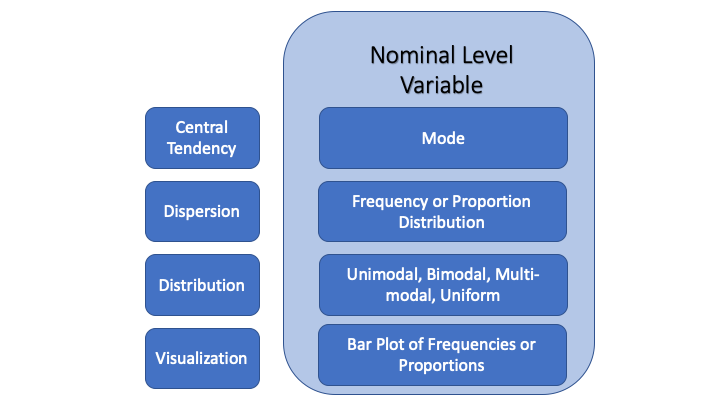

## Overview {#main-content}

In Tutorial 3, you learned that variables have different levels of measurement: nominal, ordinal, and interval. That distinction matters because the way to describe a variable depends on what its values mean. A statistic or graph that is useful for one kind of variable may be misleading or meaningless for another.

This tutorial begins a sequence of three tutorials on [**univariate description**]{.important-text}: describing one variable at a time. Before studying relationships between variables, testing hypotheses, or building models, you need to understand each variable on its own. What values does it take? Which values are most common? How much variation is there across cases? Does one category or range of values dominate the distribution, or are cases more evenly spread out? These questions help you see what is actually in the data before you try to explain it.

You will use the same broad framework throughout this sequence. In this tutorial, you describe nominal variables. In Tutorial 5, you describe ordinal variables. In Tutorial 6, you describe interval variables. Across all three tutorials, the goal is the same: to summarize central tendency, dispersion, and the shape of the distribution using tools that match the variable's level of measurement.

In this tutorial you will learn:

* How to compute and interpret a frequency and proportion table for a nominal variable
* How to identify the mode of a nominal variable
* How to describe the dispersion and shape of the distribution of a nominal variable
* How to create and customize bar plots using [ggplot2]{.package-name}


```{r setup, include=FALSE}
library(learnr)
library(learnrhash)
library(tidyverse)
library(knitr)
library(gradethis)
library(poliscidata)
library(simstudy)
library(gridExtra)
library(grid)
tutorial_options(exercise.checker = gradethis::grade_learnr,
                 exercise.completion = FALSE)
knitr::opts_chunk$set(error = TRUE)
options(lifecycle_verbosity = "quiet")
data("counties", package = "QPATutorialsCourse")
data("df", package = "QPATutorialsCourse")
data("world", package = "poliscidata")
df$region <- factor(df$region, labels = c("South", "Northeast", "Midwest", "West"))
```


## Descriptive Statistics

[**Descriptive statistics**]{.important-text} are numerical and graphical tools for summarizing what a variable or data set looks like. They help us describe what is typical, how much variation there is, and what overall pattern the values form.

Description is the first step in analysis. Before explaining why something happened, you need to understand what the relevant variables look like: what values they take, which values are most common, and how much variation there is across cases. To see why this matters, consider what you would need to know before beginning to answer questions like these:

::: {.research-example}
If we want to understand the causes of mass political polarization in current American politics, our starting point is to describe the nature and extent of polarization. It is important to know how polarized individual Americans are, whether high polarization is common, and how much polarization varies across people.
:::

::: {.research-example}
If we want to assess the relationship between the level of democracy in a nation-state and its economic outcomes, we first need to know something about the features of our measures of democracy and of economic outcomes in our data set: how common are democratic governments, are most democratic or not, and what is the range and typical level of economic prosperity across countries?
:::

::: {.research-example}
If we want to know why Donald Trump won the 2016 presidential election and our research method relies on county-level analysis of the vote, we want to know how Trump did in the typical county and how much variation there was in his performance across counties.
:::

Typically data sets contain observations on a large number of cases where it is difficult, or impossible, to understand the main features of the data by examining all the values a variable takes.


### The framework for univariate description

Univariate description means examining one variable at a time. In this course, you will use the same framework each time:

::: {.important-note}
**The three dimensions of univariate description**

Every variable you examine this semester will be described along three dimensions:

- [**Central tendency**]{.important-text} --- the "typical value" a variable takes, or the center of its distribution.
- [**Dispersion**]{.important-text} --- the spread or variation in the values a variable takes, telling you how similar or different the values are across cases.
- [**The shape of the distribution**]{.important-text} --- a summary of how frequently each value or range of values occurs, which you can describe numerically or visualize in a plot.

In most situations you will use both statistical summaries and visualizations to describe all three dimensions. The appropriate tools depend on the level of measurement of the variable, which is what this and the next two tutorials are about.
:::

Because the appropriate descriptive tools depend on a variable's level of measurement, start by practicing how to recognize nominal variables.

**Practice: Identify nominal level variables**

```{r concepts-quiz-nominal, echo=FALSE}
question("Which of the following variables are nominal level measures? Select all that apply.",
  correct = "Right. Both are nominal variables.",
  answer("The race of a respondent in a survey", correct = TRUE,
         message = "The race variable is nominal --- its values are unordered category labels. No arrangement of racial categories carries any inherent meaning."),
  answer("The status of the death penalty (permitted or not) in a state", correct = TRUE,
         message = "The death penalty status variable is nominal --- permitted and not permitted are unordered categories with no meaningful rank."),
  answer("The restrictiveness of a state's gun laws measured with a letter grade",
         message = "The gun law restrictiveness variable is ordinal. Letter grades are ordered categories --- A is more restrictive than B --- but the differences between them are not necessarily equal."),
  answer("The Polity democracy score measured on a scale from -10 (autocracy) to +10 (democracy)",
         message = "The Polity score is a borderline case. It is technically ordinal because the differences between values may not be equal, but analysts frequently treat it as interval-level in practice --- the same assumption discussed in Tutorial 3. It is not nominal because its values are clearly rank-ordered."),
  allow_retry = TRUE,
  random_answer_order = TRUE,
  try_again = "Incorrect. Try again."
)
```


## Central Tendency

[**Central tendency**]{.important-text} refers to the "typical value" a variable takes. It helps answer a basic but important question: if you had to summarize this variable in one value, what value would best represent the cases in the data? A [**distribution**]{.important-text} shows all the possible values of a variable and how often each value occurs. 

Knowing what is typical gives a starting point for interpretation: it tells you which category or value best characterizes the cases before looking more closely at how much variation there is. But a measure of central tendency is only useful when it fits the variable's level of measurement. Only one statistic is available to summarize the central tendency of a nominal variable: the mode. (For ordinal and interval variables, additional measures become available, as you will see in the next two tutorials.) That may seem limited, but for unordered categories, the most common category is the only kind of "typical" value that makes sense.

### The Mode

The [**mode**]{.important-text} is the most frequently occurring category in the data. Specifically, the mode is the *name* of the category that occurs most often. The mode is useful because it gives the simplest possible summary of a nominal variable: which category best represents the cases in the data? You can determine the mode from a frequency table. A [**frequency table**]{.important-text} lists each value a variable can take and the number of cases in the data that have each value. Sometimes it is useful to present the proportion of cases in each category as well as the frequencies, because proportions tell you how dominant or representative the modal category really is.

### Central tendency and vote for Donald Trump in US counties

To illustrate how to compute a frequency table and identify the mode, you will examine the variable **TrumpMajority** in the **counties** data frame. This variable is stored as a numeric variable, assigning a value of 0 to counties where Clinton won a majority of the vote and 1 to counties where Trump won a majority.

Our first question is simple: how many counties fall into each category? You need that count because the mode is not something you can identify from the variable name or from the numeric codes 0 and 1. You have to look at the distribution itself. To answer the question, you need to do three things: separate the counties into groups, count how many are in each group, and display the result. You will use three functions from the [dplyr]{.package-name} package to do this, connected by the pipe operator `%>%`.

::: {.tip}
**The pipe operator** (`%>%`) passes the result of one step directly into the next. Wherever you see it, read it as "and then." So `counties %>% group_by(TrumpMajority)` means "take counties, and then group by TrumpMajority." That reading can make long pipelines much less intimidating.
:::

### Step 1: group_by()

Before counting counties by category, you need to tell R which variable defines the groups. The `group_by()` function does this --- it instructs R to treat observations with the same value of a variable as belonging to the same group, so that any subsequent operations are applied separately to each group.

```r
counties %>%
  group_by(TrumpMajority)
```

On its own, `group_by()` does not change what the data looks like. It quietly marks the groups so the next step knows how to operate.

### Step 2: summarise()

Once the groups have been defined, the next step is to summarize each one. The `summarise()` function collapses each group into a single row of summary information. You tell it what to compute and what to call the result. To count the number of counties in each group you use `n()`, which simply counts rows, and store the result in a variable called **freq**. Run the code below and look at the output --- each row corresponds to one value of **TrumpMajority** and **freq** tells you how many counties have that value.

**Run and observe: Use `group_by()` and `summarise()` to count observations**

```{r analysis-summarise-majority, exercise=TRUE, warning=FALSE, exercise.cap="Run and observe: Building a frequency table with group_by() and summarise()"}
library(dplyr)
counties %>%
  group_by(TrumpMajority) %>%
  summarise(freq = n())
```


The output has two rows --- one for each value of **TrumpMajority** --- and two columns. The first column, **TrumpMajority**, names the category. The second column, **freq**, gives the count of counties in that category. This is the basic structure you will see every time you use `group_by()` and `summarise()`: one row per group, one column per summary statistic you computed.

Now use the output as evidence. The freq column gives you everything you need to identify the mode.

**Practice: Interpret the frequency table**


```{r question-freq-meaning, echo=FALSE}
question("Based on the frequency table, why is TrumpMajority = 1 the modal category?",
  correct = "Right. TrumpMajority = 1 is the mode.",
  answer("Because it has the highest frequency in the table", correct = TRUE,
         message = "The mode is the most frequently occurring category --- the value that appears in the largest number of rows. TrumpMajority = 1 has the larger count, so it is the mode. The point of building the table is precisely this: the mode is not something we can read off a variable name or a coding scheme, not by the magnitude of the numeric code and not from any external information about what happened in the election. We have to look at the distribution."),
  answer("Because 1 is larger than 0",
         message = "The numeric coding does not determine the mode. TrumpMajority is a nominal variable, so 0 and 1 are category labels. The mode depends on which category occurs most often."),
  answer("Because Trump won the national popular vote",
         message = "The table summarizes counties, not the national popular vote. TrumpMajority = 1 is the mode because more counties fall in that category."),
  answer("Because the two categories are equally common",
         message = "The categories are not equally common. The mode is the category with the higher frequency."),
  allow_retry = TRUE,
  random_answer_order = TRUE,
  try_again = "Incorrect. Try again."
)
```

Knowing which numeric code is most common is only the first step. A frequency table uses whatever values are stored in the data, and those values are not always self-explanatory. The next question asks what to do with that result.

**Practice: Identify the mode**

```{r question-mode, echo=FALSE}
question("Based on the frequency table, which statement best describes the distribution of counties?",
  correct = "Right. Most counties cast a majority of votes for Donald Trump.",
  answer("The modal category is 1",
         message = "This is technically correct but not useful. A reader who does not know the coding scheme gets no information from 'the mode is 1.' The goal is to translate the numeric code into a substantive statement: the typical county cast a majority of its votes for Donald Trump."),
  answer("Most counties cast a majority of votes for Donald Trump", correct = TRUE,
         message = "The category with the highest frequency is TrumpMajority = 1, which corresponds to counties where Trump received a majority. This translation step applies every time you work with coded data --- whatever the variable, whatever the coding scheme, the final statement should tell a reader what the typical case actually looks like, not what number was assigned to it. A result like 'the mode is 1' tells a reader nothing without the codebook."),
  answer("Counties are evenly split between the two categories",
         message = "The counts in the two categories are not equal. One category clearly has more counties than the other."),
  answer("We cannot determine anything about voting patterns from this table",
         message = "The table provides the number of counties in each category, which allows us to compare them directly."),
  allow_retry = TRUE,
  random_answer_order = TRUE,
  try_again = "Incorrect. Try again."
)
```

### Step 3: mutate()

Knowing that 2,622 counties went for Trump is informative, but it is harder to interpret than knowing the *proportion* of counties that did so. Proportions help you judge how representative the mode is. If the modal category contains 51% of cases, it is technically the most common category, but only barely. If it contains 84% of cases, it gives a much stronger summary of the typical case. Proportions become especially important later in the course when comparing variables across data sets of different sizes.

To add proportions to our table, we pipe the result of `group_by()` and `summarise()` into a third function: `mutate()`. Unlike `summarise()`, which collapses groups into single rows, `mutate()` adds a new column to the existing output without changing its structure. We define the new column **prop** as each group's count divided by the total count across all groups: `prop = freq / sum(freq)`.

Whenever you compute proportions, filter out missing values in the grouping variable first by adding `filter(!is.na(variable))` at the start of the pipeline. If any missing values are present, they form their own group and get included in the denominator --- making the substantive proportions sum to less than 1. Since you may not always know in advance whether a variable has missing values, filtering before proportions is the standard practice. **TrumpMajority** has no missing values, so the filter changes nothing here, but the habit is worth building from the start.

**Run and observe: Calculate proportions using `mutate()`**

```{r analysis-calculate-proportions, exercise=TRUE, warning=FALSE, exercise.cap="Run and observe: Adding proportions with mutate()"}
counties %>%
  filter(!is.na(TrumpMajority)) %>%
  group_by(TrumpMajority) %>%
  summarize(freq = n()) %>%
  mutate(prop = freq / sum(freq))
```

The output now has three columns. The first two --- **TrumpMajority** and **freq** --- are unchanged from the previous step. The new column, **prop**, gives each category's share of all counties: the count in that row divided by the total count across all rows. The two proportions sum to 1, confirming that every county falls in exactly one category. Proportions are easier to interpret than raw counts because they put all categories on the same 0-to-1 scale regardless of how many cases are in the data.

Once a package is loaded with `library()`, all of its functions are available for the rest of the R session. The second exercise above did not call `library(dplyr)` again because [dplyr]{.package-name} was already loaded in the first one. The same applies to all subsequent exercises in this tutorial: any package loaded once remains available. You may also notice that `summarize()` and `summarise()` are used interchangeably in this tutorial --- both spellings are valid in [dplyr]{.package-name} and produce identical results.

**Practice: Interpret the proportion table**

```{r question-prop-meaning, echo=FALSE}
question("What does the proportion table add to the frequency table?",
  correct = "Right. Proportions show each category's share of the total.",
  answer("It shows the share of all counties in each category, making the size of the modal category easier to interpret", correct = TRUE,
         message = "The proportion table converts counts into shares of the total, so it shows that the Trump-majority category contains about 84% of counties. A count is only meaningful relative to the total --- a proportion removes that dependency, which is why proportions become essential when comparing distributions across data sets that differ in size."),
  answer("It changes which category is the mode",
         message = "The mode does not change. The category with the highest frequency also has the highest proportion."),
  answer("It shows the average value of TrumpMajority",
         message = "The proportion table does not compute an average. It reports each category's share of all counties."),
  answer("It removes the need to know what 0 and 1 mean",
         message = "You still need to know what the categories mean. The proportion table helps interpret the relative size of each category, but the category labels still require substantive interpretation."),
  allow_retry = TRUE,
  random_answer_order = TRUE,
  try_again = "Incorrect. Try again."
)
```

Proportions transform raw counts into shares that can be evaluated and compared. Once you know what proportion of cases falls in the modal category, you can judge how dominant it really is --- and whether the mode gives a strong or a weak summary of the distribution. That interpretive step is what separates a table that informs from one that merely reports.


Now let's apply the same approach to a variable with more than two categories: **racial_majority** in the **counties** data frame. The variable records which racial or ethnic group comprised 50% or more of the county population, taking the values "Black Majority", "Hispanic Majority", "Other Majority", and "White Majority". It is stored as a character variable. Following the filtering norm, filter out any missing values before computing the proportion table --- an NA group would otherwise be included in the denominator, making the substantive proportions sum to less than 1. With four categories instead of two, the proportion column becomes especially important --- knowing the modal category is more informative when you can also see how dominant it is relative to the others.

**Practice: Create a proportion table**

Complete the code below to produce a frequency and proportion table for **racial_majority**. The `filter()` step is provided --- keep it. Name your count variable **freq** and your proportion variable **prop**. Two hints are available. Click "Submit Answer" to check your work.

```{r analysis-practice-proportions, exercise=TRUE, exercise.cap="Practice: Create a frequency and proportion table for racial_majority"}
counties %>%
  filter(!is.na(racial_majority)) %>%
  group_by(___) %>%
  ___(freq = n()) %>%
  mutate(prop = ___ / sum(___))
```

```{r analysis-practice-proportions-hint-1}
# Hint 1 of 2
# The filter() step is already provided --- keep it.
# Think about the sequence: group the data by category,
# count how many counties fall in each group, then
# convert those counts to shares of the whole.
```

```{r analysis-practice-proportions-hint-2}
# Hint 2 of 2
# The grouping variable is racial_majority.
# The second step uses the same summarising function
# from the previous exercise to create freq.
# The third step divides each count by the total
# to produce prop.
```


```{r analysis-practice-proportions-check}
grade_this({
  expected <- counties %>%
    filter(!is.na(racial_majority)) %>%
    group_by(racial_majority) %>%
    summarise(freq = n()) %>%
    mutate(prop = freq / sum(freq))

  if (!is.data.frame(.result)) {
    fail("Your code should return a data frame. If you're seeing an error, check for unmatched parentheses or a missing %>% between steps. Inside summarise() and mutate(), you are creating new columns with new names --- do not use existing variable names from the data frame on the left side of the =.")
  }

  required_cols <- c("racial_majority", "freq", "prop")
  missing_cols <- setdiff(required_cols, names(.result))
  if (length(missing_cols) > 0) {
    fail("Make sure your result includes the columns racial_majority, freq, and prop.")
  }

  normalize_table <- function(x) {
    x <- as.data.frame(x[, required_cols])
    x$racial_majority <- as.character(x$racial_majority)
    x <- x[order(is.na(x$racial_majority), x$racial_majority), ]
    row.names(x) <- NULL
    x
  }

  actual <- normalize_table(.result)
  expected_norm <- normalize_table(expected)

  if (nrow(actual) != nrow(expected_norm)) {
    fail("Your table should include one row for each nonmissing value of racial_majority. Keep the provided filter(!is.na(racial_majority)) step so the missing-value row is excluded.")
  }

  if (!identical(actual$racial_majority, expected_norm$racial_majority)) {
    fail("Check that you grouped by racial_majority and did not filter out any categories.")
  }

  if (!identical(as.numeric(actual$freq), as.numeric(expected_norm$freq))) {
    fail("Check your freq column. It should count the number of counties in each racial_majority category.")
  }

  if (!isTRUE(all.equal(as.numeric(actual$prop), as.numeric(expected_norm$prop), tolerance = 1e-8))) {
    fail("Check your prop column. It should divide each category's freq by the total number of counties.")
  }

  pass("Your proportion table is correct --- examine the prop column carefully before answering the next question. Which category has the highest proportion, and how does it compare to the others?")
})
```

Now interpret the table. A frequency or proportion table is only useful if you draw a conclusion from it.

**Practice: Identify the mode of racial_majority**

```{r question-mode-racial, echo=FALSE}
question("Based on the proportion table you just created, which statement best describes the central tendency of racial_majority?",
  correct = "Right. White Majority is the modal category.",
  answer("The modal category is Black Majority",
         message = "Black Majority counties make up about 3% of the total. That is not the most frequently occurring category."),
  answer("The modal category is White Majority", correct = TRUE,
         message = "White Majority is by far the most common category, making it the clear mode. With about 92% of counties in this category, the mode is an unusually representative summary of the typical county --- a county drawn at random would be very likely to be White Majority. How representative the mode is always depends on how dominant the modal category turns out to be."),
  answer("The categories are approximately evenly distributed",
         message = "The proportions are very unequal. One category dominates the distribution by a wide margin."),
  answer("There is no mode because the variable has four categories",
         message = "A nominal variable can have a mode regardless of how many categories it has. The mode is simply the most frequently occurring one."),
  allow_retry = TRUE,
  random_answer_order = TRUE,
  try_again = "Incorrect. Try again."
)
```

How representative the mode is depends on how dominant the modal category is. A mode that accounts for a large majority of cases gives a strong summary of the variable; a mode that accounts for only slightly more cases than the others tells you much less about what is typical.

### The central tendency of US states across regions

As a final example, consider **region** in the **df** data frame, which assigns each US state to one of the four Census Bureau regions. It is stored as a factor. This example is worth examining because the modal category is less dominant than in the county examples above --- and that difference matters. When cases are spread fairly evenly across categories, the mode still identifies the most common value, but it may not give a strong summary of the distribution on its own.

**Practice: Summarize the data by region**

Write the pipeline to produce **freq** and **prop** for each Census region. Two hints are available. Click "Submit Answer" to check your work.

```{r analysis-practice-freq-by-region, exercise=TRUE, exercise.lines=6, exercise.cap="Practice: Write a frequency and proportion table for region"}

```


```{r analysis-practice-freq-by-region-hint-1}
# Hint 1 of 2
# Use the same pipeline structure as the previous exercises:
# filter(), then group_by(), then summarise(), then mutate().
# Which data frame and variable are you working with?
```

```{r analysis-practice-freq-by-region-hint-2}
# Hint 2 of 2
# df %>%
#   filter(!is.na(region)) %>%
#   group_by(region) %>%
#   summarise(freq = n()) %>%
#   mutate(prop = freq / sum(freq))
```

```{r analysis-practice-freq-by-region-check}
grade_this({
  expected <- df %>%
    filter(!is.na(region)) %>%
    group_by(region) %>%
    summarise(freq = n()) %>%
    mutate(prop = freq / sum(freq))

  if (!is.data.frame(.result)) {
    fail("Your code should return a data frame. If you're seeing an error, check for unmatched parentheses or a missing %>% between steps. Inside summarise() and mutate(), you are creating new columns with new names --- do not use existing variable names from the data frame on the left side of the =.")
  }

  required_cols <- c("region", "freq", "prop")
  missing_cols <- setdiff(required_cols, names(.result))
  if (length(missing_cols) > 0) {
    fail("Make sure your result includes the columns region, freq, and prop.")
  }

  normalize_table <- function(x) {
    x <- as.data.frame(x[, required_cols])
    x$region <- as.character(x$region)
    x <- x[order(x$region), ]
    row.names(x) <- NULL
    x
  }

  actual <- normalize_table(.result)
  expected_norm <- normalize_table(expected)

  if (nrow(actual) != nrow(expected_norm)) {
    fail("Your table should have one row for each Census region.")
  }

  if (!identical(actual$region, expected_norm$region)) {
    fail("Check that you grouped by region.")
  }

  if (!identical(as.numeric(actual$freq), as.numeric(expected_norm$freq))) {
    fail("Check your freq column. It should count the number of states in each region.")
  }

  if (!isTRUE(all.equal(as.numeric(actual$prop), as.numeric(expected_norm$prop), tolerance = 1e-8))) {
    fail("Check your prop column. It should divide each region's freq by the total number of states.")
  }

  pass("Good work! Your table shows the number and proportion of states in each Census region. Look at how evenly the states are distributed before answering the next question.")
})
```

**Practice: Describe the distribution of region**

```{r practice-region-distribution, echo=FALSE}
question(
  "Based on the proportion table you just created, what does the distribution tell you about the usefulness of the mode as a summary of region?",
  answer(
    "The South is the mode, but because it contains only 32% of the states and the other states are spread across three other regions, the mode alone gives an incomplete picture of the distribution.",
    correct = TRUE,
    message = "The South is the most common category, so it is the mode. But only 32% of states are in the South, while the remaining states are distributed across the Northeast, Midwest, and West. The mode identifies the most common category, but by itself it does not show how the rest of the observations are distributed."
  ),
  answer(
    "The South is the mode, so it provides a complete summary of where US states are located."
  ),
  answer(
    "There is no mode because no region contains a majority of the states."
  ),
  answer(
    "The Northeast is the mode because it has the smallest proportion of states."
  ),
  random_answer_order = TRUE,
  allow_retry = TRUE
)
```

The mode is only as informative as the distribution behind it. That is why the analysis does not stop with the mode: dispersion also needs to be considered.

## Dispersion

A frequency or proportion table also describes the [**dispersion**]{.important-text} of values the variable takes. Dispersion tells you how spread out the cases are across the categories of a variable. This matters because the mode alone can be misleading. If most cases fall in one category, the modal category gives a strong summary of the variable. If the largest category contains only slightly more cases than the others, the mode is technically correct but not very informative. Dispersion helps you judge how much of the distribution the typical value leaves out.

Variables can differ substantially in how concentrated or spread out their distributions are. Some variables have one category that accounts for a large majority of all cases; others spread cases more evenly across several categories. The proportion tables you built earlier give you three examples to compare: **TrumpMajority** had about 84% of counties in one category, **racial_majority** had about 92% in one category, and **region** spread states across four categories ranging from about 18% to 32%. Look at those proportions and then answer the following question.

**Practice: Characterize the dispersion**

```{r question-dispersion, echo=FALSE}
question("Based on the proportion tables you created earlier, which variable is most dispersed --- that is, most evenly spread across its categories?",
  correct = "Right. Region is the most dispersed of the three variables.",
  answer("TrumpMajority, because it has two categories",
         message = "The number of categories is not what determines dispersion. TrumpMajority has 84% of counties in one category --- that is a highly concentrated, low-dispersion distribution."),
  answer("racial_majority, because it has four categories",
         message = "Having more categories does not mean a variable is more dispersed. About 92% of counties fall in the White Majority category, making this a highly concentrated distribution despite having four categories."),
  answer("region, because the states are spread fairly evenly across all four Census regions", correct = TRUE,
         message = "Region has the most even spread --- between 9 and 16 states per region. Neither TrumpMajority (84% in one category) nor racial_majority (92% in one category) comes close to that level of dispersion. This difference has a direct consequence: when one category dominates, the mode alone gives a strong summary. When cases are spread more evenly, as with region, the modal category accounts for only about a third of states and the full table becomes essential context."),
  answer("All three variables are equally dispersed",
         message = "Look at the proportion tables you built. The proportion of cases in the dominant category differs substantially across the three variables."),
  allow_retry = TRUE,
  random_answer_order = TRUE,
  try_again = "Incorrect. Try again."
)
```

How concentrated or spread out a distribution is determines how much work the mode can do on its own. When one category dominates, the mode gives a strong and representative summary of the typical case. When cases are spread more evenly, the full distribution becomes essential context --- the mode identifies the most common category but leaves much of the picture untold.

The last piece of summary information is the [**shape**]{.important-text} of the distribution: the overall pattern formed by the category frequencies. Shape gives a compact way to describe what the full distribution looks like. This matters because two variables can have the same mode but very different distributions. In one variable, the modal category might tower over all the others; in another, several categories might be nearly tied. Because frequency and proportion tables completely characterize the distribution of a nominal variable, shape is a way of turning that full table into an interpretable description. The relevant question is whether the cases are spread fairly evenly or whether one or more categories dominates the distribution. The shape of the distribution of a categorical variable is referred to as:

1. [**Unimodal**]{.important-text}: One category has many more cases than the others, producing a single peak.
2. [**Bimodal**]{.important-text}: Two categories are much more prevalent than the others, producing two distinct peaks.
3. [**Uniform**]{.important-text}: Cases are spread approximately evenly across all categories.
4. [**Multimodal**]{.important-text}: Several categories have more cases than the others, producing many peaks.

It is often easier to understand shape from a plot than from a table, because the relative size of the categories becomes visible immediately. The figure below shows stylized examples of each shape so you can see what these terms mean before applying them to real variables.

```{r distribution-plots, echo=FALSE, message=FALSE, warning=FALSE, fig.width=8, fig.height=6, fig.alt="Four bar charts showing examples of categorical distribution shapes. The unimodal chart has one clearly dominant category, the bimodal chart has two dominant categories, the uniform chart has categories with similar frequencies, and the multimodal chart has several categories with relatively high frequencies."}
def <- defData(varname = "nr", dist = "nonrandom", formula = 7, id = "idnum")
def <- defData(def, varname = "xCat1", formula = "20;20;50;10", dist = "categorical")
def <- defData(def, varname = "xCatB", formula = "40;7;50;3", dist = "categorical")
def <- defData(def, varname = "xCatU", formula = "21;25;14;17;23", dist = "categorical")
def <- defData(def, varname = "xCatM", formula = "30;10;5;5;25;5;20", dist = "categorical")

dt <- genData(10000, def)

dt$xCat1 <- factor(dt$xCat1, levels = 1:4)
dt$xCatB <- factor(dt$xCatB, levels = 1:4)
dt$xCatU <- factor(dt$xCatU, levels = 1:5)
dt$xCatM <- factor(dt$xCatM, levels = 1:7)

create_plot <- function(data, x_var, title) {
  max_count <- max(table(data[[x_var]]))
  ggplot(data, aes(x = .data[[x_var]])) +
    geom_bar(fill = "darkblue") +
    labs(title = title, x = "Category", y = "Frequency") +
    scale_y_continuous(limits = c(0, max_count * 1.1),
                       expand = expansion(mult = c(0, 0.1))) +
    theme_minimal() +
    theme(plot.title = element_text(size = 10),
          axis.title = element_text(size = 8),
          axis.text = element_text(size = 6))
}

p1 <- create_plot(dt, "xCat1", "Unimodal Distribution")
p2 <- create_plot(dt, "xCatB", "Bimodal Distribution")
p3 <- create_plot(dt, "xCatU", "Uniform Distribution")
p4 <- create_plot(dt, "xCatM", "Multi-Modal Distribution")

shape <- arrangeGrob(p1, p2, p3, p4,
                     ncol = 2,
                     top = textGrob("Distribution Shapes",
                                    x = 0.5, y = 1, just = "top",
                                    gp = gpar(fontsize = 12, fontface = "bold")))
grid.draw(shape)
```

When you need to classify the shape of a distribution, use the label as a tool for interpretation, not as a word to memorize. Ask three questions in order. Does one category clearly dominate, holding a much larger share than the rest? If so, the distribution is unimodal. Do two categories stand out as similarly prominent while the others are much smaller? Then it is bimodal. Are the categories spread so evenly that none stands out? Then it is uniform. If several categories are notably more common than the rest, it is multimodal. When the answer is genuinely ambiguous, describing the full distribution is more informative than forcing a label.

Now apply that decision routine to a variable you have already summarized. The goal is to connect the vocabulary of shape back to the actual proportions in the table.

**Practice: Classify a distribution shape**

```{r question-classify-shape, echo=FALSE}
question("You computed the frequency table for TrumpMajority earlier in this tutorial: about 84% of counties cast a majority of votes for Trump and 16% for Clinton. Using the vocabulary just introduced, how would you describe the shape of this distribution?",
  correct = "Right. This distribution is unimodal.",
  answer("Uniform, because there are only two categories",
         message = "The number of categories does not determine the shape. A uniform distribution requires the cases to be spread approximately evenly across categories. Here one category holds 84% of the counties --- far from even."),
  answer("Bimodal, because there are two categories with observations in them",
         message = "Bimodal means two categories are similarly and notably more common than the rest. Here one category (84%) far outweighs the other (16%). Having two categories with observations does not make a distribution bimodal."),
  answer("Unimodal, because one category --- Trump majority --- contains far more counties than the other", correct = TRUE,
         message = "With 84% of counties in the Trump-majority category, the distribution has a single dominant peak --- that is a textbook unimodal distribution. The key distinction from bimodal: the second category at 16% is a small trailing tier, not a comparable second peak. For a distribution to be bimodal, the two peaks need to be similarly prominent."),
  answer("Multimodal, because both categories have more than zero counties",
         message = "Multimodal means several categories have notably more observations than the others. Having observations in two categories does not make a distribution multimodal --- the categories need to be similarly prominent peaks."),
  allow_retry = TRUE,
  random_answer_order = TRUE,
  try_again = "Incorrect. Try again."
)
```

## Visualizing a Nominal Variable: Frequency Plots

A bar chart makes the distribution of a nominal variable easier to take in at a glance. It shows the same basic information as a frequency or proportion table, but in a form that makes comparisons across categories immediate: which category is largest, how dominant it is, and whether the distribution is concentrated or spread out. Tables are more precise, but a well-labeled chart often makes the main pattern easier to see. You will build one using [ggplot2]{.package-name}, adding one layer at a time.

::: {.tip}
**How ggplot2 works:** Every ggplot is built by layering components on top of each other using `+`. You will always start with the `ggplot()` function to specify the data and variable, then add layers to draw the geometry, add labels, and customize the axes.
:::

### Building a bar chart step by step

Each of the four steps below adds one layer. Run the code at each step before reading on.

### Step 1: Set up the plot and map the variable

The first line loads the [ggplot2]{.package-name} package with `library(ggplot2)`. Like [dplyr]{.package-name}, it must be loaded once per session before its functions are available.

The `ggplot()` function takes two arguments: `data =` specifies which data frame to use, and `mapping = aes(...)` specifies which variable maps to which visual feature. Here, `x = factor(TrumpMajority)` places the categories of **TrumpMajority** on the x-axis. We wrap the variable in `factor()` because it is stored as numeric codes (0 and 1); without it, ggplot would treat the variable as continuous rather than categorical. The y-axis is left unspecified because `geom_bar()`, added in the next step, computes and draws the bar heights automatically.

**Run and observe: Set up the plot and map the variable**

```{r visual-initialize-plot, exercise=TRUE, exercise.cap="Run and observe: Setting up the ggplot plot"}
library(ggplot2)
ggplot(data = counties, mapping = aes(x = factor(TrumpMajority)))
```

You now have an x-axis showing the two values of **TrumpMajority**, but no bars yet. The next step adds them. You can assume [ggplot2]{.package-name} is already loaded for all subsequent exercises.

### Step 2: Add the bars

We tell ggplot how to represent the data by adding a [**geom**]{.important-text} layer --- a geometric object that draws the data. For a bar chart, we add the `geom_bar()` function. Notice that we connect the new layer to the previous line with `+`. In the analysis section we used `%>%` to pass results from one function to the next; in ggplot, `+` plays the analogous role of stacking layers on top of each other. Every component after the initial `ggplot()` function call is attached this way.

The `geom_bar()` function takes no arguments here because it automatically inherits the variable mapping we set in the `ggplot()` function --- it already knows to put **TrumpMajority** on the x-axis. It then does the counting itself: it tallies how many counties fall in each category and draws a bar with the corresponding height. You do not need to supply the counts; the geom computes them from the data.

**Run and observe: Add the bar layer**

```{r visual-add-geom-bar, exercise=TRUE, exercise.cap="Run and observe: Adding geom_bar() to create bars"}
ggplot(data = counties, mapping = aes(x = factor(TrumpMajority))) +
  geom_bar()
```

You now have a working bar chart. The bars show that far more counties fall in the Trump-majority category, which is consistent with what you found in the frequency table. But the chart is not ready for an audience yet. The x-axis shows 0 and 1 rather than meaningful category names, and there is no title to tell readers what the bars represent. The next two steps turn the plot from something R can draw into something a person can understand.

### Step 3: Add labels

The `labs()` function adds text annotations to the plot. Its argument names correspond directly to parts of the plot: `title` sets the main title, `subtitle` appears below it, `x` and `y` label the axes, and `caption` appears in the lower right. This division of labor reflects the layered logic of ggplot: the `ggplot()` function sets up the data, the `geom_bar()` function draws the geometry, and the `labs()` function handles the annotation. Each layer has one job.

Setting an argument to `NULL` actively removes a label that would otherwise appear. Here `x = NULL` suppresses the x-axis title because the tick labels added in Step 4 make it redundant --- the category names speak for themselves. The y-axis label is `"Frequency"` because that is what the bars represent: the count of counties in each category, which is what the `geom_bar()` function computed automatically.

A plot should be interpretable without requiring the reader to search the surrounding text for basic information. These labels matter because a reader seeing the chart in isolation needs the title to know what is being counted, the subtitle to know when, and the caption to know the source. You can insert a line break inside any label using `\n`, which is useful when a title is too long to fit on one line.

::: {.tip}
**Always type quotation marks yourself.** When you copy text from a tutorial page into R code, browsers sometimes substitute curly quotation marks (`" "`) for the straight quotation marks (`" "`) that R requires. If you copy a label or title string and get an unexpected syntax error, this is almost certainly the cause. Always type your own quotation marks when writing R code.
:::

**Run and observe: Add labels**

```{r visual-add-labs, exercise=TRUE, exercise.cap="Run and observe: Adding labels with labs()"}
ggplot(data = counties, mapping = aes(x = factor(TrumpMajority))) +
  geom_bar() +
  labs(title = "Number of US Counties that Cast a Majority of \nVotes for the Major Party Presidential Candidates",
       subtitle = "2016",
       x = NULL,
       y = "Frequency",
       caption = "Source: Linn, Nagler, Zilinsky")
```

The plot is now titled and the axes are labeled. The x-axis still shows 0 and 1, however. The final step replaces those with meaningful category names.

### Step 4: Replace the axis tick labels

The `labs()` function in Step 3 set the axis *title* --- the overall label for the axis. The `scale_x_discrete()` function does something different: it controls the axis *tick labels*, the text that appears next to each bar. These are separate parts of the plot, which is why they require separate functions. The name `scale_x_discrete` signals that this function is for categorical variables specifically; the parallel for a continuous variable would be `scale_x_continuous()`.

The `labels` argument takes a vector of replacement names listed in the same order as the numeric values stored in the data, from lowest to highest --- here, "Clinton" replaces 0 and "Trump" replaces 1 because 0 comes before 1. If **TrumpMajority** had been coded as "Clinton" and "Trump" rather than 0 and 1, the tick labels would already be interpretable and this step would not be needed. It exists because numeric codes are storage choices, not descriptions, and readers need the substantive category names to understand what the distribution shows.

The `scale_x_discrete()` function also controls how missing values are handled. By default, ggplot treats NA as its own category and draws a separate bar for it. Setting `na.translate = FALSE` suppresses that bar so missing values do not appear on the x-axis. This is useful for **frequency bar charts** where you just want to hide the NA bar. For **proportion bar charts**, filtering before `ggplot()` is the better approach --- `after_stat(prop)` would include the NA bar in the group total, making the substantive proportions sum to less than 1. Filtering removes missing values entirely before any computation, ensuring the proportions are correct.

**Run and observe: Replace the axis tick labels**

```{r visual-customize-scale-x, exercise=TRUE, exercise.cap="Run and observe: Replacing tick labels with scale_x_discrete()"}
ggplot(data = counties, mapping = aes(x = factor(TrumpMajority))) +
  geom_bar() +
  labs(title = "Number of US Counties that Cast a Majority of \nVotes for the Major Party Presidential Candidates",
       subtitle = "2016",
       x = NULL,
       y = "Frequency",
       caption = "Source: Linn, Nagler, Zilinsky") +
  scale_x_discrete(labels = c("Clinton", "Trump"))
```

The plot now clearly communicates the mode, dispersion, and shape of the distribution of **TrumpMajority** at a glance.

Now step back from the code and think about what the visualization contributes. The chart should not change the conclusion you drew from the table; it should make the same distribution easier to compare and communicate.

**Practice: What does a bar chart add?**

```{r question-bar-trumpmajority, echo=FALSE}
question("You already knew from the proportion table that about 84% of counties cast a majority for Trump. What does the bar chart add that the table did not provide?",
  correct = "Right. A chart makes patterns visible without requiring the reader to compare numbers.",
  answer("The bar chart tells us the exact proportion in each category, which the table did not show",
         message = "The proportion table already showed those exact values. The bar chart does not add new numbers --- it communicates the same information in visual form."),
  answer("The bar chart makes the size of the difference between categories immediately visible at a glance, without requiring the reader to compare numbers", correct = TRUE,
         message = "The table requires you to read and compare two numbers. The bar chart makes the dominance of the Trump-majority category visible instantly --- no arithmetic required. That is the core advantage of visualization. This trade-off between precision and immediacy is worth keeping in mind every time you decide how to present a result: tables show exact numbers, charts show patterns, and neither format is always better."),
  answer("The bar chart shows which category is the mode, which the table could not",
         message = "The table also identifies the mode --- it is the category with the highest count or proportion. The bar chart communicates the same information visually."),
  answer("The bar chart is more precise than the table because it shows the exact bar heights",
         message = "The table is actually more precise --- it shows exact numbers. The bar chart sacrifices some precision in exchange for visual clarity and immediate comparability."),
  allow_retry = TRUE,
  random_answer_order = TRUE,
  try_again = "Incorrect. Try again."
)
```

### Racial Majority in US Counties

Now apply the same four-step structure to a nominal variable with more than two categories. Fill in the three blanks to complete the chart for **racial_majority**. The shortened category labels should drop the word "Majority" --- "Black", "Hispanic", "Other", "White" --- listed in alphabetical order, which is the order they are stored in the data. One hint is available. Click "Submit Answer" to check your work.

**Practice: Create a bar chart for racial majority**

```{r visual-practice-bar-race, exercise=TRUE, exercise.cap="Practice: Build a frequency bar chart for racial_majority"}
ggplot(data = counties, mapping = aes(x = ___)) +
  ___ +
  labs(title = "Number of US Counties by Racial Majority",
       subtitle = "2016",
       x = NULL,
       y = "Frequency",
       caption = "Source: Linn, Nagler, Zilinsky") +
  scale_x_discrete(na.translate = FALSE,
                   labels = ___)
```

```{r visual-practice-bar-race-hint-1}
# Hint 1 of 1
# The first blank is the variable to map to the x-axis.
# racial_majority is stored as a character variable,
# so factor() is not needed.
# The second blank is the geom layer that counts
# observations and draws bars.
# The third blank is a character vector of four
# shortened category names replacing the stored
# values. racial_majority is a character variable,
# so its categories appear in alphabetical order:
# Black Majority, Hispanic Majority, Other Majority,
# White Majority. Supply the shortened versions
# in that same order.
```

```{r visual-practice-bar-race-check}
grade_this({
  if (!inherits(.result, "ggplot")) {
    fail("Your code should return a ggplot object. If you're seeing an error rather than a plot, the most common causes are: a missing + at the end of a line, unmatched parentheses, or a label string that is missing its quotation marks.")
  }

  has_geom_bar <- any(vapply(.result$layers, function(layer) {
    inherits(layer$geom, "GeomBar")
  }, logical(1)))

  if (!has_geom_bar) {
    fail("Add a geom_bar() layer so the plot draws a frequency bar chart.")
  }

  mapping_text <- paste(
    deparse(rlang::quo_get_expr(.result$mapping$x)),
    collapse = ""
  )

  if (!grepl("racial_majority", mapping_text)) {
    fail("Map racial_majority to the x-axis.")
  }

  if (!"racial_majority" %in% names(.result$data)) {
    fail("Use racial_majority from the counties data frame for this plot.")
  }

  expected_values <- sort(
    as.character(counties$racial_majority[!is.na(counties$racial_majority)])
  )

  actual_values <- sort(
    as.character(.result$data$racial_majority[!is.na(.result$data$racial_majority)])
  )

  if (!identical(actual_values, expected_values)) {
    fail("Use all nonmissing observations of racial_majority from the counties data frame. Do not remove any valid observations.")
  }

  if (!identical(.result$labels$title, "Number of US Counties by Racial Majority")) {
    fail("Check the plot title.")
  }

  if (!identical(.result$labels$subtitle, "2016")) {
    fail("Check the plot subtitle.")
  }

  if (!is.null(.result$labels$x)) {
    fail("Set the x-axis label to NULL.")
  }

  if (!identical(.result$labels$y, "Frequency")) {
    fail("Set the y-axis label to \"Frequency\".")
  }

  if (!identical(.result$labels$caption, "Source: Linn, Nagler, Zilinsky")) {
    fail("Check the plot caption.")
  }

  x_scales <- Filter(
    function(scale) "x" %in% scale$aesthetics,
    .result$scales$scales
  )

  if (length(x_scales) == 0) {
    fail("Add scale_x_discrete() so you can shorten the category labels and exclude missing values.")
  }

  x_scale <- x_scales[[1]]

  if (!isFALSE(x_scale$na.translate)) {
    fail("Include na.translate = FALSE inside scale_x_discrete() so missing values do not appear as an x-axis category.")
  }

  expected_labels <- c("Black", "Hispanic", "Other", "White")

  if (!identical(x_scale$labels, expected_labels)) {
    fail("Use the shortened labels Black, Hispanic, Other, and White in that order.")
  }

  pass("Well done! The bar chart makes the dominance of the White Majority category immediately visible. Notice how the unimodal shape jumps out at a glance.")
})
```


The modal category "White" is vastly more common than any other, and the shape of the distribution is clearly unimodal.

## Visualizing a Nominal Variable: Proportions Plots

So far our bar charts have shown frequencies --- counts of how many counties fall in each category. Sometimes we want to show proportions instead. The reason comes down to what bar height actually represents in a frequency chart: it reflects both how common a category is *and* how large the data set is. That means two distributions that look identical in shape can produce bars of very different heights just because one data set has more cases. 

Imagine comparing the distribution of racial majority across US counties to the same distribution across a smaller set of 100 precincts. The county bars would tower over the precinct bars even if the two distributions were otherwise identical --- not because the pattern is different, but simply because there are more counties. Proportions remove that dependency by putting every distribution on a common 0-to-1 scale, so bar height reflects only each category's share of its own total. This makes proportion bar charts the right choice when the total number of cases matters less than each category's share of the whole, and essential when comparing distributions across data sets or groups of different sizes. 

To produce a proportion bar chart, only the `geom_bar()` layer changes. The `ggplot()` call, `labs()`, and `scale_x_discrete()` are identical to a frequency bar chart.

Inside `geom_bar()`, three things are new. `after_stat(prop)` transforms the y-axis from counts to proportions: it tells ggplot to compute each category's share of all cases after the data have been tallied, rather than drawing raw counts. `group = 1` tells ggplot to compute those proportions across all bars together. Without it, ggplot would compute each bar's proportion relative to itself and every bar would show 1.0. Finally, `fill = "blue"` sets the bar color. It sits outside the `aes()` call because it is a fixed setting applied equally to all bars, not a mapping from a variable --- when a visual property is constant, it belongs outside `aes()`.

**Run and observe: Build a proportion bar chart for Census region**

```{r visual-bar-proportion-region, exercise=TRUE, exercise.cap="Run and observe: A proportion bar chart"}
df %>%
  filter(!is.na(region)) %>%
  ggplot(mapping = aes(x = region)) +
  geom_bar(aes(y = after_stat(prop), group = 1), fill = "blue") +
  labs(title = "Proportion of US States in Each Census Region",
       x = NULL,
       y = "Proportion")
```

Now interpret the plot by reading the y-axis correctly. A proportion bar chart answers a slightly different question than a frequency bar chart: not "how many cases are in each category?" but "what share of all cases is in each category?"

**Practice: Interpret the proportion bar chart**

Interpret what each bar in the proportion chart represents.

```{r question-bar-region-prop, echo=FALSE}
question("In this plot, what does the height of each bar represent?",
  correct = "Right. Each bar shows the proportion of states in that region.",
  answer("The number of states in each region",
         message = "That would be true for a frequency bar chart. Here the y-axis has been transformed to display proportions instead of counts."),
  answer("The cumulative proportion up to each region",
         message = "Each bar corresponds to a single region, not a running total across regions."),
  answer("The proportion of states in each region", correct = TRUE,
         message = "The y aesthetic uses after_stat(prop), so each bar shows the share of all states that fall in that region rather than the raw count. A concrete check: the South bar should show approximately 0.32 because 16 of 50 states fall in that region. If your bar heights match values you can verify against the proportion table, the chart is working correctly."),
  answer("The average value of region",
         message = "Region is a categorical variable and the plot summarizes how states are distributed across categories, not an average."),
  allow_retry = TRUE,
  random_answer_order = TRUE,
  try_again = "Incorrect. Try again."
)
```

A proportion bar chart and a proportion table should always tell the same story. The chart adds immediacy --- the relative size of the categories becomes visible at a glance rather than requiring the reader to compare numbers. Whether the distribution looks concentrated or spread out, that visual pattern should be consistent with the proportions you computed earlier.

### Regime Type Around the World

Now build a complete proportion bar chart from scratch. The variable is **dem_level4** in the **world** data frame, which records regime type for countries in 2014 according to *The Economist*. Before writing any plotting code, run the code below to check how **dem_level4** is stored and what categories it contains.

**Run and observe: Check the storage type and levels of dem_level4**

```{r visual-regime-class, exercise=TRUE, exercise.cap="Run and observe: Check storage type and levels"}
class(world$dem_level4)
levels(world$dem_level4)
```

**dem_level4** is stored as a factor, so ggplot already treats it as categorical --- no `factor()` wrapper is needed. The output of `levels()` shows the order in which the categories are stored. That order matters: when you supply replacement labels in `scale_x_discrete()`, you must list them in the same order as the levels, so the right label lands on the right bar. Some countries have missing data on **dem_level4**; following the filtering norm for proportion bar charts, pipe the data through `filter(!is.na(dem_level4))` before `ggplot()`. This example gives you a new substantive setting and a more ambiguous distribution. The goal is not only to write the code but also to use the finished chart to decide how best to describe the shape.

**Practice: Create a proportion bar chart for regime type**

Your chart should have:

- Title: "Regime Type"
- y-axis label: "Proportion"
- x-axis label: omitted (`NULL`)
- Caption: "Source: The Economist"
- Bar fill color: "red"
- Missing values excluded by filtering before `ggplot()`
- Category labels: "Full Democracy", "Partial Democracy", "Hybrid", "Authoritarian" (in the order shown by `levels()`)

When you finish, look at the relative bar heights before moving to the interpretation question. Three hints are available. Click "Submit Answer" to check your work.

```{r visual-practice-bar-proportion-regime, exercise=TRUE, exercise.cap="Practice: Build a proportion bar chart for regime type"}

```

```{r visual-practice-bar-proportion-regime-hint-1}
# Hint 1 of 3
# A proportion bar chart needs the same four
# components as a frequency bar chart, plus one
# addition: aes(y = after_stat(prop), group = 1)
# inside geom_bar(). The fill color goes outside
# that aes() call but still inside geom_bar().
```

```{r visual-practice-bar-proportion-regime-hint-2}
# Hint 2 of 3
# Pipe world through filter(!is.na(dem_level4))
# before ggplot().
# dem_level4 is already a factor, so no factor()
# wrapper is needed.
# Inside geom_bar(), put aes(y = after_stat(prop),
# group = 1) and fill = "red".
# In labs(), set title, caption, x = NULL, and
# y = "Proportion" --- no subtitle needed.
# Add scale_x_discrete() with the four category labels.
```

```{r visual-practice-bar-proportion-regime-hint-3}
# Hint 3 of 3
# The hardest part is the geom_bar() layer.
# To produce proportion bars, you need an aes() call
# inside geom_bar() that computes the proportion of
# cases in each category using after_stat(), and a
# group argument set to a single constant so ggplot
# knows to compute proportions across all bars together
# rather than within each bar separately.
```

```{r visual-practice-bar-proportion-regime-check}
grade_this({
  if (!inherits(.result, "ggplot")) {
    fail("Your code should return a ggplot object. If you're seeing an error rather than a plot, the most common causes are: a missing + at the end of a line, unmatched parentheses, or a label string that is missing its quotation marks.")
  }

  if (any(is.na(.result$data$dem_level4))) {
    fail("Filter out missing values with filter(!is.na(dem_level4)) before plotting.")
  }

  mapping_text <- paste(deparse(rlang::quo_get_expr(.result$mapping$x)), collapse = "")
  if (!grepl("dem_level4", mapping_text)) {
    fail("Map dem_level4 to the x-axis.")
  }

  has_geom_bar <- any(vapply(.result$layers, function(layer) inherits(layer$geom, "GeomBar"), logical(1)))
  if (!has_geom_bar) {
    fail("Add a geom_bar() layer.")
  }

  bar_layers <- Filter(function(layer) inherits(layer$geom, "GeomBar"), .result$layers)
  bar_layer <- bar_layers[[1]]

  y_mapping <- paste(deparse(rlang::quo_get_expr(bar_layer$mapping$y)), collapse = "")
  if (!grepl("after_stat\\s*\\(\\s*prop\\s*\\)", y_mapping)) {
    fail("Inside geom_bar(), set y = after_stat(prop) so the bars show proportions.")
  }

  group_quo <- bar_layer$mapping$group
  group_ok <- tryCatch({
    !is.null(group_quo) && identical(rlang::eval_tidy(group_quo), 1)
  }, error = function(e) FALSE)
  if (!group_ok) {
    fail("Inside geom_bar(), include group = 1.")
  }

  fill_value <- bar_layer$aes_params$fill
  if (is.null(fill_value) || !identical(tolower(fill_value), "red")) {
    fail("Set fill = \"red\" outside aes() inside geom_bar().")
  }

  if ("fill" %in% names(bar_layer$mapping)) {
    fail("Put fill = \"red\" outside aes(). The fill color is a fixed setting, not a variable mapping.")
  }

  if (!identical(.result$labels$title, "Regime Type")) {
    fail("Check the plot title.")
  }

  if (!is.null(.result$labels$x)) {
    fail("Set the x-axis label to NULL.")
  }

  if (!identical(.result$labels$y, "Proportion")) {
    fail("Set the y-axis label to \"Proportion\".")
  }

  if (!identical(.result$labels$caption, "Source: The Economist")) {
    fail("Check the caption. Use \"Source: The Economist\".")
  }

  x_scales <- Filter(function(scale) "x" %in% scale$aesthetics, .result$scales$scales)
  if (length(x_scales) == 0) {
    fail("Add scale_x_discrete() to label the regime categories.")
  }

  x_scale <- x_scales[[1]]

  expected_labels <- c("Full Democracy", "Partial Democracy", "Hybrid", "Authoritarian")
  if (!identical(x_scale$labels, expected_labels)) {
    fail("Use the category labels Full Democracy, Partial Democracy, Hybrid, and Authoritarian in that order.")
  }

  pass("Well done --- you built a complete proportion bar chart from scratch. Look at the relative heights of the four bars before answering the next question about the shape of this distribution.")
})
```


Now use the chart as evidence. The point is not to force every distribution into a neat label; it is to decide whether a label helps summarize the pattern or whether the full distribution is more informative.

**Practice: Describe the shape of the regime type distribution**

```{r question-shape-regime, echo=FALSE}
question("Based on the proportion bar chart for dem_level4, how would you best describe the shape of the distribution?",
  correct = "Right. This distribution is genuinely ambiguous.",
  answer("Unimodal --- one category clearly dominates",
         message = "No single category stands out clearly above the others. Look at the relative heights of all four bars before deciding."),
  answer("Bimodal or roughly uniform --- Partial Democracy and Authoritarian are the two tallest bars, but all four categories are common enough that the distribution could reasonably be described either way", correct = TRUE,
         message = "This distribution is genuinely ambiguous. Partial Democracy and Authoritarian are the two most common categories, suggesting bimodal, but Full Democracy and Hybrid are not rare enough to be dismissed. Ambiguity in shape is not a failure --- it is a finding. When the label does not cleanly fit, describing the full distribution is more honest than forcing a single word onto a pattern that does not cooperate."),
  answer("Uniform --- all four categories have exactly the same proportion",
         message = "The four bars are not equal in height. One pair of categories is noticeably more common than the other pair, even if the overall distribution is fairly spread out."),
  answer("Multimodal --- every category is a separate peak",
         message = "Multimodal means several categories are notably more common than the rest. Here the bars are too similar in height for any category to stand out as a distinct peak."),
  allow_retry = TRUE,
  random_answer_order = TRUE,
  try_again = "Incorrect. Try again."
)
```

### Going further: reordering and flipping

The video below (less than 4 minutes) demonstrates two additional techniques you may find useful: reordering bars by frequency and flipping the chart so bars run horizontally. Horizontal bars are particularly helpful when category labels are long. These techniques go beyond what you are expected to produce on your own for now, but they are worth seeing because they solve common plotting problems.

The video shows R code being run in RStudio, demonstrating how to add `reorder()` and `coord_flip()` to a ggplot bar chart step by step.

<a href="https://www.youtube.com/watch?v=030gs_nF5ss" target="_blank">Watch the short video on reordering and flipping bar charts</a>

The Explore exercise below applies both techniques to the **racial_majority** chart. The `reorder()` function takes three arguments: the variable to reorder, a second variable to sort by, and a summary function that determines the sorting criterion. Here, `reorder(factor(racial_majority), racial_majority, length)` sorts the categories of **racial_majority** by how many counties fall in each, from fewest to most. Run the code as given, then try removing `coord_flip()` or the `reorder()` call one at a time to see what each one does.

**Explore: Reorder categories and flip coordinates**

```{r visual-reorder-and-flip, exercise=TRUE, exercise.cap="Explore: Reorder categories and flip a bar chart"}
ggplot(data = counties,
       mapping = aes(x = reorder(factor(racial_majority),
                                 racial_majority, length))) +
  geom_bar() +
  labs(title = "Number of US Counties by Racial Majority",
       subtitle = "2016",
       x = NULL,
       y = "Frequency",
       caption = "Source: Linn, Nagler, Zilinsky") +
  scale_x_discrete(na.translate = FALSE,
                   labels = c("Black", "Hispanic", "Other", "White")) +
  coord_flip()
```

## Check Your Understanding

The following questions ask you to pull together the main ideas from the tutorial. Your goal is to connect each question back to the logic of nominal variables: what their values mean, what kinds of summaries are appropriate, and how tables and plots help you describe a distribution.

Start by thinking carefully about what it means to apply arithmetic to nominal codes.

**Apply: Diagnose a mistake**

```{r question-synthesis-nominal, echo=FALSE}
question("A researcher codes political party affiliation as 1 = Democrat, 2 = Republican, 3 = Independent, 4 = Other, and reports that the mean party affiliation across survey respondents is 2.3. What is wrong with this?",
  correct = "Right. The mean is not appropriate for a nominal variable.",
  answer("Nothing --- the mean is always an appropriate summary of central tendency.",
         message = "The mean requires numeric values with meaningful, equal intervals between them. Party affiliation does not have that property: the codes 1 through 4 are arbitrary labels for categories, not quantities. Calculating their mean would therefore produce a number with no meaningful substantive interpretation."),
  answer("The mean is not appropriate because party affiliation is a nominal variable. The values are category labels, not quantities, so arithmetic operations on them are meaningless.", correct = TRUE,
         message = "The codes 1 through 4 were chosen arbitrarily --- they could just as easily have been assigned in any other order. A mean computed from those codes inherits that arbitrariness: it changes if you recode the categories, which means it does not measure anything real about the distribution. The appropriate summary is the mode: the category that appears most often."),
  answer("The mean would be appropriate if the researcher used different numeric codes.",
         message = "Recoding would not fix the problem. The issue is not which numbers were chosen but that the variable has no numeric meaning at all. Any arithmetic operation on nominal codes produces a result that depends on the coding scheme rather than the data."),
  answer("The mean is only wrong because there are four categories instead of two.",
         message = "The number of categories does not determine whether the mean is appropriate. A variable with four unordered categories is still nominal regardless of how many categories it has, and the mean is never appropriate for nominal data."),
  allow_retry = TRUE,
  random_answer_order = TRUE,
  try_again = "Incorrect. Try again."
)
```

Next, think about audience and purpose. If you wanted someone to understand a nominal variable quickly, what form of presentation would make the distribution easiest to grasp?

**Apply: Choose the right tool**

Think about what each presentation format makes easy for a reader who is not a statistician.

```{r question-tool-choice, echo=FALSE}
question("A colleague wants to communicate the distribution of party affiliation in a survey sample to a general audience. Which of the following would be most effective?",
  correct = "Right. A proportion bar chart is the most effective choice here.",
  answer("Report the mean and standard deviation of party affiliation",
         message = "Party affiliation is a nominal variable. Means and standard deviations require numeric values with equal intervals and are not meaningful here."),
  answer("Report the median category",
         message = "The median requires a meaningful rank order. Nominal variables have no intrinsic order, so the median is not appropriate."),
  answer("Present a bar chart showing the proportion of respondents in each party category", correct = TRUE,
         message = "A proportion bar chart is effective here because it does two things simultaneously: shows the answer and makes it visually intuitive. A table of four numbers requires a reader to compare them; a bar chart makes the comparison happen automatically. The right choice between a table and a chart always depends on audience and purpose --- when the goal is communication to a general audience, the chart usually wins."),
  answer("Report only the modal category and nothing else",
         message = "The mode alone tells us which category is most common but nothing about the other categories. A bar chart or proportion table gives a more complete picture of the distribution."),
  allow_retry = TRUE,
  random_answer_order = TRUE,
  try_again = "Incorrect. Try again."
)
```

Finally, use the shape vocabulary from this tutorial. Read the pattern in the categories carefully before deciding which label best fits.

**Apply: Identify the distribution shape**

Describe the shape of the distribution from the numbers given.

```{r question-distribution-shape, echo=FALSE}
question("A bar chart of a nominal variable shows four categories. One category has about 60% of the observations, a second has about 30%, and the remaining two have about 5% each. How would you describe the shape of this distribution?",
  correct = "Right. This distribution is unimodal.",
  answer("Uniform, because there are four categories",
         message = "A uniform distribution requires the observations to be spread approximately evenly across categories. Here one category dominates at 60%, so the distribution is far from uniform."),
  answer("Bimodal, because there are two categories with more observations than the others",
         message = "Bimodal means two categories are similarly and notably more common than the rest. Here one category is clearly dominant at 60%, with the second at a distant 30%. That is not two similarly sized peaks. For bimodal, ask whether the two tallest bars are close enough in height that neither clearly dominates --- a 60/30 split does not qualify."),
  answer("Unimodal, because one category clearly dominates the distribution", correct = TRUE,
         message = "When one category has far more observations than any other, the distribution is unimodal. The 60% category is the clear mode and the distribution has a single dominant peak. The second category at 30% is a trailing tier, not a comparable second peak."),
  answer("Multimodal, because more than one category has observations",
         message = "Multimodal means several categories have notably more observations than the others. Having observations in multiple categories does not make a distribution multimodal --- the categories need to be similarly prominent peaks."),
  allow_retry = TRUE,
  random_answer_order = TRUE,
  try_again = "Incorrect. Try again."
)
```


## The Takeaways

Descriptive statistics provide simple summaries about the sample and the measures used to study it. Together with graphical analysis, they form the basis of virtually every quantitative analysis of data. This tutorial is the first of three on univariate description --- the practice of examining one variable at a time before studying relationships, testing hypotheses, or building models. The same three-part framework runs through all three tutorials: every variable you examine this semester will be described in terms of its central tendency, its dispersion, and the shape of its distribution. What changes across the tutorials is not the framework but the tools, because the level of measurement determines which statistics and plots are meaningful.

- [**Central tendency**]{.important-text} refers to the typical value a variable takes. For a nominal variable, the only appropriate measure of central tendency is the [**mode**]{.important-text}: the category that occurs most often. The mean and median are not appropriate because they require either equal spacing between values or a meaningful rank order --- properties that unordered category labels do not have.

- [**Dispersion**]{.important-text} describes how spread out the cases are across categories. For a nominal variable you assess dispersion by examining how dominant the modal category is: a mode that accounts for 92% of cases is far more informative as a summary of the distribution than one that accounts for only slightly more cases than the other categories. Because the mode alone may not convey the full picture, the entire frequency or proportion distribution is often presented alongside it.

- [**Shape**]{.important-text} gives a compact description of the overall pattern of the distribution. A nominal distribution is [**unimodal**]{.important-text} when one category clearly dominates, [**bimodal**]{.important-text} when two categories are similarly prominent, [**uniform**]{.important-text} when cases are spread approximately evenly, and [**multimodal**]{.important-text} when several categories stand out. When the pattern is ambiguous, describing the full distribution is more honest than forcing a label.

In R, you implemented the analysis using a [dplyr]{.package-name} pipeline. Load each package once at the top of your script or Quarto document with `library(dplyr)` --- you do not need to repeat the call each time you use a dplyr function. Both `summarise()` and `summarize()` are valid spellings in [dplyr]{.package-name} and produce identical results.

You used the `group_by()` function to separate observations into categories, the `summarise()` function with `freq = n()` to count cases in each group, and the `mutate()` function with `prop = freq / sum(freq)` to convert counts to proportions.

You visualized distributions using [ggplot2]{.package-name}, loaded once with `library(ggplot2)`. Bar charts are built layer by layer: the `ggplot()` function sets up the data and maps the variable to the x-axis, the `geom_bar()` function counts cases and draws bars, the `labs()` function adds titles and axis labels, and the `scale_x_discrete()` function replaces stored values with meaningful category labels and suppresses missing values with `na.translate = FALSE` when needed. Use the `factor()` function when a variable is stored as numeric codes but should be treated as categorical; character variables and variables already stored as factors do not need it.

For proportion bar charts, `aes(y = after_stat(prop), group = 1)` inside `geom_bar()` transforms the y-axis to show each category's share of the whole. When the variable has missing values, filter them out before `ggplot()` using `filter(!is.na(variable))` --- missing values would otherwise be included in the proportion computation, making the substantive proportions sum to less than 1. For frequency bar charts where you simply want to suppress an NA bar visually without filtering the data, use `na.translate = FALSE` inside `scale_x_discrete()`. Fixed visual properties like fill color go outside `aes()` because they are settings applied to all bars equally, not mappings from variables.

When deciding how to present results, choose the format that serves your purpose and your audience. You may report the modal category and the proportion of cases in it, or you may present the entire distribution in a table or a bar chart. A table and a plot often communicate the same underlying distribution, so you usually do not need both in a final presentation unless each serves a distinct purpose. Use a proportion table when readers need exact values. Use a bar chart when you want the pattern to be visible at a glance. Use prose when one or two numbers tell the story on their own. Whatever format you choose, describe its contents in the text --- do not leave a table or figure to speak for itself. These choices --- which tool fits the variable, which format fits the audience --- recur in every tutorial that follows.

{width="70%" fig.alt="Infographic titled 'Nominal Level Variable' with four stacked blue boxes listing: Mode; Frequency or Proportion Distribution; Unimodal, Bimodal, Multimodal, Uniform; Bar Plot of Frequencies or Proportions. A left sidebar lists Central Tendency, Dispersion, Distribution, and Visualization."}


## Submit Your Work

When you have completed all exercises in this tutorial, generate your submission code using the button below. Copy the full code that appears and paste it into the Canvas submission box for this tutorial. The code can be long --- make sure you have copied all of it before submitting.

```{r encode-logic-04, context="server"}
learnrhash::encoder_logic()
```

```{r encode-ui-04, echo=FALSE}
learnrhash::encoder_ui(
  ui_before = shiny::div(
    shiny::p("Click the button below to generate your submission code.
              Copy the full code and paste it into Canvas.")
  )
)
```

```{r tutorial-success-banner-04, results="asis", echo=FALSE}
cat('
<p class="tutorial-complete"
   role="status"
   aria-label="Wonderful work! You have completed this tutorial and can now describe and visualize nominal variables, a foundation you will build on throughout the course.">
  <span aria-hidden="true">🎉</span>
  Wonderful work! You can now describe and visualize nominal variables, a foundation you will build on throughout the course.
</p>
')
```

