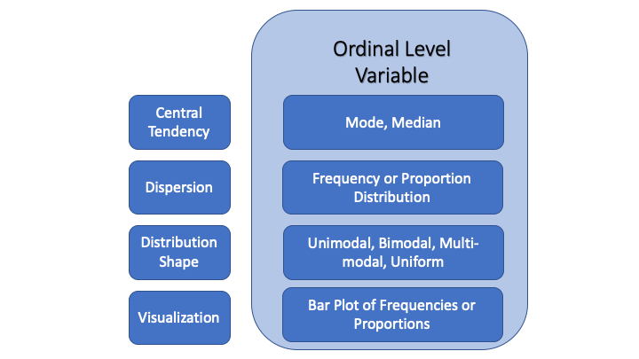

## Overview {#main-content}

This tutorial is the middle step in the three-tutorial sequence on [**univariate description**]{.important-text}. In Tutorial 4, you described **nominal variables**, where the categories are different but not ranked. In this tutorial, you will describe **ordinal variables**, where the categories do have a meaningful order. In Tutorial 6, you will move on to **interval variables**, where the distances between values are meaningful too.

That shift from nominal to ordinal may sound small, but it changes what you can say. The frequency table, proportion table, and bar plot still matter, just as they did for nominal variables. But once categories can be ranked, you can also ask a new question: where is the middle of the distribution? That is why the **median** becomes useful here. The key habit in this tutorial is learning to read ordered categories as an ordered scale, not just as a set of labels.

You will keep practicing familiar R tools from Tutorial 4, including `group_by()`, `summarise()`, `mutate()`, and `ggplot()`. The new function is `median()`, and the new interpretive challenge is remembering that ordinal numbers still need to be translated back into substantive categories. A result like “6” or “1” is not very helpful until you say what that value means.

In this tutorial you will learn:

* How to describe central tendency for ordinal variables using both the mode and the median
* Why the median becomes meaningful when categories have a rank order
* How to use `median()` with `na.rm = TRUE`
* How to use frequency and proportion tables to describe dispersion and shape
* How to use `ggplot()` from the [ggplot2]{.package-name} package to create bar plots for ordinal variables while preserving the substantive order of the categories

```{r setup, include=FALSE}
library(learnr)
library(learnrhash)
library(tidyverse)
library(knitr)
library(gradethis)
tutorial_options(exercise.checker = gradethis::grade_learnr,
                 exercise.completion = FALSE)
fHouse$FHStatus2[fHouse$FHStatus == "NF"] <- 0
fHouse$FHStatus2[fHouse$FHStatus == "PF"] <- 1
fHouse$FHStatus2[fHouse$FHStatus == "F"]  <- 2
fHouse$FHStatus2[fHouse$FHStatus == "NA"] <- NA
fHouse$FHStatus <- fHouse$FHStatus2
```

## Univariate Description

In the previous tutorial you described nominal variables using frequency tables, proportion tables, and bar plots to summarize central tendency, dispersion, and the shape of the distribution. The same tools apply to ordinal variables, but the rank order of the categories gives you one additional tool.

Because ordinal values have a meaningful rank order, you can go beyond counting categories. You can ask not just "which category is most common?" but also "where is the middle of the distribution?" That middle value --- the [**median**]{.important-text} --- is the key new tool in this tutorial. It is only meaningful for variables whose values can be ranked, which is why it was not appropriate for nominal variables.

Before working through the examples, take a moment to identify which variables have ordered categories.

**Practice: Identify ordinal level variables**

Think about which variables have categories that can be ranked in a meaningful order --- and which do not.

```{r concepts-quiz-ordinal, echo=FALSE}
question("Which of the following variables are ordinal level measures? Select all that apply.",
  correct = "Right. Both are ordinal variables.",
  answer("The GDP measured in dollars of nations in the European Union",
         message = "GDP is an interval (and ratio) measure. It is measured in dollars, so the values are ordered and the differences between them are equal at all points on the scale."),
  answer("Freedom House measure of whether a country is free, partly free, or not free", correct = TRUE,
         message = "The Freedom House measure is ordinal. Its response options are rank-ordered by how free a country is, but the differences between categories are not necessarily equal --- there is no guarantee that the political distance from Not Free to Partly Free equals the distance from Partly Free to Free."),
  answer("The level of education of a respondent in a survey where the values include less than a high school degree, high school degree, college degree, and beyond college", correct = TRUE,
         message = "Education level is ordinal. Each successive value indicates more education, but the differences between categories are not equal --- the gap between high school and college is not the same as the gap between college and beyond college. This is the defining feature of ordinal measurement: a meaningful order without equal spacing."),
  answer("A variable measuring whether a country supported a particular UN resolution",
         message = "This is a nominal variable. Supported or did not support are unordered categories with no meaningful rank."),
  allow_retry = TRUE,
  random_answer_order = TRUE,
  try_again = "Incorrect. Try again."
)
```

## Central Tendency

You can describe the [**central tendency**]{.important-text} of an ordinal variable using both the [**mode**]{.important-text} and the [**median**]{.important-text}. The mode tells you the most commonly occurring category --- the same tool used for nominal variables. The median adds something new: because ordinal values have a meaningful rank order, you can ask where the middle of the distribution falls. You will work through the mode first, then the median as the new tool that ordinal measurement makes possible.

### The Mode

To illustrate both statistics, you will work with the variable **rural_urban** in the **counties** data frame. This variable is stored as a numeric variable, classifying US counties using a 9-point scale developed by the US Department of Agriculture, ranging from the most urban counties at one end to the most rural at the other. Knowing how counties are distributed across this scale tells you something important about the context in which the 2016 presidential election played out --- and about whose communities and concerns are most represented in county-level data.

The scale is coded as follows:

- 1: Counties in metro areas of 1 million population or more
- 2: Counties in metro areas of 250,000 to 1 million population
- 3: Counties in metro areas of fewer than 250,000 population
- 4: Urban population of 20,000 or more, adjacent to a metro area
- 5: Urban population of 20,000 or more, not adjacent to a metro area
- 6: Urban population of 2,500 to 19,999, adjacent to a metro area
- 7: Urban population of 2,500 to 19,999, not adjacent to a metro area
- 8: Completely rural or less than 2,500 urban population, adjacent to a metro area
- 9: Completely rural or less than 2,500 urban population, not adjacent to a metro area

Each successive category is less urban than the one before it, but the differences between categories are not equal --- making this an ordinal variable. That order is what lets you talk about a middle county, even though the numbered categories should not be treated as equally spaced units.

Before describing the "typical" county, you need to see how counties are distributed across the full urban-rural scale. A frequency and proportion table lets you see both the count in each category and the share of counties it represents --- and gives you the evidence you need to identify the mode.

As established in Tutorial 4, the standard practice is to filter out missing values before computing proportions --- an NA group would otherwise be included in the denominator and make the substantive proportions sum to less than 1. **rural_urban** has no missing values, so the filter changes nothing here, but the habit applies consistently.

**Practice: Create a frequency and proportion table for rural_urban**

You built frequency and proportion tables in Tutorial 4 using `group_by()`, `summarise()`, and `mutate()` --- the same pipeline applies here. The filter step is already provided. Name your count column **freq** and your proportion column **prop**. Load [dplyr]{.package-name} with `library(dplyr)` at the top. One hint is available. Click "Submit Answer" to check your work.

```{r analysis-practice-rural-table, exercise=TRUE, exercise.lines=6, exercise.cap="Practice: Create a frequency and proportion table for rural_urban"}
library(dplyr)
counties %>%
  filter(!is.na(rural_urban)) %>%
```

```{r analysis-practice-rural-table-hint-1}
# Hint 1 of 1
# Continue the pipeline with group_by(rural_urban),
# then summarise(freq = n()) to count cases,
# then mutate(prop = freq / sum(freq)) to get proportions.
```


```{r analysis-practice-rural-table-check}
grade_this({
  expected <- counties %>%
    filter(!is.na(rural_urban)) %>%
    group_by(rural_urban) %>%
    summarise(freq = n(), .groups = "drop") %>%
    mutate(prop = freq / sum(freq))

  if (!is.data.frame(.result)) {
    fail("Your result should be a data frame. If you're seeing an error, check for unmatched parentheses or a missing %>% between steps. Inside summarise() and mutate(), you are creating new columns with new names --- do not use existing variable names from the data frame on the left side of the =.")
  }

  needed <- c("rural_urban", "freq", "prop")
  if (!all(needed %in% names(.result))) {
    fail("Make sure your table includes rural_urban, freq, and prop.")
  }

  result <- as.data.frame(.result)[needed]
  result <- result[order(result$rural_urban), ]
  expected <- as.data.frame(expected)[needed]
  expected <- expected[order(expected$rural_urban), ]
  rownames(result) <- NULL
  rownames(expected) <- NULL

  if (!identical(result$rural_urban, expected$rural_urban)) {
    fail("Your table should have one row for each value of rural_urban.")
  }
  if (!identical(as.numeric(result$freq), as.numeric(expected$freq))) {
    fail("Check your counts. Use n() inside summarise() to count counties in each rural_urban category.")
  }
  if (!isTRUE(all.equal(as.numeric(result$prop), as.numeric(expected$prop), tolerance = 1e-8))) {
    fail("Check your proportions. Each proportion should be freq divided by the total number of counties.")
  }

  pass("Your frequency and proportion table is correct. Now use it like an analyst: look for the category with the highest count before answering the next question.")
})
```

The highest count identifies the mode, but the analytic work is not finished until that numeric category is translated into words a reader can understand.

**Practice: Interpret the modal category**

Find the mode of **rural_urban** from the table you just created and translate it into a substantive description.

```{r concepts-quiz-mode-interpretation, echo=FALSE}
question("Which of the following statements *best* describes the mode of rural_urban?",
  correct = "Right. The substantive label is always more informative than the numeric code.",
  answer("There is no meaningful modal category",
         message = "One category has noticeably more counties than the others. Look at your frequency table and compare the counts."),
  answer("The modal category is 6",
         message = "Category 6 is indeed the most frequent, but reporting a numeric code without explanation is not informative. What does category 6 actually represent?"),
  answer("The modal county has an urban population of 2,500 to 19,999 and is adjacent to a metro area", correct = TRUE,
         message = "The most frequently occurring category is 6, but it is more informative to give the substantive meaning. Reporting 'the mode is 6' conveys nothing to a reader who does not have the codebook in front of them. Reporting that the typical county has an urban population of 2,500 to 19,999 and is adjacent to a metro area tells readers something real about the geographic character of the typical US county."),
  allow_retry = TRUE,
  random_answer_order = TRUE,
  try_again = "Incorrect. Try again."
)
```

Now that you know which category is most common, you can ask a second question: where is the middle of the distribution? Is the median county also in the same category as the mode, or does it sit somewhere else on the urban-rural scale? That is what the median tells you.

### The Median

The [**median**]{.important-text} is the middle value when all observations are listed in rank order --- the value at the 50th percentile, where half the cases fall at or below and half fall at or above. Because ordinal categories have a meaningful rank order, you can ask which category sits at the midpoint of the distribution. That is what makes the median available for ordinal variables but not for nominal ones: without a rank order, there is no meaningful middle value.

One practical note: if the two middle observations fall in different categories, R's `median()` function returns the arithmetic mean of their numeric codes --- for example, 1.5 if the two middle values are coded 1 and 2. That number does not correspond to a real category. In that case, report the two bracketing categories rather than treating the numeric result as a meaningful value.

R's `median()` function computes the median directly. Pass it the variable using the `$` operator and include `na.rm = TRUE` to exclude any missing values. The numeric codes must correctly represent the rank order of the categories --- always translate the numeric result back into the substantive category label when you report it.

**Run and observe: Calculate the median of rural_urban**

```{r analysis-calculate-median, exercise=TRUE, exercise.cap="Run and observe: Calculate the median of rural_urban"}
median(counties$rural_urban, na.rm = TRUE)
```

**Practice: Interpret the mode and median of rural_urban**

Compare the mode and median of **rural_urban** and think about what their relationship tells you about the center of the distribution.

```{r question-median-rural, echo=FALSE}
question("You just computed the mode and median of rural_urban. What does it mean when the mode and median fall in the same category?",
  correct = "Right. The mode and median both point to the same category.",
  answer("The distribution is perfectly symmetric",
         message = "Having the same mode and median does not guarantee symmetry. It means the most common value and the middle value coincide, but the distribution could still be skewed in either direction."),
  answer("The most common county type and the middle county type are the same --- both have an urban population of 2,500 to 19,999 adjacent to a metro area", correct = TRUE,
         message = "Correct. When the mode and median agree, two different summaries of central tendency point to the same category, making the characterization of the typical case especially clear."),
  answer("All counties have an urban population of 2,500 to 19,999",
         message = "The mode and median describe the center of the distribution, not all values. Many counties fall in other categories."),
  answer("The median cannot be computed for an ordinal variable",
         message = "The median is appropriate for ordinal variables because their values have a meaningful rank order."),
  allow_retry = TRUE,
  random_answer_order = TRUE,
  try_again = "Incorrect. Try again."
)
```

Note that the median depends on how the categories are ordered and coded, so it is essential to state how the scale runs whenever you report it. Here, category 1 is the most urban and category 9 is the most rural, so a median of 6 places the typical county toward the more rural end of the scale. The FHStatus example will show what happens when the mode and median do not agree.

## Dispersion and the Shape of the Distribution

[**Dispersion**]{.important-text} refers to how spread out the values of a variable are across its categories. A variable with low dispersion has most cases concentrated in one or a few categories; a variable with high dispersion has cases spread more evenly across many categories. The more dispersed a variable, the less informative the mode is as a summary --- when cases are spread evenly, knowing the most common category tells you relatively little about the typical case. That is why ordinal description works best when the mode, median, and full distribution are read together.

The frequency table you built shows that **rural_urban** is fairly dispersed: the counts range across all nine categories with no single category containing more than about 15% of counties. This means the mode is a less informative summary than it would be if one category dominated --- knowing the most common county type gives only a partial picture of how varied US counties actually are. A bar plot makes the shape of this spread visible at a glance.

## Visualizing an Ordinal Variable

Bar plots for ordinal variables follow the same layered structure as for nominal variables, but the categories must appear in their rank order on the x-axis --- not alphabetically or by frequency --- so that the shape of the distribution is visually meaningful.

### County urban-rural classification

The frequency table gives you the exact counts and proportions, but it can still be hard to see the overall shape of the distribution from numbers alone. A bar plot lets you compare all nine categories at once and ask whether counties cluster at one end of the urban-rural scale, spread fairly evenly across it, or concentrate around a particular category.

**Practice: Create a frequency bar plot for rural_urban**

You built frequency bar charts in Tutorial 4 using `ggplot()`, `geom_bar()`, `labs()`, and `scale_x_discrete()` --- the same structure applies here. The one addition is `coord_flip()` as a final layer, which flips the bars horizontal and makes the nine category labels readable. Load [ggplot2]{.package-name} with `library(ggplot2)` at the top. Use the following shortened labels for `scale_x_discrete()`, listed in order from category 1 to 9 --- type them yourself rather than copying and pasting:

- 1 million+
- 250,000 to 1 million
- \< 250,000
- 20k+ near metro
- 20k+ not near metro
- 2,500-19,999 near metro
- 2,500-19,999 not near metro
- \< 2,500 near metro
- \< 2,500 not near metro

Title: "USDA Urban/Rural Classification of US Counties", subtitle: "2016", y-axis: "Frequency", caption: "Source: Linn, Nagler, Zilinsky", fill: "firebrick". One hint is available. Click "Submit Answer" to check your work.

::: {.tip}
**Always type quotation marks yourself.** When you copy text from a tutorial page into R code, browsers sometimes substitute curly quotation marks (`" "`) for the straight quotation marks (`" "`) that R requires. If you copy a label or title string and get an unexpected syntax error, this is almost certainly the cause. Always type your own quotation marks when writing R code.
:::

```{r visual-practice-bar-rural, exercise=TRUE, exercise.cap="Practice: Create a frequency bar plot for rural_urban"}
library(ggplot2)

```

```{r visual-practice-bar-rural-hint-1}
# Hint 1 of 1
# The structure is identical to Tutorial 4 with one
# addition: coord_flip() as the final layer.
# rural_urban is stored as numeric, so wrap it in
# factor() inside aes(). Inside scale_x_discrete(),
# labels = c(...) takes all nine shortened labels
# in order from category 1 to 9.
```


```{r visual-practice-bar-rural-check}
grade_this({
  if (!inherits(.result, "ggplot")) {
    fail("Your code should return a ggplot object. If you're seeing an error rather than a plot, the most common causes are: a missing + at the end of a line, unmatched parentheses, or a label string that is missing its quotation marks.")
  }

  bar_layers <- Filter(function(layer) inherits(layer$geom, "GeomBar"), .result$layers)
  if (length(bar_layers) == 0) {
    fail("Add geom_bar() to create a frequency bar plot.")
  }

  if (!is.data.frame(.result$data) || !"rural_urban" %in% names(.result$data)) {
    fail("Use rural_urban from the counties data frame for this plot.")
  }

  expected_values <- sort(as.character(counties$rural_urban[!is.na(counties$rural_urban)]))
  actual_values   <- sort(as.character(.result$data$rural_urban[!is.na(.result$data$rural_urban)]))
  if (!identical(actual_values, expected_values)) {
    fail("Use all nonmissing observations of rural_urban from the counties data frame. Do not remove any valid observations.")
  }

  x_expr <- paste(deparse(rlang::get_expr(.result$mapping$x)), collapse = "")
  if (!grepl("factor\\s*\\(\\s*rural_urban\\s*\\)", x_expr) &&
      !grepl("as.factor\\s*\\(\\s*rural_urban\\s*\\)", x_expr)) {
    fail("Map factor(rural_urban) to the x-axis so the ordinal categories appear as categories.")
  }

  bar_layer <- bar_layers[[1]]
  y_map <- tryCatch(rlang::get_expr(bar_layer$mapping$y), error = function(e) NULL)
  y_expr <- if (!is.null(y_map)) paste(deparse(y_map), collapse = "") else ""
  if (grepl("after_stat\\s*\\(\\s*prop\\s*\\)", y_expr) || grepl("\\.\\.prop\\.\\.", y_expr)) {
    fail("This exercise asks for a frequency bar chart, not a proportion chart. Remove the y = after_stat(prop) and group = 1 arguments from geom_bar().")
  }

  fill_value <- bar_layer$aes_params$fill
  if (is.null(fill_value) || !identical(tolower(fill_value), "firebrick")) {
    fail('Set fill = "firebrick" inside geom_bar() to color the bars.')
  }

  if (!identical(.result$labels$title, "USDA Urban/Rural Classification of US Counties")) {
    fail("Check the plot title.")
  }
  if (!identical(.result$labels$subtitle, "2016")) {
    fail("Check the subtitle.")
  }
  if (!is.null(.result$labels$x)) {
    fail("Set the x-axis label to NULL.")
  }
  if (!identical(.result$labels$y, "Frequency")) {
    fail("Set the y-axis label to Frequency.")
  }
  if (!identical(.result$labels$caption, "Source: Linn, Nagler, Zilinsky")) {
    fail("Check the caption.")
  }

  x_scales <- Filter(function(s) "x" %in% s$aesthetics, .result$scales$scales)
  if (length(x_scales) == 0) {
    fail("Add scale_x_discrete() to replace the numeric codes with readable labels.")
  }

  expected_labels <- c("1 million+", "250,000 to 1 million", "< 250,000",
                       "20k+ near metro", "20k+ not near metro",
                       "2,500-19,999 near metro", "2,500-19,999 not near metro",
                       "< 2,500 near metro", "< 2,500 not near metro")
  actual_labels <- x_scales[[1]]$labels
  if (!identical(actual_labels, expected_labels)) {
    fail("Check your scale_x_discrete() labels carefully --- they must match the instructions exactly, including capitalization, spacing after < symbols, and hyphens between numbers. Type the labels yourself rather than copying from the instructions.")
  }

  has_flip <- isTRUE(tryCatch({
    coord_class <- class(.result$coordinates)[1]
    grepl("flip|Flip", coord_class, ignore.case = TRUE) ||
      isTRUE(.result$coordinates$is_flipped())
  }, error = function(e) {
    any(grepl("flip|Flip", class(.result$coordinates), ignore.case = TRUE))
  }))
  if (!has_flip) {
    fail("Add coord_flip() as the final layer to flip the bars horizontal.")
  }

  pass("Well done! The chart is correct.")
})
```

The bars are fairly similar in length across all nine categories, with no single category clearly standing out. This tells you three things:

- **Central tendency:** The modal category is "Urban population of 2,500 to 19,999, adjacent to a metro area" (category 6) --- the same as the median. The typical US county is small and semi-rural. Note that this describes the distribution of *counties*, not of *people* --- because each county counts once here, the finding tells you about units of local government, not about where most Americans live.
- **Dispersion:** The counts are spread across all nine categories without any single category clearly dominating. The data are fairly dispersed, which means the mode is a less informative summary than it would be if one category dominated.
- **Shape:** The distribution is spread fairly evenly across categories with no strong peak and no obvious concentration at either the urban or rural end. If half the counties were very urban and half very rural the distribution would be bimodal, but that is not what the data show.

Note that the median cannot be read directly from a bar plot --- that requires the computation you performed earlier.

One thing worth noticing: the bars appear in the correct rank order because the numeric codes for **rural_urban** run from 1 (most urban) to 9 (most rural) in rank order, and `factor()` preserves that numeric ordering. After `coord_flip()`, the most urban category appears at the bottom and the most rural at the top. If the variable were stored as character labels rather than ordered numbers, R would display the categories alphabetically instead. Always check that the axis reflects the substantive rank order of the categories before interpreting the shape of the distribution.

### Freedom House political freedom ratings

Now let's apply the same tools to a second ordinal variable. The variable **FHStatus** in the data frame **fHouse** contains Freedom House's annual assessment of political freedom in countries around the world. Freedom House is a non-governmental organization that rates political freedom and civil liberties in countries worldwide; their assessments are widely used in political science research as measures of democracy and human rights. The variable is stored as a numeric variable, taking three values: "Not Free" (coded 0), "Partly Free" (coded 1), and "Free" (coded 2). As you go from "Not Free" to "Free" a country becomes progressively more politically free, making this an ordinal variable.

Before you compare the mode and median, you need to see how countries are distributed across the three Freedom House categories. This pipeline applies the filtering norm established in Tutorial 4: `filter(!is.na(FHStatus))` removes rows where FHStatus is missing before computing the table. Here, unlike rural_urban, there are missing values --- so the filter is doing real work. Without it, the NA group would be included in the proportion denominator, making the substantive proportions sum to less than 1. The frequency and proportion table will tell you which category is most common and how much of the distribution falls below or above it.

**Practice: Create a frequency and proportion table for FHStatus**

Write a pipeline that produces a frequency and proportion table for **FHStatus**. The first two lines are provided --- complete the pipeline by adding `group_by()`, `summarise()`, and `mutate()`. Name your count column **freq** and your proportion column **prop**. Three hints are available. Click "Submit Answer" to check your work.

```{r analysis-practice-fhstatus-freq, exercise=TRUE, exercise.lines=8, exercise.cap="Practice: Create a frequency and proportion table for FHStatus"}
fHouse %>%
  filter(!is.na(FHStatus)) %>%

```

```{r analysis-practice-fhstatus-freq-hint-1}
# Hint 1 of 3
# The filter() step is already done for you.
# Continue the pipeline with group_by(FHStatus),
# then summarise() to count cases in each category,
# then mutate() to convert counts to proportions.
# The structure is identical to the rural_urban table.
```

```{r analysis-practice-fhstatus-freq-hint-2}
# Hint 2 of 3
# The three functions you need are group_by(),
# summarise(), and mutate(), connected with %>%.
# In summarise(), use n() to count and name the
# result freq. In mutate(), divide freq by sum(freq)
# to get prop.
```

```{r analysis-practice-fhstatus-freq-hint-3}
# Hint 3 of 3
# After the two starter lines, the pipeline continues:
# group_by(FHStatus) to define the groups,
# summarise() with freq = n() to count cases,
# and mutate() with prop = freq / sum(freq)
# to compute each category's share of the total.
```


```{r analysis-practice-fhstatus-freq-check}
grade_this({
  expected <- fHouse %>%
    filter(!is.na(FHStatus)) %>%
    group_by(FHStatus) %>%
    summarise(freq = n(), .groups = "drop") %>%
    mutate(prop = freq / sum(freq))

  if (!is.data.frame(.result)) {
    fail("Your result should be a data frame. If you're seeing an error, check for unmatched parentheses or a missing %>% between steps. Inside summarise() and mutate(), you are creating new columns with new names --- do not use existing variable names from the data frame on the left side of the =.")
  }

  needed <- c("FHStatus", "freq", "prop")
  if (!all(needed %in% names(.result))) {
    fail("Make sure your table includes FHStatus, freq, and prop.")
  }

  result <- as.data.frame(.result)[needed]
  result <- result[order(result$FHStatus), ]
  expected <- as.data.frame(expected)[needed]
  expected <- expected[order(expected$FHStatus), ]
  rownames(result) <- NULL
  rownames(expected) <- NULL

  if (!identical(result$FHStatus, expected$FHStatus)) {
    fail("Your table should have one row for each non-missing value of FHStatus. Make sure missing FHStatus values are excluded.")
  }
  if (!identical(as.numeric(result$freq), as.numeric(expected$freq))) {
    fail("Check your counts. Use n() inside summarise() after grouping by FHStatus.")
  }
  if (!isTRUE(all.equal(as.numeric(result$prop), as.numeric(expected$prop), tolerance = 1e-8))) {
    fail("Check your proportions. Each proportion should be freq divided by the total number of non-missing FHStatus cases.")
  }

  pass("Your FHStatus table is correct. Missing values were excluded before computing frequencies and proportions. Note the mode before answering the next question.")
})
```

**Practice: Interpret the mode of FHStatus**

Find the mode of **FHStatus** from the table you just created and translate it into a substantive description.

```{r concepts-quiz-fhstatus-mode, echo=FALSE}
question("Which of the following statements *best* describes the mode of FHStatus?",
  correct = "Right. The modal category is Free.",
  answer("The mode is 2",
         message = "Rather than report a numeric code, describe the modal category substantively. What does a value of 2 represent?"),
  answer("The modal category is Partly Free because it lies in the middle of the ordered scale",
         message = "The middle of the ordered scale is where the median falls, not the mode. The mode is simply the most frequently occurring category --- it has nothing to do with position on the scale. Check your frequency table for the category with the highest count."),
  answer("The modal category is Free", correct = TRUE,
         message = "The most frequently occurring category is coded 2, which represents countries assessed as Free. Reporting this substantively is always more informative than citing the numeric code --- 'the modal country is Free' tells readers something meaningful, while 'the mode is 2' does not."),
  answer("The distribution is multimodal",
         message = "Look at your frequency table. One category clearly has more countries than the others."),
  allow_retry = TRUE,
  random_answer_order = TRUE,
  try_again = "Incorrect. Try again."
)
```

Now that you know the modal category, you can ask whether the middle country falls in that same category. The median tells you where the midpoint lands when countries are ranked from least free to most free. Because the numeric codes run in rank order --- 0 for Not Free through 2 for Free --- the `median()` function will return the correct category. If the median and mode differ, that difference tells you something important about how the distribution is spread across the scale.

**Practice: Calculate the median for FHStatus**

Apply the same `median()` call you used for **rural_urban**, adapted for this variable and data frame. Two hints are available. Click "Submit Answer" to check your work.

```{r analysis-practice-fhstatus-median, exercise=TRUE, exercise.cap="Practice: Calculate the median for FHStatus"}

```

```{r analysis-practice-fhstatus-median-hint-1}
# Hint 1 of 2
# You calculated the median for rural_urban earlier
# in this tutorial using a single function call.
# The same function and syntax work here ---
# just change the data frame and variable name.
```

```{r analysis-practice-fhstatus-median-hint-2}
# Hint 2 of 2
# The function that computes the median in R takes
# the variable as its first argument and na.rm = TRUE
# as its second. The variable is accessed using
# the $ operator: data.frame$variable.
```


```{r analysis-practice-fhstatus-median-check}
grade_this({
  expected <- median(fHouse$FHStatus, na.rm = TRUE)

  if (is.null(.result)) {
    fail("Make sure your code produces a result the grader can check.")
  }
  if (!is.numeric(.result) || length(.result) != 1) {
    fail("Your result should be a single number returned by median().")
  }
  if (is.na(.result)) {
    fail("Your result is NA. Include na.rm = TRUE so R ignores missing values.")
  }
  if (!isTRUE(all.equal(as.numeric(.result), as.numeric(expected)))) {
    fail("Check that you are computing the median of FHStatus in the fHouse data frame.")
  }

  pass(paste0("Correct! The median is ", expected, ", which corresponds to the category Partly Free."))
})
```

If the mode and median point to different categories, the full distribution helps explain why. A proportion bar chart will show how the countries are spread across the three categories, making the relationship between the mode and median visible. Proportions are more useful than counts here because they tell you each category's share of all countries --- making the distribution easier to describe and compare.

**Practice: Create a proportion bar chart for FHStatus**

You built proportion bar charts in Tutorial 4 using the same pipeline structure: pipe the data through `filter(!is.na(FHStatus))` before `ggplot()`, map `factor(FHStatus)` to the x-axis, and add `aes(y = after_stat(prop), group = 1)` inside `geom_bar()`. When data arrives via a pipe, only `mapping =` is needed in `ggplot()`, not `data =`. Use the following category labels in `scale_x_discrete()`, listed in order from code 0 to 2: "Not Free", "Partly Free", "Free".

Title: "Freedom House Ranking of Countries", y-axis: "Proportion", caption: "Source: Freedom House", fill: "steelblue". Two hints are available. Click "Submit Answer" to check your work.

```{r visual-practice-fhstatus-prop-bar, exercise=TRUE, exercise.cap="Practice: Create a proportion bar chart for FHStatus"}

```

```{r visual-practice-fhstatus-prop-bar-hint-1}
# Hint 1 of 2
# The structure is the same as Tutorial 4: pipe the
# data through filter() before ggplot(), map
# factor(FHStatus) to the x-axis, and build the
# same layers as a proportion bar chart.
```

```{r visual-practice-fhstatus-prop-bar-hint-2}
# Hint 2 of 2
# Inside geom_bar(), add aes(y = after_stat(prop),
# group = 1) and fill = "steelblue" outside aes().
# Add labs() and scale_x_discrete() with the three
# category labels in order: Not Free, Partly Free, Free.
```


```{r visual-practice-fhstatus-prop-bar-check}
grade_this({
  if (!inherits(.result, "ggplot")) {
    fail("Your code should return a ggplot object. If you're seeing an error rather than a plot, the most common causes are: a missing + at the end of a line, unmatched parentheses, or a label string that is missing its quotation marks.")
  }

  if (!is.data.frame(.result$data) || !"FHStatus" %in% names(.result$data)) {
    fail("Use FHStatus from the fHouse data frame for this plot.")
  }
  if (any(is.na(.result$data$FHStatus))) {
    fail("Filter out missing FHStatus values before plotting.")
  }

  expected_values <- sort(as.character(fHouse$FHStatus[!is.na(fHouse$FHStatus)]))
  actual_values   <- sort(as.character(.result$data$FHStatus))
  if (!identical(actual_values, expected_values)) {
    fail("Use all nonmissing observations of FHStatus from the fHouse data frame. Do not remove any valid observations.")
  }

  bar_layers <- Filter(function(layer) inherits(layer$geom, "GeomBar"), .result$layers)
  if (length(bar_layers) == 0) {
    fail("Add geom_bar() to create the bar plot.")
  }

  x_expr <- paste(deparse(rlang::get_expr(.result$mapping$x)), collapse = "")
  if (!grepl("factor\\s*\\(\\s*FHStatus\\s*\\)", x_expr) &&
      !grepl("as.factor\\s*\\(\\s*FHStatus\\s*\\)", x_expr)) {
    fail("Map factor(FHStatus) to the x-axis so the categories are treated as discrete rather than numeric.")
  }

  layer_map <- bar_layers[[1]]$mapping
  y_expr <- paste(deparse(rlang::get_expr(layer_map$y)), collapse = "")

  if (!grepl("after_stat\\s*\\(\\s*prop\\s*\\)", y_expr) && !grepl("\\.\\.prop\\.\\.", y_expr)) {
    fail("Inside geom_bar(), map y to after_stat(prop) so the bars show proportions.")
  }

  group_quo <- bar_layers[[1]]$mapping$group
  group_ok <- tryCatch({
    !is.null(group_quo) && identical(rlang::eval_tidy(group_quo), 1)
  }, error = function(e) FALSE)
  if (!group_ok) {
    fail("Inside geom_bar(), include group = 1 so proportions are computed across all FHStatus categories.")
  }

  fill_value <- bar_layers[[1]]$aes_params$fill
  if (is.null(fill_value) || !identical(tolower(fill_value), "steelblue")) {
    fail('Set fill = "steelblue" inside geom_bar() to color the bars.')
  }

  if (!identical(.result$labels$title, "Freedom House Ranking of Countries")) fail("Check the plot title.")
  if (!is.null(.result$labels$x)) fail("Set the x-axis label to NULL.")
  if (!identical(.result$labels$y, "Proportion")) {
    fail("Set the y-axis label to Proportion.")
  }
  if (!identical(.result$labels$caption, "Source: Freedom House")) {
    fail('Check the caption. Use "Source: Freedom House".')
  }

  x_scales <- Filter(function(s) "x" %in% s$aesthetics, .result$scales$scales)
  labels <- if (length(x_scales) > 0) x_scales[[1]]$labels else NULL
  if (!identical(unname(labels), c("Not Free", "Partly Free", "Free"))) {
    fail("Use scale_x_discrete() to label the categories Not Free, Partly Free, and Free in that order.")
  }

  pass("Well done! The proportion plot makes it easy to see each category's share of all countries and to understand why the mode and median differ.")
})
```

**Practice: Describe the distribution of FHStatus**

Use the bar chart to describe the shape of the distribution of **FHStatus**.

```{r question-shape-fhstatus, echo=FALSE}
question("Based on the proportion bar plot, how would you best describe the shape of the distribution of FHStatus?",
  correct = "Right. The distribution is unimodal.",
  answer("Unimodal --- Free is the most common category, with Not Free and Partly Free trailing behind", correct = TRUE,
         message = "Free is the modal category and the distribution has one clear peak. The distribution is unimodal even though Not Free and Partly Free are substantial --- unimodal means one category leads, not that it accounts for most of the data. Notice that the median still falls in Partly Free even though Free is the mode: Not Free and Partly Free together account for more than half of all countries, pulling the midpoint below the most common value. That divergence between mode and median is worth reporting and explaining."),
  answer("Uniform --- the three categories are approximately equally common",
         message = "The bars are not equal in height. Free is noticeably the most common category, so the distribution is not uniform."),
  answer("Bimodal --- two categories are similarly prevalent and more common than the third",
         message = "Bimodal requires two categories of similar prominence. Here Free is clearly the tallest bar; Not Free and Partly Free are smaller and not similarly prominent to each other or to Free."),
  answer("Multimodal --- each category represents a separate peak",
         message = "Multimodal means several categories are notably more common than the rest. Having observations in three categories does not make a distribution multimodal."),
  allow_retry = TRUE,
  random_answer_order = TRUE,
  try_again = "Incorrect. Try again."
)
```

When the shape of a distribution is genuinely ambiguous, presenting the full distribution is more informative than forcing a single label.


## Check Your Understanding

The following questions focus on the main new ideas in this tutorial: what the median adds to your description of an ordered variable, and what it means when the mode and median agree or diverge.

Start by thinking about the level of measurement of a 5-point scale and which measures of central tendency that level makes available.

**Apply: Choose the right tool**

Think about what ordinal measurement makes possible that nominal measurement does not.

```{r question-tool-choice-ordinal, echo=FALSE}
question("A researcher wants to describe the central tendency of a 5-point satisfaction scale (1 = very dissatisfied, 5 = very satisfied). Which statistics are appropriate?",
  correct = "Right. Both the mode and the median are appropriate for ordinal variables.",
  answer("The mean only, because the variable is coded numerically",
         message = "A satisfaction scale is ordinal --- the differences between points are not necessarily equal. The mean assumes equal intervals and is not technically appropriate, though it is sometimes used in practice."),
  answer("The mode only, because the variable is categorical",
         message = "The mode is appropriate, but it is not the only option. Because the categories have a meaningful rank order, the median is also available."),
  answer("Both the mode and the median, because the categories have a meaningful rank order", correct = TRUE,
         message = "Both statistics are appropriate for ordinal variables. The mode identifies the most common response and the median locates the midpoint of the distribution. A 5-point satisfaction scale has a meaningful rank order, which makes the median available. Together they give a fuller picture than either alone."),
  answer("Neither the mode nor the median, because the variable has too few categories",
         message = "The number of categories does not determine which statistics are appropriate. Level of measurement does. Both mode and median are appropriate for ordinal variables regardless of how many categories they have."),
  allow_retry = TRUE,
  random_answer_order = TRUE,
  try_again = "Incorrect. Try again."
)
```

**Apply: Interpret a result**

Now apply those tools to a specific result and think about what the gap between the mode and median reveals.

```{r question-synthesis-ordinal, echo=FALSE}
question("A researcher studying job satisfaction reports that for a 5-point scale (1 = very dissatisfied, 5 = very satisfied), the mode is 5 and the median is 3. Which of the following best interprets this result?",
  correct = "Right. The mode and median together reveal something neither statistic shows alone.",
  answer("The typical worker is very satisfied, because the most common response is 5.",
         message = "The mode identifies the most common response, but it does not tell you where the middle of the distribution falls. Here the median is 3, meaning half of all workers reported satisfaction of 3 or lower. A mode of 5 with a median of 3 tells a more complicated story than 'the typical worker is very satisfied.'"),
  answer("The most common response is high satisfaction, but half of all workers reported a satisfaction level of 3 or lower. The mode alone would therefore give an incomplete picture of the distribution.", correct = TRUE,
         message = "When the mode is above the median, the most common response sits higher on the scale than the midpoint of the distribution. Here, 5 is the most common response, but half of all workers reported 3 or lower. Reporting only the mode would therefore give an incomplete and potentially misleading picture of worker satisfaction. To say more about the overall pattern --- how concentrated the responses are, or whether they trail off gradually toward the low end --- you would need to see the frequencies across all five categories, not just the mode and median."),
  answer("The distribution is symmetric, because the mode and median are both in the middle of the scale.",
         message = "The median of 3 is in the middle of the scale, but the mode of 5 is at the top. A symmetric distribution would have the mode and median close together, not two points apart."),
  answer("The median is a better summary than the mode here, because the mode is always less informative for ordinal variables.",
         message = "The mode is not always less informative --- it identifies the most common response, which is meaningful. The point is that neither statistic alone tells the full story. Together they reveal something the mode alone conceals: that the most common response is at the high end while the midpoint of the distribution is considerably lower."),
  allow_retry = TRUE,
  random_answer_order = TRUE,
  try_again = "Incorrect. Try again."
)
```

**Apply: Interpret a result**

Think about what the median can and cannot tell you when it stays the same despite a change in the distribution.

```{r question-interpret-ordinal, echo=FALSE}
question("A 5-category ordinal variable has a median of 3. After several observations move from category 1 to category 2, the median remains 3. What can you conclude?",
  correct = "Right. The median stayed the same, but the distribution changed.",
  answer("The distribution changed even though the median did not --- observations shifted from one lower category to another, which does not move the midpoint but does change the shape of the distribution",
         correct = TRUE,
         message = "The median identifies the midpoint of the ordered distribution, but it is insensitive to changes that happen entirely on one side of that midpoint. Here, observations moved from category 1 to category 2 --- both below the median of 3 --- so the midpoint did not shift. The distribution is less concentrated at the lowest end than it was before, which matters for describing shape and dispersion, but the median alone cannot tell you that. This is exactly why reporting the full distribution alongside the median is more informative than reporting the median alone."),
  answer("The distribution did not change, because the median stayed the same",
         message = "The median staying the same does not mean the distribution stayed the same. Observations moved from category 1 to category 2 --- a real change in the distribution --- but because both categories lie below the median of 3, the midpoint did not shift. The distribution is now less concentrated at the lowest end, even though the median is unchanged."),
  answer("The mode must also be 3, since the median is 3",
         message = "The median and mode are separate measures of central tendency. The median being 3 tells you where the midpoint of the distribution falls; it says nothing about which category is most common. The mode could be any category."),
  answer("The variable should be treated as interval rather than ordinal, since its median is stable",
         message = "The stability of the median has nothing to do with level of measurement. Ordinal variables can have stable medians across different distributions. What makes a variable ordinal is that its categories have a meaningful rank order without necessarily equal spacing between them."),
  allow_retry = TRUE,
  random_answer_order = TRUE,
  try_again = "Incorrect. Try again."
)
```

## The Takeaways

This tutorial is the middle step in the three-tutorial sequence on univariate description. The same three-part framework applies --- [**central tendency**]{.important-text}, [**dispersion**]{.important-text}, and [**shape**]{.important-text} --- but ordinal measurement adds one new tool: the [**median**]{.important-text}. Because ordinal categories can be ranked, you can now ask not just which category is most common but where the middle of the distribution falls.

For ordinal variables, the three dimensions are described as follows:

- [**Central tendency**]{.important-text} is described with both the [**mode**]{.important-text} and the [**median**]{.important-text}. The mode identifies the most common category; the median identifies the midpoint of the ordered distribution. In R, `median(data$variable, na.rm = TRUE)` gives you the median directly. When the mode and median agree, the typical value is especially clear. When they diverge, as they did for FHStatus, that difference is part of the story and should be explained.

- [**Dispersion**]{.important-text} is described with frequency and proportion tables. As established in Tutorial 4, always filter out missing values before computing proportions --- an NA group would otherwise be included in the denominator, making the substantive proportions sum to less than 1. After filtering, use `group_by()`, `summarise()`, and `mutate()` to count cases and calculate proportions. The more spread out the cases are across categories, the less you should rely on the mode or median alone.

- [**Shape**]{.important-text} is easiest to see in a bar plot. For ordinal variables, the bars must appear in the substantive rank order of the categories. A distribution is [**unimodal**]{.important-text} when one category clearly leads, [**bimodal**]{.important-text} when two categories are similarly prominent, [**uniform**]{.important-text} when cases are spread approximately evenly, and [**multimodal**]{.important-text} when several categories stand out. If the numeric codes already run in the correct direction, `factor()` preserves that ordering. Use `scale_x_discrete()` to add readable labels while maintaining the rank order. Use `coord_flip()` when category labels are long.

In R, load [dplyr]{.package-name} and [ggplot2]{.package-name} once at the top of your script or Quarto document with `library(dplyr)` and `library(ggplot2)` before any code that uses functions from those packages. When building a proportion bar chart, filter out missing values before passing data to `ggplot()` --- for the same reason as proportion tables, an NA bar would otherwise be included in the proportion computation, making the substantive proportions sum to less than 1. Pipe the filtered data frame directly into `ggplot()` --- when data arrives via a pipe, the `data =` argument is supplied automatically and only `mapping =` is needed.

In Tutorial 6, you will move to interval variables, where the distances between values are equal and meaningful. That additional property makes the [**mean**]{.important-text} available as a measure of central tendency --- the payoff for all the "not appropriate for ordinal" caveats in this tutorial. The median remains useful for interval variables too, but the mean becomes the primary tool.

{width="70%" fig.alt="Infographic titled 'Ordinal Level Variable' with four stacked blue boxes listing: Median or Mode; Frequency or Proportion Distribution; Unimodal, Bimodal, Multimodal, or Uniform; Bar Plot of Ordered Categories. A left sidebar lists Central Tendency, Dispersion, Distribution, and Visualization."}


## Submit Your Work

When you have completed all exercises in this tutorial, generate your submission code using the button below. Copy the full code that appears and paste it into the Canvas submission box for this tutorial. The code can be long --- make sure you have copied all of it before submitting.

```{r encode-logic-05, context="server"}
learnrhash::encoder_logic()
```

```{r encode-ui-05, echo=FALSE}
learnrhash::encoder_ui(
  ui_before = shiny::div(
    shiny::p("Click the button below to generate your submission code.
              Copy the full code and paste it into Canvas.")
  )
)
```

```{r tutorial-success-banner-05, results="asis", echo=FALSE}
cat('
<p class="tutorial-complete"
   role="status"
   aria-label="Great work! You have completed this tutorial and can now describe and visualize ordinal variables, building on your skills from the previous tutorial.">
  <span aria-hidden="true">🎉</span>
  Great work! You can now describe and visualize ordinal variables, building on your skills from the previous tutorial.
</p>
')
```
