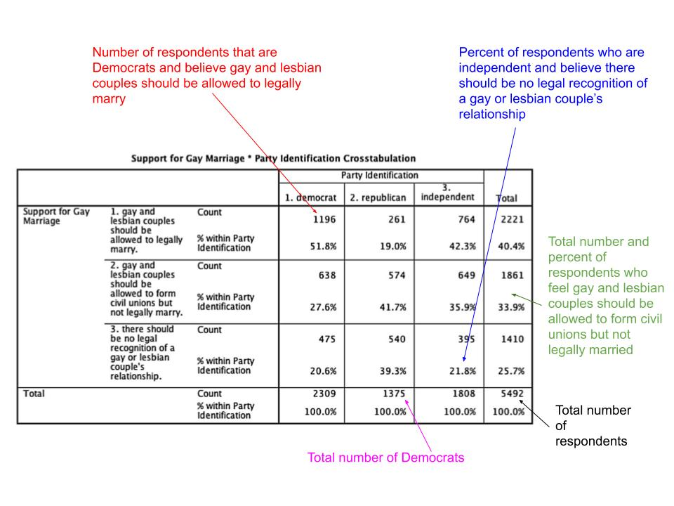

## Overview {#main-content}

Almost every claim worth arguing about in politics is a claim about a relationship. Rural voters turned toward one party. Democracies protect civil liberties better than autocracies do. Policies spread from one state to its neighbors. A claim of that shape says that knowing something about a case tells you something more about it --- that cases differing on one attribute tend to differ on another as well. Describing a single variable can never settle such a claim, however carefully it is done, because the claim is about two things at once.

Where both variables are categorical, the tool is a **cross-tabulation** --- a table showing how the outcome is distributed within each category of the explanatory variable. You will build one, learn which of its numbers to read, and use it to say whether a pattern points the way a hypothesis predicted.

In this tutorial you will learn:

* How to conduct a descriptive analysis of the relationship between two nominal or ordinal variables, or one of each, using cross-tabs
* How to use the `CrossTable()` function from the [descr]{.package-name} package to produce cross-tabs
* How to use column proportions to evaluate whether a pattern is consistent with a hypothesis
* How to visualize cross-tab patterns with grouped bar plots using `ggplot()` from the [ggplot2]{.package-name} package with the `fill` aesthetic, `position = "dodge"`, and `after_stat(prop)`

```{r setup, include=FALSE}
library(learnr)
library(dplyr)
library(ggplot2)
library(descr)
library(gradethis)
tutorial_options(exercise.checker = gradethis::grade_learnr,
                 exercise.completion = FALSE)
knitr::opts_chunk$set(error = TRUE)
options(lifecycle_verbosity = "quiet")
options(cli.num_colors = 1)
data("counties", package = "QPATutorialsCourse")
data("world", package = "QPATutorialsCourse")
```


## Bivariate Description

Once you have described the main features of the individual variables in a study, you want to look at the relationships between them. [Bivariate description]{.important-text} is the practice of examining two variables at a time, asking whether the values of one differ systematically across the values of the other. The hypotheses you bring to an analysis suggest what you should expect to see. For example, if you hypothesize that more rural counties tend to favor Republican presidential candidates, you can examine one piece of evidence for that claim by comparing the proportion of counties that cast a majority of their votes for Donald Trump in 2016 in more rural counties to that in more urban counties.

How you describe a bivariate relationship depends on the level of measurement of both variables.

- If both variables are categorical --- some combination of nominal and ordinal variables --- you describe the relationship using a cross-tabulation, which you may choose to visualize as a grouped bar plot.
- If one variable is categorical and one is interval, you compare the mean of the interval variable across categories of the categorical variable and may also compare the full distribution using histograms or box plots.
- If both variables are interval, you illustrate the relationship with a scatter plot and summarize its strength and direction with a correlation coefficient.

This tutorial covers the first case. Each of its three examples opens with a research question and a hypothesis, builds the table, and asks whether the pattern in it matches what the hypothesis predicts.

## Describing the Relationship Between Two Nominal or Ordinal Variables

Describing a relationship means asking how one variable changes across values of another, so the first step is deciding which variable plays which role. The [explanatory variable]{.important-text} is the one whose categories you compare across. The [outcome variable]{.important-text} is the one whose distribution you examine within each of those categories. Which is which comes from the hypothesis you are evaluating rather than from anything in the data --- the same two variables can trade roles under a different question.

You may have met these under other names. The explanatory variable is also called the independent variable, and the outcome variable the dependent variable. These tutorials use explanatory and outcome throughout, because those names say what each variable does in the analysis: one explains, the other is the outcome being explained.

You use a [cross-tabulation]{.important-text} --- or cross-tab --- to describe the relationship between two categorical variables. A cross-tab is a table that shows the distribution of cases across values of the outcome variable for cases that have different values on the explanatory variable. You've seen tables like this in textbooks and other contexts many times, even if you haven't called them cross-tabs before.

Each row of the table presents the different values the outcome variable can take, and each column represents the values the explanatory variable can take. Each cell gives the number of cases with that combination of row and column values. The margins give the row and column totals, and the bottom-right corner gives the total number of cases. A cross-tab may also report proportions calculated out of the row total, the column total, or all cases in the table. Which representation is most useful depends on what you want to compare --- and for evaluating hypotheses, you will almost always want column proportions.

The image below shows a cross-tab of the relationship between party identification and attitudes toward gay and lesbian relationships, with column proportions. Take a moment to orient yourself before reading the annotations --- find the row totals on the right, the column totals at the bottom, and try reading one cell on your own.

```{r crosstab-gay-support-by-party, echo=FALSE, out.width='70%', fig.alt='Annotated table showing a crosstabulation of support for gay marriage by party identification, with annotation arrows explaining how to interpret specific cells. Rows list three positions: allowing gay and lesbian couples to legally marry, allowing civil unions but not marriage, and no legal recognition. Columns show respondents who identify as Democrat, Republican, Independent, and the overall total. The annotations highlight examples including the count of Democrats who support legal marriage, the percent of Independents who oppose legal recognition, the total number and percent supporting civil unions only, the total number of Democrats, and the overall sample size of respondents.'}

```

Reading the table: 1,196 respondents, or 51.8% *of Democratic respondents*, supported legal marriage; 385 respondents, or 21.8% *of Independents*, opposed any legal recognition; there were 2,309 Democratic respondents in total; and 5,492 respondents answered both questions. Notice that each percentage is calculated within its column --- that is what makes cross-tabs useful for comparing groups.

Cross-tabs are useful because they let you compare how common different outcomes are across groups. When the explanatory variable is in the columns and the outcome variable is in the rows, [column proportions]{.important-text} answer the question: within each category of the explanatory variable, what proportion of cases falls into each outcome category? That comparison helps you see whether the pattern in the data is consistent with what a hypothesis predicts.

### The `CrossTable()` Function

To produce a cross-tab in R, use the `CrossTable()` function from the [descr]{.package-name} package. Because cross-tabs can be organized in more than one way, this tutorial follows the same three rules throughout.

::: {.important-note}
**Rules for organizing cross-tabs**

Rule 1: The outcome variable goes in the rows of the table.

Rule 2: The explanatory variable goes in the columns of the table.

Rule 3: Report column proportions, which show how the outcome is distributed within each category of the explanatory variable.
:::

`CrossTable()` takes the two variables first. The `x` argument holds the variable whose values become the rows, and the `y` argument holds the variable whose values become the columns --- so Rule 1 puts the outcome variable in `x` and Rule 2 puts the explanatory variable in `y`. Both are written as `dataframe$variable`, because `CrossTable()` has no `data` argument to tell it where to look for them.

Four more arguments control what appears inside each cell, and they matter because the default is unreadable. Left alone, `CrossTable()` prints five numbers in every cell: the count, the row proportion, the column proportion, the total proportion, and a chi-square contribution, which belongs to a formal hypothesis test rather than descriptive analysis. These tutorials keep two of the five. Setting `prop.c = TRUE` keeps the column proportion that Rule 3 calls for, and setting `prop.r = FALSE`, `prop.t = FALSE`, and `prop.chisq = FALSE` switches off the rest, leaving each cell with a count and the proportion of its column that falls in that row. A key at the top of the output lists whichever numbers you have kept, so you can always check which proportion you are reading.

Putting those together, every cross-tab in this tutorial has the same shape. All six arguments are written out each time, because the four you set to `FALSE` are what keep the output readable.

**Example code:**

```{r crosstable-template, exercise=FALSE, eval=FALSE}
CrossTable(x = yourdata$outcome_variable,
           y = yourdata$explanatory_variable,
           prop.r = FALSE,
           prop.c = TRUE,
           prop.t = FALSE,
           prop.chisq = FALSE)
```

The three examples that follow put these rules to work. The first two ask about American electoral politics, using counties, and the third is cross-national, using countries. A final section returns to all three and shows how to visualize the same patterns with grouped bar plots.


## Do Rural Counties Favor Republicans?

Within days of the 2016 election, one explanation had crowded out the others in newspaper columns and cable panels: rural America had delivered the result. The claim was repeated often enough to become common knowledge, and common knowledge is exactly the kind of thing worth checking, because a claim can be widely believed and still be wrong about its magnitude, its direction, or the cases it applies to.

There is a theoretical argument behind the claim, and in fact there are two. The economic version holds that appeals built on the loss of manufacturing employment, on trade agreements blamed for that loss, and on federal regulation of coal and other extractive industries carry different weight depending on what a county's economy actually rests on, and should carry furthest where mining, manufacturing and agriculture are close to daily life. Republican candidates have made those appeals for decades, and Donald Trump made them centrally in 2016. The cultural version holds that rural places sit further from the universities, media institutions and immigrant communities that shape metropolitan politics, and that distance shows up as a different set of political priorities.

Both versions predict the same pattern, which is worth noticing now: the comparison you are about to make cannot tell you which mechanism is at work, because they do not disagree about what the data should look like. What it can tell you is whether the pattern the claim assumes is there at all.

Either version leads to the same testable hypothesis:

::: {.hypothesis}
In a comparison of [counties], those that are [more rural] will be more likely to [give a majority of their support to the Republican presidential candidate] than will those that are [less rural (more urban)].
:::

The hypothesis is general, but any single election gives you one set of evidence about it. You will use the 2016 presidential election, in which Donald Trump was the Republican candidate. The data frame **counties** contains a variable called **rural**, a 3-category ordinal variable where 0 represents more urban counties, 1 represents counties that are neither urban nor rural, and 2 represents more rural counties. It also contains a nominal variable called **TrumpMajority**, which takes a value of 0 if Hillary Clinton received a majority of the county's two-party presidential vote in 2016 and 1 if Donald Trump did. Neither variable has any missing values, so all 3,112 counties appear in the table.

### Create the Cross-tab

`CrossTable()` comes from the [descr]{.package-name} package, so it has to be loaded before you can use it.

The hypothesis is about how likely counties are to support the Republican candidate, so **TrumpMajority** is the outcome: it goes in the `x` argument and will appear in the rows. **rural** is the explanatory variable, so it goes in the `y` argument and will appear in the columns. The four `prop.` arguments are set as described above, so each cell reports a count and a column proportion: the proportion of counties within each rurality category that gave a majority of votes to Clinton or Trump.

**Run and observe 1: Generate a cross-tab with column proportions**

```{r crosstab-trump-majority-by-rural-column-proportions, exercise=TRUE, exercise.cap="Run and observe 1"}
library(descr)  # first use in this tutorial; it stays loaded from here on
CrossTable(x = counties$TrumpMajority,
           y = counties$rural,
           prop.r = FALSE,
           prop.c = TRUE,
           prop.t = FALSE,
           prop.chisq = FALSE)
```

Two numbers appear in each cell, and the key at the top of the output tells you which is which: the count on the first line, the column proportion on the second. Notice that the columns are headed 0, 1, and 2 rather than Urban, Neither, and Rural --- `CrossTable()` labels them with the values stored in **rural**, so you need the coding in mind as you read. One check confirms you are looking at column proportions rather than row or total proportions: read down any single column and the proportions sum to 1, because each was divided by the total at the foot of its own column.

### Interpret the Cross-tab

**Practice 2: Read a column total**


```{r quiz-identify-number-of-counties, echo=FALSE}
question("How many counties in the data are rural?",
  correct = "Right. 627 counties in the data are rural.",
  answer("2622", message = "2622 is a row total: it is the number of counties where Trump won a majority, not the number of rural counties."),
  answer("1162", message = "1162 is a column total, but for the wrong column. Urban counties are coded 0, and 1162 is the total for that column."),
  answer("3112", message = "3112 is the grand total in the bottom-right corner --- every county in the table, not just the rural ones."),
  answer("627", correct = TRUE, message = "627 is the column total for rural counties --- those coded 2 on the **rural** variable. Column totals at the bottom of the table give the number of counties in each category of the explanatory variable."),
  allow_retry = TRUE,
  random_answer_order = TRUE,
  try_again = "The column totals run along the bottom of the table. Check which column holds rural counties --- the **rural** variable codes them 2, not 1."
)
```


**Practice 3: Interpret a column proportion**


```{r quiz-identify-county-trump-majority, echo=FALSE}
question("What does the value 0.261 in the top-left cell of the table tell you?",
  correct = "Right. That is a column proportion within the Urban column.",
  answer("The proportion of all counties that cast votes for Hillary Clinton",
         message = "This would be a total proportion calculated out of all counties. Column proportions are calculated within each column, not across all counties."),
  answer("The proportion of urban counties that cast a majority of the vote for Donald Trump",
         message = "The top row corresponds to counties where Clinton won, not Trump. Look at which row this cell is in."),
  answer("The proportion of urban counties that cast a majority of the vote for Hillary Clinton",
         correct = TRUE,
         message = "The top-left cell is in the row where **TrumpMajority** equals 0 --- the Clinton-majority row --- and the column where **rural** equals 0, the urban column. The column proportion 0.261 means 26.1% of urban counties gave Clinton a majority."),
  answer("The proportion of counties that cast a majority of votes for Hillary Clinton that were also urban counties",
         message = "That would be a row proportion --- calculated out of all Clinton-majority counties. Column proportions are calculated within each column, not within each row."),
  allow_retry = TRUE,
  random_answer_order = TRUE,
  try_again = "Two things fix what a cell proportion means: which row it sits in, and which total it was divided by. Work out both before choosing."
)
```


### Is the Pattern Consistent with the Hypothesis?

Reading individual cells is the first step. The bigger goal is to use the table to see whether the overall pattern matches what the hypothesis predicted. Because **TrumpMajority** is the outcome variable, you focus on the row where `TrumpMajority = 1`. Because **rural** is the explanatory variable, you compare the column proportions across the urban, neither urban nor rural, and rural columns.

If the 2016 election reflects the broader pattern the hypothesis describes, the proportion of counties where Trump won a majority should increase as counties become more rural. You would also expect the reverse pattern in the Clinton-majority row: the proportion of Clinton-majority counties should decrease as counties become more rural.

::: {.caution}
**Cross-tab analysis is not a hypothesis test.** A cross-tab can show whether the observed pattern is *consistent with* a hypothesis. It does not tell you whether a pattern this large would be surprising if there were no systematic relationship between the two variables. Formal hypothesis tests are covered in later tutorials.
:::

The cross-tab is reproduced here so you do not have to look back.

```{r crosstab-trump-majority-by-rural-column-proportions-repeat, exercise=FALSE, echo=FALSE}
CrossTable(x = counties$TrumpMajority,
           y = counties$rural, 
           prop.r = FALSE, 
           prop.c = TRUE, 
           prop.t = FALSE,
           prop.chisq = FALSE)
```


**Apply 4: Evaluate the rurality and Republican support hypothesis**


```{r quiz-pattern-hypothesis, echo=FALSE}
question("Which statement best describes the cross-tab evidence?",
  correct = "Right. The Trump-majority proportion rises steadily with rurality.",
  answer("The evidence is consistent with the hypothesis --- the proportion of Trump-majority counties rises monotonically with rurality",
         correct = TRUE,
         message = "Reading across the Trump-majority row, the column proportions increase steadily with rurality, from 0.739 in urban counties to 0.891 in neither-urban-nor-rural counties to 0.931 in rural counties. That monotonic pattern is exactly what the hypothesis predicts."),
  answer("The evidence is not consistent with the hypothesis --- Trump won a majority of counties in every rurality category, so rurality did not make a difference",
         message = "The hypothesis is not about whether Trump won more than half of counties in every category. It predicts that the proportion of Trump-majority counties should be higher in more rural counties --- and it is, by nearly 20 percentage points."),
  answer("The evidence is consistent with the hypothesis, but only weakly --- the differences across rurality categories are too small to be meaningful",
         message = "The gap between urban (0.739) and rural (0.931) counties is nearly 20 percentage points. That is a substantial descriptive difference."),
  answer("The cross-tab cannot evaluate the hypothesis because it does not control for other variables that might explain Trump support",
         message = "Cross-tabs are descriptive tools. They evaluate whether the observed pattern is consistent with what the hypothesis predicts --- not whether the relationship is causal or holds after controlling for other factors."),
  allow_retry = TRUE,
  random_answer_order = TRUE,
  try_again = "Read across the Trump-majority row and compare the three column proportions. The question is whether they move in the direction the hypothesis predicted, not whether Trump won each category."
)
```


## Do Majority-White Counties Favor Republicans?

Race has organized American voting since the realignment of the 1960s. Before it, Black voters leaned Democratic in the North while white southerners were the party's most reliable bloc; the Civil Rights Act and the Voting Rights Act broke that coalition apart, and within a decade Black voters had become the most consistently Democratic group in the country while the white South moved the other way. The 2016 campaign was not subtle about continuing the pattern: both candidates made explicit appeals to racially distinct constituencies, on immigration, on policing, on who was said to have been left behind and by whom.

The theoretical argument is that campaign appeals work where there is an audience for them, so places whose populations differ racially should differ politically in the direction those appeals were aimed. Counties are a rough instrument for testing that. A county is not a person, and its racial majority tells you nothing about how any individual in it voted --- a majority-white county still contains Clinton voters, and a Black-majority county still contains Trump voters. What makes the comparison worth making anyway is that American counties are racially sorted enough for a county's majority to stand in reasonably well for the electorate a campaign is addressing.

If appeals of that kind find their audience, the prediction is:

::: {.hypothesis}
In a comparison of [counties], those that are [majority-white] will be more likely to [give a majority of their support to the Republican presidential candidate] than will those that are [not majority-white].
:::

As before, the hypothesis describes a broader relationship, and the 2016 election provides one setting in which to examine it. The data frame **counties** contains a nominal variable called **racial_majority** that takes the character values "Black Majority," "Hispanic Majority," "Other/No Majority," and "White Majority." Like **TrumpMajority**, it has no missing values, so again all 3,112 counties are included.

### Create the Cross-tab

To evaluate whether the observed pattern is consistent with this hypothesis, you need to compare Trump support across racial majority categories --- seeing whether the proportion of Trump-majority counties is substantially higher for White Majority counties than for the others. A cross-tab with column proportions gives you exactly that comparison.

**Practice 5: Create a cross-tab of Trump support by racial majority**

Apply the same three rules: outcome in rows, explanatory in columns, column proportions only. Two hints are available. Click "Submit Answer" to check your work.

```{r exercise-create-crosstab-trump-racial, exercise=TRUE, exercise.cap="Practice 5"}
CrossTable(x = ___,
           y = ___,
           prop.r = ___,
           prop.c = ___,
           prop.t = ___,
           prop.chisq = ___)
```

```{r exercise-create-crosstab-trump-racial-hint-1}
# Hint 1 of 2
# You want a table showing how Trump support is distributed
# within each racial majority category --- the outcome down
# the rows, the explanatory variable across the columns, and
# proportions computed within each column so categories with
# very different numbers of counties can still be compared.
# Which of these two variables is the outcome here?
```

```{r exercise-create-crosstab-trump-racial-hint-2}
# Hint 2 of 2
# TrumpMajority is the outcome, so it fills the x blank and
# appears in the rows; racial_majority is the explanatory
# variable, so it fills the y blank and appears in the
# columns. Reach both through the counties data frame with
# the $ operator. Of the four prop arguments, turn on the
# one giving column proportions and turn the other three off.
```

```{r exercise-create-crosstab-trump-racial-check}
grade_this({
  code <- paste(.user_code, collapse = "\n")
  code_no_comments <- gsub("#[^\r\n]*", "", code)

  if (!grepl("CrossTable\\s*\\(", code_no_comments)) {
    fail("Use the `CrossTable()` function to create the cross-tab.")
  }
  if (!grepl("x\\s*=\\s*counties\\$TrumpMajority", code_no_comments)) {
    fail("The outcome variable goes in the `x` argument, so it appears in the rows. Which of the two does the hypothesis treat as the outcome?")
  }
  if (!grepl("y\\s*=\\s*counties\\$racial_majority", code_no_comments)) {
    fail("The explanatory variable goes in the `y` argument, so it appears in the columns.")
  }
  if (grepl("prop\\.(chisq|c|r|t)\\s*=\\s*[TF](?![A-Za-z])", code_no_comments, perl = TRUE)) {
    fail("Write `TRUE` and `FALSE` in full. R accepts `T` and `F` as shorthand, but these tutorials do not: `TRUE` and `FALSE` are reserved words and always mean what you expect, while `T` and `F` are ordinary object names that other code can overwrite --- after which an argument set to `T` or `F` quietly means something else. Replace them with `TRUE` and `FALSE` and submit again.")
  }
  if (!grepl("prop\\.c\\s*=\\s*TRUE", code_no_comments)) {
    fail("Set `prop.c = TRUE` to show column proportions.")
  }
  if (!grepl("prop\\.r\\s*=\\s*FALSE", code_no_comments)) {
    fail("Set `prop.r = FALSE` to suppress row proportions.")
  }
  if (!grepl("prop\\.t\\s*=\\s*FALSE", code_no_comments)) {
    fail("Set `prop.t = FALSE` to suppress total proportions.")
  }
  if (!grepl("prop\\.chisq\\s*=\\s*FALSE", code_no_comments)) {
    fail("Set `prop.chisq = FALSE` to suppress chi-square contributions and reduce clutter.")
  }

  pass("Well done! Your cross-tab puts **TrumpMajority** in the rows as the outcome, **racial_majority** in the columns as the explanatory variable, and reports column proportions only.")
})
```

### Interpret the Cross-tab

**Practice 6: Read counts and proportions together**


```{r quiz-identify-crosstab-cells, echo=FALSE}
question("Which of the following statements about the cross-tab are true? Select all that apply.",
  correct = "Right. Both statements correctly describe column proportions.",
  answer("Of the 490 counties that cast a majority of votes for Hillary Clinton, 0.111 were majority white",
         message = "This reverses the direction. The proportion 0.111 is a column proportion calculated out of the 2866 White Majority counties --- not out of Clinton-majority counties."),
  answer("Of the 2866 counties that were majority white, 0.111 or 11.1% of them cast a majority of their votes for Hillary Clinton",
         correct = TRUE,
         message = "The White Majority column proportion for Clinton-majority counties is 0.111. That means 11.1% of majority-white counties gave Clinton a majority."),
  answer("Of the 3,112 counties in the data, 0.039 or 3.9% cast a majority of their votes for Donald Trump",
         message = "This would be a total proportion calculated out of all counties in the data. The value 0.039 is a column proportion within the Black Majority column."),
  answer("Of the 102 majority Black counties, 0.039 or 3.9% cast a majority of their vote for Donald Trump",
         correct = TRUE,
         message = "The Black Majority column proportion for Trump-majority counties is 0.039. That means only 3.9% of majority-Black counties gave Trump a majority."),
  allow_retry = TRUE,
  random_answer_order = TRUE,
  try_again = "Two of the four are true. Column proportions are shares of a column total, so for each statement ask whether the number quoted was divided by the column it sits in."
)
```


### Is the Pattern Consistent with the Hypothesis?


**Apply 7: Evaluate the racial-majority/Republican-support hypothesis**


```{r quiz-racial-hypothesis, echo=FALSE}
question("Which statement best describes the cross-tab evidence?",
  correct = "Right. The pattern is consistent with the hypothesis.",
  answer("The pattern is consistent with the hypothesis --- White Majority counties have the highest proportion supporting Trump",
         correct = TRUE,
         message = "The White Majority column shows 0.889 of counties giving Trump a majority --- higher than any other racial majority category. This is consistent with the hypothesis."),
  answer("The pattern is not consistent with the hypothesis --- Trump won a majority in both White Majority and Hispanic Majority counties",
         message = "Look at the proportions carefully. The proportion of Hispanic Majority counties giving Trump a majority is much lower than for White Majority counties. The hypothesis is about relative proportions, not just whether Trump won more than 50%."),
  answer("The pattern is not consistent with the hypothesis because the table does not explain why counties differ",
         message = "A cross-tab does not explain why the pattern exists. Here the question is only whether the descriptive pattern matches what the hypothesis predicted."),
  answer("The cross-tab is uninformative because the columns have very different numbers of counties",
         message = "That is exactly why these tutorials use column proportions. Dividing by the column total standardizes the comparison so that different column sizes do not distort the results."),
  allow_retry = TRUE,
  random_answer_order = TRUE,
  try_again = "Compare the Trump-majority row across all four racial majority columns. A hypothesis about which counties are more likely to support Trump is about relative proportions, not about who won a majority."
)
```

## Are Dictatorships Less Likely to Have High Gender Equality?

Governments differ enormously in how much they must answer to the people they govern, and that difference has been linked to nearly everything states do --- how they spend, whether courts constrain them, how they treat dissent. Extending it to the status of women is a natural next step, since women are half of every population a government answers to and, historically, the half most often excluded from the institutions that do the answering.

The theoretical argument is about where a demand for equal rights can go. Where leaders face elections, an organized movement has institutional routes to pursue: parties that need its votes, courts that can be petitioned, legislatures that can be lobbied. Where leaders do not, the same movement has no address to send its demand to, and can be suppressed at low political cost. The claim is not that democracy produces gender equality on its own --- plenty of democracies have been slow about it --- but that it gives movements for it a way to win.

Stated as a hypothesis:

::: {.hypothesis}
In a comparison of [countries], those that are [dictatorships] will be less likely to [have a high degree of gender equality] than will those that are [not dictatorships].
:::

The data frame **world** contains the nominal variable **regime_type3**, which takes the values "Dictatorship," "Parliamentary democ," and "Presidential democ." It is stored as a factor. It also contains the ordinal variable **gender_equal3**, a measure of gender empowerment grouped into three categories, which may be "Low," "Medium," or "High." It is also stored as a factor. Both variables have substantial missing values: **regime_type3** is missing for 34 of the 167 countries and **gender_equal3** for 95. Only 61 countries have a recorded value for both, so that is the number a cross-tab of the two will describe. This example uses **regime_type3** as the explanatory variable and **gender_equal3** as the outcome variable.

It is worth knowing how `CrossTable()` handles the rest. It drops any country missing a value on either variable, and it does so silently: there is no NA row, no NA column, and no warning. The only sign is the total. A cross-tab of these two variables will report 61 at the bottom right rather than 167, and unless you know the counts going in, nothing on screen tells you that 106 countries have gone missing. This is why you check the counts before building the table rather than after.

### Create the Cross-tab

To evaluate whether the observed pattern is consistent with this hypothesis, you need to compare the distribution of gender equality across regime types --- seeing whether the proportion of countries with high gender equality is lower for dictatorships than for democratic regimes. A cross-tab with column proportions gives you that comparison directly.

**Practice 8: Create a cross-tab of gender equality by regime type**

Write the code to produce a cross-tab of **gender_equal3** by **regime_type3** from the **world** data frame, following the same three rules as before. Three hints are available. Click "Submit Answer" to check your work.

```{r exercise-create-crosstab-gender-regime, exercise=TRUE, exercise.cap="Practice 8"}

```

```{r exercise-create-crosstab-gender-regime-hint-1}
# Hint 1 of 3
# You want to know whether high gender equality is more
# common under some regime types than others. That means a
# table with gender equality distributed down the rows,
# regime type across the columns, and proportions computed
# within each column, so the three regime types can be
# compared on an equal footing despite differing in size.
```

```{r exercise-create-crosstab-gender-regime-hint-2}
# Hint 2 of 3
# The function is CrossTable(), the same one you used for
# the two county cross-tabs. Its x argument takes the
# outcome and its y argument takes the explanatory variable.
# Both variables live in the world data frame, so reach them
# with the $ operator.
```

```{r exercise-create-crosstab-gender-regime-hint-3}
# Hint 3 of 3
# Four prop arguments control what each cell reports. Turn
# on the one that gives column proportions and turn off the
# other three --- row proportions, total proportions, and
# the chi-square contributions --- so each cell shows the
# count and the column proportion only.
```

```{r exercise-create-crosstab-gender-regime-check}
grade_this({
  code <- paste(.user_code, collapse = "\n")
  code_no_comments <- gsub("#[^\r\n]*", "", code)

  if (!grepl("CrossTable\\s*\\(", code_no_comments)) {
    fail("Use the `CrossTable()` function to create the cross-tab.")
  }
  if (!grepl("x\\s*=\\s*world\\$gender_equal3", code_no_comments)) {
    fail("The outcome variable goes in the `x` argument, so it appears in the rows. Which of the two does the hypothesis treat as the outcome?")
  }
  if (!grepl("y\\s*=\\s*world\\$regime_type3", code_no_comments)) {
    fail("The explanatory variable goes in the `y` argument, so it appears in the columns.")
  }
  if (grepl("prop\\.(chisq|c|r|t)\\s*=\\s*[TF](?![A-Za-z])", code_no_comments, perl = TRUE)) {
    fail("Write `TRUE` and `FALSE` in full. R accepts `T` and `F` as shorthand, but these tutorials do not: `TRUE` and `FALSE` are reserved words and always mean what you expect, while `T` and `F` are ordinary object names that other code can overwrite --- after which an argument set to `T` or `F` quietly means something else. Replace them with `TRUE` and `FALSE` and submit again.")
  }
  if (!grepl("prop\\.c\\s*=\\s*TRUE", code_no_comments)) {
    fail("Set `prop.c = TRUE` to show column proportions.")
  }
  if (!grepl("prop\\.r\\s*=\\s*FALSE", code_no_comments)) {
    fail("Set `prop.r = FALSE` to suppress row proportions.")
  }
  if (!grepl("prop\\.t\\s*=\\s*FALSE", code_no_comments)) {
    fail("Set `prop.t = FALSE` to suppress total proportions.")
  }
  if (!grepl("prop\\.chisq\\s*=\\s*FALSE", code_no_comments)) {
    fail("Set `prop.chisq = FALSE` to suppress chi-square contributions and reduce clutter.")
  }

  pass("Exactly! Your cross-tab puts **gender_equal3** in the rows as the outcome, **regime_type3** in the columns as the explanatory variable, and reports column proportions only.")
})
```

### Interpret the Cross-tab

**Practice 9: Read the gender-equality table**


```{r quiz-identify-proportions-gender-regime, echo=FALSE}
question("Which of the following statements about this table are true? Select all that apply.",
  correct = "Right. One statement reads down a column and the other reads across a row, and both quote column proportions.",
  answer("Of the countries with a regime type of Dictatorship, the level of gender equality with the highest proportion of cases is low (0.625)",
         correct = TRUE,
         message = "The Dictatorship column shows that 0.625 of dictatorships have low gender equality --- the highest proportion in that column."),
  answer("Of the 21 countries with the highest level of gender equality, only 0.062 are dictatorships",
         message = "This reverses the direction. The value 0.062 is a column proportion calculated out of all dictatorships --- not out of the 21 high-equality countries."),
  answer("Parliamentary democracies have the highest proportion of countries with high gender equality",
         correct = TRUE,
         message = "Looking across the High row, the Parliamentary democracy column has the highest proportion. Parliamentary democracies are the most likely regime type to have high gender equality."),
  answer("Of all 61 countries in the table, 0.552 have high gender equality",
         message = "This would be a total proportion calculated out of every country in the table. The value 0.552 is a column proportion within the Parliamentary democracy column --- it is the share of parliamentary democracies with high gender equality, not the share of all countries."),
  allow_retry = TRUE,
  random_answer_order = TRUE,
  try_again = "Two of the four are true. For each one, ask whether the proportion quoted is a share of its column or of something else."
)
```


### Is the Pattern Consistent with the Hypothesis?


**Apply 10: Evaluate the dictatorship/gender-equality hypothesis**


```{r quiz-gender-hypothesis, echo=FALSE}
question("Which statement best describes the cross-tab evidence?",
  correct = "Right. The pattern is consistent with the hypothesis.",
  answer("The pattern is consistent with the hypothesis --- dictatorships have a lower proportion with high gender equality than both democratic regime types",
         correct = TRUE,
         message = "Only 0.062 of dictatorships have high gender equality, compared to 0.250 of presidential democracies and 0.552 of parliamentary democracies. Dictatorships are less likely to have high gender equality than either type of democracy, consistent with the hypothesis."),
  answer("The pattern is not consistent with the hypothesis --- some dictatorships do have high gender equality",
         message = "The hypothesis does not require that zero dictatorships have high gender equality. It predicts that dictatorships are less likely to have high gender equality than non-dictatorships."),
  answer("The pattern is not consistent with the hypothesis --- most countries with high gender equality are parliamentary democracies, not dictatorships",
         message = "That reads across the High gender equality row instead of down the columns. Which regime type contributes the most high-equality countries is a row proportion; the hypothesis is about how common high gender equality is within each regime type, which is a column proportion."),
  answer("The pattern is partially consistent with the hypothesis --- it holds for parliamentary democracies but not for presidential democracies",
         message = "Look at the High gender equality row across all three columns. Both democratic regime types have higher proportions of high gender equality than dictatorships, which is consistent with the hypothesis."),
  allow_retry = TRUE,
  random_answer_order = TRUE,
  try_again = "Find the High gender equality row and compare the column proportions across the three regime types. The hypothesis predicts a direction; check whether the numbers run that way."
)
```


## Visualizing Cross-tabs with Grouped Bar Plots

Cross-tabs give you the precise numbers. Grouped bar plots help you see the same pattern visually. A [grouped bar plot]{.important-text} uses one variable on the x-axis and uses fill color to show categories of the second variable. The height of the bars can show either counts or proportions.

The plot follows the same organization as the cross-tab: the outcome variable goes on the x-axis and the explanatory variable maps to `fill`. For the Trump/rural example, **TrumpMajority** goes on the x-axis and **rural** maps to `fill` --- just as **rural** defined the columns of the cross-tab, `fill` groups the bars by rurality category, placing one bar per rurality group within each outcome category. This is a different use of `fill`. In Tutorials 4 and 5, `fill` set a single fixed color for all bars (`fill = "steelblue"`). Here it maps a variable to color, so each category of **rural** gets its own color. The `factor()` wrapper ensures ggplot treats the numeric codes as discrete categories rather than points on a continuous scale --- when a variable is already stored as a character, `factor()` is not needed.

Bars can be stacked or placed side by side. Stacking shows how a total is composed; side-by-side placement makes it easy to compare heights across fill categories, which is what evaluating a hypothesis requires. **`position = "dodge"`** inside `geom_bar()` places them side by side.


The next two plots leave out titles and readable category labels so the code stays focused on the arguments that build the grouping. Adding those comes right after.

**Run and observe 11: Create a side-by-side bar plot**

```{r barplot-dodge-trump-majority-rural, exercise=TRUE, exercise.cap="Run and observe 11", fig.alt="Grouped bar chart of US counties. The x-axis has two positions, one for counties where Clinton won a majority and one for counties where Trump won, and within each position three bars stand side by side for urban counties, counties that are neither urban nor rural, and rural counties. The y-axis is labeled count. The three bars in the Trump group are all far taller than the three in the Clinton group."}
library(ggplot2)  # first use in this tutorial; it stays loaded from here on
ggplot(data = counties, mapping = aes(x = factor(TrumpMajority), fill = factor(rural))) +
  geom_bar(position = "dodge") 
```

This is a count plot. The x-axis shows the outcome categories (Clinton majority = 0, Trump majority = 1), and the fill colors show the three rurality categories placed side by side within each outcome group. The bars show raw counts, so their heights depend partly on how many counties fall in each rurality category. Because there are very different numbers of urban, neither-urban-nor-rural, and rural counties, counts alone can be misleading for comparing voting patterns. Proportions give a clearer picture.

### Plotting Proportions

The count plot is a useful starting point, but counts are misleading when the groups being compared have different sizes --- and here, urban, neither-urban-nor-rural, and rural counties have very different counts. Proportions put all three groups on the same 0-to-1 scale, giving the visual equivalent of column proportions in the cross-tab.

Two new arguments inside `geom_bar()` make this work:

- **`y = after_stat(prop)`** inside `aes()` transforms the y-axis from raw counts to proportions. The `after_stat()` function computes a new quantity from the data after the bars have been tallied. Setting it to `prop` asks ggplot to divide each bar's count by the group total rather than showing the raw count.
- **`group = factor(rural)`** tells ggplot which variable to use when calculating proportions. Without it, ggplot would calculate proportions out of the entire data set, so each bar would show what fraction of all counties falls in that outcome category --- not what fraction within each rurality group. Setting `group = factor(rural)` makes the Clinton and Trump bars within each rurality group add to 1, giving the visual equivalent of the column proportions in the cross-tab.

Both arguments go inside a second `aes()` call within `geom_bar()`, not in the main `ggplot()` call. They belong here because they describe how the bars are computed, not how the overall data are mapped.

**Run and observe 12: Plot proportions instead of frequencies**

```{r barplot-proportions-trump-majority-rural, exercise=TRUE, exercise.cap="Run and observe 12", fig.alt="The same grouped bar chart, now with a y-axis running from 0 to 1 and labeled prop. Within each rurality category, the Clinton bar and the Trump bar together reach 1. The Trump bars rise from about 0.74 for urban counties to about 0.93 for rural counties, and the Clinton bars fall correspondingly."}
ggplot(data = counties, mapping = aes(x = factor(TrumpMajority), fill = factor(rural))) +
  geom_bar(position = "dodge", mapping = aes(y = after_stat(prop), group = factor(rural))) 
```

Now the y-axis shows proportions rather than counts. For each rurality category, the Clinton and Trump proportions add to 1. The plot shows that the proportion of Trump-majority counties is highest among rural counties and lowest among urban counties.

**Practice 13: Why use proportions instead of frequencies?**


```{r quiz-proportions-vs-frequencies, echo=FALSE}
question("Why is the proportion bar plot more useful than the frequency bar plot for comparing Clinton and Trump support across urbanicity categories?",
  correct = "Right. Proportions remove the group-size effect that makes raw counts misleading.",
  answer("Because a proportion is always a clearer summary than a count, whatever is being compared",
         message = "Proportions are not always preferable. When you want to communicate how many cases are in a category, counts are more direct. The issue here is specific to comparison across groups of different sizes."),
  answer("Because the three urbanicity categories have different numbers of counties, so raw counts make the comparison misleading", correct = TRUE,
         message = "There are 1162 urban counties, 1323 neither counties, and 627 rural counties. Comparing raw counts across these groups would mix up differences in group size with differences in voting patterns. Proportions remove the group-size effect."),
  answer("Because a grouped bar plot cannot display frequencies once the bars are placed side by side",
         message = "ggplot can display frequencies for grouped bar plots --- that is what Run and observe 11 and 12 produced. The choice between frequencies and proportions is a substantive one, not a technical limitation."),
  answer("Because the proportions within each rurality group sum to one, which lets you check the figures add up",
         message = "While proportions within each fill category do sum to one here, that is a consequence of the approach rather than the reason to use it. The real reason is about comparability across groups of different sizes."),
  allow_retry = TRUE,
  random_answer_order = TRUE,
  try_again = "The three urbanicity groups do not contain the same number of counties. Ask what that does to a comparison of raw bar heights."
)
```

### Making the Plot More Informative

The plot above shows the right information, but it is not yet easy to read. The x-axis uses the values 0 and 1 instead of candidate names, and the legend uses the values 0, 1, and 2 instead of meaningful labels for rurality. You can make the plot more informative by adding labels.

`labs()` sets the title, axis labels, and caption, and `scale_x_discrete()` replaces the x-axis tick labels from 0 and 1 to "Clinton" and "Trump." The new element here is `scale_fill_discrete()`, which does for the legend what `scale_x_discrete()` does for the x-axis: it replaces the stored values with readable labels. The `name` argument gives the legend a title --- equivalent to setting `x =` or `y =` in `labs()` --- and the `labels` argument pairs each stored value with its readable name, as in `"0" = "Urban"`. Because each label is attached to a value by name, the order you list them in does not matter.

How you find the stored order depends on how the variable is stored. For a factor, `levels()` returns the categories in their stored order. Character variables like **racial_majority** do not have levels --- `levels()` returns `NULL` for them --- and ggplot plots their categories in alphabetical order. Numeric variables like **rural** and **TrumpMajority** are plotted in ascending numeric order once they are wrapped in `factor()`. So check before writing labels: use `levels()` for factors, assume alphabetical order for character variables, and assume ascending numeric order for numeric variables. In the code below, **rural** is numeric, so its three labels are listed for 0, 1, and 2 in that order.

Before you execute the code below, read through it carefully. You will have to edit similar code in later exercises.

**Run and observe 14: Add labels to make the plot easier to read**

```{r barplot-informative-trump-majority-rural, exercise=TRUE, exercise.cap="Run and observe 14", fig.alt="The same proportion chart, now titled Proportion of Counties Casting a Majority of Votes for Clinton and Trump, with the x-axis tick labels reading Clinton and Trump, the y-axis labeled Proportion, a source caption, and a legend headed Urbanicity naming the three categories Urban, Neither Urban nor Rural, and Rural."}
ggplot(data = counties, mapping = aes(x = factor(TrumpMajority), fill = factor(rural))) +
  geom_bar(position = "dodge", aes(y = after_stat(prop), group = factor(rural))) +
  labs(title = "Proportion of Counties Casting \na Majority of Votes for Clinton and Trump", 
       x = NULL, 
       y = "Proportion",
       caption = "Source: Linn, Nagler, Zilinsky") +
  scale_x_discrete(labels = c("0" = "Clinton", "1" = "Trump")) +
  scale_fill_discrete(name = "Urbanicity", 
                      labels = c("0" = "Urban", "1" = "Neither Urban \nnor Rural",
                                 "2" = "Rural")) 
```

Every change here is cosmetic --- the bars are identical to the ones above --- but the plot now says what it shows without the reader having to know the coding. Two details are worth noting. Setting `x = NULL` removes the x-axis title, which would otherwise read `factor(TrumpMajority)`; once the tick labels say Clinton and Trump, a title on that axis adds nothing. And both scales pair labels with values by name --- `"0" = "Clinton"` on the x-axis, `"0" = "Urban"` in the legend --- so neither depends on the order you type them in. What they do depend on is spelling: a name that does not match a stored value is ignored without an error, leaving that category with its original label while the plot still looks perfectly fine.

## Grouped Bar Plots: Vote Outcome by Racial Majority

Now use the same plotting structure with the racial-majority cross-tab. The goal is to present the proportion of counties casting a majority of votes for Hillary Clinton and Donald Trump grouped by the categories of **racial_majority**.

**Practice 15: Create a proportion bar plot of vote outcome by racial majority**

Use the same outcome/explanatory-variable logic from the cross-tab to decide which variable goes on the x-axis and which goes in `fill`, then build the proportion bar plot. Four hints are available. Click "Submit Answer" to check your work.

```{r exercise-create-proportions-vote-race-majority, exercise=TRUE, exercise.cap="Practice 15", fig.alt="Grouped proportion bar chart with two x-axis positions labeled Clinton and Trump, and within each, four bars for the racial majority categories Black, Hispanic, Other/No, and White. The y-axis is labeled Proportion. Among the Trump bars the White Majority bar is the tallest and the Black Majority bar the shortest; the Clinton bars run the other way."}
ggplot(data = counties, mapping = ___(x = ___, fill = ___)) +
  geom_bar(___ = ___, aes(y = after_stat(prop), group = ___)) +
  labs(title = "Proportion of Counties Casting \na Majority of Votes for Clinton and Trump", 
       x = NULL, 
       y = "Proportion",
       caption = "Source: Linn, Nagler, Zilinsky") +
  scale_x_discrete(labels = c("0" = "Clinton", "1" = "Trump")) +
  scale_fill_discrete(name = "Majority",
                      labels = c("Black Majority" = "Black",
                                 "Hispanic Majority" = "Hispanic",
                                 "Other/No Majority" = "Other/No",
                                 "White Majority" = "White")) 
```

```{r exercise-create-proportions-vote-race-majority-hint-1}
# Hint 1 of 4
# The plot should show the same comparison the cross-tab
# showed: within each racial majority category, what share
# of counties gave a majority to Clinton and what share gave
# one to Trump. The outcome varies along the x-axis and the
# explanatory variable separates the bars within each
# outcome.
```

```{r exercise-create-proportions-vote-race-majority-hint-2}
# Hint 2 of 4
# TrumpMajority is the outcome, so it goes to x;
# racial_majority is the explanatory variable, so it goes to
# fill. TrumpMajority is stored as a number, so wrap it in
# factor() or ggplot will treat 0 and 1 as points on a
# continuous scale rather than as two categories.
# racial_majority is already a character variable and needs
# no wrapper.
```

```{r exercise-create-proportions-vote-race-majority-hint-3}
# Hint 3 of 4
# The data frame is already supplied. The first blank is
# aes(), the function that maps variables to visual
# properties such as the x-axis position and the fill color.
```

```{r exercise-create-proportions-vote-race-majority-hint-4}
# Hint 4 of 4
# geom_bar() carries three things: the position argument set
# to dodge so the bars sit side by side, and inside its own
# aes(), y set to after_stat(prop) and group set to the same
# variable you mapped to fill. Note where each one sits:
# names inside aes() are looked up in the data, while
# anything set outside it is a fixed value --- a bare
# variable name there gives an object not found error.
# Without the group, the proportions are computed over all
# counties rather than within each racial majority category.
```

```{r exercise-create-proportions-vote-race-majority-check}
grade_this({
  show_label <- function(x) {
    if (is.null(x)) "nothing" else paste0('"', paste(as.character(x), collapse = " "), '"')
  }

  code <- paste(.user_code, collapse = "\n")
  code_no_comments <- gsub("#[^\r\n]*", "", code)

  if (is.null(.result)) {
    fail("Your code did not produce a plot. Make sure the pipeline ends with a `ggplot()` call and that nothing is assigned to an object instead of being displayed.")
  }
  if (!inherits(.result, "ggplot")) {
    fail("Your code should return a ggplot object. Check for a missing `+` at the end of a line, unmatched parentheses, or a label string missing its quotation marks.")
  }
  plot_mapping <- .result$mapping

  x_expr <- rlang::as_label(plot_mapping$x)
  fill_expr <- rlang::as_label(plot_mapping$fill)

  if (!grepl("TrumpMajority", x_expr)) {
    fail("Map the outcome variable to the `x`-axis inside `aes()` --- the same one that went in the rows of the cross-tab.")
  }
  if (!grepl("^(as\\.)?factor\\s*\\(\\s*TrumpMajority\\s*\\)$", x_expr)) {
    fail("Wrap it in `factor()`: **TrumpMajority** is stored as a number, so without the wrapper ggplot treats 0 and 1 as points on a continuous scale rather than as two categories.")
  }
  if (!identical(fill_expr, "racial_majority")) {
    fail("Map the explanatory variable to the `fill` aesthetic inside `aes()`.")
  }
  bar_layers <- Filter(function(l) inherits(l$geom, "GeomBar"), .result$layers)
  if (length(bar_layers) == 0) {
    fail("Use `geom_bar()` to create the bar plot.")
  }
  bar_layer <- bar_layers[[1]]
  bar_pos <- class(bar_layer$position)[1]
  bar_map <- bar_layer$mapping
  bar_y <- if (is.null(bar_map$y)) "" else rlang::as_label(bar_map$y)
  bar_group <- if (is.null(bar_map$group)) "" else rlang::as_label(bar_map$group)
  if (!identical(bar_pos, "PositionDodge")) {
    fail('Add `position = "dodge"` inside `geom_bar()` to place bars side-by-side.')
  }
  if (!grepl("after_stat\\s*\\(\\s*prop\\s*\\)", bar_y)) {
    fail("Set `y = after_stat(prop)` inside the `aes()` call within `geom_bar()` to plot proportions.")
  }
  if (!identical(bar_group, "racial_majority")) {
    fail("Set `group = racial_majority` inside the `aes()` call within `geom_bar()` so proportions are calculated within each racial majority category.")
  }

  # Check plot labels from object
  plot_labels <- .result$labels
  x_scales <- Filter(function(sc) "x" %in% sc$aesthetics, .result$scales$scales)
  expected_x <- c("0" = "Clinton", "1" = "Trump")
  if (length(x_scales) == 0) {
    fail('Add `scale_x_discrete()` pairing each stored value with its label, as in "0" = "Clinton".')
  }
  unmatched_x <- setdiff(names(expected_x), names(x_scales[[1]]$labels))
  unused_x <- setdiff(names(x_scales[[1]]$labels), names(expected_x))
  if (length(unmatched_x) > 0) {
    fail(paste0("Each label must be paired with the value as it is stored in the data, written \"stored value\" = \"label\". No pair matches ",
                paste0('"', unmatched_x, '"', collapse = " or "),
                if (length(unused_x) > 0) paste0(", and you have a pair for ", paste0('"', unused_x, '"', collapse = " and "), ", which is not a stored value") else "",
                ". The stored values are \"0\" and \"1\"."))
  }
  got_lab <- x_scales[[1]]$labels[names(expected_x)]
  wrong_lab <- names(expected_x)[unlist(got_lab) != expected_x]
  if (length(wrong_lab) > 0) {
    fail(paste0("Check the axis labels. ",
                paste0("For \"", wrong_lab, "\" you have \"", unlist(got_lab)[wrong_lab],
                       "\"; it should be \"", expected_x[wrong_lab], "\".",
                       collapse = " ")))
  }
  fill_scales <- Filter(function(sc) "fill" %in% sc$aesthetics, .result$scales$scales)
  expected_fill <- c("Black Majority" = "Black", "Hispanic Majority" = "Hispanic",
                     "Other/No Majority" = "Other/No", "White Majority" = "White")
  if (length(fill_scales) == 0) {
    fail('Pair each stored value with its legend label, as in "Black Majority" = "Black".')
  }
  unmatched_fill <- setdiff(names(expected_fill), names(fill_scales[[1]]$labels))
  unused_fill <- setdiff(names(fill_scales[[1]]$labels), names(expected_fill))
  if (length(unmatched_fill) > 0) {
    fail(paste0("Each legend label must be paired with the value as it is stored in the data, written \"stored value\" = \"label\". No pair matches ",
                paste0('"', unmatched_fill, '"', collapse = " or "),
                if (length(unused_fill) > 0) paste0(", and you have a pair for ", paste0('"', unused_fill, '"', collapse = " and "), ", which is not a stored value") else "",
                ". The stored values are \"Black Majority\", \"Hispanic Majority\", \"Other/No Majority\" and \"White Majority\"."))
  }
  got_lab <- fill_scales[[1]]$labels[names(expected_fill)]
  wrong_lab <- names(expected_fill)[unlist(got_lab) != expected_fill]
  if (length(wrong_lab) > 0) {
    fail(paste0("Check the legend labels. ",
                paste0("For \"", wrong_lab, "\" you have \"", unlist(got_lab)[wrong_lab],
                       "\"; it should be \"", expected_fill[wrong_lab], "\".",
                       collapse = " ")))
  }
  if (!identical(plot_labels$caption, "Source: Linn, Nagler, Zilinsky")) {
    fail(paste0("Your caption must match exactly. You have ", show_label(plot_labels$caption), "; use `caption = \"Source: Linn, Nagler, Zilinsky\"` inside `labs()`."))
  }

  pass("Excellent! Your plot compares Clinton- and Trump-majority outcomes within each racial majority category, with the bars side by side and every axis and group labeled.")
})
```

**Practice 16: Read the grouped bar plot**

```{r quiz-read-grouped-bar-racial, echo=FALSE}
question("Each bar shows the proportion of counties in one racial-majority category that gave a majority to Clinton or to Trump. Which set of bars adds to 1?",
  correct = "Right. Each racial-majority category is its own denominator.",
  answer("The two bars that share a color", correct = TRUE,
         message = "One sits above Clinton and one above Trump. Each racial-majority category is its own denominator, so the two Black bars add to 1, and so do the Hispanic, Other/No and White pairs. That is what `group = racial_majority` does: it makes each color its own 100%. Reading across the Trump cluster, the proportion is highest for White Majority counties and lowest for Black Majority counties --- the same pattern the cross-tab showed."),
  answer("The four bars above Clinton",
         message = "Those four come from four different denominators, one per racial-majority category, so there is no reason for them to add to anything in particular."),
  answer("The four bars above Trump",
         message = "Same problem as the Clinton cluster: four bars, four different denominators. Grouping on the x-axis is visual, not arithmetic."),
  answer("All eight bars together",
         message = "All eight add to 4 --- one for each racial-majority category. Only the pairs sharing a color add to 1."),
  allow_retry = TRUE,
  random_answer_order = TRUE,
  try_again = "Ask which bars share a denominator. The `group` argument inside `geom_bar()` is what sets it."
)
```


## Grouped Bar Plots: Gender Equality by Regime Type

Now visualize the gender-equality/regime-type cross-tab. Plotting the proportions side by side lets you see at a glance whether the distribution of gender equality across regime types matches the pattern the hypothesis predicted. Both **gender_equal3** and **regime_type3** have missing values, which neither variable in the two county examples did.

**Run and observe 17: Plot gender equality by regime type without filtering**

This is put together the same way as the county plots --- the two variables mapped, proportions plotted. Run it and look carefully at what comes back.

```{r barplot-gender-regime-unfiltered, exercise=TRUE, exercise.cap="Run and observe 17", fig.alt="Grouped proportion bar chart with four positions on the x-axis --- Low, Medium, High, and NA --- and four legend entries: Dictatorship, Parliamentary democ, Presidential democ, and NA. Among the dictatorship bars the tallest stands at the NA position on the x-axis, at about 0.73."}
ggplot(data = world, mapping = aes(x = gender_equal3, fill = regime_type3)) +
  geom_bar(position = "dodge", mapping = aes(y = after_stat(prop), group = regime_type3))
```

The plot has four positions on the x-axis and four entries in the legend, not three of each. The extra ones are labeled NA, and they are not categories. The fourth x position holds the countries with no gender-equality rating; the fourth legend entry holds the countries with no recorded regime type. ggplot has drawn both as though "missing" were a level of gender equality and a form of government. They are not small, either: among dictatorships, the tallest bar of all is the one standing where no rating was recorded. Nothing is wrong with the code --- the plot is a faithful picture of a data frame you have not yet filtered.

The finished plot needs two things the county plots did not: a `filter()` step you write yourself, and readable labels for the regime-type legend. The filter needs two conditions rather than one, because both variables have gaps. `filter()` takes conditions separated by commas and keeps only the rows that satisfy all of them, so each condition names one variable and keeps the rows where it is not missing --- `!is.na()` applied to that variable.

Only one of the two variables needs label work. **gender_equal3** needs none: it is stored as a factor whose levels already run Low, Medium, High, so the bars will appear in rank order, and its values are already readable, so they need no replacement labels. **regime_type3** does: its stored values are abbreviated, so you will replace them in the legend. Pair each one with its readable name, as in `"Parliamentary democ" = "Parliamentary democracy"`. Spelling is what matters, not order --- **regime_type3** is a factor, so `levels()` returns its stored values exactly as you must type them.

**Run and observe 18: Check the stored values of regime_type3**

```{r regime-type-levels, exercise=TRUE, exercise.cap="Run and observe 18"}
levels(world$regime_type3)
```

Those are the strings to type on the left of each pair in `scale_fill_discrete()`, spelled exactly as they appear.

::: {.tip}
**Line breaks in titles and labels:** When a label is too long to fit on one line, you can insert a line break using `\n` inside the quoted string. For example, `"Parliamentary\nDemocracy"` would display "Parliamentary" on one line and "Democracy" on the next. This works anywhere you use quoted text in `labs()` or `scale_fill_discrete()`.
:::

**Practice 19: Build the complete proportion bar plot for gender equality by regime type**

The variables are **gender_equal3** and **regime_type3**, from the **world** data frame. Use the same outcome/explanatory-variable logic to decide which goes on `x` and which goes in `fill`. Fill in the two filter conditions, then build the rest. Title the plot \"Gender Equality\", label the y-axis \"Proportion\", set the x-axis label to `NULL`, caption it \"Cheibub Democracy and Dictatorship dataset; World Values Survey\", and omit the subtitle from `labs()` entirely. Give the legend the title \"Regime Type\" and the category labels \"Dictatorship\", \"Parliamentary\\nDemocracy\", and \"Presidential\\nDemocracy\" --- the `\n` in the two democracy labels creates a line break to keep the legend readable. Five hints are available. Click "Submit Answer" to check your work.

```{r exercise-create-proportions-gender-equality-regime, exercise=TRUE, exercise.cap="Practice 19", fig.alt="Grouped proportion bar chart titled Gender Equality, with three x-axis positions for low, medium, and high gender equality and, within each, three bars for the regime types named in the legend: Dictatorship, Parliamentary Democracy, and Presidential Democracy. The y-axis is labeled Proportion. At the high end of the scale the Dictatorship bar is shorter than either democracy bar."}
library(dplyr)  # first use in this tutorial; it stays loaded from here on
world %>%
  filter(___, ___) %>%
```

```{r exercise-create-proportions-gender-equality-regime-hint-1}
# Hint 1 of 5
# The finished plot should let a reader compare, within each
# regime type, how countries are distributed across the
# three levels of gender equality --- the visual equivalent
# of reading down the columns of the cross-tab you just
# built. Gender equality varies along the x-axis; regime
# type separates the bars within each level.
```

```{r exercise-create-proportions-gender-equality-regime-hint-2}
# Hint 2 of 5
# The filter comes first because everything after it works
# on the rows that survive it. One condition per variable,
# separated by a comma: for each of the two variables, keep
# the rows where that variable is not missing.
```

```{r exercise-create-proportions-gender-equality-regime-hint-3}
# Hint 3 of 5
# Map gender_equal3 to x and regime_type3 to fill in the
# main aes(). Both are stored as factors, so neither needs
# factor().
```

```{r exercise-create-proportions-gender-equality-regime-hint-4}
# Hint 4 of 5
# geom_bar() takes the position argument set to dodge, and
# its own aes() supplying y as after_stat(prop) and group as
# regime_type3.

```

```{r exercise-create-proportions-gender-equality-regime-hint-5}
# Hint 5 of 5
# labs() carries the title, the y-axis label, and the
# caption, with x set to NULL and no subtitle at all.
# scale_fill_discrete() takes name for the legend title and
# labels for the three category names, each paired with the
# stored value it replaces, as in
# "Parliamentary democ" = "Parliamentary\nDemocracy".
```

```{r exercise-create-proportions-gender-equality-regime-check}
grade_this({
  show_label <- function(x) {
    if (is.null(x)) "nothing" else paste0('"', paste(as.character(x), collapse = " "), '"')
  }

  code <- paste(.user_code, collapse = "\n")
  code_no_comments <- gsub("#[^\r\n]*", "", code)
  labs_txt <- sub(".*labs\\s*\\(", "", code_no_comments)

  if (is.null(.result)) {
    fail("Your code did not produce a plot. Make sure the pipeline ends with a `ggplot()` call and that nothing is assigned to an object instead of being displayed.")
  }
  if (!inherits(.result, "ggplot")) {
    fail("Your code should return a ggplot object. If you're seeing an error rather than a plot, the most common causes are: a missing `+` at the end of a line, unmatched parentheses, or a label string that is missing its quotation marks.")
  }
  if (!grepl("!\\s*is\\.na\\s*\\(\\s*gender_equal3\\s*\\)", code_no_comments)) {
    fail("In `filter()`, remove rows where **gender_equal3** is missing with `!is.na(gender_equal3)`.")
  }
  if (!grepl("!\\s*is\\.na\\s*\\(\\s*regime_type3\\s*\\)", code_no_comments)) {
    fail("In `filter()`, remove rows where **regime_type3** is missing with `!is.na(regime_type3)`.")
  }

  # Check mappings via plot object
  plot_mapping <- .result$mapping
  x_mapping    <- rlang::as_label(plot_mapping$x)
  fill_mapping <- rlang::as_label(plot_mapping$fill)

  if (!identical(x_mapping, "gender_equal3")) {
    fail("Map the outcome variable to the `x`-axis inside `aes()` --- the same one that went in the rows of the cross-tab.")
  }
  if (!identical(fill_mapping, "regime_type3")) {
    fail("Map the explanatory variable to the `fill` aesthetic inside `aes()`.")
  }

  # Check geom, position, after_stat, group via code
  bar_layers <- Filter(function(l) inherits(l$geom, "GeomBar"), .result$layers)
  if (length(bar_layers) == 0) {
    fail("Use `geom_bar()` to create the bar plot.")
  }
  bar_layer <- bar_layers[[1]]
  bar_pos <- class(bar_layer$position)[1]
  bar_map <- bar_layer$mapping
  bar_y <- if (is.null(bar_map$y)) "" else rlang::as_label(bar_map$y)
  bar_group <- if (is.null(bar_map$group)) "" else rlang::as_label(bar_map$group)
  if (!identical(bar_pos, "PositionDodge")) {
    fail('Add `position = "dodge"` inside `geom_bar()` to place bars side-by-side.')
  }
  if (!grepl("after_stat\\s*\\(\\s*prop\\s*\\)", bar_y)) {
    fail("Set `y = after_stat(prop)` inside the `aes()` call within `geom_bar()` to plot proportions.")
  }
  if (!identical(bar_group, "regime_type3")) {
    fail("Set `group = regime_type3` inside the `aes()` call within `geom_bar()`.")
  }

  # Check labels via plot object
  plot_labels <- .result$labels
  if (!grepl("labs\\s*\\(", code_no_comments)) {
    fail("Add `labs()` to give the plot a title, axis labels, and caption.")
  }

  if (!identical(plot_labels$title, "Gender Equality")) {
    fail(paste0("Your plot title must match exactly. You have ", show_label(plot_labels$title), "; use `title = \"Gender Equality\"` inside `labs()`."))
  }
  if (!identical(plot_labels$y, "Proportion")) {
    fail(paste0("Your y-axis label must match exactly. You have ", show_label(plot_labels$y), "; use `y = \"Proportion\"` inside `labs()`."))
  }
  if (!grepl("x\\s*=\\s*NULL", labs_txt)) {
    fail('Set `x = NULL` inside `labs()` so no `x`-axis title appears.')
  }
  if (grepl("subtitle", labs_txt)) {
    fail('Leave `subtitle` out of `labs()` entirely --- this plot should not have one.')
  }
  if (!identical(plot_labels$caption, "Cheibub Democracy and Dictatorship dataset; World Values Survey")) {
    fail(paste0("Your caption must match exactly. You have ", show_label(plot_labels$caption), "; use `caption = \"Cheibub Democracy and Dictatorship dataset; World Values Survey\"` inside `labs()`."))
  }

  # Check scale_fill_discrete and labels via code
  if (!grepl("scale_fill_discrete", code_no_comments)) {
    fail("Add `scale_fill_discrete()` to label the legend.")
  }
  if (!grepl("Regime Type", code_no_comments)) {
    fail('Set `name = "Regime Type"` inside `scale_fill_discrete()`.')
  }
  fill_scales <- Filter(function(sc) "fill" %in% sc$aesthetics, .result$scales$scales)
  expected_labels <- c("Dictatorship" = "Dictatorship",
                       "Parliamentary democ" = "Parliamentary\nDemocracy",
                       "Presidential democ" = "Presidential\nDemocracy")

  if (length(fill_scales) == 0) {
    fail('Pair each stored value with its legend label inside `scale_fill_discrete()`, as in "Dictatorship" = "Dictatorship".')
  }
  fill_labels <- fill_scales[[1]]$labels
  unmatched_fill <- setdiff(names(expected_labels), names(fill_labels))
  unused_fill <- setdiff(names(fill_labels), names(expected_labels))
  if (length(unmatched_fill) > 0) {
    fail(paste0("Each legend label must be paired with the value as it is stored in the data, written \"stored value\" = \"label\". No pair matches ",
                paste0('"', unmatched_fill, '"', collapse = " or "),
                if (length(unused_fill) > 0) paste0(", and you have a pair for ", paste0('"', unused_fill, '"', collapse = " and "), ", which is not a stored value") else "",
                ". The stored values are \"Dictatorship\", \"Parliamentary democ\" and \"Presidential democ\"."))
  }
  got <- fill_labels[names(expected_labels)]
  if (!identical(got, expected_labels) &&
      identical(gsub("\n", " ", got), gsub("\n", " ", expected_labels))) {
    fail('Your legend labels are right, but the line breaks are missing. Write `"Parliamentary democ" = "Parliamentary\\nDemocracy"` so the label wraps onto two lines.')
  }
  wrong_lab <- names(expected_labels)[unlist(got) != expected_labels]
  if (length(wrong_lab) > 0) {
    show_lab <- function(x) gsub("\n", "\\\\n", x)
    fail(paste0("Check the legend labels. ",
                paste0("For \"", wrong_lab, "\" you have \"", show_lab(unlist(got)[wrong_lab]),
                       "\"; it should be \"", show_lab(expected_labels[wrong_lab]), "\".",
                       collapse = " ")))
  }

  pass("Good work! Your plot compares the distribution of gender equality within each regime type, with the three regime labels in their stored order.")
})
```

**Practice 20: Read the grouped bar plot**

```{r quiz-read-grouped-bar-regime, echo=FALSE}
question("Following each regime type across the three levels of gender equality, which statement best describes the pattern?",
  correct = "Right. Two regime types move steadily in opposite directions, and the third does not.",
  answer("Dictatorships fall steadily while parliamentary democracies rise steadily, and presidential democracies peak in the middle", correct = TRUE,
         message = "The dictatorship bars run about 0.63, 0.31 and 0.06 --- a steady decline. The parliamentary bars run the other way, about 0.14, 0.31 and 0.55. Presidential democracies are the exception: roughly 0.25, 0.50 and 0.25, highest in the Medium category rather than at either end. The hypothesis predicted the first of those three, and the plot bears it out."),
  answer("All three regime types shift steadily in the same direction as gender equality rises",
         message = "Follow the dictatorship bars and then the parliamentary ones. They move in opposite directions: dictatorships get shorter as gender equality rises, parliamentary democracies get taller."),
  answer("Dictatorships fall steadily and both democratic types rise steadily",
         message = "The parliamentary bars do rise steadily, but the presidential bars do not. They are about 0.25 at Low, 0.50 at Medium, and 0.25 again at High --- highest in the middle."),
  answer("Dictatorships have the tallest bars overall, so they are the most common regime type",
         message = "Bar height is a proportion within each regime type, not a count of countries. The tall dictatorship bar at Low means most dictatorships have low gender equality, not that dictatorships outnumber democracies."),
  allow_retry = TRUE,
  random_answer_order = TRUE,
  try_again = "Follow each color across the three categories in turn, rather than comparing colors within one category."
)
```

## Check Your Understanding

Now let's step back and practice the full workflow with a new example. You do not need to write any code. Focus on the logic: identify the outcome and explanatory variables, read the column proportions, and decide whether the pattern is consistent with the hypothesis.

Whether alliances make war more or less likely is one of the oldest disputes in the study of international politics, and it is unusual in that the two sides predict opposite patterns in the same data. Deterrence theory holds that an attacker weighing war against an alliance member must weigh the combined capabilities of every member, not those of the target alone, which should make alliance members less attractive targets. The entanglement argument holds the reverse: alliances pull members into wars they would otherwise have sat out, so membership should come with more conflict rather than less.

Take the deterrence argument as the one being tested:

::: {.hypothesis}
In a comparison of [countries], those that are [members of a military alliance] will be less likely to [experience an interstate conflict] than will those that are [not members of a military alliance].
:::

Suppose the relationship is summarized in the following cross-tab. The entries in each cell show the count, with the column proportion in parentheses.

| Conflict outcome | Not in alliance | In alliance |
|---|---:|---:|
| No interstate conflict | 70 (0.700) | 170 (0.850) |
| Interstate conflict | 30 (0.300) | 30 (0.150) |
| Column total | 100 | 200 |

**Apply 21: Identify the relevant comparison**


```{r cyu-alliance-expected-pattern, echo=FALSE}
question("To evaluate whether the pattern is consistent with the hypothesis, which comparison in the cross-tab is the relevant one?",
  correct = "Right. The hypothesis is about whether conflict is less common among alliance members, so you compare the interstate conflict row proportion across the two columns.",
  answer("The proportion experiencing interstate conflict among alliance members versus among non-members",
         correct = TRUE,
         message = "The hypothesis predicts that conflict is less common among alliance members. To evaluate it, you look at the Interstate conflict row and compare the column proportions across the two alliance categories. That is the comparison that tells you whether alliance membership is associated with lower conflict rates."),
  answer("The proportion of all conflict cases that belong to alliance members versus non-members",
         message = "That would be a row proportion --- the share of conflict cases in each alliance category. Column proportions tell you how common conflict is within each alliance category, which is what the hypothesis predicts."),
  answer("The number of countries in the alliance column compared with the number in the non-alliance column",
         message = "Those column totals tell you how many countries fall in each alliance group, but not whether conflict is more common in one than the other. You need the proportions within each column to evaluate the hypothesis."),
  answer("The total number of countries in the table that avoided interstate conflict, taken as a single figure",
         message = "A single count pooled across both columns cannot tell you whether conflict is less common among alliance members, because it does not separate the two groups the hypothesis compares."),
  allow_retry = TRUE,
  random_answer_order = TRUE,
  try_again = "The hypothesis predicts something about one specific outcome. Which row captures that outcome, and which proportions let you compare it across the alliance categories?"
)
```

**Apply 22: Interpret a cell**


```{r cyu-alliance-interpret-cell, echo=FALSE}
question("What does the entry 30 (0.150) in the Interstate conflict row and In alliance column mean?",
  correct = "Right. The proportion 0.150 is calculated within the In alliance column.",
  answer("Of the 200 countries in alliances, 30 experienced interstate conflict, or 15.0%",
         correct = TRUE,
         message = "Because these are column proportions, 0.150 is calculated out of the 200-country alliance column total --- not out of all 300 countries or all 30 conflict cases. The count 30 and the proportion 0.150 both describe the same alliance column."),
  answer("Of the 30 countries that experienced interstate conflict, 15.0% were in alliances",
         message = "This reverses the direction. The proportion is calculated within the In alliance column, not within the Interstate conflict row."),
  answer("Of all 300 countries in the table, 15.0% were in alliances and experienced interstate conflict",
         message = "That would be a total proportion. The table reports column proportions."),
  answer("The table shows that alliance membership caused 15.0% of countries to experience conflict",
         message = "A cross-tab describes the pattern in the data. It does not by itself establish causation."),
  allow_retry = TRUE,
  random_answer_order = TRUE,
  try_again = "The count and the proportion in that cell describe the same set of countries. Work out which total the 0.150 was divided by --- the column, the row, or the whole table."
)
```

**Apply 23: Evaluate the alliance/conflict hypothesis**


```{r cyu-alliance-consistent-hypothesis, echo=FALSE}
question("Which statement best describes the cross-tab evidence?",
  correct = "Right. The conflict proportion is lower among alliance members, consistent with the hypothesis.",
  answer("The pattern is consistent with the hypothesis --- conflict is less common among countries in alliances",
         correct = TRUE,
         message = "Yes. The conflict proportion is 0.150 for countries in alliances and 0.300 for countries not in alliances."),
  answer("The pattern is not consistent with the hypothesis because the same number of countries in each column experienced interstate conflict",
         message = "The counts are both 30, but the column totals are different. That is why column proportions are compared rather than counts."),
  answer("The pattern is not consistent with the hypothesis because most countries in both columns avoided interstate conflict",
         message = "The hypothesis is about whether conflict is less common among alliance members, not whether conflict is rare in both groups."),
  answer("The cross-tab proves that alliances prevent interstate conflict",
         message = "The cross-tab shows a pattern that is consistent with the hypothesis, but it does not prove that alliances caused the difference."),
  allow_retry = TRUE,
  random_answer_order = TRUE,
  try_again = "The counts in the conflict row are equal, but the two columns hold different numbers of countries. Compare the proportions rather than the counts."
)
```


## The Takeaways

This tutorial introduced [bivariate description]{.important-text} of two categorical variables --- examining whether the distribution of a categorical outcome differs across the categories of a categorical explanatory variable. The basic move is simple but powerful --- compare the distribution of an outcome across categories of an explanatory variable and ask whether the pattern matches what a hypothesis predicts. The table below collects the tools for that case; Tutorials 8 and 9 add columns of their own as the combination of variable types changes.

::: {.qpa-infographic}
<table class="qpa-table single">
  <caption>Describing Two Categorical Variables</caption>
  <thead>
    <tr>
      <th class="qpa-corner" scope="col"><span class="visually-hidden">Aspect of the relationship</span></th>
      <th scope="col">What to Use</th>
    </tr>
  </thead>
  <tbody>
    <tr>
      <th scope="row">Numerical Summary</th>
      <td>Cross-tabulation with Column Proportions</td>
    </tr>
    <tr>
      <th scope="row">Visualization</th>
      <td>Grouped Bar Plot of Proportions</td>
    </tr>
    <tr>
      <th scope="row">What to Look For</th>
      <td>Differences in Column Proportions Across Categories of the Explanatory Variable</td>
    </tr>
    <tr>
      <th scope="row">R Functions</th>
      <td><code>CrossTable()</code>, <code>geom_bar()</code></td>
    </tr>
  </tbody>
</table>
:::

- [Cross-tabulations]{.important-text} are the primary tool for describing the relationship between two categorical variables. A cross-tab shows how the distribution of an [outcome variable]{.important-text} differs across the categories of an [explanatory variable]{.important-text}. Three rules govern how you set them up and read them: the outcome variable goes in the rows, the explanatory variable goes in the columns, and you use [column proportions]{.important-text}. Column proportions show the share of cases within each column that fall in each row. To evaluate whether a pattern is consistent with a hypothesis, find the relevant outcome row and compare the column proportions across the categories of the explanatory variable. In R, `CrossTable()` from the [descr]{.package-name} package produces cross-tabs. Use `prop.c = TRUE` for column proportions and set `prop.r`, `prop.t`, and `prop.chisq` to `FALSE` to keep the table clean.

- [Grouped bar plots]{.important-text} present the same information visually. The outcome variable goes on the x-axis and the explanatory variable maps to the `fill` argument inside `aes()`. Use `position = "dodge"` inside `geom_bar()` to place bars side by side. Three things are worth keeping straight:

    - **Mapping the variables:** Map the outcome to `x` and the explanatory variable to `fill` inside the main `aes()` call. If either variable is stored as a number, wrap it in `factor()` so ggplot treats its values as discrete categories rather than points on a continuous scale. Character variables and variables already stored as factors do not need `factor()`.
    
    - **Plotting proportions:** When groups have different sizes, plot proportions rather than counts by adding `aes(y = after_stat(prop), group = fill_variable)` inside `geom_bar()`. The `group` argument tells ggplot which variable to use when computing proportions --- without it, proportions would be calculated out of all cases rather than within each fill group.
    
    - **Labels and cleanup:** Use `scale_x_discrete()` to relabel x-axis tick marks and `scale_fill_discrete()` to relabel the legend, with `name` for the legend title and `labels = c(...)` for the category names, each written as `"stored value" = "replacement label"` so that the order you list them in cannot matter. Use `levels()` to see the stored values of a factor. Use `\n` inside a label string to insert a line break when labels are long. Before plotting, check the mapped variables for missing values. Include a `!is.na()` condition for each variable that has gaps; when both variables have missing values, place the two conditions inside the same `filter()` call, separated by a comma.

**Table and plot together.** The cross-tab and the grouped bar plot are complementary: the table gives exact numbers, the plot makes the pattern easier to see at a glance. For evaluating a hypothesis, you usually want both.

**One important limitation:** a cross-tab can show whether the observed pattern is *consistent with* a hypothesis, but it does not tell you whether a pattern this large would be surprising if there were no systematic relationship between the two variables --- that requires a formal hypothesis test, which Tutorial 12 takes up for two categorical variables.


Tutorial 8 applies the same logic to a different combination of variable types --- one categorical and one interval --- where the main tool shifts from column proportions to a comparison of group means. The question is the same: does the pattern in the data point in the direction the hypothesis predicts?
    
## Submit Your Work

When you have completed all exercises in this tutorial, generate your submission code using the button below. Copy the full code that appears and paste it into the Canvas submission box for this tutorial. The code can be long --- make sure you have copied all of it before submitting.

```{r encode-logic-07, context="server"}
learnrhash::encoder_logic()
```

```{r encode-ui-07, echo=FALSE}
learnrhash::encoder_ui(
  ui_before = shiny::div(
    shiny::p("Click the button below to generate your submission code.
              Copy the full code and paste it into Canvas.")
  )
)
```

```{r tutorial-success-banner-07, results="asis", echo=FALSE}
cat('
<p class="tutorial-complete"
   role="status"
   aria-label="Nicely done! You can now examine relationships between categorical variables using cross-tabs and grouped bar plots.">
  <span aria-hidden="true">🎉</span>
  Nicely done! You can now examine relationships between categorical variables using cross-tabs and grouped bar plots.
</p>
')
```
