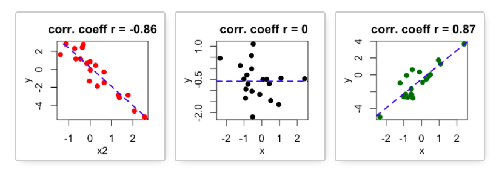

## Overview {#main-content}

This tutorial completes the bivariate description sequence by introducing the tools for two interval variables: scatter plots built with `ggplot()` using `geom_point()` and `geom_smooth()`, and Pearson's correlation coefficient calculated with `cor()`.

In this tutorial, you will learn how to:

* Visualize the relationship between two interval variables with a scatter plot using `ggplot()` with `geom_point()` and `geom_smooth()`
* Summarize the strength and direction of a linear relationship using Pearson's correlation coefficient and the `cor()` function
* Evaluate whether a scatter plot and a correlation coefficient are consistent with a hypothesis


```{r setup, include=FALSE}
library(learnr)
library(learnrhash)
library(tidyverse)
library(knitr)
library(poliscidata)
library(gradethis)
tutorial_options(exercise.checker = gradethis::grade_learnr)
knitr::opts_chunk$set(error = TRUE)
data("counties", package = "QPATutorialsCourse")
data("fHouse", package = "QPATutorialsCourse")
counties$wage_growth <- counties$wage_growth * 100
```


## Describing the Relationship Between Two Interval Variables

With this tutorial, we complete the bivariate description sequence begun in Tutorial 7: cross-tabs for two categorical variables, comparisons of means for one categorical and one interval variable, and now scatter plots and correlation for two interval variables.

When both variables are interval, there is no categorical variable to define groups. We cannot make a cross-tab, because neither variable is categorical. We also cannot compare means across categories, because there are no categories to compare. Instead, we ask whether the two variables tend to move together across their full range of values.

If larger values of the explanatory variable tend to occur with larger values of the outcome variable, and smaller values of the explanatory variable tend to occur with smaller values of the outcome variable, the two variables have a **positive relationship**. They move together in the same direction.

If larger values of the explanatory variable tend to occur with smaller values of the outcome variable, and smaller values of the explanatory variable tend to occur with larger values of the outcome variable, the two variables have a **negative relationship**. They move in opposite directions.

A **scatter plot** helps us see this pattern visually. Each point represents one case. The point's position on the x-axis shows that case's value on the explanatory variable, and the point's position on the y-axis shows that case's value on the outcome variable. By looking at the overall pattern of points, we can see whether the relationship appears positive, negative, or close to zero.

Before we build scatter plots ourselves, let’s slow down and look carefully at one:


```{r scatterplot-clintonvote-by-education, echo=FALSE, out.width='70%', fig.alt="Scatter plot of U.S. counties showing proportion of adults with a college degree on the x-axis and Democratic two-party vote share in 2016 on the y-axis. Each point represents one county. A vertical reference line marks the mean proportion college graduates, and a horizontal reference line marks the mean Democratic vote share. The points form a generally upward-sloping pattern: counties with higher proportions of college graduates tend to have higher Democratic vote shares, although there is substantial variation around that pattern."}
knitr::include_graphics("images/samplescattervoteed.png")
```

This scatter plot shows the relationship between two interval-level measures from the **counties** data frame: **prop_college_grad**, the proportion of adults in a county who graduated from college, and **dem2p_vote_share**, the share of the 2016 presidential vote cast for Hillary Clinton. Each dot represents one county. Its position on the x-axis is its value on **prop_college_grad**. Its position on the y-axis is its value on **dem2p_vote_share**. The vertical and horizontal lines mark the mean values of each variable.

Consider the point in the upper right labeled Arlington, VA. This county has a value of 0.74 on **prop_college_grad** and a value of 0.82 on **dem2p_vote_share**.

```{r scatterplot-clintonvote-by-education-label-arlington, echo=FALSE, out.width='70%', fig.alt="Scatter plot of U.S. counties showing proportion of adults with a college degree on the x-axis and Democratic two-party vote share in 2016 on the y-axis. Each point represents one county. Vertical and horizontal reference lines mark the means of the two variables, dividing the plot into four quadrants. Arlington, Virginia is labeled in the upper-right quadrant, with above-average college graduation and above-average Democratic vote share. Many counties fall in the lower-left and upper-right quadrants, illustrating a positive relationship between the two variables."}
knitr::include_graphics("images/samplescattervoteedArlington.png")
```

Points --- like Arlington --- in the upper right quadrant have values of **prop_college_grad** above the mean and values of **dem2p_vote_share** above the mean. Points in the lower left quadrant have values of **prop_college_grad** below the mean and values of **dem2p_vote_share** below the mean. These points show the pattern of a positive relationship because their values on the two variables move together: above average on both variables or below average on both variables.

A negative relationship would show the opposite pattern. Points would cluster in the upper left and lower right quadrants. In the upper left, counties would have below-average values of **prop_college_grad** but above-average values of **dem2p_vote_share**. In the lower right, counties would have above-average values of **prop_college_grad** but below-average values of **dem2p_vote_share**. Those points show the pattern of a negative relationship because higher values on one variable tend to go with lower values on the other.

The visual pattern we have been describing has a name: [**correlation**]{.important-text}. Correlation describes how two interval variables move together --- the same positive, negative, and no-relationship patterns described above.

[**Pearson's correlation coefficient**]{.important-text}, denoted $r$, summarizes this pattern with a single number that captures both its direction --- positive or negative --- and its strength: how closely the two variables move together.

Pearson's correlation coefficient is given by the following formula:

$$r=\frac{1}{n-1} \Sigma \frac{ (X_i-\bar{X}) (Y_i-\bar{Y}) }{S_X S_Y}$$

where

* $X_i,Y_i$ are the individual observations of $X$ and $Y$ for unit $i$,
* $\bar{X},\bar{Y}$ are the sample means of $X$ and $Y$,
* $S_X,S_Y$ are the sample standard deviations of $X$ and $Y$, and
* $n$ is the sample size.


You do not need to memorize this formula. Its job here is to show the intuition behind correlation. For each case, the formula asks whether that case is above or below the mean on each variable. If a case is above the mean on both variables, or below the mean on both variables, it contributes positively to $r$. If a case is above the mean on one variable and below the mean on the other, it contributes negatively to $r$.

The value of $r$ ranges between -1 and +1.

* $r>0$ indicates a positive relationship: higher values of one variable tend to occur with higher values of the other variable.
* $r<0$ indicates a negative relationship: higher values of one variable tend to occur with lower values of the other variable.
* $r=0$ indicates no linear relationship.

Below is a picture illustrating the relationship between the pattern in a scatter plot and Pearson's $r$. A line is drawn through the points to summarize the linear pattern. If the line slopes downward, as on the left, $r$ is negative. If the line is flat, as in the middle, $r$ is close to zero. If the line slopes upward, as on the right, $r$ is positive. The strength of the relationship depends on how tightly the points cluster around a straight-line pattern: tighter clustering means a stronger relationship, while more scatter means a weaker relationship. 

```{r scatterplot-correlation, echo=FALSE, out.width='70%', fig.alt="Three side-by-side scatter plots illustrating different linear relationships between two interval variables. The left panel shows a strong negative relationship, with points clustered around a downward-sloping line and r approximately negative 0.86. The middle panel shows little or no linear relationship, with points scattered randomly around a nearly flat line and r approximately 0. The right panel shows a strong positive relationship, with points clustered around an upward-sloping line and r approximately 0.87. The figure shows that the sign of r gives the direction of the relationship, while the closeness of the points to a straight-line pattern shows its strength."}

```

How do we translate a specific value of $r$ into a description like weak, moderate, or strong? There is no single rule, but a common rough guide is: values of $|r|$ below about .2 indicate a weak relationship --- the points are scattered widely around the line, much like the middle panel above. Values of $|r|$ between about .3 and .6 indicate a moderate relationship --- a clear pattern is visible, but with substantial scatter around the line. Values of $|r|$ above about .6 or .7 indicate a strong relationship --- the points cluster tightly around the line, similar to the panels on the left and right above. These thresholds are only a starting point. What counts as a strong relationship can depend on the variables involved and the research question, so we will always describe both the sign and the approximate size of $r$ when interpreting it, rather than relying on a single fixed cutoff.

As in Tutorials 7 and 8, this is still descriptive analysis. A scatter plot and Pearson's $r$ can tell us whether the pattern in the data is consistent with what a hypothesis predicts. They cannot tell us whether the observed relationship is larger than we would expect by chance. For now, our question is narrower: does the descriptive pattern point in the direction the hypothesis predicts?

A scatter plot lets us see whether the relationship points in the direction the hypothesis predicts. Pearson's $r$ summarizes that same pattern with a single number: its sign tells us whether the relationship is positive or negative, and its size tells us whether the linear relationship is stronger or weaker. Together, the scatter plot and Pearson's $r$ let us ask the same question we asked in Tutorials 7 and 8: is the descriptive pattern in the data consistent with what the hypothesis predicts?


## The Two Tools We Will Use

To describe the relationship between two interval variables, we will use two tools together: a scatter plot and Pearson's $r$. The scatter plot shows the relationship visually. Pearson's $r$ summarizes the direction and strength of the linear relationship with a single number.

### Building a Scatter Plot with `ggplot()`

Building a scatter plot with `ggplot()` follows the same basic logic as the plots you built in earlier tutorials. Map the explanatory variable to `x` and the outcome variable to `y` inside `aes()` --- the explanatory variable goes on the x-axis because we want to see how the outcome changes across its values, and the outcome variable goes on the y-axis so its vertical position shows whether it tends to be higher or lower as the explanatory variable increases. Add `geom_point()` to draw one point per case, and `geom_smooth(se = FALSE, method = "lm")` to add a straight fitted line that summarizes the overall pattern. The `method = "lm"` argument draws a straight line, and `se = FALSE` removes a shaded band that ggplot would otherwise draw around it by default --- we want the line as a visual guide, not a confidence interval. Finish with `labs()` for an informative title and axis labels.

The basic structure is:

```{r scatterplot-template, eval=FALSE}
data_frame %>%
  ggplot(mapping = aes(x = explanatory_variable, y = outcome_variable)) +
  geom_point() +
  geom_smooth(se = FALSE, method = "lm") +
  labs(title = "Plot Title",
       x = "Explanatory Variable Label",
       y = "Outcome Variable Label")
```

The `geom_point()` layer creates the scatter plot by drawing one point for each case in the data. The `geom_smooth()` layer adds a line that summarizes the overall pattern in the points. We will use two arguments inside `geom_smooth()`: `method = "lm"` tells R to draw a straight line, and `se = FALSE` removes a shaded band that ggplot would otherwise draw around the line by default, keeping the plot focused on the line itself. We are using the line descriptively, as a visual guide to whether the relationship slopes upward, slopes downward, or is close to flat.

The `labs()` layer gives the plot an informative title and axis labels. The x-axis label should describe the explanatory variable, and the y-axis label should describe the outcome variable.

If either plotted variable has missing values, `ggplot()` will automatically leave those cases out of the scatter plot. You may see a warning saying that some rows were removed. That warning is not an error; it simply tells you that cases with missing values were not plotted.

When you use `geom_smooth(method = "lm")`, R will also print a message saying `geom_smooth() using formula = 'y ~ x'`. That message just confirms the type of line being fit; it is not a warning or an error.

### Calculating Pearson's $r$ with `cor()`

To calculate Pearson's $r$, we use the `cor()` function in base R. The first two arguments, `x` and `y`, are the two interval variables whose relationship we want to summarize.

If either variable has missing values, `cor()` will return `NA` unless we tell R how to handle those missing values. To avoid that problem, we set `use = "pairwise.complete.obs"`. This tells R to calculate the correlation using only cases that have observed values on both variables.

We also set `method = "pearson"` because Pearson's $r$ is the measure of correlation we use for two interval variables in this tutorial. The `cor()` function can calculate other measures of correlation, but those are used for other kinds of variables or other kinds of relationships. In this tutorial, whenever we use `cor()`, we will use `method = "pearson"`.

The basic structure is:

```{r correlation-template, eval=FALSE}
cor(x = data_frame$explanatory_variable,
    y = data_frame$outcome_variable,
    use = "pairwise.complete.obs",
    method = "pearson")
```

Unlike a scatter plot, the order of the two variables in `cor()` does not change the result. The correlation between `x` and `y` is the same as the correlation between `y` and `x`. We will usually list the explanatory variable first and the outcome variable second so that the code matches the research question.

We will use this same two-tool structure throughout the tutorial: first inspect the scatter plot, then calculate Pearson's $r$. We turn to three examples now, each asking a different research question.

## Do More Effective Governments Have Higher Life Expectancy?

Why do people live longer in some countries than in others? One possibility is that more effective governments are better able to provide the public goods that support health: clean water, sanitation, vaccination programs, reliable health systems, and emergency response. This suggests a research question: do countries with more effective governments have higher life expectancy?

::: {.hypothesis}
In a comparison of [countries], those with [more effective governments] will tend to have [higher life expectancy] than will those with [less effective governments].
:::

The causal explanation is that effective governments are better able to provide the public goods and services that help people live longer, including sanitation, healthcare access, disease prevention, and basic infrastructure.

The data frame **world** contains the variable **effectiveness**, a measure of government effectiveness where higher values indicate more effective government. It also contains **lifeex_total**, life expectancy at birth. **effectiveness** is our explanatory variable and **lifeex_total** is our outcome, so **effectiveness** goes on the `x`-axis and **lifeex_total** goes on the `y`-axis.

### Create the Scatter Plot

Let's put the steps from the previous section to work. First, we tell `ggplot()` the data: **world**. Then, inside `aes()`, we map **effectiveness** to `x` and **lifeex_total** to `y`. We add `geom_point()` to plot the points, `geom_smooth()` with `method = "lm"` and `se = FALSE` to add a straight fitted line without the shaded band, and `labs()` to add informative labels.

**Run and observe: Build a scatter plot of government effectiveness and life expectancy**

```{r scatterplot-effectiveness-lifeexpectancy, exercise=TRUE, exercise.cap="Run and observe: Scatter plot of government effectiveness and life expectancy", fig.alt="Scatter plot of countries showing government effectiveness on the x-axis and life expectancy at birth on the y-axis. Each point represents one country. The points form a generally upward-sloping pattern, and the fitted line slopes upward: countries with higher government effectiveness tend to have higher life expectancy. There is still variation around the line, especially among countries with lower and middle levels of government effectiveness."}
library(ggplot2)
ggplot(data = world, mapping = aes(x = effectiveness, y = lifeex_total)) +
  geom_point(color = "steelblue") +
  geom_smooth(color = "darkorange", se = FALSE, method = "lm") +
  labs(title = "Government Effectiveness and Life Expectancy",
       x = "Government Effectiveness",
       y = "Life Expectancy at Birth",
       caption = "Source: World Bank")
```

Since [ggplot2]{.package-name} was loaded above, you can assume it is already loaded for all subsequent exercises in this tutorial.

When you run this code, R may print two messages. The warning about removed rows means that a few countries are missing values for **effectiveness** or **lifeex_total**, so ggplot leaves those countries out of the scatter plot. The message `geom_smooth() using formula = 'y ~ x'` simply tells you that ggplot fit the straight line using **lifeex_total** as the outcome (`y`) and **effectiveness** as the explanatory variable (`x`). Neither message means that something went wrong. The next example will show how to remove missing rows ourselves with `filter()` before plotting.

### Interpret the Scatter Plot

Look at the direction of the fitted line and the overall pattern of points before answering the question below.

**Practice: Read the scatter plot**

```{r quiz-interpret-scatterplot-effectiveness-lifeexpectancy, echo=FALSE}
question("Based on the scatter plot, which statement best describes the relationship between government effectiveness and life expectancy?",
  correct = "Right. The fitted line slopes upward and the cloud of points generally rises from left to right. Countries with higher government effectiveness tend to have higher life expectancy, though there is meaningful scatter around that overall trend.",
  answer("The points show a generally positive relationship: countries with higher government effectiveness tend to have higher life expectancy",
         correct = TRUE,
         message = "Countries with higher government effectiveness tend to have higher life expectancy, although the points don't fall perfectly on the line --- there's still meaningful scatter around that overall trend."),
  answer("The points show a generally negative relationship: countries with higher government effectiveness tend to have lower life expectancy",
         message = "A negative relationship would slope downward from left to right. This plot slopes upward, not downward."),
  answer("The points are randomly scattered with no visible pattern",
         message = "There is variation around the line, but the points are not randomly scattered. The fitted line and the cloud of points show a clear upward pattern."),
  answer("The scatter plot confirms that government effectiveness causes higher life expectancy",
         message = "A scatter plot is descriptive. It can show whether the pattern is consistent with the hypothesis, but it cannot confirm the hypothesis or establish causation."),
  allow_retry = TRUE,
  random_answer_order = TRUE,
  try_again = "Hint: Look at which direction the fitted line slopes and whether the cloud of points rises or falls from left to right."
)
```

### Calculate Pearson's Correlation

We use the same `cor()` syntax introduced above, with **effectiveness** and **lifeex_total** as the two interval variables whose relationship we want to summarize. As with the scatter plot, the explanatory variable goes first: we list **effectiveness** as the `x` argument and **lifeex_total** as the `y` argument.

**Run and observe: Calculate Pearson's r for government effectiveness and life expectancy**

```{r correlation-effectiveness-lifeexpectancy, exercise=TRUE, exercise.cap="Run and observe: Pearson's r for government effectiveness and life expectancy"}
cor(x = world$effectiveness, y = world$lifeex_total, use = "pairwise.complete.obs", method = "pearson")
```

Consider both the sign of Pearson's $r$ and its size before answering the question below.

### Is the Pattern Consistent with the Hypothesis?

Consider both the sign of the correlation and its size, then decide whether the pattern matches what the hypothesis predicted.

**Practice: Evaluate the government effectiveness/life expectancy hypothesis**


```{r quiz-hypothesis-effectiveness-lifeexpectancy, echo=FALSE}
question("Based on the scatter plot and the correlation coefficient you just calculated, is this descriptive pattern consistent with the hypothesis?",
  correct = "Right. The relationship is positive and moderately strong --- r is about 0.63, which falls in the moderate-to-strong range. The sign matches the direction the hypothesis predicted: countries with more effective governments do tend to have higher life expectancy. But this is still just description; it does not tell us whether the relationship is larger than chance or rule out other explanations.",
  answer("Yes --- the relationship is positive and moderately strong, which is consistent with the hypothesis",
         correct = TRUE,
         message = "A moderately strong, correctly-signed correlation is a descriptive pattern consistent with the hypothesis. But it is still just description --- it does not tell us whether this relationship is bigger than we would expect by chance, or rule out other reasons effective governments and longer lives might go together."),
  answer("Yes --- the relationship is positive but so weak that it provides almost no descriptive information",
         message = "The r value is about 0.63, which is positive but not close to zero --- it indicates a moderately strong linear relationship, not a negligible one."),
  answer("No --- Pearson's r would need to be exactly 1 for the pattern to be consistent with the hypothesis",
         message = "A correlation does not need to be perfect to be consistent with a hypothesis. Any correctly-signed, non-negligible correlation is consistent with a directional prediction."),
  answer("The relationship is too strong to be only descriptive, so Pearson's r confirms the hypothesis",
         message = "Even a moderately strong correlation is still descriptive. Pearson's r tells us the direction and strength of the observed linear relationship, but it cannot confirm the hypothesis or rule out chance as an explanation."),
  allow_retry = TRUE,
  random_answer_order = TRUE,
  try_again = "Hint: Consider both the sign of the correlation and its approximate size. Does the sign match the direction the hypothesis predicted? Is the relationship strong enough to be meaningful?"
)
```


## Does a Country's Level of Democracy Predict Support for Democracy?

Why do some countries' citizens express more support for democratic government than others? One possibility is that direct experience with democracy shapes how citizens feel about it: people who live under well-established democratic institutions may come to value them, while people in less democratic systems have had less opportunity to experience the benefits of democratic governance. This suggests a research question: does a country's level of democracy predict how supportive its citizens are of democratic government?

::: {.hypothesis}
In a comparison of [countries], those with [a higher level of democracy] will have [higher support for democratic government] than will those with [a lower level of democracy].
:::

The causal explanation is that citizens who live under well-functioning democratic institutions accumulate direct experience with the benefits of democratic governance --- competitive elections, protected civil liberties, accountable leaders --- which in turn builds support for democracy as a system of government.

The data frame **fHouse** contains **Pro.Dem**, the percent of a country's respondents who view democracy favorably as a way of governing their country (World Values Survey/European Values Survey, 2005--2008), and **FHTotalAggr**, the Freedom House (2017) measure of a country's level of democracy. **FHTotalAggr** is our explanatory variable and **Pro.Dem** is our outcome.

### Create the Scatter Plot

The data are in place and the hypothesis is stated. Now we can ask whether countries with stronger democratic institutions tend to have higher public support for democratic governance --- and whether any relationship between the two is strong enough to stand out above the scatter.

**Practice: Build a scatter plot of democracy level and support for democracy**

Fill in the variable names in the starter code. The same variable goes in both the matching `filter()` check and the matching `aes()` argument --- decide which is explanatory and which is the outcome. Two hints are available. Click Submit Answer to check your work.

```{r scatterplot-democracylevel-prodem, exercise=TRUE, exercise.cap="Practice: Scatter plot of democracy level and support for democracy", fig.alt="Scatter plot showing level of democracy on the x-axis and support for democratic rule on the y-axis across countries, with dark teal points and a black fitted line that is nearly flat with a slight downward slope. The points are widely scattered across the full range of both variables, showing no strong visual pattern between the two variables."}
library(dplyr)
fHouse %>%
  filter(!is.na(___), !is.na(___)) %>%
  ggplot(mapping = aes(x = ___, y = ___)) +
  geom_point(color = "darkcyan") +
  geom_smooth(color = "black", se = FALSE, method = "lm") +
  labs(title = "Level of Democracy and Support for Democratic Values",
       x = "Level of Democracy",
       y = "Support for Democratic Rule",
       caption = "Source: WVS and EVS, 2005-2008, Freedom House 2017")
```

```{r scatterplot-democracylevel-prodem-hint-1}
# Hint 1 of 2
# Which variable is explanatory and which is the outcome in this hypothesis?
# The explanatory variable belongs in the first filter() check and on the x-axis.
# The outcome variable belongs in the second filter() check and on the y-axis.
```

```{r scatterplot-democracylevel-prodem-hint-2}
# Hint 2 of 2
# Fill in the same two variable names in both filter() and aes():
# library(dplyr)
# filter(!is.na(explanatory_variable), !is.na(outcome_variable)) %>%
#   ggplot(mapping = aes(x = explanatory_variable, y = outcome_variable))
# Now replace explanatory_variable and outcome_variable with the actual column names from fHouse.
```

```{r scatterplot-democracylevel-prodem-check}
grade_this({
  code <- paste(.user_code, collapse = "\n")
  code_no_comments <- gsub("#.*", "", code)

  if (!inherits(.result, "ggplot")) {
    fail("Your code should return a ggplot object. Check for a missing + at the end of a line, unmatched parentheses, a label string missing its quotation marks, or a missing %>% in the pipeline.")
  }
  if (!grepl("filter\\s*\\(", code_no_comments)) {
    fail("Use filter() before ggplot() to remove rows with missing values, as shown in the starter code.")
  }
  if (!grepl("!\\s*is\\.na\\s*\\(\\s*FHTotalAggr\\s*\\)", code_no_comments)) {
    fail("In filter(), remove rows where FHTotalAggr is missing with !is.na(FHTotalAggr).")
  }
  if (!grepl("!\\s*is\\.na\\s*\\(\\s*Pro\\.Dem\\s*\\)", code_no_comments)) {
    fail("In filter(), remove rows where Pro.Dem is missing with !is.na(Pro.Dem).")
  }
  if (!grepl("ggplot\\s*\\(", code_no_comments)) {
    fail("Use ggplot() to build the scatter plot.")
  }
  if (!grepl("aes\\s*\\([^)]*x\\s*=\\s*FHTotalAggr", code_no_comments)) {
    fail("FHTotalAggr is our explanatory variable, so it belongs on the x-axis inside aes().")
  }
  if (!grepl("aes\\s*\\([^)]*y\\s*=\\s*Pro\\.Dem", code_no_comments)) {
    fail("Pro.Dem is our outcome variable, so it belongs on the y-axis inside aes().")
  }
  if (!grepl("geom_point\\s*\\(", code_no_comments)) {
    fail("Add geom_point() to plot the data as a scatter plot.")
  }
  if (!grepl("geom_smooth\\s*\\(", code_no_comments)) {
    fail("Add geom_smooth() to show the fitted line.")
  }
  if (!grepl("method\\s*=\\s*['\"]lm['\"]", code_no_comments)) {
    fail('Set method = "lm" inside geom_smooth() to draw a straight fitted line.')
  }
  if (!grepl("se\\s*=\\s*FALSE", code_no_comments)) {
    fail("Set se = FALSE inside geom_smooth() to remove the shaded confidence band.")
  }

  pass("Correct! You filtered out missing values and mapped FHTotalAggr to x and Pro.Dem to y, matching their roles as explanatory variable and outcome.")
})
```

Since [dplyr]{.package-name} was loaded above, you can assume it is already loaded for all subsequent exercises in this tutorial.

### Interpret the Scatter Plot

Look at which direction the fitted line slopes and whether the points cluster tightly or loosely around it before answering.

**Practice: Read the scatter plot**

```{r quiz-interpret-scatterplot-democracylevel-prodem, echo=FALSE}
question("Based on the scatter plot, which statement best describes the relationship between level of democracy and support for democracy?",
  correct = "Right. The points are widely scattered with little visual pattern, and the fitted line is nearly flat --- both signs of a weak relationship between the two variables.",
  answer("The points cluster tightly along an upward-sloping line, indicating a strong positive relationship",
         message = "Look again at how widely scattered the points are. A strong relationship would show the points clustered close to the fitted line, not spread across the whole plot."),
  answer("The points are widely scattered with little visual pattern, and the fitted line is nearly flat",
         correct = TRUE,
         message = "The line has only a slight slope, and the points don't cluster closely around it in either direction --- both are signs of a weak relationship."),
  answer("The points cluster tightly along a downward-sloping line, indicating a strong negative relationship",
         message = "The line does slope down slightly, but the points are not clustered close to it. A strong relationship would show much less scatter around the line."),
  allow_retry = TRUE,
  random_answer_order = TRUE,
  try_again = "Hint: Look at which direction the fitted line slopes and whether the cloud of points rises or falls from left to right."
)
```

### Calculate Pearson's Correlation

The scatter plot gave us a visual impression of the relationship. Now we can quantify it.

**Practice: Calculate the correlation between democracy level and support for democracy**

Use the same `cor()` syntax as the template, with the same explanatory/outcome variable order you used for the scatter plot --- explanatory variable first, outcome variable second. Two hints are available. Click Submit Answer to check your work.

```{r correlation-democracylevel-prodem, exercise=TRUE, exercise.cap="Practice: Pearson's r for democracy level and support for democracy"}
cor(x = fHouse$___, y = fHouse$___, use = ___, method = "pearson")
```

```{r correlation-democracylevel-prodem-hint-1}
# Hint 1 of 2
# Same explanatory/outcome assignment as the scatter plot above:
# cor(x = fHouse$explanatory_variable, y = fHouse$outcome_variable, use = ___, method = "pearson")
# Replace explanatory_variable and outcome_variable with the correct column names.
```

```{r correlation-democracylevel-prodem-hint-2}
# Hint 2 of 2
# Recall from the Two Tools section: if either variable has missing values, cor() will
# return NA unless you tell R how to handle them. Fill in the same value you used there.
```

```{r correlation-democracylevel-prodem-check}
grade_this({
  code <- paste(.user_code, collapse = "\n")
  code_no_comments <- gsub("#.*", "", code)

  if (is.null(.result)) {
    fail("Make sure your code produces a result the grader can check.")
  }
  if (!is.numeric(.result) || length(.result) != 1) {
    fail("Your result should be a single number. Check that your cor() call is complete and uses the correct variable names and arguments.")
  }
  if (!grepl("cor\\s*\\(", code_no_comments)) {
    fail("Use the cor() function to calculate Pearson's r.")
  }
  if (!grepl("x\\s*=\\s*fHouse\\$FHTotalAggr", code_no_comments)) {
    fail("FHTotalAggr is our explanatory variable. Assign it to the x argument, matching the order used in the scatter plot.")
  }
  if (!grepl("y\\s*=\\s*fHouse\\$Pro\\.Dem", code_no_comments)) {
    fail("Pro.Dem is our outcome variable. Assign it to the y argument, matching the order used in the scatter plot.")
  }
  if (!grepl("use\\s*=\\s*['\"]pairwise\\.complete\\.obs['\"]", code_no_comments)) {
    fail('Set use = "pairwise.complete.obs" so cor() handles missing values correctly.')
  }
  if (!grepl("method\\s*=\\s*['\"]pearson['\"]", code_no_comments)) {
    fail('Set method = "pearson" since we are calculating Pearson\'s r.')
  }

  expected <- cor(x = fHouse$FHTotalAggr,
                  y = fHouse$Pro.Dem,
                  use = "pairwise.complete.obs",
                  method = "pearson")

  if (!isTRUE(all.equal(as.numeric(.result), as.numeric(expected), tolerance = 1e-6))) {
    fail("Check that your cor() call uses FHTotalAggr as x, Pro.Dem as y, use = \"pairwise.complete.obs\", and method = \"pearson\".")
  }

  pass("Correct! FHTotalAggr is assigned to x and Pro.Dem is assigned to y, with missing values handled correctly and Pearson's r requested.")
})
```

Consider both the sign of Pearson's $r$ and its size before answering the question below.

### Is the Pattern Consistent with the Hypothesis?

Consider both the sign of the correlation and its size before answering.

**Practice: Evaluate the democracy/support hypothesis**

```{r quiz-hypothesis-democracylevel-prodem, echo=FALSE}
question("Based on the scatter plot and the correlation coefficient you just calculated, is this pattern consistent with the hypothesis?",
  correct = "Right. The correlation is very close to zero and slightly negative --- both the wrong direction and essentially no relationship. This is a useful reminder that a reasonable hypothesis can still fail to show up in the data. A near-zero correlation is itself an informative finding, not a failure of the method.",
  answer("No --- the correlation is very close to zero and points slightly in the wrong direction, indicating essentially no linear relationship between the two variables",
         correct = TRUE,
         message = "This is a good reminder that descriptive analysis doesn't always confirm what we expect. A reasonable hypothesis can still fail to show up in the data --- and a near-zero correlation is itself an informative finding, not a failure of the method."),
  answer("No --- the direction is wrong, but a correlation of -0.04 still indicates a moderately weak relationship running counter to the hypothesis",
         message = "The direction is wrong, but -0.04 is not a moderately weak relationship --- it is close enough to zero to indicate essentially no linear relationship at all. There is barely anything here to run counter to the hypothesis in the first place."),
  answer("Yes --- the two variables are related to some degree, so the pattern supports the hypothesis",
         message = "The hypothesis made a specific directional prediction: higher democracy goes with higher support. A pattern is only consistent with a hypothesis if it points in the predicted direction, not simply because some relationship exists."),
  answer("Yes --- r = -0.04 is close enough to zero that it still counts as support for the hypothesis",
         message = "A correlation close to zero means the two variables are barely related at all, which is itself evidence against the hypothesis, not weak support for it."),
  allow_retry = TRUE,
  random_answer_order = TRUE,
  try_again = "Hint: Check both the sign and the size of the correlation you calculated. Does it point in the direction the hypothesis predicted? Is it large enough to indicate a meaningful relationship?"
)
```

## Does Wage Growth Predict Democratic Vote Share?

Voters often reward or punish the party in power based on how the economy has performed during their time in office. Wage growth is one concrete sign of how the local economy is doing. This suggests a research question: did counties with stronger wage growth show greater support for the incumbent party's candidate in 2016?

::: {.hypothesis}
In a comparison of [counties], those with [higher wage growth] will have [a higher Democratic vote share] than will those with [lower wage growth].
:::

The causal explanation is retrospective voting: voters tend to credit the incumbent party for a strong local economy, so counties experiencing stronger wage growth under the incumbent administration should be more likely to reward that party's candidate at the polls.

The data frame **counties** contains **wage_growth**, the percent change in average wages from 2008 to 2016, and **dem2p_vote_share**, the Democratic candidate's share of the two-party vote in 2016. **wage_growth** is our explanatory variable and **dem2p_vote_share** is our outcome.

### Create the Scatter Plot

Now build the scatter plot on your own from scratch, using everything practiced in the previous two examples. The question is whether counties that experienced stronger wage growth rewarded the incumbent party's candidate with a higher vote share.

**Practice: Build a scatter plot of wage growth and Democratic vote share**

Map **wage_growth** to the x-axis and **dem2p_vote_share** to the y-axis, filtering out missing values for both before plotting. Label the axes "Wage Growth" and "Democratic Vote Share", add a title of your choice, and cite the source as "Source: Linn, Nagler, and Zilinsky". Five hints are available. Click Submit Answer to check your work.

```{r scatterplot-wagegrowth-demvoteshare, exercise=TRUE, exercise.cap="Practice: Scatter plot of wage growth and Democratic vote share", fig.alt="Scatter plot showing wage growth on the x-axis and Democratic vote share on the y-axis across U.S. counties in 2016. Most points cluster densely near zero wage growth but span nearly the entire range of vote share, from close to 0 to close to 1. A smaller number of counties with higher or lower wage growth are more sparsely scattered. The fitted line slopes upward only modestly, reflecting a weak positive relationship."}

```

```{r scatterplot-wagegrowth-demvoteshare-hint-1}
# Hint 1 of 5
# Think about the order of operations: you'll need to filter out missing
# values first, and only then build the plot.
```

```{r scatterplot-wagegrowth-demvoteshare-hint-2}
# Hint 2 of 5
# Which variable is explanatory and which is the outcome in this hypothesis?
# Look back at the previous example: the explanatory variable went inside
# filter() and on the x-axis; the outcome variable went inside filter() and
# on the y-axis.
```

```{r scatterplot-wagegrowth-demvoteshare-hint-3}
# Hint 3 of 5
aes(x = explanatory_variable, y = outcome_variable)
```

```{r scatterplot-wagegrowth-demvoteshare-hint-4}
# Hint 4 of 5
# Recall what these two layers do: geom_point() draws the points, and
# geom_smooth() adds a fitted line. geom_smooth() needs two arguments ---
# method, which tells R to draw a straight line, and se, which removes the
# shaded band around it. Look back at the previous examples for the exact
# values you need.
```

```{r scatterplot-wagegrowth-demvoteshare-hint-5}
# Hint 5 of 5: fill in the blanks
# Remember: title, x, y, and caption values need quotation marks.
counties %>%
  filter(!is.na(___), !is.na(___)) %>%
  ggplot(mapping = aes(x = ___, y = ___)) +
  geom_point() +
  geom_smooth(method = ___, se = ___) +
  labs(title = "___",
       x = "x.axis.label",
       y = "y.axis.label",
       caption = "Source: Linn, Nagler, and Zilinsky")
```

```{r scatterplot-wagegrowth-demvoteshare-check}
grade_this({
  code <- paste(.user_code, collapse = "\n")
  code_no_comments <- gsub("#.*", "", code)

  if (!inherits(.result, "ggplot")) {
    fail("Your code should return a ggplot object. Check for a missing + at the end of a line, unmatched parentheses, a label string missing its quotation marks, or a missing %>% in the pipeline.")
  }
  if (!grepl("\\bcounties\\b", code_no_comments)) {
    fail("Use the counties data frame.")
  }
  if (!grepl("filter\\s*\\(", code_no_comments)) {
    fail("Filter out missing values with filter() before plotting, as in the previous example.")
  }
  if (!grepl("!\\s*is\\.na\\s*\\(\\s*wage_growth\\s*\\)", code_no_comments)) {
    fail("Use filter() to remove rows where wage_growth is missing: !is.na(wage_growth).")
  }
  if (!grepl("!\\s*is\\.na\\s*\\(\\s*dem2p_vote_share\\s*\\)", code_no_comments)) {
    fail("Use filter() to remove rows where dem2p_vote_share is missing: !is.na(dem2p_vote_share).")
  }
  if (!grepl("ggplot\\s*\\(", code_no_comments)) {
    fail("Use ggplot() to build the scatter plot.")
  }
  if (!grepl("aes\\s*\\([^)]*x\\s*=\\s*wage_growth", code_no_comments)) {
    fail("wage_growth is our explanatory variable, so it belongs on the x-axis inside aes().")
  }
  if (!grepl("aes\\s*\\([^)]*y\\s*=\\s*dem2p_vote_share", code_no_comments)) {
    fail("dem2p_vote_share is our outcome variable, so it belongs on the y-axis inside aes().")
  }
  if (!grepl("geom_point\\s*\\(", code_no_comments)) {
    fail("Add geom_point() to plot the data as a scatter plot.")
  }
  if (!grepl("geom_smooth\\s*\\(", code_no_comments)) {
    fail("Add geom_smooth() to add a fitted line.")
  }
  if (!grepl("method\\s*=\\s*['\"]lm['\"]", code_no_comments)) {
    fail('Set method = "lm" inside geom_smooth() to draw a straight line.')
  }
  if (!grepl("se\\s*=\\s*FALSE", code_no_comments)) {
    fail("Set se = FALSE inside geom_smooth() to remove the shaded band.")
  }
  if (!grepl("labs\\s*\\(", code_no_comments)) {
    fail("Add labs() to give the plot a title, axis labels, and caption.")
  }
  if (!grepl("title\\s*=\\s*['\"][^'\"]+['\"]", code_no_comments)) {
    fail("Add your own informative title inside labs().")
  }
  if (!grepl("x\\s*=\\s*['\"]Wage Growth['\"]", code_no_comments)) {
    fail('Label the x-axis "Wage Growth" inside labs().')
  }
  if (!grepl("y\\s*=\\s*['\"]Democratic Vote Share['\"]", code_no_comments)) {
    fail('Label the y-axis "Democratic Vote Share" inside labs().')
  }
  if (!grepl("caption\\s*=\\s*['\"]Source: Linn, Nagler, and Zilinsky['\"]", code_no_comments)) {
    fail('Set caption = "Source: Linn, Nagler, and Zilinsky" inside labs().')
  }

  pass("Correct! wage_growth is mapped to x and dem2p_vote_share is mapped to y, with missing values filtered out and the plot properly labeled and cited.")
})
```

### Interpret the Scatter Plot

**Practice: Read the scatter plot**

Look at where most of the points cluster, how tightly they follow the fitted line, and which direction the line slopes before answering.

```{r quiz-wagegrowth-scatter-read, echo=FALSE}
question("Based on the scatter plot, which statement best describes the relationship between wage growth and Democratic vote share?",
  correct = "Right. Most counties cluster densely near zero wage growth but span nearly the full range of vote share --- a sign that wage growth explains very little of the variation in vote share. The fitted line slopes upward only modestly, consistent with a weak positive relationship.",
  answer("The points cluster tightly along a steep upward-sloping line, indicating a strong positive relationship",
         message = "Look again at how widely the points are scattered, especially the dense cluster near zero wage growth that spans almost the full range of vote share. A strong relationship would show much tighter clustering around the line."),
  answer("Most counties cluster near zero wage growth but show a wide range of vote share, and the fitted line slopes upward only modestly",
         correct = TRUE,
         message = "Counties with stronger wage growth show, on average, a slightly higher Democratic vote share, but most counties sit close to zero wage growth and vary enormously in vote share --- a sign that wage growth explains very little of that variation."),
  answer("The handful of counties with the highest and lowest wage growth show a clear, strong pattern, so the relationship is strong overall",
         message = "Those extreme counties are a small minority of the data. Most counties cluster densely near zero wage growth with a wide spread of vote share, and that dense cluster --- not the few outliers --- is what the correlation mostly reflects."),
  answer("The points show a clear negative relationship: higher wage growth is associated with lower vote share",
         message = "The fitted line slopes upward, not downward. Higher wage growth is associated with slightly higher, not lower, vote share."),
  allow_retry = TRUE,
  random_answer_order = TRUE,
  try_again = "Hint: Look at which direction the fitted line slopes and whether the cloud of points rises or falls from left to right."
)
```

### Calculate Pearson's Correlation

Now quantify what you observed. Use the same `cor()` structure from the previous examples.

**Practice: Calculate the correlation between wage growth and Democratic vote share**

Calculate Pearson's r on your own, following the same structure as before. Four hints are available. Click Submit Answer to check your work.

```{r correlation-wagegrowth-demvoteshare, exercise=TRUE, exercise.cap="Practice: Pearson's r for wage growth and Democratic vote share"}

```

```{r correlation-wagegrowth-demvoteshare-hint-1}
# Hint 1 of 4
# Which variable is explanatory and which is the outcome? They go in the same
# x/y order you used for the scatter plot.
```

```{r correlation-wagegrowth-demvoteshare-hint-2}
# Hint 2 of 4
# Look back at the cor() syntax from the Two Tools section and the previous
# example. The function always takes the same four arguments: x, y, use, and method.
```

```{r correlation-wagegrowth-demvoteshare-hint-3}
# Hint 3 of 4
# The structure is:
cor(x = data_frame$explanatory_variable,
    y = data_frame$outcome_variable,
    use = "pairwise.complete.obs",
    method = "pearson")
```

```{r correlation-wagegrowth-demvoteshare-hint-4}
# Hint 4 of 4: fill in the blanks
cor(x = counties$explanatory.variable,
    y = counties$outcome.variable,
    use = "pairwise.complete.obs",
    method = "pearson")
```

```{r correlation-wagegrowth-demvoteshare-check}
grade_this({
  code <- paste(.user_code, collapse = "\n")
  code_no_comments <- gsub("#.*", "", code)

  if (is.null(.result)) {
    fail("Make sure your code produces a result the grader can check.")
  }
  if (!is.numeric(.result) || length(.result) != 1) {
    fail("Your result should be a single number. Check that your cor() call is complete and uses the correct variable names and arguments.")
  }
  if (!grepl("cor\\s*\\(", code_no_comments)) {
    fail("Use the cor() function to calculate Pearson's r.")
  }
  if (!grepl("x\\s*=\\s*counties\\$wage_growth", code_no_comments)) {
    fail("wage_growth is our explanatory variable. Assign it to the x argument, matching the order used in the scatter plot.")
  }
  if (!grepl("y\\s*=\\s*counties\\$dem2p_vote_share", code_no_comments)) {
    fail("dem2p_vote_share is our outcome variable. Assign it to the y argument, matching the order used in the scatter plot.")
  }
  if (!grepl("use\\s*=\\s*['\"]pairwise\\.complete\\.obs['\"]", code_no_comments)) {
    fail('Set use = "pairwise.complete.obs" so cor() handles missing values correctly.')
  }
  if (!grepl("method\\s*=\\s*['\"]pearson['\"]", code_no_comments)) {
    fail('Set method = "pearson" since we are calculating Pearson\'s r.')
  }

  expected <- cor(x = counties$wage_growth,
                  y = counties$dem2p_vote_share,
                  use = "pairwise.complete.obs",
                  method = "pearson")

  if (!isTRUE(all.equal(as.numeric(.result), as.numeric(expected), tolerance = 1e-6))) {
    fail("Check that your cor() call uses wage_growth as x, dem2p_vote_share as y, use = \"pairwise.complete.obs\", and method = \"pearson\".")
  }

  pass("Correct! wage_growth is assigned to x and dem2p_vote_share is assigned to y, with missing values handled correctly and Pearson's r requested.")
})
```

Consider both the sign of Pearson's $r$ and its size before answering the question below.

### Is the Pattern Consistent with the Hypothesis?

Consider both the direction and the size of the correlation before answering --- a pattern can be consistent with a hypothesis even if the relationship is weak.

**Practice: Evaluate the wage growth/Democratic vote share hypothesis**

```{r quiz-hypothesis-wagegrowth-demvoteshare, echo=FALSE}
question("Based on the scatter plot and the correlation coefficient you just calculated, is this pattern consistent with the hypothesis?",
  correct = "Right. The correlation is positive, matching the direction predicted by retrospective voting theory, but it is quite weak. Reporting this finding honestly means saying both things: the sign is right, but the relationship is small. Counties with stronger wage growth gave Clinton slightly higher vote shares on average, but most of the variation in vote share is explained by other factors.",
  answer("Yes --- the correlation is positive, matching the direction predicted by the hypothesis, though it is quite weak",
         correct = TRUE,
         message = "Notice that being consistent with a hypothesis doesn't require a strong relationship --- it just means the data point in the predicted direction. Reporting this finding honestly means saying both things together: positive, as predicted, but weak in magnitude."),
  answer("No --- the correlation is too weak to be consistent with any hypothesis",
         message = "A weak correlation can still point in the direction a hypothesis predicts. Consistency is about direction, not about how large the relationship needs to be to count."),
  answer("Yes --- the correlation is positive and strong, which strongly supports the hypothesis",
         message = "The direction is right, but at this size the relationship is weak, not strong. A correct sign does not mean the relationship is large."),
  answer("No --- the relationship is positive, which is the opposite of what retrospective voting would predict",
         message = "Retrospective voting predicts that stronger local economic performance should be rewarded with higher support for the incumbent party's candidate --- a positive relationship. That is exactly the direction we see here."),
  allow_retry = TRUE,
  random_answer_order = TRUE,
  try_again = "Hint: Consider both the direction and the size of the correlation. A pattern can be consistent with a hypothesis even if the relationship is weak --- consistency is about direction, not magnitude."
)
```

## Check Your Understanding

Now let’s step back and practice the main ideas without writing code. Focus on the logic: identify whether a relationship is positive or negative, translate the size of Pearson’s $r$ into words, and use a scatter plot to describe the direction and strength of a relationship.

**Apply: Connect the pattern to the sign of r**

```{r quiz-negative-relationship-sign, echo=FALSE}
question("Consider this pattern: large values of the explanatory variable tend to occur with small values of the outcome variable, and small values of the explanatory variable tend to occur with large values of the outcome variable. What does this pattern imply about the sign of r?",
  correct = "Right. When large values of one variable systematically pair with small values of the other, the variables move in opposite directions. Recall the formula: when a case is above the mean on one variable and below the mean on the other, it contributes negatively to r. A consistent pattern of that kind produces a negative r.",
  answer("r would be positive",
         message = "A positive r describes the opposite pattern: large values of one variable occurring together with large values of the other, and small with small. This description is about values moving in opposite directions, which is negative."),
  answer("r would be negative",
         correct = TRUE,
         message = "Recall the logic behind the formula: when a case is above the mean on one variable and below the mean on the other, it contributes negatively to r. A pattern where large values of one variable systematically pair with small values of the other is exactly that --- which is why this pattern corresponds to a negative r."),
  answer("r would be zero",
         message = "r is close to zero when there is no systematic tendency in either direction. This description is describing a clear, systematic tendency --- just in the negative direction, not the absence of one."),
  answer("It is impossible to know the sign without seeing the actual data",
         message = "This description is itself a statement about the data pattern --- it already tells us that large values of one variable systematically pair with small values of the other. That is enough to know the sign is negative, without needing to see the literal numbers."),
  allow_retry = TRUE,
  random_answer_order = TRUE,
  try_again = "Hint: Think about what the formula is doing. When large values of one variable pair with small values of the other, is a case above the mean on both variables, or above on one and below on the other?"
)
```

**Apply: Translate a correlation into words**

Use the rough guide from the tutorial to decide where 0.6 falls on the weak-moderate-strong scale.

```{r quiz-magnitude-r, echo=FALSE}
question("Suppose two variables have a correlation of r = 0.6. Which statement best describes this relationship?",
  correct = "Right. A value of 0.6 is positive and falls right at the boundary between moderate and strong using the rough guide introduced earlier: below about .2 is weak, between about .3 and .6 is moderate, above about .6 or .7 is strong. It indicates a meaningful, fairly substantial positive relationship.",
  answer("A weak positive relationship",
         message = "Weak relationships sit closer to zero, generally below about .2 or .3. At 0.6, this relationship is considerably stronger than that."),
  answer("A moderate-to-strong positive relationship",
         correct = TRUE,
         message = "Recall the rough guide from earlier: values of |r| below about .2 are weak, between about .3 and .6 are moderate, and above about .6 or .7 are strong. At 0.6, this relationship sits right at the boundary between moderate and strong --- a meaningful, fairly substantial relationship, even though it's far from a perfect 1."),
  answer("A strong negative relationship",
         message = "The value is positive (0.6), not negative. A negative r would mean the two variables move in opposite directions."),
  answer("No meaningful relationship, since r is far from 1",
         message = "r does not need to be close to 1 to be meaningful. Only values close to 0 indicate a weak or negligible relationship; 0.6 is well above that range."),
  allow_retry = TRUE,
  random_answer_order = TRUE,
  try_again = "Hint: Use the rough guide from the tutorial. Where does 0.6 fall on the weak-moderate-strong scale? And what does the positive sign tell you?"
)
```

**Apply: Predict a correlation's sign**

Think about which direction skill and score move relative to each other before answering.

```{r quiz-golf-correlation, echo=FALSE}
question("Suppose x is a golfer's skill level and y is the golfer's average score (in golf, a lower score is better). What sign would you expect for the correlation between x and y?",
  correct = "Right. In golf, a lower score is better, so higher skill produces lower scores. The two variables move in opposite directions --- higher on one, lower on the other --- which is the defining pattern of a negative correlation.",
  answer("Positive, because more skilled golfers should have higher numbers in every sense",
         message = "In golf, a lower score is better. If higher skill produces lower scores, skill and score move in opposite directions --- a negative relationship, not a positive one."),
  answer("Negative, because higher skill goes with lower (better) scores",
         correct = TRUE,
         message = "This is the same logic from earlier in the tutorial: when higher values of one variable systematically occur with lower values of the other, the correlation is negative. Higher skill produces lower, better scores, so we'd expect r to be negative."),
  answer("Zero, because skill and performance are unrelated",
         message = "Skill and performance are very much related in golf --- that's exactly why we'd expect a relationship, just a negative one rather than no relationship at all."),
  allow_retry = TRUE,
  random_answer_order = TRUE,
  try_again = "Hint: In golf, a lower score is better. If a more skilled golfer gets a lower score, do skill and score move in the same direction or opposite directions?"
)
```

Consider the scatter plot below, showing the relationship between government effectiveness, **effectiveness** (0 to 100, where 100 is most effective), and fertility rate, **fertility** (the average number of children born per woman), across countries in the **world** data frame.

```{r scatterplot-governmenteffectiveness-fertility, echo=FALSE, warning=FALSE, message=FALSE, fig.alt="Scatter plot showing government effectiveness on the x-axis and fertility rate on the y-axis across countries, with purple points and a firebrick fitted line sloping downward. The points cluster fairly closely around the line: countries with higher government effectiveness tend to have lower fertility rates, indicating a negative and reasonably strong relationship."}
ggplot(data = world, mapping = aes(x = effectiveness, y = fertility)) +
  geom_point(color = "purple4") +
  geom_smooth(color = "firebrick", method = "lm", se = FALSE) +
  labs(title = "Government Effectiveness and Fertility Around the World",
       x = "Government Effectiveness Score",
       y = "Number of Children",
       caption = "Source: World Bank")
```

**Apply: Interpret a new scatter plot**

Look at the direction the line slopes and how tightly the points cluster around it before choosing your answer.

```{r quiz-governmenteffectiveness-fertility, echo=FALSE}
question("Based on the scatter plot, which statement best describes the relationship between government effectiveness and fertility?",
  correct = "Right. The points trend downward fairly tightly around the fitted line, and the line has a clear negative slope. Countries with more effective governments tend to have meaningfully lower fertility rates, and the clustering around the line indicates a reasonably strong negative relationship, not just a weakly negative one.",
  answer("A strong positive relationship: more effective governments have higher fertility",
         message = "Look again at the direction of the points and the fitted line --- they trend downward, not upward, as government effectiveness increases."),
  answer("A strong negative relationship: more effective governments have lower fertility",
         correct = TRUE,
         message = "Countries with more effective governments tend to have meaningfully lower fertility rates, and the points cluster fairly closely around the downward-sloping line --- both signs of a relationship that is negative and reasonably strong, not just weakly negative."),
  answer("No meaningful relationship; the points are randomly scattered",
         message = "The points are not randomly scattered --- they follow a clear downward trend, which is the signature of a negative relationship, not the absence of one."),
  allow_retry = TRUE,
  random_answer_order = TRUE,
  try_again = "Hint: Look at both the direction the line slopes and how closely the points cluster around it. What does that tell you about the sign and strength of the relationship?"
)
```

## The Takeaways

With this tutorial, you have completed the bivariate description sequence that began in Tutorial 7. Two categorical variables: cross-tabs and grouped bar plots. One categorical and one interval: group means, histograms, and box plots. Two interval variables: scatter plots and Pearson's correlation coefficient. The question has been the same throughout --- does the descriptive pattern point in the direction the hypothesis predicts? --- and the answer is always the same kind of answer: consistent or inconsistent with what we expected, but not yet a formal test.

**Scatter plots** are the visual tool for describing the relationship between two interval variables. Build one with `ggplot()`, mapping the explanatory variable to `x` and the outcome variable to `y` inside `aes()`. Add `geom_point()` to draw each case as a point and `geom_smooth(method = "lm", se = FALSE)` to add a straight fitted line without the shaded band. If either variable has missing values, filter them out first with `filter(!is.na(...), !is.na(...))` to make the missing-value decision explicit in your code.

**Pearson's correlation coefficient**, $r$, summarizes the scatter plot's pattern in a single number: its sign gives the direction (positive means the variables move together; negative means they move in opposite directions), and its size gives the strength (below about .2 is weak; between .3 and .6 is moderate; above .6 or .7 is strong). Calculate it with `cor(x = data$var1, y = data$var2, use = "pairwise.complete.obs", method = "pearson")`. These thresholds are a starting point --- always report both sign and size rather than mechanically applying cutoffs.

One important limitation: $r$ only captures linear relationships. If a scatter plot reveals a clear curve or some other non-linear pattern, the correlation coefficient can be misleading or meaningless even when a real relationship exists. Always look at the scatter plot before interpreting $r$.

Tutorials 7 through 9 have given you the full toolkit for bivariate description. From here the course moves to inference --- asking not just whether the observed pattern is consistent with a hypothesis, but whether it is large enough to rule out chance. Tutorial 10 introduces the logic of inference. You have the descriptive foundation. The rest builds on it.

In your own R scripts, call `library(ggplot2)` and `library(dplyr)` once at the top of the script before using any functions from those packages. Loading a package once per session is enough --- you do not need to repeat the `library()` call every time you use a function from it.

## Submit Your Work

When you have completed all exercises in this tutorial, generate your submission code using the button below. Copy the full code that appears and paste it into the Canvas submission box for this tutorial.

```{r encode-logic-09, context="server"}
learnrhash::encoder_logic()
```

```{r encode-ui-09, echo=FALSE}
learnrhash::encoder_ui(
  ui_before = shiny::div(
    shiny::p("Click the button below to generate your submission code.
              Copy the full code and paste it into Canvas.")
  )
)
```

```{r tutorial-success-banner-09, results="asis", echo=FALSE}
cat('
<p class="tutorial-complete"
   role="status"
   aria-label="Superb work! You have completed this tutorial and can now describe relationships between two interval variables using scatter plots and Pearson&apos;s correlation coefficient.">
  <span aria-hidden="true">📈</span>
  Superb work! You can now describe relationships between two interval variables using scatter plots and Pearson&apos;s correlation coefficient.
</p>
')
```