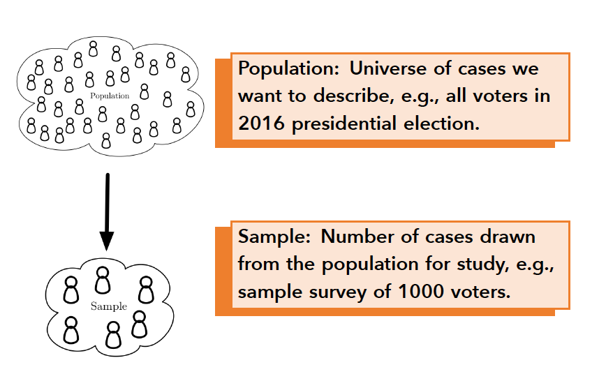

## Overview {#main-content}

Political research is almost never about the cases in front of you. A survey of 1,500 respondents is interesting for what it suggests about millions of voters; forty countries are interesting for what they suggest about how countries behave in general. The gap between the cases you observed and the ones you want to talk about is unavoidable, and it is not a defect in the data --- it is the condition under which nearly all empirical work is done. What matters is being able to say how much that gap should temper a conclusion.

This tutorial covers the reasoning that makes such a statement possible. The gap it addresses takes two forms. Sometimes you observe only a fraction of the cases you care about, as in a survey, and a different sample would have produced somewhat different numbers. Sometimes you observe every case in a set --- all fifty states, all countries in a given year --- but the claim you want to make is about a relationship that could have come out differently. The same reasoning handles both, and this tutorial builds it in the first case, where the variation is easiest to see. You will see that variation directly by drawing samples over and over, watch the pattern the sample statistics form, and arrive at the standard error --- the number that says how far a sample estimate typically falls from the truth. Nothing here is a hypothesis test; every test in the tutorials that follow is built on what this one establishes.

In this tutorial you will learn to:

* Explain the difference between a sample statistic and a population parameter, and what a point estimate is
* Describe what sampling variation is and why it makes statistical inference necessary
* Distinguish the population distribution, the sample distribution, and the sampling distribution
* Explain why sample means and proportions from random samples are centered on the corresponding population parameters, and what the CLT adds to this
* Describe how sample size affects the precision of a sample estimate and why
* Explain what the Central Limit Theorem implies and why it enables inference
* Define the standard error and explain what determines its size

```{r setup, include=FALSE}
library(learnr)
library(dplyr)
library(ggplot2)
library(moderndive)
library(gridExtra)
library(gradethis)
tutorial_options(exercise.checker = gradethis::grade_learnr,
                 exercise.completion = FALSE)
knitr::opts_chunk$set(error = TRUE)
options(lifecycle_verbosity = "quiet")
options(cli.num_colors = 1)

data("bowl", package = "moderndive")

# Pre-compute sampling objects so exercise chunks stay clean
set.seed(1000)
virtual_shovel <- bowl %>% rep_sample_n(size = 100, reps = 1)

set.seed(1000)
repeated_samples100 <- bowl %>% rep_sample_n(size = 100, reps = 1000)
virtual_prop_red100 <- repeated_samples100 %>%
  group_by(replicate) %>%
  summarise(red = sum(color == "red")) %>%
  mutate(p = red / 100)

set.seed(1000)
repeated_samples25 <- bowl %>% rep_sample_n(size = 25, reps = 1000)
virtual_prop_red25 <- repeated_samples25 %>%
  group_by(replicate) %>%
  summarise(red = sum(color == "red")) %>%
  mutate(p = red / 25)

set.seed(1000)
repeated_samples500 <- bowl %>% rep_sample_n(size = 500, reps = 1000)
virtual_prop_red500 <- repeated_samples500 %>%
  group_by(replicate) %>%
  summarise(red = sum(color == "red")) %>%
  mutate(p = red / 500)
```

## Populations and Samples

Much research in political science involves more cases than we can observe --- all voters, all countries, all historical moments. The concepts in this section give us the vocabulary to think precisely about that gap between what we have and what we want to know.

A [population]{.important-text} is the full set of cases you want to draw conclusions about. It could be all voters in a presidential election, all countries in the world, all U.S. states across time, or all adults living in a particular city. The population is defined by your research question, not by your data.

A [sample]{.important-text} is the subset of the population you actually observe. A survey of 1,200 American adults is a sample drawn from the population of all American adults. Forty countries chosen at random from all the countries in the world are a sample in the same sense. When your data are a sample, they give you a partial view of the population you care about --- and that gap is what the rest of this tutorial is about.



### Sample Statistics and Population Parameters

Suppose Gallup reports that 30% of a sample of 1,200 American adults approve of the way the president is handling the job. That figure --- 30% --- was computed from the sample. But what you really want to know is not what those 1,200 people think. It is what *all* American adults think. The 30% is your best single guess for the true approval rate in the population --- what statisticians call a [point estimate]{.important-text}. But it is only an estimate. A different random sample of 1,200 adults drawn on the same day would almost certainly produce a somewhat different percentage.

The same situation arises throughout political science. Suppose a researcher surveys 40 countries and finds that the average democracy score in her sample is 58 points. Democracy scores are numerical measures of how democratic a country's institutions are, typically ranging from 0 (fully authoritarian) to 100 (fully democratic). The mean of 58 describes those 40 countries accurately. But her real question is about the average level of democracy across *all* countries in the world. The 58 is a point estimate of that unknown quantity.

These two roles --- the quantity computed from your data, and the true quantity in the population you are trying to learn about --- have names.

A [sample statistic]{.important-text} is a quantity computed from your data --- a sample mean, a sample proportion, a sample correlation. It is a point estimate of the corresponding population quantity, and different random samples from the same population will produce different values of it. A [population parameter]{.important-text} is the true value of that same quantity in the full population: the mean democracy score of all countries, say, or the proportion of all American adults who approve of the president. Population parameters are almost always unknown, and that is precisely why we need inference.


These two concepts also have standard notation that you will encounter throughout the course and in published research. Sample statistics are written with Roman letters; population parameters use Greek letters.

| Quantity | Sample Statistic | Population Parameter |
|:---------|:----------------:|:--------------------:|
| Mean | $\bar{X}$ | $\mu$ |
| Proportion | $p$ | $\pi$ |
| Standard deviation | $s$ | $\sigma$ |
| Correlation | $r$ | $\rho$ |


**Apply 1: Statistic or parameter?**

```{r q-stat-param, echo=FALSE}
question(
  "A researcher randomly selects 45 countries and measures the
  percentage of seats in the national legislature held by women.
  The mean in her sample is 28%. A colleague says: 'That 28%
  is probably close to the true global figure, so it is
  essentially a population parameter.' What is wrong with
  this reasoning?",
  correct = "Right. What makes it a statistic is where the number came from, not how accurate it is.",
  answer(
    "Nothing is wrong. If the sample is representative,
    the sample statistic and the population parameter
    are the same thing.",
    message = "Representativeness affects how good an estimate
    is, but it does not change what kind of quantity it is.
    A sample statistic is always computed from your data.
    The population parameter is always the true value in the
    full population. A well-designed sampling process makes the
    statistic a more defensible estimate --- it does not turn the
    statistic into the parameter."
  ),
  answer(
    "The colleague is right that 28% is close to the truth,
    but wrong to call it a parameter. It is a statistic
    because 45 countries is too small a sample to compute
    a parameter.",
    message = "Sample size does not determine whether a
    quantity is a statistic or a parameter. A statistic is
    any quantity computed from your data, regardless of how
    many cases are in it. The population parameter is the
    true value across all countries in the world --- unknown
    regardless of sample size."
  ),
  answer(
    "The 28% is a sample statistic because it was computed from
    45 countries. Whether it is close to the truth has no
    bearing on which of the two it is.",
    correct = TRUE,
    message = "A sample statistic and a population
    parameter are defined by where they come from, not by
    how accurate the statistic turns out to be. The 28%
    describes the 45 countries in the sample. The population
    parameter --- the true mean percentage of women in
    legislatures across all countries --- is a separate,
    unknown quantity. Closeness to the truth is a property
    of a good estimator; it does not dissolve the distinction
    between statistic and parameter."
  ),
  answer(
    "The 28% is a population parameter because it describes
    a real, measurable feature of the world --- the actual
    percentage of women in legislatures.",
    message = "A quantity being real and measurable does not
    make it a population parameter. The 28% is real, but it
    was computed from 45 countries, not all countries. The
    population parameter is the true value across the full
    population --- here, all countries in the world --- which
    is not directly observed in this study."
  ),
  allow_retry = TRUE,
  random_answer_order = TRUE,
  try_again = "A statistic and a parameter are defined
  by where they come from, not by how accurate or representative
  the statistic is. Which of these was computed from the 45
  countries in the sample?"
)
```

### A Critical Requirement: Random Sampling

Having a sample is not enough on its own. For a sample statistic to be a trustworthy estimate of the population parameter, the process that produced the sample must not systematically favor some parts of the population over others. A sample that reflects the population's composition rather than some distorted version of it is called [representative]{.important-text}, but no single random sample is guaranteed to be one. Some will over- or underrepresent particular kinds of case purely by chance --- that is what sampling error is. What random sampling guarantees is that those departures are not systematic, so they average out across repeated samples.

The most reliable way to achieve this is [random sampling]{.important-text}: drawing cases from the population in a way that gives every member a known, and often equal, chance of being selected. Think of the bowl of red and white balls you will use in the next section. Imagine the balls have not been mixed --- all the red balls have settled to the bottom. If you reach in and scoop, your handful will be almost entirely white, badly underestimating the true proportion of red balls in the bowl. Now imagine thoroughly stirring the bowl before you scoop. With the balls well mixed, any handful you draw will tend to reflect the overall composition of the bowl. That is what random sampling does: it gives every part of the population a chance to appear in the sample, so that across repeated samples the sampling process does not systematically over- or underrepresent one part of the population.

The uncertainty that remains even after random sampling --- the fact that your sample proportion might be 28% when the true population proportion is 31% --- is called [sampling error]{.important-text}. It is random, unavoidable, and crucially, quantifiable. The inference you will build in this tutorial rests on quantifying it.

Sampling error is very different from [sampling bias]{.important-text}, which arises when the sampling process systematically over- or underrepresents certain members of the population. A survey that only reaches people with landline phones will systematically underrepresent younger adults. A data set of countries assembled by selecting the ones a researcher knows best will systematically overrepresent wealthy democracies. Bias does not average out across samples --- it pushes estimates in the wrong direction every time.

::: {.caution}
**Inference requires a defensible source of randomness or uncertainty.** In the simplest survey setting, that comes from random sampling. The tools developed in this tutorial --- sampling distributions, standard errors, and later p-values and confidence intervals --- rest on that foundation. Applying sampling-based inference to a convenience sample or a biased sample produces numbers that look precise but may be badly misleading.
:::

### Statistical Inference

With those foundations in place, statistical inference can be defined precisely.

[Statistical inference]{.important-text} is the process of using what you observe to draw conclusions about something you cannot observe directly, while honestly accounting for the uncertainty involved. In this tutorial that means using a sample statistic to draw conclusions about a population parameter, and the uncertainty comes from sampling.

::: {.important-note}
**The two tools of statistical inference**

- **Hypothesis tests**, which assess how surprising the observed evidence would be if a particular claim about the population or process were true.
- **Confidence intervals**, which provide a range of plausible values for an unknown quantity, given what you observed and how much it could have varied.
:::


Both tools are grounded in the same mathematical foundation: the theory of sampling distributions and the Central Limit Theorem. These results tell you how sample statistics behave across repeated random samples --- which is exactly what you need to quantify uncertainty honestly. That theory is what this tutorial turns to next.

## The Virtual Experiment

The best way to build intuition for statistical inference is to watch it happen. In this section you will conduct a virtual sampling experiment using a bowl of 2,400 red and white balls. The bowl plays the role of the population --- think of the balls as voters, each of whom either approves (red) or disapproves (white) of the president. A sample of balls drawn from the bowl is like a Gallup survey: a random subset of the population used to estimate the true approval rate.

This experiment uses the [moderndive]{.package-name} package. The package was designed specifically to teach statistical inference through virtual sampling, and it provides both the **bowl** data set and the `rep_sample_n()` function you will use to draw random samples from it.

### Look at the Bowl

The **bowl** data frame has one row per ball. The variable **ball_ID** is an identification number, and **color** records whether each ball is red or white. The code below prints the data frame so you can see its structure.

**Run and observe 2: Examine the bowl**

```{r ex-look-bowl, exercise=TRUE, exercise.cap="Run and observe 2"}
bowl
```

The output shows the first several rows and reports the total number of rows at the bottom. With 2,400 balls in the bowl, we actually could compute the true population parameter directly by counting all the red balls. Unlike most real research situations, you can check your estimates against the truth --- but that comes later. For now, we will do what researchers always have to do: draw a sample and estimate.

### Drawing One Sample

In real research you rarely observe every member of the population --- and even when your data cover every case in a defined population, you may be reasoning about an underlying process that could have generated different outcomes. In those situations, a random sample is your window into the population. We mimic this by drawing a sample of balls from the bowl using `rep_sample_n()`.

`rep_sample_n()` takes two key arguments: `size` sets the number of balls to draw in each sample, and `reps` sets how many separate samples to draw. Each call draws a fresh random sample --- as if the bowl were stirred thoroughly before every scoop, ensuring every ball has a known, equal chance of being selected. We start with one sample of 100 balls: `size = 100, reps = 1`.

**Run and observe 3: Draw one random sample of 100 balls**

```{r ex-one-sample, exercise=TRUE, exercise.cap="Run and observe 3"}
set.seed(1000)
virtual_shovel <- bowl %>%
  rep_sample_n(size = 100, reps = 1)
virtual_shovel
```

The output has 100 rows, one per ball in the sample. The **replicate** column takes the value 1 for every row, indicating that all 100 balls came from the same single sample. The **ball_ID** column identifies which of the 2,400 balls ended up in this draw. Notice that `set.seed(1000)` appears before the sampling call --- this makes the random draw reproducible so that everyone running this tutorial gets the same sample. The object `virtual_shovel` is available throughout this tutorial.

**Practice 4: Understanding the sample**

```{r q-replicate, echo=FALSE}
question(
  "The variable replicate takes the value 1 for every row in
  virtual_shovel. A student says this means every ball was drawn
  exactly once. Another says it means all 100 rows belong to the
  first and only sample drawn. Who is right?",
  correct = "Right. With a single sample there is only one **replicate** to identify.",
  answer(
    "Both are saying the same thing in different words.",
    message = "They are actually describing two different things.
    The **replicate** variable tracks sample membership --- which sample
    a row belongs to --- not whether any individual ball appeared
    more than once. With `reps = 1` there is one sample, so
    `replicate = 1` for all rows."
  ),
  answer(
    "The first student. Each ball_ID appears only once, confirming
    that every ball was drawn exactly once.",
    message = "While it may be true that no ball_ID repeats in this
    sample, that is a feature of sampling without replacement, not
    what the **replicate** variable measures. The **replicate** variable
    tracks which sample each row belongs to, not whether balls
    were repeated."
  ),
  answer(
    "The second student. The **replicate** variable identifies
    which sample each row belongs to.",
    correct = TRUE,
    message = "The **replicate** variable labels sample membership --- which sample each row belongs to --- not whether individual balls were drawn with or without replacement. When we draw 1,000 samples later, **replicate** will range from 1 to 1,000, with each value identifying which of the 1,000 samples a ball belongs to."
  ),
  answer(
    "Neither. The **replicate** variable records how many times each
    ball was sampled across all repetitions.",
    message = "The **replicate** variable labels which sample each row
    belongs to, not a count of how many times a ball was drawn.
    With `reps = 1`, every row belongs to the first and only sample,
    so `replicate = 1` throughout."
  ),
  allow_retry = TRUE,
  random_answer_order = TRUE,
  try_again = "The **replicate** variable tells you which sample a row belongs to. With `reps = 1` there is only one sample. What value would every row have for **replicate**?"
)
```

### The Sample Distribution

Before computing the proportion of red balls, let's look at the distribution of **color** in your sample. You have been plotting distributions like this all semester --- this is a sample distribution, the distribution of a variable in one data set. The code uses `geom_bar()` with `after_stat(prop)` to display proportions rather than counts on the y-axis, and `group = 1` tells ggplot2 to compute proportions across all bars rather than within each one.

**Run and observe 5: Plot the sample distribution**

```{r ex-sample-dist, exercise=TRUE, exercise.cap="Run and observe 5", fig.alt="Bar plot of one random sample of 100 balls, with proportion on the y-axis and color on the x-axis. The white bar is the taller of the two at just over 0.6; the red bar reaches just under 0.4."}
ggplot(virtual_shovel, aes(x = color)) +
  geom_bar(aes(y = after_stat(prop), group = 1),
           fill = "steelblue", color = "white") +
  labs(title = "Sample Distribution",
       subtitle = "One random sample of 100 balls",
       x = "Color",
       y = "Proportion") +
  theme_minimal()
```

This bar chart shows the proportion of red and white balls in your one sample. It describes what this particular sample looks like --- nothing more. A different random draw of 100 balls would produce a slightly different chart.

### Calculating the Sample Proportion

The bar chart gives you a visual summary, but you need a number: the proportion of red balls in the sample. This is your sample statistic --- your point estimate of the true proportion of red balls in the bowl, just as Gallup's 30% approval figure is their point estimate of the true approval rate among all American adults.

You have used `summarise()` and `mutate()` in previous tutorials to compute summary statistics and add new variables. The same tools apply here. `summarise()` with `sum(color == "red")` counts the red balls --- the expression `color == "red"` evaluates to TRUE for each red ball and FALSE for each white ball, and `sum()` counts the TRUE values. Then `mutate()` divides that count by 100 to get the proportion.

**Run and observe 6: Calculate the proportion of red balls**

```{r ex-prop-red, exercise=TRUE, exercise.cap="Run and observe 6"}
virtual_shovel %>%
  summarise(num_red = sum(color == "red")) %>%
  mutate(p = num_red / 100)   # 100 is the sample size
```

The result gives you **num_red**, the count of red balls, and **p**, the proportion. This single number is your best guess for the true proportion of red balls in the entire bowl of 2,400. Just as a Gallup survey of 1,200 adults produces one estimate of the approval rate among all American adults, this one scoop of 100 balls produces one estimate of the true proportion of red balls in the bowl.

**Apply 7: The limits of one sample**

```{r q-one-sample-limit, echo=FALSE}
question(
  "Your sample of 100 balls produces a proportion p. A classmate
  argues that because the sample was drawn randomly, p must be
  very close to the true population proportion. A second classmate
  argues that p is just one of many possible estimates and could
  be somewhat far from the truth. Who has the stronger argument,
  and why?",
  correct = "Right. Unbiased on average says nothing about any one sample.",
  answer(
    "The first classmate. A random sample of 100 is large enough
    to guarantee that p is within a few percentage points of the
    true proportion.",
    message = "Random sampling does not guarantee closeness in any
    individual sample --- it guarantees that the estimates are
    centered on the truth across many samples. How close any one
    sample tends to be depends on sample size and population
    variability, but there is always some possibility of a sample
    that differs meaningfully from the truth."
  ),
  answer(
    "Both are partly right. Random sampling guarantees p equals
    the true proportion, but only if the sample size is at
    least 100.",
    message = "No sample size guarantees that p equals the true
    proportion exactly. Random sampling ensures estimates are
    unbiased on average, not that any individual estimate is
    exact. Even a sample of 10,000 would not guarantee an exact
    match with the population proportion."
  ),
  answer(
    "Neither. The only way to know how close p is to the truth
    is to examine all 2,400 balls.",
    message = "While examining all 2,400 balls would give you the
    truth directly, statistical inference gives you a way to
    quantify uncertainty without doing so. That is precisely what
    makes inference useful: it lets you make principled claims about
    the population from a sample alone."
  ),
  answer(
    "The second classmate. Random sampling makes the estimate
    unbiased across many samples, but any one sample can still
    differ from the population proportion.",
    correct = TRUE,
    message = "Random sampling guarantees that estimates are centered on the truth across many repetitions --- that is what unbiasedness means. But it does not guarantee closeness in any one sample. The gap between your single estimate and the true population proportion is sampling variation, and quantifying that gap is exactly what statistical inference is built to do."
  ),
  allow_retry = TRUE,
  random_answer_order = TRUE,
  try_again = "Think about the difference between how a process performs on average across many repetitions versus how it performs in any single instance."
)
```

### Drawing 1,000 Samples

You now have a point estimate: the proportion of red balls in your sample. But how good an estimate is it? Could a different random sample of 100 balls have given you a very different answer?

In real research you cannot answer this question directly. You draw one sample, compute one estimate, and that is all you have. You cannot re-run the survey a thousand times to see how much your estimates would vary. The gap between your sample statistic and the true population parameter is real, but you have no direct way to measure it.

This is where the virtual experiment gives us something real research cannot. Because the bowl is a simulated population, we can draw as many samples as we like and watch what happens. We are not doing this because we need 1,000 estimates --- we only ever use one in practice. We are doing it to understand how much a single random sample of 100 balls can vary, which tells us how much uncertainty surrounds the one estimate we would have in a real study.

Each sample is a fresh random draw --- as if the bowl were stirred before every scoop. Because each draw selects a different subset of 100 balls from the 2,400 in the bowl, the proportions computed from them will differ. This is [sampling variation]{.important-text}: not a flaw in the process, but an inherent consequence of working with a random subset rather than the full population.

The code works in two steps. First, `rep_sample_n()` with `reps = 1000` draws all 1,000 samples at once, producing a data frame with 100,000 rows (1,000 samples x 100 balls each). The **replicate** variable now ranges from 1 to 1,000, identifying which sample each ball belongs to. Second, `group_by(replicate)` treats each sample separately, `summarise()` counts the red balls within each, and `mutate()` computes **p** for each sample. The result has one row per sample.

**Run and observe 8: Draw 1,000 samples and compute a proportion for each**

```{r ex-1000-samples, exercise=TRUE, exercise.cap="Run and observe 8"}
set.seed(1000)
repeated_samples100 <- bowl %>%
  rep_sample_n(size = 100, reps = 1000)

virtual_prop_red100 <- repeated_samples100 %>%
  group_by(replicate) %>%
  summarise(red = sum(color == "red")) %>%
  mutate(p = red / 100)

virtual_prop_red100
```

Look at the **p** column. The proportions vary from sample to sample --- some samples happened to scoop more red balls, others fewer, purely by chance. This is sampling variation in action. The question is: how much does it matter? The histogram in the next step makes that visible.

**Apply 9: What does sampling variation mean for your estimate?**

```{r q-sampling-variation, echo=FALSE}
question(
  "You computed p from one sample of 100 balls. A classmate
  says: 'Since each sample is drawn randomly, your p is just
  as likely to be above the true population proportion as
  below it, so on average random samples get it right ---
  there is nothing to worry about.' What is the flaw in
  this reasoning?",
  correct = "Right. In real research you only ever have the one sample you drew.",
  answer(
    "The classmate is correct. If random samples get it right
    on average, there is no inferential problem to solve.",
    message = "Unbiasedness --- being right on average --- is
    a necessary but not sufficient condition for useful
    inference. It tells you the estimates are centered on the
    truth, but not how tightly they cluster around it. A single
    estimate could still be far from the truth even when the
    process is unbiased on average."
  ),
  answer(
    "The flaw is that random samples are actually biased
    toward overestimating the population proportion.",
    message = "Random samples are not systematically biased in
    either direction --- that is what makes them random. The
    flaw in the classmate's reasoning is not about bias but
    about the difference between average performance across
    many samples and the performance of any one sample."
  ),
  answer(
    "The classmate is wrong because random samples are not equally likely to be above or below the truth.",
    message = "Actually the classmate is right about the main idea --- random samples are centered on the population parameter across repeated samples. The flaw is in concluding that this means there is nothing to worry about in any individual sample. Being right on average does not tell you how far your one estimate might be from the truth."
  ),
  answer(
    "Being right on average across many samples is not the same
    as being right in the one sample you actually drew.",
    correct = TRUE,
    message = "The classmate is describing unbiasedness: random samples are centered on the truth across many repetitions. That is a real and important property. But it says nothing about how close your one sample is to the truth. In real research you only have one draw, and that draw could land anywhere in the sampling distribution. Quantifying how far it might be from the truth is exactly what the rest of this tutorial develops."
  ),
  allow_retry = TRUE,
  random_answer_order = TRUE,
  try_again = "The classmate is right that random samples are centered on the truth on average. The question is what that guarantees about any single sample."
)
```

### Plotting the Sampling Distribution

A histogram of the 1,000 proportions makes the pattern of sampling variation visible all at once. The code plots **p** on the x-axis and adds a red vertical line at the mean of all 1,000 proportions with `geom_vline()`. The `binwidth = 0.02` argument sets the width of each bar, and `boundary = 0.4` ensures the bars align at sensible cut points.

**Run and observe 10: Plot the distribution of sample proportions**

```{r ex-sampling-dist, exercise=TRUE, warning=FALSE, exercise.cap="Run and observe 10", fig.alt="Histogram of the proportion red across 1,000 random samples of size 100. The distribution is roughly symmetric and bell-shaped, running from about 0.2 to about 0.55, with the tallest bars near 0.38 at a frequency of about 170. A vertical reference line marks the mean of the distribution, just below 0.4."}
ggplot(data = virtual_prop_red100,
       mapping = aes(x = p)) +
  geom_histogram(binwidth = 0.02, boundary = 0.4,
                 color = "white") +
  geom_vline(xintercept = mean(virtual_prop_red100$p),
             color = "red") +
  labs(title = "Sampling Distribution of the Proportion",
       subtitle = "1,000 random samples of size 100",
       x = "Proportion Red",
       y = "Frequency") +
  scale_x_continuous(limits = c(0.1, 0.6))
```

The histogram shows the **sampling distribution** of the sample proportion --- the distribution of **p** across 1,000 repeated random samples from the same population. The proportions vary, but they cluster around a central value marked by the reference line. Values far from that center are rare. The shape is approximately bell-shaped and symmetric.

Notice what the reference line tells you: it marks the average of all 1,000 estimates. If your single sample's estimate happens to land near that center, it is close to what most other samples would have given. If it falls in one of the tails, it is an unusual draw. But in real research, you cannot see this histogram --- you only have your one sample. That is why you need tools to quantify how much uncertainty surrounds a single estimate. The next section starts developing them.

**Practice 11: Reading the sampling distribution**

```{r q-sampling-dist-read, echo=FALSE}
question(
  "A student looks at the histogram and says: 'Most of the
  1,000 samples gave proportions between about 0.30 and 0.45,
  so the sampling distribution tells you the true proportion
  of red balls in the bowl is somewhere in that range.' What
  is wrong with this interpretation?",
  correct = "Right. The spread describes where sample proportions land, not where the truth lies.",
  answer(
    "The interpretation is correct. The sampling distribution
    shows all values the true proportion could plausibly take.",
    message = "The sampling distribution shows how sample
    statistics vary around the truth, not the range of
    plausible values for the population parameter itself.
    The true proportion is a single fixed value --- the
    spread of the sampling distribution describes uncertainty
    about estimates, not uncertainty about where the
    truth is located."
  ),
  answer(
    "The interpretation is wrong because 1,000 samples is
    not enough to draw any conclusions from the histogram.",
    message = "1,000 samples is more than sufficient to reveal
    the shape and center of the sampling distribution. The
    student's error is conceptual --- misidentifying the
    spread of the distribution with the range of plausible
    values for the population parameter."
  ),
  answer(
    "The range is too narrow. The true proportion could be
    anywhere from 0 to 1.",
    message = "The student's error is not about the range being
    too narrow but about misidentifying what the spread of
    the sampling distribution means. The spread reflects
    sampling variation in the estimates, not the full range
    of possible values for the population parameter."
  ),
  answer(
    "The range 0.30 to 0.45 describes where most sample
    proportions fall, not where the true proportion might be.",
    correct = TRUE,
    message = "The spread of the sampling distribution tells you how much individual sample estimates vary around the true value --- not the range of possible locations for the truth itself. The true proportion is a single fixed number. The center of the distribution is the best estimate of it. The width of the distribution reflects how precise that estimate is."
  ),
  allow_retry = TRUE,
  random_answer_order = TRUE,
  try_again = "The sampling distribution shows how sample statistics vary. Ask what the spread of this distribution tells you versus what the center tells you."
)
```

## What the Sampling Distribution Tells Us

You have just built something remarkable: a picture of how a sample statistic behaves across many repeated random samples. In real research you never get to see this picture --- you have one sample and one estimate. But the virtual experiment lets us peek behind the curtain, and what we find there is the foundation of all statistical inference.

### The Reveal

So far we have been treating the true proportion of red balls in the bowl as unknown --- just as a researcher treats a population parameter as unknown. But the bowl is a simulated population, which means we actually can compute the truth directly. The code below counts every red and white ball across all 2,400 rows and computes the true population proportion $\pi$.

**Run and observe 12: Compute the true population proportion**

```{r ex-reveal, exercise=TRUE, exercise.cap="Run and observe 12"}
bowl %>%
  summarise(
    sum_red   = sum(color == "red"),
    sum_white = sum(color != "red")
  ) %>%
  mutate(pi = sum_red / (sum_red + sum_white))
```

The output shows both `sum_red` and `sum_white` so you can see the full composition of the bowl before computing the proportion. This is a rare privilege. In virtually every real research situation, the population parameter can only be known through a complete census --- which is expensive, time-consuming, and often impossible. Here we can see it directly because we constructed the population ourselves. Take note of the value: you will use it immediately.

**Practice 13: The truth and your estimate**

```{r q-reveal, echo=FALSE}
question(
  "The true proportion of red balls in the bowl is 0.375. Look
  back at the sampling distribution histogram you produced. The
  red vertical line marks the mean of the 1,000 sample
  proportions. Which of the following best describes the
  relationship between the mean of the sampling distribution
  and the true population proportion?",
  correct = "Right. The sampling distribution centers on the true population proportion.",
  answer(
    "The mean of the sampling distribution is close to 0.375
    by coincidence. With a different set of 1,000 samples it
    would likely be quite different.",
    message = "This is not a coincidence --- it is a property
    of random sampling. The mean of the sampling distribution
    should be close to the true population parameter, and with
    more repeated samples it would tend to get even closer.
    This is what it means for an estimator to be unbiased."
  ),
  answer(
    "The mean of the sampling distribution equals 0.375
    exactly because we used set.seed(), which controls the
    random draws.",
    message = "`set.seed()` makes the draws reproducible but
    does not control what values are produced. The closeness
    of the sampling distribution mean to 0.375 is a property
    of random sampling, not of the seed. With a different
    seed the mean would still be close to 0.375."
  ),
  answer(
    "The mean of the sampling distribution is very close to
    0.375, the true population proportion --- and that is no
    coincidence.",
    correct = TRUE,
    message = "This is one of the two most important properties of sampling distributions. Across many random samples, sample means and proportions are centered on the true population parameter --- they are [unbiased estimators]{.important-text}. No single sample is guaranteed to land exactly on the truth, but the process does not systematically push estimates above or below it. This is not a coincidence; it is a mathematical property of random sampling."
  ),
  answer(
    "The relationship is unclear because you cannot compare
    a distribution to a single value.",
    message = "You can absolutely compare the mean of the
    sampling distribution --- a single summary of the
    distribution --- to the population parameter. The mean
    of the 1,000 sample proportions is a single number,
    and comparing it to the true proportion of 0.375
    is exactly what reveals the unbiasedness property."
  ),
  allow_retry = TRUE,
  random_answer_order = TRUE,
  try_again = "The red line marks the mean of the 1,000 sample proportions. The true proportion is 0.375. What does it mean that these two numbers are so close to each other?"
)
```

### The Effect of Sample Size

The sampling distribution is centered on the truth --- that is reassuring. But how tightly do individual estimates cluster around it? A single sample of 100 balls gave you one proportion. Could it have been very different? To answer this, we compare sampling distributions from three different sample sizes: 25, 100, and 500. Each uses 1,000 repeated random samples from the same bowl, so the only thing changing is how many balls are in each scoop.

The code below produces three histograms side by side. The `scale_x_continuous()` and `scale_y_continuous()` calls fix the axes to the same range across all three plots so the comparison is fair --- you are seeing the same scale in all three panels.

**Run and observe 14: Compare sampling distributions across sample sizes**

```{r ex-sample-size, exercise=TRUE, warning=FALSE, exercise.cap="Run and observe 14", fig.alt="Three histograms side by side of the proportion red across 1,000 samples, at sample sizes of 25, 100 and 500. All three are centered near 0.375, but the spread narrows sharply as the sample size grows: the n = 25 panel runs from roughly 0.1 to 0.65 and peaks near 150, the n = 100 panel runs from roughly 0.25 to 0.5 and peaks near 170, and the n = 500 panel is a narrow spike from roughly 0.32 to 0.45 peaking near 380."}
dist_25 <- ggplot(virtual_prop_red25, aes(x = p)) +
  geom_histogram(binwidth = 0.02, boundary = 0.4,
                 color = "white") +
  labs(title = "n = 25",
       x = "Proportion Red", y = "Frequency") +
  scale_x_continuous(limits = c(0, 0.7)) +
  scale_y_continuous(limits = c(0, 400))

dist_100 <- ggplot(virtual_prop_red100, aes(x = p)) +
  geom_histogram(binwidth = 0.02, boundary = 0.4,
                 color = "white") +
  labs(title = "n = 100",
       x = "Proportion Red", y = "Frequency") +
  scale_x_continuous(limits = c(0, 0.7)) +
  scale_y_continuous(limits = c(0, 400))

dist_500 <- ggplot(virtual_prop_red500, aes(x = p)) +
  geom_histogram(binwidth = 0.02, boundary = 0.4,
                 color = "white") +
  labs(title = "n = 500",
       x = "Proportion Red", y = "Frequency") +
  scale_x_continuous(limits = c(0, 0.7)) +
  scale_y_continuous(limits = c(0, 400))

grid.arrange(dist_25, dist_100, dist_500, nrow = 1)
```

Before reading on, pause for a moment with the three histograms. The important lesson is visible before it is put into words: the centers are similar, but the spreads are not.


**What they have in common.** All three distributions are centered near 0.375 --- the true population proportion you just computed. It doesn't matter whether each sample contained 25 balls or 500: across many draws, sample proportions are centered on the truth. This is what it means for sample proportions to be unbiased estimators of the population proportion. Random sampling doesn't guarantee that any single estimate is correct, but it guarantees that the process isn't systematically fooling you in one direction. That is a powerful assurance.

**What is different.** Now look at the spread. With samples of only 25 balls, the proportions scatter widely --- individual samples gave everything from 0.08 to 0.76. If you happened to draw one of those extreme samples in a real study, you'd be quite far from the truth with no way of knowing it. With samples of 500, the proportions pack tightly near the center. Almost every sample gives you something close to 0.375.

This difference in spread is the difference in [precision]{.important-text} --- how tightly individual estimates cluster around the population parameter. Precision is not the same as unbiasedness. All three processes are unbiased. But only the larger samples are precise, meaning that any single draw is likely to be close to the truth rather than somewhere in a wide range around it.

This matters enormously for real research. You never get to draw 1,000 samples. You get one. If your one sample comes from a narrow sampling distribution --- because your sample is large --- you can be reasonably confident your estimate is close to the population parameter. If it comes from a wide one --- because your sample is small --- you have a point estimate but much more uncertainty about how far it might be from the truth. Quantifying that uncertainty precisely is what the rest of this tutorial is about.

**Apply 15: Connecting precision to real research**

```{r q-sample-size-applied, echo=FALSE}
question(
  "Gallup typically surveys around 1,000 American adults to
  estimate presidential approval. A critic argues they should
  survey at least 100,000 people to get a useful estimate.
  Based on what you observed in the three sampling
  distributions, what is the most relevant response to
  this criticism?",
  correct = "Right. Larger samples do help, but with diminishing returns.",
  answer(
    "The critic is right. A sample of 1,000 is far too small
    to estimate anything about a population of 330 million
    Americans.",
    message = "For very large populations, the precision of a random sample depends primarily on the absolute size of the sample, not its size relative to the population. A well-designed random sample of 1,000
    produces a narrow sampling distribution even when the
    population is very large."
  ),
  answer(
    "The critic is right because presidential approval is
    too variable to estimate from any sample smaller than
    the full population.",
    message = "Variability in the population affects the
    standard error, but it does not make inference impossible
    with a sample of 1,000. Random samples of that size
    routinely produce precise estimates of population
    proportions."
  ),
  answer(
    "Sample size is irrelevant as long as the sample is
    random. Gallup's 1,000 interviews are exactly as precise
    as 100,000 would be.",
    message = "Sample size does matter for precision. Larger
    samples produce narrower sampling distributions. The
    point is not that size is irrelevant but that the gains
    in precision beyond a few thousand respondents are small
    relative to the cost."
  ),
  answer(
    "Increasing the sample size does reduce sampling variation,
    but the gains diminish. A well-designed sample of 1,000
    already clusters tightly around the truth.",
    correct = TRUE,
    message = "The three sampling distributions showed that going from n = 25 to n = 100 produces a dramatic reduction in spread, but the gain from n = 100 to n = 500 is smaller. This diminishing return continues: to cut the standard error in half, you need to quadruple the sample size. A random sample of 1,000 is already quite precise for estimating a national proportion, which is why major polling organizations converge on roughly that size."
  ),
  allow_retry = TRUE,
  random_answer_order = TRUE,
  try_again = "Look at how the spread changed across the three histograms. Was each step an equal reduction in spread? What does that suggest about the returns to larger samples?"
)
```

## Three Distributions

::: {.tip}
**Good place to take a break.** You have now covered samples, sampling variation, and sampling distributions, and seen how the sampling distribution is centered on the truth and how sample size affects precision. The next sections explain why these ideas allow you to compute standard errors and use the Central Limit Theorem.
:::

To use inferential tools correctly --- and to avoid one of the most common errors in interpreting statistical results --- you need to be precise about which kind of distribution is in front of you. There are three kinds of distribution --- the population distribution, the sample distribution, and the sampling distribution --- and they are easy to confuse. Confusing them leads to real mistakes: misreading a histogram, misinterpreting a standard error, or drawing the wrong conclusion from a p-value. Getting them straight now will pay off every time you encounter inferential output for the rest of the course.

The bowl experiment used a simple two-category population --- red and white balls --- which kept the mechanics clear. To see what all three distributions look like for a continuous numerical variable, consider the following example. A population of 10,000 individuals has been measured on annual income in thousands of dollars, with a mean of 10 and a standard deviation of 2. We draw one random sample of 100 from this population and also construct the sampling distribution of the sample mean across 1,000 repeated samples.

```{r three-dist-plot, echo=FALSE, warning=FALSE, message=FALSE, fig.height=9, fig.cap="Three stacked histograms comparing the population distribution, one sample distribution, and the sampling distribution of the mean. The population and sample distributions show individual income values and look similarly spread out. The sampling distribution of the mean is much narrower and centered on the same value, marked with a vertical reference line.", fig.alt="Three histograms stacked vertically. Panel 1, Population Distribution, shows the spread of annual income across all 10,000 individuals, roughly bell-shaped and centered near 10 thousand dollars. Panel 2, Sample Distribution, shows one random sample of 100 individuals with a similar spread and shape to the population. Panel 3, Sampling Distribution of the Mean, shows the mean income from each of 1,000 random samples of size 100; this distribution is much narrower than the other two and is centered at the same value, marked with a vertical reference line at the population mean."}
set.seed(1230)
population_norm <- data.frame(value = rnorm(10000, 10, 2))
sample_norm     <- population_norm %>% sample_n(100)
sampling_means  <- data.frame(
  mean = replicate(1000,
                   mean(sample(population_norm$value, 100)))
)

p_pop <- ggplot(population_norm, aes(x = value)) +
  geom_histogram(bins = 30, fill = "lightblue",
                 color = "black") +
  labs(title = "1. Population Distribution",
       subtitle = "All 10,000 individuals",
       x = "Annual Income (thousands of dollars)",
       y = "Frequency") +
  theme_minimal()

p_samp <- ggplot(sample_norm, aes(x = value)) +
  geom_histogram(bins = 30, fill = "lightgreen",
                 color = "black") +
  labs(title = "2. Sample Distribution",
       subtitle = "One random sample of 100 individuals",
       x = "Annual Income (thousands of dollars)",
       y = "Frequency") +
  theme_minimal()

p_sdist <- ggplot(sampling_means, aes(x = mean)) +
  geom_histogram(bins = 30, fill = "lightsalmon",
                 color = "black") +
  geom_vline(xintercept = mean(sampling_means$mean),
             color = "red", linewidth = 1) +
  annotate("text",
           x = mean(sampling_means$mean) + 0.1,
           y = 120,
           label = paste0("Mean = ",
                          round(mean(sampling_means$mean), 1)),
           color = "red", hjust = 0, size = 3) +
  labs(title = "3. Sampling Distribution of the Mean",
       subtitle = "Mean of each of 1,000 random samples of size 100",
       x = "Sample Mean Income (thousands of dollars)",
       y = "Frequency") +
  theme_minimal()

grid.arrange(p_pop, p_samp, p_sdist, ncol = 1)
```

Look at all three panels together. The top two --- the population distribution and the sample distribution --- show the spread of individual income values. They look similar in shape and spread because one random sample of 100 tends to resemble the population it was drawn from. The bottom panel is fundamentally different. It does not show individual incomes at all. It shows the mean income of each sample --- a single summary number --- computed across 1,000 repeated draws. Because averaging reduces variability, the sampling distribution is much narrower than the other two. And notice the reference line: just as with the bowl, the mean of the sampling distribution lands right on the true population mean, reflecting the same unbiasedness you observed earlier.

::: {.important-note}
**Three distributions**

A [population distribution]{.important-text} is the distribution of a variable across every member of the population. In the example above, it is the distribution of annual incomes across all 10,000 individuals. In real research you cannot observe this directly --- it is the unknown you are trying to learn about.

A [sample distribution]{.important-text} is the distribution of a variable in one sample. It is what your data set looks like --- the histogram of a variable in your data. You typically have only one sample, and the sample distribution is what you have been plotting all semester.

A [sampling distribution]{.important-text} is the distribution of a sample *statistic* --- such as a mean or proportion --- across many repeated samples from the same population. In real research you never observe this directly. It is a theoretical distribution whose properties can be derived mathematically, and it is the foundation of all statistical inference. The sampling distribution is not a distribution of individual observations --- it is a distribution of summary numbers, one per sample.
:::

The critical distinction to internalize is between the sample distribution and the sampling distribution. The sample distribution describes individual *observations* in one data set. The sampling distribution describes a *statistic* computed from each of many data sets. These are fundamentally different objects, and mixing them up is one of the most persistent sources of confusion in learning inference.

**Apply 16: Identify the distribution**

```{r q-three-dists-1, echo=FALSE}
question(
  "A graduate student downloads the 2022 American National
  Election Study, which surveyed about 1,600 American adults.
  She plots a histogram of respondents' feelings toward
  Congress on a 0-100 scale. Which distribution does her
  histogram represent, and why?",
  correct = "Right. One variable across the individuals in one data set is a sample distribution.",
  answer(
    "The population distribution, because the ANES is a
    nationally representative sample that reflects all
    American adults.",
    message = "Even a representative sample is still a sample.
    The population distribution would require data on all
    American adults. Representativeness means the sample
    closely reflects the population, but it does not make
    the sample distribution the same as the population
    distribution."
  ),
  answer(
    "The sampling distribution, because it shows how feelings
    toward Congress vary across many respondents.",
    message = "A sampling distribution shows how a statistic
    --- such as the mean feeling score --- varies across many
    different samples. A single histogram of individual
    responses from one survey is not a sampling distribution,
    regardless of how many respondents it contains."
  ),
  answer(
    "The sample distribution, because it shows individual
    values from one data set.",
    correct = TRUE,
    message = "A histogram of a variable in one survey is a sample distribution. It describes the shape, center, and spread of feelings toward Congress among the 1,600 people in this particular data set. A different random sample of 1,600 adults would produce a similar but not identical histogram. The population distribution would require all American adults; the sampling distribution would require many repeated surveys."
  ),
  answer(
    "It is impossible to tell without knowing how the
    sample was drawn.",
    message = "The type of distribution does not depend on
    how the sample was drawn. A histogram of individual
    responses in one data set is always a sample distribution,
    regardless of the sampling method."
  ),
  allow_retry = TRUE,
  random_answer_order = TRUE,
  try_again = "Ask what the x-axis shows. Are these individual responses from one data set, or statistics computed from many data sets?"
)
```

**Apply 17: A trickier case**

```{r q-three-dists-2, echo=FALSE}
question(
  "A polling organization draws 50 separate random samples of
  1,600 American adults from the same population during the same
  time period. It computes the mean approval rating of Congress
  in each sample and plots those 50 means as a histogram. What
  distribution does this histogram represent, and what makes this
  case different from the previous question?",
  correct = "Right. It shows a statistic varying across samples, which is what makes it a sampling distribution.",
  answer(
    "It is the population distribution, because combining
    50 samples gives a more complete picture of American adults.",
    message = "The population distribution would show individual
    approval scores across all American adults. The organization
    is plotting means --- one per sample --- not individual
    scores. Combining more samples does not turn a distribution
    of statistics into a population distribution."
  ),
  answer(
    "It is still a sample distribution, because each of the
    50 samples surveyed a sample of American adults.",
    message = "Each individual sample produced a sample
    distribution of its respondents. But the organization is
    not plotting individual responses --- it is plotting one
    mean per sample. A histogram of statistics computed from
    repeated samples is a sampling distribution, not a sample
    distribution."
  ),
  answer(
    "It cannot be any of the three distributions because
    50 samples is not enough to construct a sampling distribution.",
    message = "There is no minimum number of repeated samples
    required to call something a sampling distribution. What
    matters is what the x-axis represents: one statistic per
    sample drawn from the same population under the same
    process. 50 samples is enough to see the shape of the
    distribution, even if more would make it clearer."
  ),
  answer(
    "It is a sampling distribution, because it shows one number
    per sample --- the mean approval rating --- across 50
    separate samples.",
    correct = TRUE,
    message = "This is the subtle distinction. Both
    histograms involve survey data about American adults, but
    they show fundamentally different things. The first showed
    individual responses in one data set --- a sample
    distribution. This one shows means computed from 50 separate
    samples drawn by the same process from the same population
    --- a sampling distribution. The key is what the x-axis
    represents: individual scores in the first case, sample
    means in the second. And crucially, because all 50 samples
    come from the same population under the same process, the
    histogram reflects genuine sampling variation --- how much
    the mean approval rating bounces around from sample to
    sample due to chance alone."
  ),
  allow_retry = TRUE,
  random_answer_order = TRUE,
  try_again = "Ask what the x-axis shows. Is it individual
  responses from one survey, or one number computed from each of
  many surveys drawn by the same process?"
)
```


## From Sampling Distributions to Standard Errors

### The Central Limit Theorem

The sampling distributions you built in the previous sections were all approximately bell-shaped, regardless of whether the underlying population was a two-category bowl or a continuous income distribution. This is not a coincidence. It is a consequence of the [Central Limit Theorem]{.important-text}, one of the most important results in all of statistics.

::: {.important-note}
**The Central Limit Theorem (CLT)**

For sufficiently large samples, the sampling distribution of the sample mean is approximately normal, regardless of the shape of the population distribution. A common rule of thumb is that the approximation works well once $n \geq 30$, though more skewed populations may require larger samples.
:::

The same idea applies to sample proportions once the sample is large enough to include enough cases in both outcome categories --- a sample proportion is a special case of a mean, the mean of a 0/1 variable where 1 indicates the outcome of interest. Note that the n = 25 sampling distribution from the bowl already looked roughly bell-shaped, because the bowl's population proportion of 0.375 is not far from 0.5 and so is relatively well-behaved even at small sample sizes. The $n \geq 30$ threshold is a rule of thumb, not a bright line, and the sample size you need depends on how skewed or extreme the underlying population is.

One part of the picture does not come from the CLT at all. For sample means and proportions from random samples, the sampling distribution is centered on the corresponding population parameter --- and that centering follows from these statistics being unbiased estimators under random sampling, not from the theorem. What the CLT adds is the second piece: for large enough samples, the sampling distribution is approximately normal.


The CLT is what makes statistical inference work in practice. Because the sampling distribution is approximately normal, we can use the known mathematical properties of the [normal distribution]{.important-text} to make precise probability statements --- things like "there is only a 5% chance of getting a result this far from the population parameter if the null hypothesis is true." This holds regardless of the shape of the population distribution. Without the CLT, we would need to know the shape of the population to say anything precise about uncertainty. With it, we do not.

The claim that a skewed population produces a normal sampling distribution can sound implausible until you see it. The figure below makes it concrete: the left panel is a population that looks like many real-world variables in political science --- income, campaign donations, hate crime rates --- with most cases low and a long tail of high values. The right panel is the sampling distribution of the mean, built from 1,000 random samples of size 30 drawn from that same skewed population.

```{r clt-skew-demo, echo=FALSE, warning=FALSE, message=FALSE, fig.height=4, fig.cap="Side by side comparison of a right-skewed population distribution and the sampling distribution of its mean for samples of size 30. The population is heavily skewed with a long right tail, but the sampling distribution of the mean is approximately symmetric and bell-shaped, centered on the population mean.", fig.alt="Two histograms side by side. The left panel, Skewed Population, shows a right-skewed distribution: most values are low, with a long tail of high values extending to the right, and no symmetry. The right panel, Sampling Distribution of the Mean, n equals 30, shows an approximately symmetric, bell-shaped distribution centered near the population mean, with a vertical reference line marking that mean. Despite the skewed shape on the left, the distribution on the right is approximately normal."}
set.seed(2026)
skewed_population <- data.frame(value = rexp(10000, rate = 1))

skewed_sampling_means <- data.frame(
  mean = replicate(1000, mean(sample(skewed_population$value, 30)))
)

p_skew_pop <- ggplot(skewed_population, aes(x = value)) +
  geom_histogram(bins = 30, fill = "lightblue", color = "black") +
  labs(title = "Skewed Population",
       subtitle = "10,000 cases, long right tail",
       x = "Value",
       y = "Frequency") +
  theme_minimal()

p_skew_sdist <- ggplot(skewed_sampling_means, aes(x = mean)) +
  geom_histogram(bins = 30, fill = "lightsalmon", color = "black") +
  geom_vline(xintercept = mean(skewed_population$value),
             color = "red", linewidth = 1) +
  labs(title = "Sampling Distribution of the Mean",
       subtitle = "1,000 samples of size n = 30",
       x = "Sample Mean",
       y = "Frequency") +
  theme_minimal()

grid.arrange(p_skew_pop, p_skew_sdist, ncol = 2)
```

Notice what happened. The population on the left is nothing like a bell curve --- it is heavily skewed, with most values clustered near zero and a long tail stretching to the right. But the sampling distribution on the right, built entirely from means of samples drawn from that same skewed population, is approximately symmetric and bell-shaped, centered on the true population mean. This is the CLT in action: averaging greatly reduces the influence of the population's shape, and as the sample size grows the sampling distribution becomes increasingly close to normal.

**Apply 18: What the CLT requires and provides**

```{r q-clt-1, echo=FALSE}
question(
  "A researcher studies CO2 emissions across countries. The
  population distribution is highly skewed --- most countries
  have low emissions, but a handful of wealthy industrialized
  countries have extremely high values. She draws a random
  sample of 50 countries and computes the mean. According to
  the CLT, which of the following is true about the sampling
  distribution of her sample mean?",
  correct = "Right. The Central Limit Theorem describes the sampling distribution, not the population.",
  answer(
    "The sampling distribution will also be skewed, because
    it reflects the shape of the population.",
    message = "This is what you might expect intuitively, but
    the CLT says otherwise. Even when the population is skewed,
    the sampling distribution of the mean is approximately
    normal for large enough samples. This is precisely what
    makes the theorem so powerful."
  ),
  answer(
    "The sampling distribution will be normal only if she
    transforms the variable to remove the skew first.",
    message = "The CLT requires no transformation. It applies
    to the sample mean computed from the raw data. The approximation
    improves as sample size increases, regardless of whether the
    variable has been transformed."
  ),
  answer(
    "The sampling distribution will be approximately normal,
    centered on the true population mean, even though the
    population distribution is skewed.",
    correct = TRUE,
    message = "The shape of the population does not determine the shape of the sampling distribution --- as sample size grows, the sampling distribution of the mean approaches normal regardless of population shape. Whether n = 50 is sufficient depends on how severe the skew and how extreme the outliers are: highly skewed distributions with extreme values may require larger samples before the approximation is reliable. The key principle is that larger samples produce sampling distributions closer to normal, and for most political science applications a sample of 50 provides a reasonable approximation."
  ),
  answer(
    "The sampling distribution will be normal only if the
    population is large enough for the Central Limit Theorem
    to apply.",
    message = "The Central Limit Theorem sets a condition on
    the SAMPLE, not the population. What has to be large enough
    is the number of cases in each sample; the population can be
    any size and any shape."
  ),
  allow_retry = TRUE,
  random_answer_order = TRUE,
  try_again = "The CLT makes a claim about what happens to the sampling distribution as sample size grows, regardless of the population's shape. What does it imply about the shape of the sampling distribution?"
)
```

### The Empirical Rule

Because the sampling distribution is approximately normal, we can use a well-known property of the normal distribution to say something precise about how far sample statistics typically fall from the population parameter. This property is called the [Empirical Rule]{.important-text}.


```{r empirical-rule-plot, echo=FALSE, fig.align='center', fig.width=7, fig.height=4.5, out.width = "75%", fig.alt="Normal curve illustrating the Empirical Rule. The region within 1 standard deviation of the mean is shaded and labeled 68% of data, the region within 2 standard deviations is shaded and labeled 95% of data, and the region within 3 standard deviations is shaded and labeled 99.7% of data. Vertical reference lines mark -3 through 3 standard deviations on the x-axis."}

emp_rule <- tibble(
  x = seq(-3.5, 3.5, length.out = 2000),
  y = dnorm(x)
)

ggplot(emp_rule, aes(x = x, y = y)) +
  geom_area(
    data = filter(emp_rule, x >= -3, x <= 3),
    fill = "#cfe8cf"
  ) +
  geom_area(
    data = filter(emp_rule, x >= -2, x <= 2),
    fill = "#f6d7a7"
  ) +
  geom_area(
    data = filter(emp_rule, x >= -1, x <= 1),
    fill = "#c9d9f2"
  ) +
  geom_line(color = "#d94b5c", linewidth = 1.1) +
  geom_vline(xintercept = -3:3, color = "#2f7f6f", linewidth = 0.7) +
  annotate(
    "segment", x = -1, xend = 1, y = 0.16, yend = 0.16,
    color = "#2f7f6f",
    arrow = arrow(ends = "both", length = unit(0.12, "in"))
  ) +
  annotate("text", x = 0, y = 0.173, label = "68% of data", size = 4.3) +
  annotate(
    "segment", x = -2, xend = 2, y = 0.105, yend = 0.105,
    color = "#2f7f6f",
    arrow = arrow(ends = "both", length = unit(0.12, "in"))
  ) +
  annotate("text", x = 0, y = 0.118, label = "95% of data", size = 4.3) +
  annotate(
    "segment", x = -3, xend = 3, y = 0.05, yend = 0.05,
    color = "#2f7f6f",
    arrow = arrow(ends = "both", length = unit(0.12, "in"))
  ) +
  annotate("text", x = 0, y = 0.063, label = "99.7% of data", size = 4.3) +
  scale_x_continuous(
    breaks = -3:3,
    labels = -3:3
  ) +
  labs(
    title = "The 68-95-99.7 Rule",
    x = "Standard deviations from the mean",
    y = NULL
  ) +
  theme_minimal(base_size = 14) +
  theme(
    plot.title = element_text(size = 18, hjust = 0.5),
    axis.text.y = element_blank(),
    axis.ticks.y = element_blank(),
    panel.grid.minor = element_blank(),
    panel.grid.major.y = element_blank()
  )
```


Applied to the sampling distribution, this means that about 95% of sample statistics fall within approximately 2 standard deviations of the population parameter. More precisely, the value is 1.96 standard deviations --- this is where the critical value of 1.96 you will use in confidence intervals comes from. It is not an arbitrary number: it is the exact point on the normal distribution that captures the middle 95%, leaving 2.5% in each tail.

To make this concrete: from the 1,000 samples of size 100 you drew earlier from the bowl, the standard deviation of the sample proportions was approximately 0.047 --- this is the empirical standard error for samples of that size from this population.

This inferential use of the Empirical Rule depends on having a defensible source of randomness, such as those built from random samples. If the sample was not drawn randomly, the usual sampling distribution may not describe the uncertainty in your estimate. The numbers may still look precise, but the inferential interpretation is no longer justified without additional assumptions.

**Practice 19: Applying the Empirical Rule**

```{r q-empirical-rule, echo=FALSE}
question(
  "A sampling distribution has a mean of 0.375 and a standard
  deviation of 0.047 (the standard error for samples of size
  100 from the bowl). According to the Empirical Rule,
  approximately what range captures 95% of all sample
  proportions?",
  correct = "Right. Two standard errors either side of the center covers about 95% of sample proportions.",
  answer(
    "Between 0.328 and 0.422, computed as 0.375 plus or minus
    1 times 0.047.",
    message = "That range captures approximately 68% of sample
    proportions, not 95%. For 95% you need to go out
    approximately 2 standard deviations in each direction."
  ),
  answer(
    "Between 0.281 and 0.469, computed as 0.375 plus or minus
    2 times 0.047.",
    correct = TRUE,
    message = "The Empirical Rule says approximately 95% of values fall within 2 standard deviations of the mean. Applied here: 0.375 minus 2(0.047) = 0.281 and 0.375 plus 2(0.047) = 0.469. This means 95% of random samples of size 100 from the bowl will produce a proportion between 0.281 and 0.469 --- and only about 5% will fall outside this range. For an exactly normal distribution, the more precise cutoff is 1.96 standard deviations, which contains the central 95% of the distribution. The Empirical Rule rounds this to approximately 2 standard deviations."
  ),
  answer(
    "Between 0.234 and 0.516, computed as 0.375 plus or minus
    3 times 0.047.",
    message = "That range captures approximately 99.7% of
    sample proportions. For 95% you need approximately 2
    standard deviations, not 3."
  ),
  allow_retry = TRUE,
  random_answer_order = TRUE,
  try_again = "The Empirical Rule says 95% of values fall within how many standard deviations of the mean? Multiply that by 0.047 and add/subtract from 0.375."
)
```

### The Standard Error

You have now seen qualitatively that larger samples produce narrower sampling distributions --- the three histograms in the previous section made that visible. Now let's put numbers on it. The spread of the sampling distribution has a formal name and a formula.

The [standard error]{.important-text} ($s.e.$) is the standard deviation of that sampling distribution --- it measures how much a sample statistic typically varies from the population parameter across repeated samples. In practice we cannot compute it exactly, because the population quantities it needs are unknown: we do not know $\sigma$, the population standard deviation, or $\pi$, the population proportion, any more than we know the population mean. So we estimate it from the sample.

::: {.important-note}
**Estimating the standard error**

For a sample mean:

$$s.e. = \frac{s}{\sqrt{n}}$$

For a sample proportion:

$$s.e. = \sqrt{\frac{p(1-p)}{n}}$$

where $s$ is the sample standard deviation, $p$ the sample proportion, and $n$ the sample size.
:::

Both formulas share the same structure. Dividing by $\sqrt{n}$ means larger samples produce smaller standard errors --- and a smaller $s.e.$ means estimates cluster more tightly around the population parameter, while a larger one means any given estimate could be farther from the truth.


The formula reveals two levers for reducing uncertainty. The first is sample size: because $n$ appears under a square root in the denominator, increasing the sample size reduces the standard error --- but with diminishing returns. To cut the standard error in half, you need to quadruple the sample size. This is why polling organizations rarely survey more than about 1,000 respondents: the gains in precision beyond that point are small relative to the cost of additional interviews. The second lever is population variability: when everyone in the population is similar ($s$ is small), any sample closely reflects the whole and the standard error is small. When the population is heterogeneous ($s$ is large), individual estimates vary more from sample to sample.

We can now compare the formula's predictions to the virtual experiment by computing the standard deviation of the 1,000 sample proportions for each of the three sample sizes. The `sd(p)` function computes the standard deviation of the proportions across the 1,000 samples --- this is the empirical standard error for each sample size, and it is the number that corresponds to the spread you saw visually in the histograms.

**Run and observe 20: Compute the standard deviation of each sampling distribution**

```{r ex-sd-compare, exercise=TRUE, exercise.cap="Run and observe 20"}
virtual_prop_red25 %>%
  summarise(se_n25 = sd(p))

virtual_prop_red100 %>%
  summarise(se_n100 = sd(p))

virtual_prop_red500 %>%
  summarise(se_n500 = sd(p))
```

The three values are approximately `r round(sd(virtual_prop_red25$p), 3)` (n = 25), `r round(sd(virtual_prop_red100$p), 3)` (n = 100), and `r round(sd(virtual_prop_red500$p), 3)` (n = 500). These numbers quantify exactly what you observed in the histograms. The n = 25 distribution was wide --- `r round(sd(virtual_prop_red25$p), 3)` means a typical sample of 25 balls lands about `r round(sd(virtual_prop_red25$p) * 100, 1)` percentage points away from the truth. The n = 500 distribution was narrow --- `r round(sd(virtual_prop_red500$p), 3)` means a typical sample of 500 lands about `r round(sd(virtual_prop_red500$p) * 100, 1)` percentage points away. Notice also the square-root pattern: going from n = 25 to n = 100 is a fourfold increase and roughly halves the standard error; going from n = 100 to n = 500 is a fivefold increase and roughly halves it again.

**Apply 21: Connecting standard error to sample size**

```{r q-se-formula, echo=FALSE}
question(
  "A researcher estimates the standard error of the mean for
  a survey of 400 respondents is 0.040. A colleague suggests
  expanding to 1,600 respondents. Assuming the population
  standard deviation stays the same, what will the new
  standard error be?",
  correct = "Right. The standard error falls with the square root of the sample size.",
  answer(
    "0.040, because the standard error depends only on the
    population, not the sample size.",
    message = "Sample size is one of the two determinants of
    the standard error. The formula is s / sqrt(n), so
    increasing n reduces the standard error."
  ),
  answer(
    "0.010, because quadrupling the sample size quarters the
    standard error.",
    message = "The standard error decreases by the square root
    of the increase in sample size, not proportionally.
    Quadrupling n doubles sqrt(n), which halves the standard
    error --- not quarters it."
  ),
  answer(
    "0.020, because quadrupling the sample size halves the
    standard error.",
    correct = TRUE,
    message = "The standard error formula is s / sqrt(n). Quadrupling the sample size from 400 to 1,600 doubles sqrt(n) --- from 20 to 40 --- which doubles the denominator and halves the standard error: 0.040 / 2 = 0.020. This square-root relationship is what produces the diminishing returns of larger samples: you need four times as many respondents to cut uncertainty in half, sixteen times as many to cut it to one quarter."
  ),
  allow_retry = TRUE,
  random_answer_order = TRUE,
  try_again = "The standard error formula is s / sqrt(n). What happens to sqrt(n) when n is quadrupled? What does that do to the standard error?"
)
```

**Apply 22: When does the standard error matter?**

```{r q-se-meaning, echo=FALSE}
question(
  "Two researchers study the same population. Researcher A uses
  a sample of 50 and finds a mean of 42.3 with a standard error
  of 3.8. Researcher B uses a sample of 800 and finds a mean of
  41.1 with a standard error of 0.9. The true population mean is
  41.5. Which researcher's estimate is closer to the truth, and
  what does the difference in standard errors tell you?",
  correct = "Right. A smaller standard error means a more tightly clustered sampling distribution.",
  answer(
    "Researcher A's estimate is closer, because A's mean of
    42.3 misses the true value by 0.8 while B's mean of 41.1
    misses it by only 0.4 --- so A is further off and the
    standard errors do not change that.",
    message = "Check the arithmetic: 42.3 is 0.8 above 41.5 and
    41.1 is 0.4 below it, so B is the closer of the two here.
    But that is not the point. Which sample happens to land
    closer is luck of the draw. The standard error tells you how
    tightly estimates cluster across many samples, which is why
    B's is the more reliable procedure even before you know the
    truth."
  ),
  answer(
    "Researcher B is closer, because a smaller standard error
    means a more precise estimation procedure.",
    correct = TRUE,
    message = "Researcher B's estimate of 41.1 is closer to the true 41.5 than A's 42.3. The standard errors tell you something different but equally important: B's estimates cluster much more tightly around the truth across repeated samples, while A's are far more dispersed. B therefore uses a more precise estimation procedure, and in this particular pair of samples B's estimate is also closer to the true value. With a standard error of 3.8, A could easily land 4 or 5 points from the truth in any given sample."
  ),
  answer(
    "Researcher B's standard error of 0.9 means B's estimate is
    within 0.9 of the true population mean, which A's cannot
    guarantee.",
    message = "A standard error is not a guarantee about the
    sample you drew. It describes how far sample means typically
    fall from the population mean across many samples --- most
    within about two standard errors, but any single sample can
    land further out."
  ),
  answer(
    "Neither can be called closer, because a standard error
    describes the sampling procedure rather than the particular
    sample a researcher happens to draw.",
    message = "The first half is right --- the standard error is
    a property of the procedure. But the true mean is given here
    as 41.5, so you can simply compare: 41.1 is nearer to it than
    42.3. What the standard error adds is why B's procedure was
    the more reliable one to begin with."
  ),
  allow_retry = TRUE,
  random_answer_order = TRUE,
  try_again = "Compare the two standard errors. What does a smaller standard error tell you about how estimates cluster around the truth? Which estimate is actually closer to 41.5?"
)
```

## Check Your Understanding

Now let's step back from the simulation and work with the ideas on their own. The bowl made sampling variation visible; these questions ask you to reason about it without one in front of you. Focus on telling the three distributions apart, and on what random sampling does and does not guarantee about an estimate.

**Apply 23: Which distribution is this?**

```{r q-which-distribution, echo=FALSE}
question(
  "A researcher plots a histogram of the 2024 unemployment rate
  for all fifty US states. Which distribution does the histogram
  represent?",
  correct = "Right. Every case in the population is present, and the bars count cases rather than summarize samples.",
  answer(
    "The population distribution, because every case in the
    population is present and the histogram shows individual
    cases rather than statistics.",
    correct = TRUE,
    message = "The population here is the fifty states, and all
    fifty are in the data. What makes it a population distribution
    is not the number of cases but that nothing is missing, and
    that each bar counts states rather than summarizing samples."
  ),
  answer(
    "A sample distribution, because fifty cases is a small number
    to draw conclusions from.",
    message = "Sample size is not what makes a distribution a
    sample distribution. A sample is a subset of a population;
    here there is no subset, because every state is included."
  ),
  answer(
    "A sampling distribution, because each state's unemployment
    rate is itself estimated from a survey of households.",
    message = "Each value being an estimate does not make this a
    sampling distribution. A sampling distribution plots one
    statistic computed repeatedly across many samples of the same
    population. This histogram plots one value per state, which is
    a distribution of cases."
  ),
  answer(
    "The population distribution, but only if the researcher also
    had earlier years, since one year is a sample of time.",
    message = "The population is the fifty states in 2024, and it
    is fully observed. Whether to treat other years as part of the
    population is a decision about what you are studying, not
    something the data forces on you."
  ),
  allow_retry = TRUE,
  random_answer_order = TRUE,
  try_again = "Ask two questions. Is any case missing? And does each bar count a case, or summarize a sample?"
)
```

**Apply 24: What a small standard error does not tell you**

```{r q-bias-vs-se, echo=FALSE}
question(
  "An online poll invites anyone who visits a news site to answer,
  and 60,000 people respond. The standard error of the estimated
  vote share is very small. Does that mean the estimate is close
  to the true vote share?",
  correct = "Right. A small standard error says the estimate is stable, not that it is centered on the truth.",
  answer(
    "No. The standard error describes how much the estimate would
    vary across repeated samples drawn the same way.",
    correct = TRUE,
    message = "Every one of those repeated samples would come from
    the same self-selected group. Random sampling is what centers a sampling
    distribution on the population parameter. When the process
    systematically over- or underrepresents some people, the whole
    distribution is centered somewhere else, and collecting more
    responses tightens it around the wrong value."
  ),
  answer(
    "Yes. With 60,000 responses the Central Limit Theorem
    guarantees the estimate is close to the truth.",
    message = "The CLT describes the shape of the sampling
    distribution, not where it is centered. It applies here, and
    the distribution is approximately normal --- around a value
    that is not the population parameter."
  ),
  answer(
    "Yes. A small standard error means small sampling error, and
    sampling error is what separates an estimate from the truth.",
    message = "Sampling error is one source of difference between
    an estimate and the truth, not the only one. Sampling bias is
    a second, and the standard error says nothing about it."
  ),
  answer(
    "No, because 60,000 is too small a sample to estimate a
    national vote share.",
    message = "The sample size is not the problem. A far smaller
    random sample would give a better estimate than this one,
    because the way the cases were selected matters more here
    than how many there are."
  ),
  allow_retry = TRUE,
  random_answer_order = TRUE,
  try_again = "The standard error measures spread across repeated samples. What would every one of those repeated samples have in common here?"
)
```

## The Takeaways

This tutorial built the foundation for [statistical inference]{.important-text} --- the logical chain that connects sampling variation to the standard error, the Central Limit Theorem, and ultimately to the hypothesis tests and confidence intervals in Tutorial 11.

The CLT and the [normal distribution]{.important-text} are the foundation for inference about means and proportions with large samples. Not all tests rely on the normal distribution: Tutorial 12 introduces the chi-square distribution for relationships between two categorical variables, Tutorial 13 introduces both the t-distribution and F for comparing group means, and Tutorial 14 extends the same logic to correlation. The underlying machinery you have built here powers all of them --- locate your observed statistic on the relevant distribution, see how far into the tail it falls, and let that tell you how surprising your result would be if the null hypothesis were true.

**The problem statistical inference solves.** You have a [sample]{.important-text} drawn from a [population]{.important-text}, and from it a [sample statistic]{.important-text} --- a mean, proportion, or correlation computed from your data. Used as your single best guess at the corresponding [population parameter]{.important-text}, which you cannot observe directly, it is a [point estimate]{.important-text}. The obstacle is [sampling variation]{.important-text}: different random samples from the same population produce different estimates, so yours could differ from the truth by some unknown amount. The gap between your estimate and the truth is [sampling error]{.important-text} --- random, unavoidable, and quantifiable, which is what makes inference possible at all.

**The sampling distribution is the key.** If you could draw many repeated samples from the same population and compute your statistic each time, the distribution of those statistics is the [sampling distribution]{.important-text}. Keep it distinct from the other two. The [population distribution]{.important-text} is the spread of individual cases across the whole population, and the [sample distribution]{.important-text} is their spread in the one sample you drew. A sampling distribution is neither: it is a distribution of summary numbers, one per sample, rather than of individual observations. You never observe it directly --- but theory tells you its shape, its center, and its spread. For the sample means and proportions considered in this tutorial, [random sampling]{.important-text} produces sampling distributions centered on the corresponding population parameters --- the statistics are [unbiased estimators]{.important-text}, right on target across many samples even though any one sample can miss. That centering depends on the sampling process not systematically favoring some parts of the population over others, not on any one sample turning out [representative]{.important-text}. A sampling process that systematically over- or underrepresents some members introduces [sampling bias]{.important-text}, which no amount of data corrects and which sampling error cannot describe. Their spread is measured by the [standard error]{.important-text}.

The [Central Limit Theorem]{.important-text} makes inference practical. For sufficiently large samples, the sampling distribution of the mean or proportion is approximately normal regardless of the shape of the population. Because it is normal, the [Empirical Rule]{.important-text} applies: about 95% of sample statistics fall within roughly two standard errors of the population parameter. That is what lets you make probability statements about how far an estimate is likely to fall from the population parameter even when the population distribution itself is not normal. Larger samples produce smaller standard errors, which means greater [precision]{.important-text}.

Tutorial 11 uses this foundation to introduce the two main tools of statistical inference: hypothesis tests, which ask how surprising an observed result would be if a specified claim were true, and confidence intervals, which give a range of plausible values for an unknown quantity. The sampling setting developed here is the clearest starting point for understanding both.

## Submit Your Work

When you have completed all exercises in this tutorial, generate your submission code using the button below. Copy the full code that appears and paste it into the Canvas submission box for this tutorial. The code can be long --- make sure you have copied all of it before submitting.

```{r encode-logic-10, context="server"}
learnrhash::encoder_logic()
```

```{r encode-ui-10, echo=FALSE}
learnrhash::encoder_ui(
  ui_before = shiny::div(
    shiny::p("Click the button below to generate your submission code.
              Copy the full code and paste it into Canvas.")
  )
)
```

```{r tutorial-success-banner-10, results="asis", echo=FALSE}
cat('
<p class="tutorial-complete"
   role="status"
   aria-label="Wonderful work! You can now explain the logic of statistical inference, including sampling variation, sampling distributions, the Central Limit Theorem, and standard error.">
  <span aria-hidden="true">🎉</span>
  Wonderful work! You can now explain the logic of statistical inference, including sampling variation, sampling distributions, the Central Limit Theorem, and standard error.
</p>
')
```
