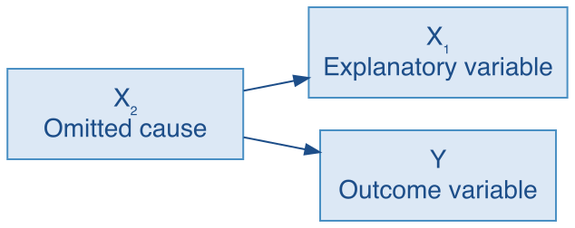
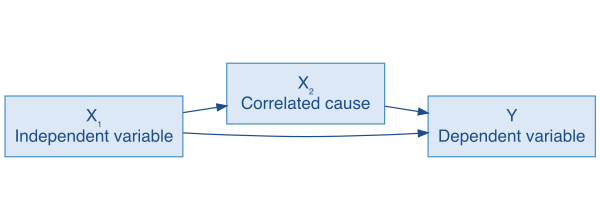

## Overview {#main-content}

Why do some people vote while others stay home? Why are some countries more democratic, prosperous, or peaceful than others? Why do some governments adopt a policy while others resist it? Each outcome may have several plausible explanations, and those explanations are often related to one another. Studying them one at a time can make it difficult to tell which relationships remain once the others are taken into account.

This tutorial introduces **multiple regression**, which estimates the relationship between each predictor and the outcome while holding the other predictors in the model constant. It extends the simple regression framework from Tutorial 15: the R mechanics change very little, but interpreting the coefficients requires new reasoning.

In this tutorial you will learn:

* How to estimate a multiple regression model using `lm()` by adding predictors with `+` in the formula
* How to interpret coefficients in a multiple regression, including the "all else equal" qualifier that changes meaning compared to simple regression
* How to choose which variables to include and why, including the logic of controlling for competing explanations
* How to interpret the slope on a nominal variable with three or more categories, using `factor()` and `relevel()`
* How to center a continuous predictor so that the intercept describes a typical case rather than one outside the data
* How to assess model fit using the Multiple $R^2$ for the share of variation explained and the residual standard error for the spread of the residuals, and when to prefer the Adjusted $R^2$ --- comparing models with different numbers of predictors
* How to present a fitted model in a publication-style table with `stargazer()`

::: {.important-note}
**Before you begin.** This tutorial follows the reading **Multiple Regression**, which sets out why controlling for other variables is necessary and what including one does and does not buy you. Read it before working through this tutorial: [open the reading](qpa-readings/MultipleRegression.html){target="_blank"} in a new tab, or run `open_reading("multiple-regression")` in the R console.
:::

```{r setup, include=FALSE}
# Make the packaged readings reachable from inside the tutorial
local({
  readings <- system.file("readings", package = "QPATutorialsCourse")
  if (nzchar(readings)) shiny::addResourcePath("qpa-readings", readings)
})
library(learnr)
library(gradethis)
library(stargazer)
tutorial_options(exercise.checker = gradethis::grade_learnr,
                 exercise.completion = FALSE)
options(lifecycle_verbosity = "quiet")
knitr::opts_chunk$set(error = TRUE)
data("counties", package = "QPATutorialsCourse")
data("qog", package = "QPATutorialsCourse")
data("ipu", package = "QPATutorialsCourse")
ipu$electoral_f <- factor(ipu$electoral_system,
                          levels = c("plurality_majority",
                                     "proportional_representation",
                                     "mixed_system"),
                          labels = c("Plurality/Majority", "Proportional", "Mixed"))
ipu$quota_f <- factor(ipu$gender_quota, levels = c(FALSE, TRUE),
                      labels = c("No quota", "Quota"))
ipu$years_c <- ipu$years_since_first_woman -
               mean(ipu$years_since_first_woman, na.rm = TRUE)
qog$democ <- dplyr::case_when(
  qog$fh_ipolity2 < 4  ~ 0,
  qog$fh_ipolity2 > 6  ~ 2,
  TRUE                  ~ 1
)
qog$democ_f <- factor(qog$democ, labels = c("Autocracy", "Partial Democracy", "Democracy"))
model_gov <- lm(wbgi_cce ~ wdi_fertility + ipu_l_sw + democ_f, data = qog)
model_gov_dem <- lm(wbgi_cce ~ wdi_fertility + ipu_l_sw + relevel(democ_f, ref = "Democracy"), data = qog)
model1 <- lm(dem2p_percent ~ mortality_risk_25_45 + wage_growth + college_grad_percent + hispanic_percent + white_percent + Black_percent, data = counties)
model_simple <- lm(dem2p_percent ~ wage_growth, data = counties)
```

## Why Control for Other Variables?

Before running a model, it is worth being clear about why [multiple regression]{.important-text} exists in the first place. There are two central reasons to include additional variables in an additive multiple-regression model. A third possibility --- conditional relationships, where the association between one variable and the outcome depends on the level of another --- requires an interaction term rather than simply adding a variable, and will be introduced in Tutorial 18.

**Spurious relationships.** Sometimes two variables are associated only because a third is related to both, and there is no relationship between them at all. Counties with more coffee shops per person gave Hillary Clinton a higher share of the vote. Nothing about a coffee shop changes how anyone votes --- both are consequences of population density, and dense places differ from sparse ones in ways that matter for elections. Control for density and the coffee-shop association disappears. Not merely shrinks: disappears once density is held constant, because the original association came from their shared relationship with density. A third variable that produces an association like this is called a [confounder]{.important-text}, and the distortion it produces is confounding.

```{r diagram-spurious, echo=FALSE, out.width="46%", fig.align="center", fig.alt="A path diagram with three boxes. A box labeled X2, omitted cause, sits at the left with one arrow to a box labeled X1, explanatory variable, at the upper right, and a second arrow to a box labeled Y, outcome variable, at the lower right. No arrow runs between X1 and Y."}

```

**Multiple correlated causes.** More often the bivariate estimate is wrong about its size. Most political and social outcomes have several causes, and the variables representing them are correlated with one another: counties with more college graduates tend to have higher wage growth and lower mortality risk. Regress the vote on wage growth alone and the slope absorbs differences that are also associated with education and health. Controlling for them does not make the wage-growth relationship vanish --- it changes its magnitude, because the estimate is no longer carrying those other characteristics of the same counties. This is [omitted variable bias]{.important-text}, and it is the main reason you will almost never see a published regression with only one predictor.

```{r diagram-correlated, echo=FALSE, out.width="70%", fig.align="center", fig.alt="A path diagram with three boxes. A box labeled X1, explanatory variable, at the left has an arrow to a box labeled X2, correlated cause, above centre, which in turn has an arrow to a box labeled Y, outcome variable, at the right. A second arrow runs directly from X1 to Y."}

```

The remedy in both cases is the same: include the relevant variables in the model. Once you do, each coefficient is estimated holding the other variables constant. That is the meaning of the phrase you will see throughout this tutorial: **controlling for all other variables in the model**, or equivalently, [all else equal]{.important-text}.

::: {.caution}
**Controlling for variables reduces some alternative explanations but does not eliminate them.** Multiple regression holds measured variables constant, which is more informative than a simple bivariate association --- but it cannot guarantee that all relevant differences between cases have been accounted for. Variables not included in the model may still distort the relationships we estimate. Causal conclusions require a research design and assumptions that justify them; regression coefficients alone describe partial associations among the variables included in the model. Throughout this tutorial, estimates are described as relationships and associations, not causes.
:::

## Do Voters Reward the Incumbent Party for Economic Growth, Controlling for Other County Characteristics?

Does the association between local economic conditions and presidential voting hold up once we account for other features of counties that might be related to both? A simple regression of Clinton's two-party vote percent on wage growth --- the kind you estimated in Tutorial 15 --- finds a positive association, consistent with retrospective voting theory. But counties with higher wage growth also tend to have higher education levels, lower mortality risk, and different racial compositions. We include these variables because each is plausibly related to both local economic conditions and presidential voting and may therefore contribute to the bivariate association. This example tests whether the wage-growth association holds up once those other characteristics are controlled for.

::: {.hypothesis}
In a comparison of [counties], those with [higher economic growth] will tend to have [a higher vote share for the incumbent party] than will those with [lower economic growth].
:::

The data frame **counties** contains **wage_growth**, the percent by which wages grew or fell in a county between the third quarter of 2015 and the third quarter of 2016, and **dem2p_percent**, the percent of the two-party vote cast for Hillary Clinton in the November 2016 election. Every variable in **counties** describes the county as of 2016. Both variables are already measured in percentage points, so a one-unit increase in either is a one-percentage-point increase --- wage growth moving from 4% to 5%, for example --- not a one-percent relative increase on top of whatever the value already was. These sound similar but mean very different things, and the distinction matters when you interpret the estimated association.

Missing values are few but not zero. Of the 3,112 counties, **dem2p_percent** has none; **wage_growth** and **Black_percent** are each missing for 2; **mortality_risk_25_45**, **college_grad_percent**, **hispanic_percent** and **white_percent** for 1 each. A regression uses only the counties with a recorded value on every variable in the model --- here 3,108 of the 3,112, since several of those gaps fall in the same counties.

The other variables we include as controls are **mortality_risk_25_45**, **college_grad_percent**, **hispanic_percent**, **white_percent**, and **Black_percent**. Each was chosen because it is plausibly related to both local economic conditions and presidential voting. That combination is what can make a variable a relevant control: if counties with higher wage growth also have more college graduates, and college attainment independently predicts the vote, then the simple two-variable slope on wage growth is partly measuring education.

### Estimate the Regression

Before estimating the full model, run the model below with wage growth alone. Note the slope on **wage_growth**, the intercept, and the $R^2$ --- if the confounders are doing real work, all three will change when we add them.

**Run and observe 1: The simple regression baseline**

```{r exercise-simple-baseline, exercise=TRUE, exercise.cap="Run and observe 1"}
model_simple <- lm(dem2p_percent ~ wage_growth, data = counties)
summary(model_simple)
```

The output shows a slope of 0.456 on **wage_growth**. The simple slope combines the wage-growth association with any overlapping associations involving omitted county characteristics. Adding theoretically relevant controls lets us see how much the wage-growth coefficient changes when those measured differences are held constant. The $R^2$ of about 0.017 also shows how little of the vote's variation this single variable captures; you will see whether the full model accounts for substantially more of the variation in Clinton's vote.

Now add the controls. The `lm()` formula extends naturally to multiple predictors: where you previously wrote `outcome ~ predictor`, you now write `outcome ~ predictor1 + predictor2 + predictor3`, listing each variable separated by a `+`. Everything else stays the same: the `data =` argument, the assignment to a named object, and the call to `summary()`. The formula is written across multiple lines --- R allows you to break a call anywhere after a comma or `+` operator, and continue on the next line. This keeps long formulas readable without horizontal scrolling, and is good practice whenever a formula has more than two or three variables.

**Run and observe 2: Regress Clinton's two-party vote percent on wage growth and county characteristics**

```{r exercise-multipleregression-clintonvote, exercise=TRUE, exercise.cap="Run and observe 2"}
model1 <- lm(dem2p_percent ~ mortality_risk_25_45 + wage_growth +
               college_grad_percent + hispanic_percent +
               white_percent + Black_percent,
             data = counties)
summary(model1)
```

Take a moment to look at the output before moving on. Find the `Coefficients` table and locate each variable by name. Notice that the output structure is identical to simple regression --- there is one row per variable plus a row for the intercept, each with an estimate, standard error, t-statistic, and p-value. The only thing that has changed is the number of rows.


### Interpret the Coefficients

The key interpretive rule is the same as in simple regression: the slope gives the expected change in the outcome for a one-unit increase in the predictor. The crucial difference in multiple regression is what comes after: **controlling for all other variables in the model**. Every coefficient is now a [partial slope]{.important-text} --- the estimated change in the outcome for a one-unit increase in that predictor while the other predictors are held constant.

The model includes six predictors, but the interpretation below focuses on the three most directly tied to the hypothesis --- **wage_growth**, **mortality_risk_25_45**, and **college_grad_percent**. The racial-composition variables serve primarily as controls; their coefficients follow the same interpretive logic but are not the focus of this example.

That qualifier matters more than it might seem. Without controls, the simple regression of the incumbent party's vote share on **wage_growth** alone yields a larger slope. In this model it is smaller, and the reason is worth spelling out. Counties with higher wage growth also tend to have more college graduates and lower mortality risk, and those characteristics predict the vote on their own. The bivariate slope had no way to separate them, so it credited wage growth with all of it. Adding the controls compares counties that are alike on education and health, which gives the association between wage growth and vote share among counties alike on those measured characteristics. Find the slope on **wage_growth** and see for yourself what controlling for the other variables does to it.

**Apply 3: Interpret the slope on wage_growth**

```{r quiz-interpret-wagegrowth, echo=FALSE}
question("Look at the slope on **wage_growth** in your output. Which statement correctly gives its value and what it means?",
  correct = "Right: holding all other variables constant, a one-percentage-point increase in wage growth predicts a 0.314-percentage-point increase in Clinton's percent of the two-party vote.",
  answer("The slope is 0.314; among counties alike on the other predictors, a one-percentage-point increase in wage growth predicts about a 0.31-point rise in Clinton's two-party vote percent",
         correct = TRUE,
         message = "The coefficient on wage growth is smaller than it appeared without controls. Some of what looks like a wage growth association overlaps with correlated county characteristics --- education levels, racial composition, mortality risk --- that also shape the vote."),
  answer("The slope is 0.039; for every one-percentage-point increase in wage growth, Clinton's percent of the two-party vote is expected to increase by about 0.04 percentage points, controlling for other variables",
         message = "0.039 is the standard error of the slope, not the slope itself. The Estimate column gives the slope; the Std. Error column measures the uncertainty around that estimate. Always read the coefficient from the Estimate column."),
  answer("The slope is 0.314; for every one-percentage-point increase in Clinton's percent of the two-party vote, wage growth is expected to increase by about 0.31 percentage points, controlling for other variables",
         message = "This reverses the outcome and predictor variables. The slope tells us the expected change in **dem2p_percent** for a one-unit change in **wage_growth**, not the other way around."),
  answer("The slope is 0.314; this is the expected percent of the two-party vote for Hillary Clinton in a county with zero wage growth, holding all other variables constant",
         message = "That would be the intercept's job, not the slope's. The slope gives the expected change in the outcome for a one-unit change in the predictor, not the expected level of the outcome at any particular value."),
  allow_retry = TRUE,
  random_answer_order = TRUE,
  try_again = "The slope gives the expected change in the outcome for a one-unit increase in the predictor, holding all other variables constant. Look at the **wage_growth** row in the Coefficients table."
) 
```

Now consider **mortality_risk_25_45**, the probability of dying between ages 25 and 45, expressed as a percent of the population in that age range.

**Apply 4: Interpret the slope on mortality_risk_25_45**

Look at your Coefficients table before answering. Mortality risk is measured in percentage points, like the outcome.

```{r quiz-interpret-mortality, echo=FALSE}
question("Which statement correctly gives the value and meaning of the slope on **mortality_risk_25_45**?",
  correct = "Right: holding all other variables constant, a one-percentage-point increase in mortality risk predicts a 3.117-percentage-point decrease in Clinton's percent of the two-party vote.",
  answer("The slope is -3.117; for every one-percentage-point increase in mortality risk, Clinton's percent of the two-party vote is expected to decrease by about 3.12 percentage points, controlling for all other variables in the model",
         correct = TRUE,
         message = "The negative sign matches the hypothesis: counties where more young adults are dying show lower support for the incumbent party, even after controlling for wage growth, education, and racial composition."),
  answer("The slope is -3.117; for every one-percentage-point increase in Clinton's percent of the two-party vote, mortality risk is expected to decrease by about 3.12 percentage points, controlling for all other variables",
         message = "This reverses the outcome and predictor variables. The slope tells us the expected change in **dem2p_percent** for a change in **mortality_risk_25_45**, not the reverse."),
  answer("The slope is -3.117; this is the expected percent of the two-party vote for Hillary Clinton in a county with zero mortality risk, holding all other variables constant",
         message = "That would be the intercept's job, not the slope's. The slope gives the expected change in the outcome for a one-unit change in the predictor, not the expected level of the outcome at any particular value."),
  answer("The slope is 0.302; for every one-percentage-point increase in mortality risk, Clinton's percent of the two-party vote is expected to decrease by about 0.30 percentage points, controlling for all other variables",
         message = "0.302 is the standard error of the slope, not the slope itself. The Estimate column gives the slope; the Std. Error column measures the uncertainty around that estimate."),
  allow_retry = TRUE,
  random_answer_order = TRUE,
  try_again = "Look at the Estimate column in the **mortality_risk_25_45** row. The slope gives the expected change in Clinton's percent of the two-party vote for a one-percentage-point increase in mortality risk, controlling for all other variables."
)
```

Now consider **college_grad_percent**, the percent of county residents with a college degree.

**Apply 5: Interpret the slope on college_grad_percent**

Look at your Coefficients table before answering, and note the sign.

```{r quiz-interpret-college, echo=FALSE}
question("Which statement correctly gives the value and meaning of the slope on **college_grad_percent**?",
  correct = "Right. Holding all other variables constant, a one-percentage-point increase in the county's college graduation rate predicts a 0.646-percentage-point increase in Clinton's two-party vote.",
  answer("The slope is 0.646; for every one-percentage-point increase in the county's college graduation rate, Clinton's percent of the two-party vote is expected to increase by about 0.65 percentage points, controlling for all other variables in the model",
         correct = TRUE,
         message = "Each partial slope tells you the expected change in the outcome for a one-unit increase in that variable, holding everything else constant. With a positive slope, counties with higher college graduation rates gave Clinton a higher share of the two-party vote, controlling for mortality risk, wage growth, and racial composition."),
  answer("The slope is 0.646; for every one-percentage-point increase in Clinton's percent of the two-party vote, the county's college graduation rate is expected to increase by about 0.65 percentage points, controlling for all other variables",
         message = "This reverses the outcome and predictor variables. The slope tells us the expected change in **dem2p_percent** for a change in **college_grad_percent**, not the reverse."),
  answer("The slope is 24.517; for every one-percentage-point increase in the county's college graduation rate, Clinton's percent of the two-party vote is expected to increase by about 24.5 percentage points, controlling for all other variables",
         message = "24.517 is the t-statistic, not the coefficient estimate. Look at the Estimate column, not the t value column."),
  answer("The slope is 0.646; for every one-percentage-point increase in the county's college graduation rate, Clinton's percent of the two-party vote is expected to increase by about 0.65 percentage points, regardless of other county characteristics",
         message = "The 'controlling for all other variables' qualifier is essential to the interpretation of a partial slope. Omitting it implies the slope describes a marginal effect without any controls, which is what a simple regression coefficient would give --- not a multiple regression coefficient."),
  allow_retry = TRUE,
  random_answer_order = TRUE,
  try_again = "Look at the Estimate column in the **college_grad_percent** row. The slope gives the expected change in Clinton's percent of the two-party vote for a one-percentage-point increase in the college graduation rate, controlling for all other variables."
)
```

The remaining variables --- **hispanic_percent**, **white_percent**, and **Black_percent** --- follow the same interpretive logic. Each slope gives the expected change in the outcome for a one-percentage-point increase in that group's share of the county population, holding all other variables constant.

### How Large Are the Effects?

Reading a slope tells you the expected change in the outcome for a one-unit increase in that predictor. But whether that difference is large or small in practice depends on the scale of the variable --- specifically, what a one-unit difference actually represents relative to the variation we observe in the data. A slope of 0.314 could be enormous or trivial depending on whether typical variation in that variable spans 1 unit or 100 units.

A slope is commonly called the [effect]{.important-text} of its predictor --- the expected change in the outcome for a one-unit increase in that predictor, holding the others constant. As with *predictor* and *predicts*, the word is used in this statistical sense and does not by itself say that one variable causes the other. The standard deviation is a natural anchor for gauging the size of an effect: it gives a common benchmark for comparing slopes measured on very different scales. A one-standard-deviation difference is a substantial one without being extreme. For any increase of size $c$, the predicted change in the outcome is $c \times \hat{\beta}$ --- the same multiplication Tutorial 15 uses to compute predicted values. This gives you a general recipe to follow whenever you want to assess the practical significance of regression coefficients: calculate the standard deviation of each predictor, choose $c$ as one standard deviation (or a round number close to it), and compute $c \times \hat{\beta}$ for each variable. Run the code below to get the standard deviations of the three focal variables.

**Run and observe 6: Standard deviations of the three focal variables**

```{r exercise-sds-clintonvote, exercise=TRUE, exercise.cap="Run and observe 6"}
sd(counties$wage_growth, na.rm = TRUE)
sd(counties$mortality_risk_25_45, na.rm = TRUE)
sd(counties$college_grad_percent, na.rm = TRUE)
```

The output shows standard deviations of about 4.7, 0.9, and 9.1 percentage points respectively. For **wage_growth**, one standard deviation is about 4.7 percentage points. With a slope of 0.314, the predicted change in the incumbent party's vote share for a one-standard-deviation increase in wage growth is 4.7 × 0.314 = 1.48 percentage points --- a modest association. Now apply the same recipe to the other two variables.

**Apply 7: Scale the mortality risk slope to one standard deviation**

The standard deviation of **mortality_risk_25_45** is about 0.9 percentage points. Find the slope in your output and apply the same recipe before answering.

```{r quiz-predict-mortality, echo=FALSE}
question("What change in Clinton's percent of the two-party vote does the model predict for a 0.9-percentage-point increase in mortality risk --- one standard deviation --- controlling for all other variables?",
  correct = "Right: 0.9 * (-3.117) = -2.805.",
  answer("A decrease of about 2.81 percentage points",
         correct = TRUE,
         message = "A one-standard-deviation increase in mortality risk predicts a decrease of about 2.8 percentage points in Clinton's two-party vote, controlling for wage growth, education, and racial composition --- a meaningfully larger association than the wage growth result."),
  answer("A decrease of about 3.12 percentage points",
         message = "That is the slope itself --- the expected change for a full one-percentage-point increase, which exceeds one standard deviation. Multiply by the standard deviation: 0.9 * (-3.117) = -2.805."),
  answer("An increase of about 2.81 percentage points",
         message = "The slope on **mortality_risk_25_45** is negative, so higher mortality risk predicts lower Clinton two-party vote percent, not higher."),
  answer("A decrease of about 1.56 percentage points",
         message = "Check your value of c. The standard deviation is 0.9, not 0.5: 0.9 * (-3.117) = -2.805."),
  allow_retry = TRUE,
  random_answer_order = TRUE,
  try_again = "Multiply the slope on mortality risk by the size of the increase. Watch the sign."
)
```

**Apply 8: Scale the college attainment slope to one standard deviation**

The standard deviation of **college_grad_percent** is about 9 percentage points. A round increment of 10 is close to one standard deviation and easy to interpret. Find the slope in your output and apply the same recipe before answering.

```{r quiz-predict-college, echo=FALSE}
question("What change in Clinton's percent of the two-party vote does the model predict for a 10-percentage-point increase in the county's college graduation rate, controlling for all other variables?",
  correct = "Right: 10 * 0.646 = 6.46.",
  answer("An increase of about 6.46 percentage points",
         correct = TRUE,
         message = "A 10-percentage-point increase in the college graduation rate --- close to one standard deviation --- predicts an increase of about 6.5 percentage points in Clinton's two-party vote, controlling for everything else. That is roughly four times the association of a one-standard-deviation shift in wage growth, and about twice the association of a one-standard-deviation shift in mortality risk."),
  answer("An increase of about 0.65 percentage points",
         message = "That is the slope itself --- the expected change for a one-percentage-point increase. Multiply by c = 10: 10 * 0.646 = 6.46."),
  answer("An increase of about 64.6 percentage points",
         message = "Check your multiplication: 10 * 0.646 = 6.46, not 64.6. The slope is 0.646, not 6.46."),
  answer("A decrease of about 6.46 percentage points",
         message = "The slope on **college_grad_percent** is positive, so higher college graduation rates predict higher Clinton two-party vote percent, not lower."),
  allow_retry = TRUE,
  random_answer_order = TRUE,
  try_again = "Multiply the slope on college attainment by the size of the increase."
)
```

Comparing across all three: a one-standard-deviation increase in college attainment predicts about four times the change in the incumbent party's vote share produced by a one-standard-deviation increase in wage growth, and about twice the change produced by a one-standard-deviation increase in mortality risk. Of the three focal predictors, a one-standard-deviation difference in education corresponds to the largest predicted change in Clinton's vote --- a comparison that is only possible once each coefficient is scaled to a comparable unit of variation.

### Conduct Hypothesis Tests

The coefficients tell us the direction and size of each estimated association; hypothesis tests tell us whether those associations are statistically distinguishable from zero in the population. For each coefficient, we test $H_0: \beta = 0$ (the variable has no association with the outcome in the population, holding all other variables constant) against $H_A: \beta \ne 0$. The 1.96 shortcut from Tutorial 15 applies here: with over 3,100 counties the approximation is exact to two decimals, so a t-statistic beyond about 1.96 in absolute value corresponds to a p-value below .05. The model output is reproduced here so you do not need to scroll back.

```{r model1-output-reference-tests, echo=FALSE, comment=NA}
summary(model1)
```

**Apply 9: Test and interpret the wage_growth coefficient**

Find the t-statistic and p-value for the slope on **wage_growth** in your output before answering.

```{r quiz-hypothesistesting-clintonvote, echo=FALSE}
question("Which statements are true? Select all that apply.",
  correct = "Right. The evidence is consistent: we reject the null hypothesis that wage growth has no relationship with Clinton's percent of the two-party vote, controlling for the other county characteristics.",
  answer("The p-value is less than .05, so we reject the null of no relationship",
         correct = TRUE,
         message = "The data provide strong evidence against a zero relationship between wage growth and Clinton's two-party vote percent, even after accounting for correlated county characteristics."),
  answer("The t-statistic leads to the same conclusion as the p-value",
         correct = TRUE,
         message = "The t-statistic and p-value always agree for the same two-tailed test, since both are built from the same estimate and standard error."),
  answer("The significant result proves that wage growth caused counties to shift toward Clinton in 2016",
         message = "A significant coefficient tells us the relationship would be unlikely if the population slope were zero. It does not establish causation --- counties with higher wage growth may also differ in other unmeasured ways that drive the vote."),
  answer("A p-value below .05 means there is less than a 5% probability that the null hypothesis is true",
         message = "The p-value gives the probability of observing a result this extreme *if the null were true*, not the probability that the null is true. A small p-value means the data would be surprising under the null --- not that the null is probably false."),
  allow_retry = TRUE,
  random_answer_order = TRUE,
  try_again = "Make sure to select all true statements."
)
```

**Apply 10: Test the slope on mortality_risk_25_45**

Find the t-statistic and p-value for mortality risk in your output before answering.

```{r quiz-hypothesistesting-mortality, echo=FALSE}
question("What can you conclude from the hypothesis test on **mortality_risk_25_45**?",
  correct = "Right. We reject the null hypothesis --- counties with higher mortality risk show significantly lower support for Clinton, controlling for the other variables.",
  answer("The p-value is far below .05, so we reject the null of no relationship",
         correct = TRUE,
         message = "The negative slope (-3.117) is large in practical terms and highly significant. Even after controlling for wage growth, education, and racial composition, counties where more young adults are dying show substantially lower support for Clinton."),
  answer("We fail to reject the null hypothesis because the slope is negative",
         message = "The sign of the coefficient has nothing to do with statistical significance. What matters is the coefficient relative to its standard error --- a large negative coefficient can be just as significant as a large positive one."),
  answer("The p-value is far below .05, so we fail to reject the null hypothesis",
         message = "It is the other way around: a p-value below .05 is evidence against the null, which leads you to reject it. We fail to reject the null only when the p-value is above .05 --- meaning the data would not be surprising if the null were true."),
  answer("A significant result for mortality risk means wage growth is no longer a statistically significant predictor in this model",
         message = "Each coefficient has its own separate hypothesis test. A significant result for mortality risk tells us that variable has a relationship with the outcome --- it says nothing about whether other predictors are significant. Look at the p-value for **wage_growth** separately."),
  allow_retry = TRUE,
  random_answer_order = TRUE,
  try_again = "Find the t-statistic and p-value for **mortality_risk_25_45**. Apply the same decision rule as always: if p < .05, reject the null."
)
```

**Apply 11: Test the hypothesis for college_grad_percent**

Find the t-statistic and p-value for college_grad_percent in your output before answering.

```{r quiz-test-college, echo=FALSE}
question("What can you conclude from the hypothesis test on **college_grad_percent**?",
  correct = "Right: a large t-statistic and a very small p-value lead to rejecting the null hypothesis.",
  answer("The p-value is far below .05, so we reject the null of no relationship, controlling for the other predictors",
         correct = TRUE,
         message = "With over 3,100 counties, the estimate is a precise one, and the coefficient implies a substantial difference in predicted vote share across the observed range of college attainment."),
  answer("We fail to reject the null hypothesis because the **college_grad_percent** coefficient is smaller than 1",
         message = "The size of the coefficient alone does not determine statistical significance. What matters is the coefficient relative to its standard error --- a small coefficient with a tiny standard error can be highly significant."),
  answer("The p-value is far below .05, but the t-statistic points the other way, so the two tests disagree and we cannot draw a conclusion",
         message = "The t-statistic and p-value cannot disagree. They are two expressions of the same test, built from the same estimate and the same standard error, so they always point to the same conclusion."),
  answer("We reject the null hypothesis, which proves that higher college attainment caused counties to vote for Clinton",
         message = "Rejecting the null tells us the relationship would be unlikely if the population slope were zero. It does not establish causation --- counties with more college-educated residents may differ in many other ways that also shape the vote."),
  allow_retry = TRUE,
  random_answer_order = TRUE,
  try_again = "Find the p-value for **college_grad_percent** and apply the decision rule: if p < .05, reject the null."
)
```

### Assess Model Fit

The individual coefficients tell us about each predictor's partial relationship with the outcome. But how much of the county-to-county variation in Clinton's vote does this six-variable model actually account for --- and how does that compare to the near-zero fit we saw in Tutorial 15 with wage growth alone? The model output is reproduced here so you do not need to scroll back.

```{r model1-output-reference, echo=FALSE, comment=NA}
summary(model1)
```

The model output reports two versions of $R^2$. The [Multiple R-squared]{.important-text} ($R^2$) has the cleanest interpretation: it is the proportion of the variation in the outcome that the model explains, expressed as a percentage. An $R^2$ of 0.607 means the model explains about 60.7% of the county-to-county variation in Clinton's two-party vote --- the remaining 39.3% is variation the model does not capture.

The [Adjusted R-squared]{.important-text} is a corrected version that penalizes for the number of predictors. Every variable you add to a regression model, even a useless one, will mechanically increase the Multiple $R^2$ at least a tiny bit, just because the model has more flexibility to fit the data. The Adjusted $R^2$ subtracts a penalty that grows with the number of predictors, making it less likely to increase unless an added variable genuinely improves fit. In this model the two values are nearly identical --- 0.607 and 0.606 --- because with over 3,100 counties and only six predictors, the penalty is tiny.

For describing how well a model fits, use the Multiple $R^2$ --- it gives the clean "percentage of variation explained" interpretation. Reserve the Adjusted $R^2$ for one specific purpose: comparing models that differ in the number of predictors, where the Multiple $R^2$ would mechanically favor the model with more variables regardless of whether they are genuinely useful.

You have already seen the comparison this matters for. In Run and observe 1 you estimated `model_simple`, with wage growth as the only predictor, and its Multiple $R^2$ was 0.017. This model has six predictors and a Multiple $R^2$ of 0.607. Because the two differ in the number of predictors, the Adjusted $R^2$ is the fairer comparison: 0.017 against 0.606. One condition on any such comparison: the models must be fitted to the same outcome and the same cases, since a different set of dropped observations would change both figures for reasons that have nothing to do with the predictors. Here both tell the same story, since the added variables are doing real work --- but had they been useless, the Multiple $R^2$ would still have risen while the Adjusted $R^2$ would not.

The [residual standard error]{.important-text} complements $R^2$ by giving the estimated standard deviation of the residuals --- the typical distance between observed outcomes and the fitted regression line. Under roughly normal errors, about two-thirds of cases have an observed value within one residual standard error of their fitted value.

**Apply 12: Assess the fit of the model**

Find the Multiple R-squared and residual standard error in your output before answering.

```{r quiz-modelfit-clintonvote, echo=FALSE}
question("Which statement correctly describes what the model fit statistics tell us?",
  correct = "Right. The Multiple R-squared gives the percentage of variation explained, and the residual standard error gives the estimated standard deviation of the residuals.",
  answer("The Multiple R-squared of 0.6066 means the model explains about 60.7% of the variation, and the residual standard error of 10.13 is the typical miss",
         correct = TRUE,
         message = "Under roughly normal errors, about two-thirds of counties fall within about 10.13 percentage points of their predicted value. Compare this to the simple regression of Clinton's vote on wage growth alone, which explained only about 1.7% of the variation. Adding the other county characteristics dramatically improves the model's fit."),
  answer("The model explains about 60.66% of the county-to-county variation in Clinton's two-party vote, and the model's predictions are off by exactly 10.13 percentage points for every county",
         message = "The residual standard error is not a fixed error for every prediction. It is the standard deviation of the residuals --- under roughly normal errors, it tells us that about two-thirds of predictions are within about 10 points, not all of them."),
  answer("The Adjusted R-squared of 0.6058 tells us the model explains about 60.58% of the variation in Clinton's two-party vote",
         message = "The Adjusted R-squared penalizes for the number of predictors and does not have the clean 'percentage of variation explained' interpretation. For that, use the Multiple R-squared of 0.6066."),
  answer("The Multiple R-squared of 0.6066 tells us that wage growth alone explains about 60.66% of the variation in Clinton's two-party vote",
         message = "This model has six predictors, not just wage growth. The Multiple R-squared reflects the combined explanatory power of all six variables together."),
  allow_retry = TRUE,
  random_answer_order = TRUE,
  try_again = "Which statistic gives the clean 'percentage of variation explained' interpretation, and what does the residual standard error tell you?"
)
```

### What We Learned About Economic Growth and the Incumbent Party's Vote

So do voters reward the incumbent party for economic growth once we account for the other county characteristics in the model? Yes --- but the full picture is more nuanced than the simple regression suggested.

::: {.research-example}
Wage growth has a statistically significant positive relationship with the Democratic share of the two-party vote: counties where wages grew faster gave the incumbent party more of the vote, consistent with retrospective voting theory. The relationship is smaller than simple regression suggested --- controlling for education, racial composition and mortality risk, the slope shrank from 0.456 to 0.314, so part of the bivariate association overlapped with those county characteristics. Scaled to one-standard-deviation differences, college attainment has the largest estimated association at about 6.5 percentage points, against about 2.8 for mortality risk and 1.5 for wage growth. The model accounts for about 60.7% of the county-to-county variation, with a residual standard error of 10.13 percentage points. Together these suggest that long-run demographic and educational characteristics are at least as strongly associated with 2016 county voting as recent economic conditions are.
:::

## Is Democracy Associated with Control of Corruption?

Let's consider a second example using a different unit of analysis: countries. Is the level of democracy in a country associated with how well it controls corruption? The theoretical argument runs through accountability: democratic institutions create electoral incentives to punish officials who divert public resources, a free press and civil society organizations that expose wrongdoing, and independent courts that can prosecute it. All of these channels suggest that more democratic countries should, on average, control corruption better --- though we should also consider whether the relationship is linear across the full spectrum from autocracy to full democracy, or whether the gains are concentrated at the top.

::: {.hypothesis}
In a comparison of [countries], those with [higher levels of democratic governance] will tend to have [stronger control of corruption] than will those with [lower levels of democratic governance], after controlling for economic development and women's representation in the legislature.
:::

The data frame **qog** contains country-level data from multiple sources, drawn from the January 2020 cross-section of the Quality of Government Basic Dataset. Variables in that cross-section take their most recent available observation as of that release, so they are not all measured in the same year. Of the 194 countries, **wdi_fertility** is missing for 9, **wbgi_cce** for 2, **ipu_l_sw** for 1, and **fh_ipolity2** for none. The outcome variable is **wbgi_cce**, the World Bank's control of corruption score --- it runs from about -2.5 to 2.5, where higher values indicate better control of corruption. The predictors are:

- **wdi_fertility**: the total fertility rate --- the expected number of children per woman, observed from 1.17 to 7.09 --- standing in here for economic development
- **ipu_l_sw**: the percentage of seats in the national legislature held by women
- **democ_f**: a three-category factor in which **Autocracy** = lowest democracy level, **Partial Democracy** = middle, and **Democracy** = highest

The three regime categories are unevenly sized --- 47 autocracies, 20 partial democracies and 127 democracies. That matters later: the partial democracy group is small, and small groups produce imprecise estimates.

### Choosing a Reference Category

Before estimating a model with a categorical predictor, it is worth thinking about which category to use as the [reference category]{.important-text}. The choice matters because every factor coefficient measures the difference between one category and the reference category --- so the question you can answer directly depends on which category you omit. If Democracy is the reference, you can compare both Autocracy and Partial Democracy to Democracy, but you cannot directly test whether Autocracy and Partial Democracy differ from each other. If Autocracy is the reference, you get both comparisons to the lowest level --- which is usually what we want when asking whether more democracy produces better outcomes. The variable **democ_f** has already been created with three labels. Let's check which category R is treating as the reference.

**Run and observe 13: Check the levels of democ_f**

```{r exercise-levels-democ, exercise=TRUE, exercise.cap="Run and observe 13"}
levels(qog$democ_f)
```

The first level listed is the reference --- the category that will be omitted from the regression output, against which the other categories are compared. Here, **Autocracy** comes first, so it will serve as the reference. That makes sense for this question: we want to ask how much better partial democracies and full democracies control corruption compared to the baseline of autocracy.

But you should always check, and you should think about whether the default serves your question. To see why the choice matters, let's first run the model with **Democracy** as the reference instead --- so we can ask how much worse autocracies and partial democracies do compared to the democratic baseline.

To do this, we need to tell `lm()` to use Democracy as the reference category for this model only. Instead of writing just `democ_f` in the formula, we write `relevel(democ_f, ref = "Democracy")` in its place. The `relevel()` function takes two arguments: the factor variable and `ref =` naming the new reference category. The change is temporary --- it applies only to this model and does not permanently alter the variable.

::: {.caution}
**This model's output will look different from the ones you have seen.** R builds the name of a factor coefficient by gluing the variable name to the level name, so **democ_f** plus Partial Democracy becomes `democ_fPartial Democracy`. Wrapping a `relevel()` call around the variable makes it longer still: `relevel(democ_f, ref = "Democracy")Partial Democracy`. Names that wide leave no room for four columns of numbers, so `summary()` splits the coefficients table into two blocks --- `Estimate` and `Std. Error` first, then `t value` and `Pr(>|t|)` below, with the row names repeated in each. Nothing is wrong when that happens. Find the row you want in the first block for the estimate and its standard error, then find the same row name in the second block for the test statistic and p-value. The model in Practice 15 uses **democ_f** directly, with no `relevel()` call, so its names are short and its table prints in the usual single block.
:::

**Run and observe 14: Estimate the corruption model with Democracy as the reference category**

```{r exercise-multipleregression-governance-dem, exercise=TRUE, exercise.cap="Run and observe 14"}
model_gov_dem <- lm(wbgi_cce ~ wdi_fertility + ipu_l_sw +
                      relevel(democ_f, ref = "Democracy"),
                    data = qog)
summary(model_gov_dem)
```

Look at the two factor coefficients. With **Democracy** as the reference, both **Partial Democracy** (−0.667, p < .001) and **Autocracy** (−0.681, p < .001) appear significantly worse --- and at first glance, they look almost equally bad. Now let's run the model with **Autocracy** as the reference and see if that impression holds.

### Estimate the Regression

Now let's estimate the model with **Autocracy** as the reference --- which is already the default, so we write `democ_f` in the formula without any `relevel()` call. This lets us read off directly how partial democracies and full democracies compare to the autocratic baseline.

**Practice 15: Estimate the corruption model with Autocracy as the reference category**

Fill in the blanks to regress **wbgi_cce** on **wdi_fertility**, **ipu_l_sw** and **democ_f** in the **qog** data frame, assigning the model to **model_gov**, then display the results. Two hints are available. Click "Submit Answer" to check your work.

```{r exercise-multipleregression-governance, exercise=TRUE, exercise.cap="Practice 15"}
___ <- lm(___ ~ ___ + ___ + ___, data = ___)
summary(model_gov)
```

```{r exercise-multipleregression-governance-hint-1}
# Hint 1 of 2
# Look back at the hypothesis. Which variable is the outcome?
# Which variables do we think drive it? In a regression formula,
# the outcome goes on the left of ~ and the predictors go on the
# right, separated by +.
```

```{r exercise-multipleregression-governance-hint-2}
# Hint 2 of 2
# The outcome is wbgi_cce and the data frame is qog.
# You have two continuous variables and one factor variable
# as predictors. democ_f is already in the environment.
# Assign your model to model_gov, then call summary() on it.
```

```{r exercise-multipleregression-governance-check}
grade_this({
  code <- paste(.user_code, collapse = "\n")
  code_no_comments <- gsub("#[^\r\n]*", "", code)
  if (grepl("=\\s*[TF](?![A-Za-z._0-9])", code_no_comments, perl = TRUE)) {
    fail("Write `TRUE` and `FALSE` in full. R accepts `T` and `F` as shorthand, but these tutorials do not: `TRUE` and `FALSE` are reserved words and always mean what you expect, while `T` and `F` are ordinary object names that other code can overwrite --- after which an argument set to `T` or `F` quietly means something else. Replace them with `TRUE` and `FALSE` and submit again.")
  }
  if (!grepl("lm\\s*\\(", code_no_comments)) {
    fail("Use `lm()` to estimate the regression.")
  }
  if (!grepl("model_gov\\s*(<-|=)", code_no_comments)) {
    fail("Assign your model to an object called **model_gov**.")
  }
  if (!grepl("wbgi_cce\\s*~", code_no_comments)) {
    fail("The outcome variable should be **wbgi_cce** --- control of corruption is what we are trying to explain.")
  }
  if (!grepl("wdi_fertility", code_no_comments)) {
    fail("Include **wdi_fertility** as a predictor.")
  }
  if (!grepl("ipu_l_sw", code_no_comments)) {
    fail("Include **ipu_l_sw** as a predictor.")
  }
  if (!grepl("democ_f", code_no_comments)) {
    fail("Include **democ_f** as a predictor.")
  }
  if (!grepl("data\\s*=\\s*qog", code_no_comments)) {
    fail("Set `data = qog` so R knows where to find the variables.")
  }
  if (!grepl("summary\\s*\\(", code_no_comments)) {
    fail("Call `summary()` on your saved model object to display the results.")
  }
  expected <- lm(wbgi_cce ~ wdi_fertility + ipu_l_sw + democ_f, data = qog)
  if (!inherits(.result, "summary.lm")) {
    fail("The last line should display the summary. Save the model, then call `summary()` on it so the summary is what prints.")
  }
  result_coef <- setNames(.result$coefficients[, "Estimate"], rownames(.result$coefficients))
  if (is.null(result_coef)) {
    fail("Make sure you display the results by calling `summary()` on your model object.")
  }
  if (!isTRUE(all.equal(
    as.numeric(result_coef[order(names(result_coef))]),
    as.numeric(coef(expected)[order(names(coef(expected)))]),
    tolerance = 1e-6))) {
    fail("Check that your model includes **wbgi_cce** as the outcome and **wdi_fertility**, **ipu_l_sw**, and **democ_f** as predictors, using the qog data.")
  }
  pass("Correct! With Autocracy as the reference, each factor coefficient now compares a regime type against autocracies rather than against full democracies.")
})
```

### Interpret the Coefficients

The table below places both models side by side so you can compare them directly. The key question is what changes when we switch the reference category from Democracy to Autocracy --- and what that change reveals about the relationship between regime type and control of corruption. You will learn to produce tables like this with the `stargazer()` function later in this tutorial. For now, note how it differs from `summary()` output: each cell gives the coefficient with its standard error in parentheses beneath, and the stars mark significance thresholds rather than reporting p-values. A blank cell is the reference category, which has no coefficient because it is what the others are compared against. There are no t-statistics and no p-values here --- for those, and for testing a coefficient, you still go to `summary()`.

```{r governance-comparison, echo=FALSE}
stargazer(model_gov_dem, model_gov,
          type = "text",
          title = "Control of Corruption Under Two Reference Categories",
          column.labels = c("(1) Demo. ref.", "(2) Auto. ref."),
          dep.var.labels = "Control of Corruption",
          covariate.labels = c("Fertility Rate",
                               "Women in Legislature",
                               "Partial Democracy",
                               "Autocracy",
                               "Partial Democracy",
                               "Democracy"),
          no.space = TRUE,
          omit.stat = c("f", "ser"))
```

Look carefully at both columns. You can verify directly from the table which rows are identical across the two models and which differ. Look at the factor coefficients and the constants before answering.

**Apply 16: Interpret the factor coefficients**

```{r quiz-interpret-democ-governance, echo=FALSE}
question("Look at both columns in the table above. Which statements are true? Select all that apply.",
  correct = "Right: three statements correctly describe what the table shows.",
  answer("In column (2), full democracies score about 0.68 points higher on control of corruption than autocracies on average",
         correct = TRUE,
         message = "Column (2) shows the Democracy vs. Autocracy coefficient as 0.681 (p < .001). This is the comparison we wanted: how much better do full democracies control corruption relative to the autocratic baseline?"),
  answer("In column (2), the Partial Democracy coefficient is about 0.01 points and is not statistically significant",
         correct = TRUE,
         message = "This finding was invisible in column (1). When Democracy was the reference, both other categories looked nearly equally worse. Column (2) reveals that partial democracies and autocracies are statistically indistinguishable on control of corruption."),
  answer("The constant in column (2), 0.154, is the predicted score for autocracies when the other predictors are zero",
         correct = TRUE,
         message = "In column (2) the reference category is Autocracy, so the constant gives the predicted value for autocracies at X = 0. Compare to column (1): there the reference is Democracy, so the constant (0.835) gives the predicted value for full democracies at X = 0 --- a different quantity entirely."),
  answer("The constant in column (1), 0.835, gives the predicted average control of corruption score for full democracies",
         message = "The constant gives the predicted value of the outcome when all other variables are zero --- not the average for the reference category across the real data. Since full democracy is the reference in column (1), the constant is the predicted corruption score for full democracies only when fertility rate = 0 and women's representation = 0, values no country actually has."),
  answer("The choice of reference category changes the coefficients on **wdi_fertility** and **ipu_l_sw** as well as the factor rows",
         message = "Look at the Fertility Rate and Women in Legislature rows in both columns --- the values are identical. The reference category choice only affects the intercept and the factor coefficient rows, not the interval variable estimates."),
  type = "learnr_checkbox",
  allow_retry = TRUE,
  random_answer_order = TRUE,
  try_again = "Make sure to select all true statements."
)
```

### What the Reference Category Reveals

The non-significant partial democracy finding is substantively important. It suggests that the corruption advantage of democracy is not a smooth gradient --- partial democracies, which have some competitive elections but lack full civil liberties and rule of law, do not control corruption reliably better than autocracies once we account for development and women's representation. Full democracies do. This finding was completely invisible when Democracy was the reference category.

One caution about the partial democracy estimate. Only 20 countries fall in that category, against 47 autocracies and 127 democracies, and small groups produce imprecise estimates --- the standard error on that coefficient is wide enough that a moderate difference would be hard to distinguish from zero. "Not statistically distinguishable" is not the same as "identical," and with 20 cases the distinction matters.

### How Large Are the Effects?

The same recipe from Example 1 applies to the two continuous variables. Run the code below to get their standard deviations.

**Run and observe 17: Standard deviations of the continuous predictors**

```{r exercise-sds-governance, exercise=TRUE, exercise.cap="Run and observe 17"}
sd(qog$wdi_fertility, na.rm = TRUE)
sd(qog$ipu_l_sw, na.rm = TRUE)
```

The output shows standard deviations of about 1.32 children per woman for **wdi_fertility** and about 12.2 percentage points for **ipu_l_sw**. With a slope of -0.335 on the fertility rate, a one-sd difference of 1.32 gives an expected change of 1.32 × (−0.335) = −0.44 points on the corruption scale. With a slope of 0.0121 on women's representation, a one-sd difference of 12.2 gives 12.2 × 0.0121 = 0.15 points. In this fitted model a one-standard-deviation difference in development corresponds to about three times the predicted outcome difference that a one-standard-deviation difference in women's representation does --- and note that this comparison is only possible because we scaled each slope by its own variable's spread. Comparing -0.335 to 0.0121 directly would tell you nothing, since one is measured in children per woman and the other in percentage points.

The factor variable **democ_f** works differently. Its coefficients describe a discrete jump from one named category to another --- the Democracy and Partial Democracy coefficients already express the most natural comparison: how much better do those countries control corruption than autocracies, controlling for fertility and women's representation. There is no standard deviation to scale by because the variable doesn't vary continuously.

For factor variables, the right question is how large the gap is relative to the outcome's distribution. Run the code below to see the distribution of **wbgi_cce**.

**Run and observe 18: Distribution of the corruption outcome**

```{r exercise-dist-governance, exercise=TRUE, exercise.cap="Run and observe 18"}
summary(qog$wbgi_cce)
sd(qog$wbgi_cce, na.rm = TRUE)
```

The outcome ranges from about -1.81 to 2.28, with a standard deviation of about 1.0. The Democracy vs. Autocracy gap of 0.68 points is roughly two-thirds of a standard deviation --- a substantively meaningful difference, and larger than either continuous predictor contributes across a one-sd change. The Partial Democracy vs. Autocracy gap of 0.01 points is about one percent of a standard deviation --- negligible. The gains in controlling corruption are concentrated at the top of the democracy scale, not spread evenly across the spectrum.

### Conduct Hypothesis Tests

The table comparison showed us the estimates. Now let's check whether those estimates hold up to formal scrutiny --- particularly the democracy coefficient, which represents the core theoretical claim. The `summary()` output for the Autocracy-reference model is reproduced here so you can find t-statistics and p-values without scrolling back.

```{r model-gov-output-reference, echo=FALSE, comment=NA}
summary(model_gov)
```

**Apply 19: Test and interpret the Democracy coefficient**

```{r quiz-hypothesistesting-governance, echo=FALSE}
question("The output reports a separate test for each regime-type coefficient. Which statement correctly describes what those two tests show?",
  correct = "Right. The two tests point in different directions, and reading them separately is the whole point.",
  answer("Democracy differs significantly from Autocracy, but Partial Democracy does not",
         correct = TRUE,
         message = "Two coefficients, two separate tests. Full democracies control corruption significantly better than autocracies; partial democracies are not distinguishable from them."),
  answer("Because the Partial Democracy p-value is above .05, neither the Partial Democracy nor the Democracy coefficient is statistically significant",
         message = "These are two separate coefficients with separate tests. The Democracy coefficient is significant; the Partial Democracy coefficient is not. Look at them separately."),
  answer("Both coefficients are positive, so both regime types control corruption better than autocracies",
         message = "The signs alone do not settle it. The Partial Democracy coefficient is 0.014 with a p-value of 0.945 --- indistinguishable from zero. A positive estimate is not evidence of a difference unless the test says so."),
  answer("The Democracy coefficient of 0.681 means full democracies control corruption better than partial democracies",
         message = "Both coefficients are measured against the reference category, which here is Autocracy. Neither one compares full democracies with partial democracies. Reading a comparison the model did not make is the mistake this example is built to expose."),
  allow_retry = TRUE,
  random_answer_order = TRUE,
  try_again = "Look at the p-value for the Democracy coefficient. Is it above or below .05?"
)
```

### Assess Model Fit

The coefficients and tests tell us whether the relationships are statistically distinguishable from zero. How much of the variation in control of corruption across countries does this three-variable model actually capture?

**Apply 20: Assess the fit of the corruption model**

Find the Multiple R-squared and residual standard error at the foot of your output.

```{r quiz-modelfit-governance, echo=FALSE}
question("Which statement correctly describes what the model fit statistics tell us?",
  correct = "Right. The model explains a meaningful share of the variation in control of corruption, and the residual standard error is large relative to the scale of the outcome.",
  answer("The Multiple R-squared of 0.437 means the model explains about 43.7% of the variation in control of corruption across the 185 countries with complete data",
         correct = TRUE,
         message = "That is respectable explanatory power for a three-variable model, and it rests on 185 of the 194 countries --- almost the full set, so these results are not confined to a narrow subsample. But note the scale: the outcome's own standard deviation is about 1.0, so a typical miss of 0.76 is large. Most of what separates countries on corruption is not captured here."),
  answer("The Adjusted R-squared of 0.4245 tells us the model explains about 42.45% of the variation in control of corruption",
         message = "The Adjusted R-squared penalizes for the number of predictors and does not have the clean 'percentage of variation explained' interpretation. For that, use the Multiple R-squared of 0.437."),
  answer("An Adjusted R-squared of 0.4245 and a residual standard error of 0.7627 cannot both be correct for the same model, since R-squared must always equal the squared residual standard error",
         message = "These two statistics measure completely different things and there is no mathematical relationship between them. R-squared is a proportion of variance explained; the residual standard error is a standard deviation measured in the units of the outcome."),
  answer("The Multiple R-squared of 0.437 should be preferred over the Adjusted R-squared of 0.4245 for comparing models with different numbers of predictors",
         message = "It is the other way around: when comparing models with different numbers of predictors, the Multiple R-squared mechanically favors the model with more variables. The Adjusted R-squared penalizes for additional predictors and is the right measure for model comparison."),
  allow_retry = TRUE,
  random_answer_order = TRUE,
  try_again = "Which statistic gives the clean 'percentage of variation explained' interpretation, and what does the residual standard error tell you?"
)
```

### What We Learned About Democracy and Control of Corruption

So is democracy associated with control of corruption? The answer depends on what kind of democracy --- and that distinction only becomes visible once you choose the right reference category.

::: {.research-example}
The most important finding is not the significant full democracy coefficient --- it is the non-significant partial democracy finding. When Autocracy is the reference category, we can directly ask whether partial democracies control corruption better than autocracies, and in these data they are not distinguishable once we control for development and women's representation. The advantage appears concentrated among full democratic regimes. Partial democracies --- those with competitive elections but weak civil liberties and rule of law --- do not appear to control corruption meaningfully better than their autocratic counterparts, controlling for these two variables. With only 20 partial democracies in the data, that comparison is imprecisely estimated --- insufficient evidence of a difference is not evidence that there is none.
:::

## Why Do Some Countries Elect More Women Than Others?

As of August 2026, the share of seats held by women in a national legislature ran from zero to nearly 64 percent. Explaining that spread is one of the most studied questions in comparative politics, and the leading answer is institutional.

Electoral rules shape what parties can do. A proportional system lets a party balance its list, putting women in winnable positions without displacing anyone in particular. A plurality system asks the same party to nominate a woman in a particular district against a particular opponent, so identical party pressure yields fewer women. If that account is right, countries using proportional representation should elect more women than countries using plurality rules.

Two other things plausibly matter, and the model includes them as controls so that the comparison between electoral systems is not partly measuring them instead. An electoral gender quota is a deliberate intervention that changes what parties must do rather than what they are inclined to do. And representation accumulates over time, as parties build recruitment pipelines, women gain political experience, and voters grow accustomed to women as candidates --- so a parliament that has seated women for a century starts from a different place than one that seated its first in 2010.

::: {.hypothesis}
In a comparison of [countries], those [using proportional electoral systems] will tend to have [a higher percentage of women in the national legislature] than will those [using plurality electoral systems], controlling for electoral gender quotas and how long women have served in that parliament.
:::

The data frame **ipu** contains one row for each of 193 national legislatures --- the lower house where a parliament is bicameral, the single chamber where it is not. Chamber composition is current as of August 2026, when these data were collected from the Inter-Parliamentary Union.

The outcome is **women_percent**, the percentage of current members who are women, missing for 8 countries. The predictors are:

- **electoral_system**: recorded as `"proportional_representation"` (77 countries), `"plurality_majority"` (65), and `"mixed_system"` (36), with 15 countries the IPU does not place in these families set to missing
- **gender_quota**: a logical indicator, `TRUE` for the 115 countries reporting an electoral quota for women and `FALSE` for 77, with one missing
- **years_since_first_woman**: how long women have been present in that parliament, running from 5 to 119 years and complete for all 193 countries. It is derived from **first_woman_year**, the calendar year the first woman entered, which runs from 1907 to 2021

### Prepare the Variables

Neither **electoral_system** nor **gender_quota** arrives as a factor, which is deliberate: you will build both, and choose the reference category yourself.

That choice matters here in a way it did not in Example 2. Left to itself, R would order the electoral-system categories alphabetically and take **mixed_system** as the baseline, so every coefficient would report a comparison against mixed systems --- the category the hypothesis says least about. Setting **plurality_majority** first makes the coefficients answer the question we asked.

The history variable needs one further step. Running from 5 to 119, a value of zero would describe a country whose first woman entered parliament in 2026. No country is like that, and an intercept describing one is not worth reading. [Centering]{.important-text} a predictor --- subtracting its mean from every value --- moves zero to the middle of the data, so the intercept describes a typical country instead of an impossible one. The mean is 60.3 years, so a centered value of zero means a parliament that seated its first woman around 1966. Negative values are parliaments that seated their first woman more recently, positive values are ones that did so earlier --- the range runs from about -55, a first woman in 2021, to about +59, a first woman in 1907.

Centering changes nothing about a slope or about model fit. It changes only what the intercept means.

**Apply 21: Build the two factors and center the history variable**

Tutorial 15 builds a factor with `factor()` and a `labels` argument, which names the categories but leaves R to order them. Here the order matters, so `factor()` takes a second argument: `levels`, a vector of the values **as they appear in the data**, in the order you want them. The first one becomes the reference category. `labels` then supplies the printed names, in that same order.

**Example code:**

```{r factor-levels-template, exercise=FALSE, eval=FALSE}
yourdata$new_factor <- factor(yourdata$original_variable,
                              levels = c("value to use as reference",
                                         "second value",
                                         "third value"),
                              labels = c("Name for the reference",
                                         "Name for the second",
                                         "Name for the third"))
```

Create **electoral_f** from **electoral_system**, with **plurality_majority** as the first level, labeled \"Plurality/Majority\", \"Proportional\", and \"Mixed\". Create **quota_f** from **gender_quota**, labeled \"No quota\" and \"Quota\". Create **years_c** by subtracting the mean of **years_since_first_woman** from itself.

Three hints are available. Click "Submit Answer" to check your work.

```{r exercise-prepare-ipu, exercise=TRUE, exercise.cap="Apply 21"}

```

```{r exercise-prepare-ipu-hint-1}
# Hint 1 of 3
# Two ideas here. A categorical variable has one category that every
# comparison gets made against, and which one that is depends on the
# order the categories are stored in --- so the order is something you
# choose rather than something to accept. Separately, a variable is
# centered when its average has been subtracted from every value,
# which moves zero to the middle of the data.
```

```{r exercise-prepare-ipu-hint-2}
# Hint 2 of 3
# factor() takes a levels argument giving the values as they
# appear in the data, and a labels argument giving the names you
# want printed. The two must be in the same order.
# mean() takes the variable and nothing else here.
```

```{r exercise-prepare-ipu-hint-3}
# Hint 3 of 3
# Assign all three back into the data frame, so the regression
# below can find them. gender_quota is logical, so its levels
# are FALSE and TRUE, in that order.
```

```{r exercise-prepare-ipu-check}
grade_this({
  code <- paste(.user_code, collapse = "\n")
  code_no_comments <- gsub("#[^\r\n]*", "", code)
  if (grepl("=\\s*[TF](?![A-Za-z._0-9])", code_no_comments, perl = TRUE)) {
    fail("Write `TRUE` and `FALSE` in full. R accepts `T` and `F` as shorthand, but these tutorials do not: `TRUE` and `FALSE` are reserved words and always mean what you expect, while `T` and `F` are ordinary object names that other code can overwrite --- after which an argument set to `T` or `F` quietly means something else. Replace them with `TRUE` and `FALSE` and submit again.")
  }

  if (!grepl("factor\\s*\\(", code_no_comments)) {
    fail("Use `factor()` to build the two factor variables.")
  }
  if (!grepl("ipu\\$electoral_f\\s*(<-|=)\\s*factor\\s*\\(\\s*(x\\s*=\\s*)?ipu\\$electoral_system\\b", code_no_comments)) {
    fail("Build and assign in one step: `ipu$electoral_f` on the left, `factor()` applied to `ipu$electoral_system` on the right.")
  }
  if (!grepl("ipu\\$quota_f\\s*(<-|=)\\s*factor\\s*\\(\\s*(x\\s*=\\s*)?ipu\\$gender_quota\\b", code_no_comments)) {
    fail("Build and assign in one step: `ipu$quota_f` on the left, `factor()` applied to `ipu$gender_quota` on the right.")
  }
  if (!grepl("ipu\\$years_c\\s*(<-|=)\\s*ipu\\$years_since_first_woman\\s*-", code_no_comments)) {
    fail("Build and assign in one step: `ipu$years_c` on the left, and `ipu$years_since_first_woman` minus its mean on the right.")
  }
  if (!grepl("levels\\s*=", code_no_comments)) {
    fail("Pass a levels argument to `factor()` for **electoral_f**, or R will order the categories alphabetically and take mixed systems as the reference.")
  }
  if (!grepl("mean\\s*\\(", code_no_comments)) {
    fail("Centering subtracts the mean, so your code needs `mean()`.")
  }

  want_el <- factor(ipu$electoral_system,
                    levels = c("plurality_majority", "proportional_representation", "mixed_system"),
                    labels = c("Plurality/Majority", "Proportional", "Mixed"))
  want_q  <- factor(ipu$gender_quota, levels = c(FALSE, TRUE),
                    labels = c("No quota", "Quota"))
  want_yc <- ipu$years_since_first_woman - mean(ipu$years_since_first_woman, na.rm = TRUE)

  if (!identical(levels(ipu$electoral_f), levels(want_el)) ||
      !identical(as.character(ipu$electoral_f), as.character(want_el))) {
    fail("`ipu$electoral_f` does not match **electoral_system** case for case. Check the `levels` and `labels` arguments --- they must be in the same order, with plurality_majority first.")
  }
  if (!identical(levels(ipu$quota_f), levels(want_q)) ||
      !identical(as.character(ipu$quota_f), as.character(want_q))) {
    fail("`ipu$quota_f` does not match **gender_quota** case for case. FALSE takes the first label and TRUE the second.")
  }
  if (!isTRUE(all.equal(as.numeric(ipu$years_c), as.numeric(want_yc), tolerance = 1e-6))) {
    fail("`ipu$years_c` is not **years_since_first_woman** centered at its own mean.")
  }

  pass("Correct. Plurality/Majority is the reference category, each label sits on the right category, and **years_c** is centered at its mean of 60.3 years. The next exercise checks all three so you can see it for yourself.")
})
```

**Run and observe 22: Check the three variables**

Getting `levels` and `labels` out of step attaches the right names to the wrong categories, and nothing about the output announces the mistake. `table(original, new_factor)` cross-tabulates the two and shows which original value became which label --- a simpler function than the `CrossTable()` you used in Tutorial 7, and the right tool when all you need is the mapping.

Run the three checks below and read the output against what follows.

```{r exercise-check-ipu, exercise=TRUE, exercise.cap="Run and observe 22"}
levels(ipu$electoral_f)

table(ipu$electoral_system, ipu$electoral_f)

mean(ipu$years_c, na.rm = TRUE)
```

`levels()` should print Plurality/Majority first --- that is the reference category, the one every comparison in the model will be made against.

The cross-tab has the original values down one side and your labels across the other. If every category was labeled correctly, each count sits on the diagonal and every off-diagonal cell is zero: the 65 countries stored as plurality_majority all appear under Plurality/Majority and nowhere else. A non-zero cell off the diagonal means a label landed on the wrong category, which is what happens when `levels` and `labels` are given in different orders.

The mean of **years_c** should be zero, or something like `-2.1e-16`. Floating-point arithmetic rarely lands exactly on zero, and a number that small is zero for practical purposes.


### Estimate the Regression

**Practice 23: Regress women's representation on electoral system, quotas, and history**

Write the code from scratch to regress **women_percent** on **quota_f**, **electoral_f** and **years_c** in the **ipu** data frame, assigning the model to **model4**, then display the results. Two hints are available. Click "Submit Answer" to check your work.

```{r exercise-multipleregression-ipu, exercise=TRUE, exercise.cap="Practice 23"}

```

```{r exercise-multipleregression-ipu-hint-1}
# Hint 1 of 2
# Look back at the hypothesis. Which variable is the outcome
# you are trying to explain, and which three are the predictors?
# The outcome goes on the left of ~; predictors go on the right,
# separated by +.
```

```{r exercise-multipleregression-ipu-hint-2}
# Hint 2 of 2
# The structure is the same as Examples 1 and 2: lm() with a
# formula and a data argument, assigned to a named object, then
# passed to summary(). Use the factors and the centered variable
# you just built, not the originals.
```

```{r exercise-multipleregression-ipu-check}
grade_this({
  code <- paste(.user_code, collapse = "\n")
  code_no_comments <- gsub("#[^\r\n]*", "", code)
  if (grepl("=\\s*[TF](?![A-Za-z._0-9])", code_no_comments, perl = TRUE)) {
    fail("Write `TRUE` and `FALSE` in full. R accepts `T` and `F` as shorthand, but these tutorials do not: `TRUE` and `FALSE` are reserved words and always mean what you expect, while `T` and `F` are ordinary object names that other code can overwrite --- after which an argument set to `T` or `F` quietly means something else. Replace them with `TRUE` and `FALSE` and submit again.")
  }
  if (!grepl("lm\\s*\\(", code_no_comments)) {
    fail("Use `lm()` to estimate the regression.")
  }
  if (!grepl("model4\\s*(<-|=)", code_no_comments)) {
    fail("Assign your model to an object called **model4**.")
  }
  if (!grepl("women_percent\\s*~", code_no_comments)) {
    fail("The outcome variable should be **women_percent** --- women's share of seats is what we are trying to explain.")
  }
  if (!grepl("electoral_f", code_no_comments)) {
    fail("Include **electoral_f** as a predictor, not **electoral_system** --- the model needs the factor with the reference category you set.")
  }
  if (!grepl("quota_f", code_no_comments)) {
    fail("Include **quota_f** as a predictor.")
  }
  if (!grepl("years_c", code_no_comments)) {
    fail("Include **years_c** as a predictor, not **years_since_first_woman** --- the centered version is the one we want.")
  }
  if (!grepl("data\\s*=\\s*ipu", code_no_comments)) {
    fail("Set `data = ipu` so R knows where to find the variables.")
  }
  if (!grepl("summary\\s*\\(", code_no_comments)) {
    fail("Pass the model to `summary()` so the coefficients and fit statistics are displayed.")
  }

  if (!inherits(.result, "summary.lm")) {
    fail("The last line should display the summary. Save the model as **model4**, then call `summary(model4)` so the summary is what prints.")
  }
  expected <- lm(women_percent ~ quota_f + electoral_f + years_c, data = ipu)
  got <- setNames(.result$coefficients[, "Estimate"], rownames(.result$coefficients))
  want <- coef(expected)
  if (!setequal(names(got), names(want))) {
    fail("The fitted model does not have the expected predictors. Regress **women_percent** on **quota_f**, **electoral_f** and **years_c**, using the **ipu** data.")
  }
  if (!isTRUE(all.equal(as.numeric(got[order(names(got))]),
                        as.numeric(want[order(names(want))]),
                        tolerance = 1e-6))) {
    fail("The coefficients do not match the expected model. Check that each predictor is the version named in the prompt and that the data frame is **ipu**.")
  }

  pass("Correct. The model is estimated with plurality systems as the reference category, which is what makes the electoral-system coefficients readable.")
})
```

### Interpret the Coefficients

**Apply 24: Interpret the coefficients**

```{r quiz-interpret-ipu, echo=FALSE}
question("Which statements about the estimated coefficients are correct? Select all that apply.",
  correct = "Right. Each factor coefficient is a comparison against plurality systems, and the intercept now describes a country at the average length of history.",
  answer("Countries using proportional representation are estimated to have about 7.77 percentage points more women than countries using plurality systems",
         correct = TRUE,
         message = "This is the comparison the hypothesis specifies. The comparison is against plurality systems because that is the reference category you set."),
  answer("Countries using mixed systems are estimated to have about 5.54 percentage points more women than countries using plurality systems",
         correct = TRUE,
         message = "Mixed systems sit between proportional and plurality systems, closer to proportional."),
  answer("For each year earlier that a parliament first seated a woman, it is predicted to seat about 0.09 percentage points more women",
         correct = TRUE,
         message = "Small per year, but the variable spans 114 years --- from a first woman in 2021 to a first woman in 1907 --- so the two ends of that range differ by about 11 percentage points."),
  answer("The intercept of 17.79 is the predicted percentage of women for a country with no quota, a plurality system, and no history of women in parliament",
         message = "Not quite --- and this is what centering changed. Because **years_c** is centered, zero means the average length of history, about 60 years, not none at all. The intercept describes a plurality country with no quota whose first woman entered parliament around 1966."),
  answer("Because proportional systems have the largest coefficient, electoral system explains more of the variation in women's representation than the other predictors",
         message = "Coefficient size and variation explained are different things. Comparing predictors on the same footing requires scaling each by its own spread, because a one-unit change means something different for each of them."),
  allow_retry = TRUE,
  random_answer_order = TRUE,
  try_again = "Three statements are correct. Check what the reference category is, and what zero means on a centered variable."
)
```

### How Large Are the Effects?

By now the two cases are familiar. The three institutional coefficients are categorical, so each already gives the whole difference between that category and the reference. **years_since_first_woman** is continuous, so it needs an increment: one standard deviation is 24.3 years --- roughly the gap between a parliament that first seated a woman in 1966 and one that did so in 1942 --- and 24.3 × 0.094 = 2.28 points.

Put on those contrasts, the institutional rules are associated with substantially larger differences in representation than a one-standard-deviation difference in parliamentary history is.

| Comparison | Difference in representation | In standard deviations of the outcome |
|:---|---:|---:|
| Quota rather than none | 7.29 points | 0.56 |
| Proportional rather than plurality | 7.77 points | 0.60 |
| Mixed rather than plurality | 5.54 points | 0.43 |
| 24.3 more years of history | 2.28 points | 0.18 |

The raw coefficients would not have told you this: 7.77 and 0.094 are not comparable until each is attached to a difference worth comparing and then measured against the same yardstick.

### Conduct Hypothesis Tests

**Apply 25: Test the hypothesis**

```{r quiz-hypothesistesting-ipu, echo=FALSE}
question("What do the p-values tell us about the hypothesis and the controls? Select all that apply.",
  correct = "Right. The hypothesis is supported, and both controls are also distinguishable from zero.",
  answer("The proportional-system coefficient has a p-value of .0003, so we reject the null of no difference between proportional and plurality systems --- the hypothesis is supported",
         correct = TRUE,
         message = "The evidence against a zero difference is strong."),
  answer("The mixed-system coefficient has a p-value of .026, so mixed systems are also distinguishable from plurality systems",
         correct = TRUE,
         message = "This was not part of the focal hypothesis, but the mixed-system coefficient is also statistically distinguishable from zero: mixed systems sit above plurality systems too."),
  answer("Both controls are statistically distinguishable from zero: quotas at p < .001 and history at p = .009",
         correct = TRUE,
         message = "Controls are included to hold constant rather than to carry the focal hypotheses. Their coefficients can be tested like any other; they simply are not what this hypothesis is about."),
  answer("Because the proportional coefficient is significant, we have established that proportional representation causes countries to elect more women",
         message = "A significant coefficient is evidence of a relationship in the population, not of causation. Countries do not adopt electoral systems at random, and the same forces that produce a proportional system may also produce a political culture more open to women candidates."),
  answer("The significant mixed-system coefficient means mixed and proportional systems are statistically indistinguishable from each other",
         message = "Neither coefficient compares those two categories. Both compare against plurality systems, the reference. Testing proportional against mixed would require refitting with a different reference category."),
  allow_retry = TRUE,
  random_answer_order = TRUE,
  try_again = "Three statements are correct. Remember what every factor coefficient is a comparison against."
)
```

### Assess Model Fit

**Apply 26: Assess the fit of the representation model**

```{r quiz-modelfit-ipu, echo=FALSE}
question("What do the fit statistics tell us? Select all that apply.",
  correct = "Right. The model explains about a third of the variation, and a typical country sits nearly 11 points from its predicted value.",
  answer("The Multiple R-squared of 0.3068 means the model explains about 30.7% of the variation in women's representation",
         correct = TRUE,
         message = "Respectable for three predictors on a question this complex --- and it leaves roughly 69% unexplained."),
  answer("The residual standard error of 10.77 means a typical country sits about 10.8 percentage points from its predicted value",
         correct = TRUE,
         message = "Against an outcome whose standard deviation is 13.0, that is a large typical miss. Electoral rules, quotas and history together leave most of the country-to-country variation unaccounted for."),
  answer("The residual standard error is measured in percentage points, the same units as **women_percent**, rather than as a share of variation",
         correct = TRUE,
         message = "That is what makes it directly interpretable: 10.77 is a distance on the outcome's own scale, which is why it can be set against the outcome's standard deviation of 13.0 points."),
  answer("An R-squared of 0.3068 means the model is a poor one and should be rejected",
         message = "R-squared measures how much variation is accounted for, not whether a model is worth having. A model that isolates a substantively large institutional difference is useful even when most variation remains unexplained."),
  answer("The Adjusted R-squared of 0.2903 is lower than the Multiple R-squared, which means one of the predictors should be dropped",
         message = "The Adjusted R-squared is lower because it penalizes for the number of predictors, so it does not automatically rise whenever one is added. The gap here is small, which is what you would expect when the added predictors are contributing."),
  allow_retry = TRUE,
  random_answer_order = TRUE,
  try_again = "Three statements are correct. Compare the residual standard error to the outcome's own standard deviation."
)
```

### What We Learned About Electoral Systems and Women's Representation

So do proportional systems elect more women? In these data, yes --- by about 7.8 percentage points over plurality systems, among countries with the same quota status and the same length of women's parliamentary history.

Take a moment before reading this summary to think about what you found. Which predictor mattered most once each was put on a common footing?

::: {.research-example}
The institutional account holds up. Proportional systems are estimated to seat about 7.8 percentage points more women than plurality systems, mixed systems about 5.5 points more, and both differences are statistically distinguishable from zero. Scaled by the outcome's own spread, the electoral-system and quota differences are each worth around half a standard deviation, while a typical difference in history is worth about a fifth of one --- so the rules under which a country elects its legislature are associated with substantially larger differences than how long women have been serving in it. What the model cannot do is establish that the rules are the cause. Countries do not adopt electoral systems at random, and whatever produced a proportional system in a given country may also have produced a politics more open to women candidates. The model tells us the difference is there, is sizable, and is not explained away by quotas or by history.
:::


## Presenting a Regression Table

The models you have estimated in this tutorial are the kind you would present in a paper or thesis. The `summary()` output you have been reading throughout is the right tool for checking your own work --- but it is not designed for a reader who was not in the room when you ran the code. Variable names come straight from the formula, there is no title, and the layout does not match what journals or thesis committees expect to see. The `stargazer()` function in the [stargazer]{.package-name} package solves all of these problems. This section introduces the basics.

### A Basic Table

The corruption model from Example 2 is available here as **model_gov**. Let's see what `stargazer()` produces with no customization.

**Run and observe 27: Produce a basic regression table with `stargazer()`**

```{r exercise-stargazer-basic16, exercise=TRUE, exercise.cap="Run and observe 27"}
library(stargazer)
stargazer(model_gov,
          type = "text")
```

Once a package is loaded with `library()`, all of its functions are available for the rest of your R session --- you do not need to load it again each time you use a function from it. Since [stargazer]{.package-name} was loaded in the exercise above, you can assume it is already loaded for all subsequent exercises in this tutorial.

The output is already closer to a publication-ready table: coefficients with standard errors in parentheses, significance stars, and fit statistics at the bottom. What it does not print is a t-statistic or a p-value for any coefficient. Neither is lost --- a coefficient divided by its standard error gives the t-statistic, and the stars tell you which threshold the p-value clears --- but when you need the p-value itself, read it from `summary()`.

The variable names are still raw formula names. Notice the order in which predictors appear --- top to bottom, exactly as they appear in the model formula. Note also that the Constant (intercept) appears at the bottom. You will need to know both of these things when you add labels.

### The Key Arguments

Here is what you need to produce a labeled, titled table:

**`type`** controls the output format. Use `type = "text"` in these exercises. In your Quarto documents, use `type = "html"` with the chunk option `#| results: asis`.

**`title`** adds a caption above the table.

**`dep.var.labels`** labels the outcome variable column.

**`covariate.labels`** provides one label per predictor row, in the exact order the predictors appear in the basic table output. For factor variables, `levels()` tells you which category is the reference (omitted) and in what order the remaining categories appear. You already checked the levels of **democ_f** earlier in this tutorial: Autocracy is the reference category, followed by Partial Democracy then Democracy. That means **model_gov** needs four labels: one for **wdi_fertility**, one for **ipu_l_sw**, one for Partial Democracy, and one for Democracy --- in that order.

::: {.caution}
**Getting the label order wrong puts the wrong label on the wrong coefficient.** Always run the basic table first, note the predictor order, and check `levels()` for any factor variables before writing your labels. Compare the customized table to `summary()` to verify every label landed on the right row.
:::

`stargazer()` has many more arguments than the ones used here. When you are next working in the R console rather than in a tutorial, `?stargazer` lists them all.

### A Customized Table

Use the title \"Predictors of Control of Corruption\" and the outcome-variable label \"Control of Corruption Score\". The covariate labels for this model are: **Fertility Rate**, **Women in Legislature**, **Partial Democracy**, and **Democracy**. Determine the correct order to supply them from the basic table output above.

**Practice 28: Produce a labeled, titled `stargazer()` table for the corruption model**

Fill in the blanks to complete the table with the prescribed title, outcome-variable label, and covariate labels. Two hints are available. Click "Submit Answer" to check your work.

```{r exercise-stargazer-governance, exercise=TRUE, exercise.cap="Practice 28"}
stargazer(model_gov,
          type = "text",
          title = "___",
          dep.var.labels = "___",
          covariate.labels = c("Fertility Rate",
                               "___",
                               "___",
                               "___"))
```

```{r exercise-stargazer-governance-hint-1}
# Hint 1 of 2
# The three remaining labels should cover: Women in Legislature,
# Partial Democracy, and Democracy --- in the order they appear
# in the basic table output. Check the basic table above and
# confirm the order before filling in the blanks.
```

```{r exercise-stargazer-governance-hint-2}
# Hint 2 of 2
# The title and dep.var.labels are prescribed above.
# covariate.labels needs four entries in formula order:
# Fertility Rate is already filled in as the first.
```

```{r exercise-stargazer-governance-check}
grade_this({
  code <- paste(.user_code, collapse = "\n")
  code_no_comments <- gsub("#[^\r\n]*", "", code)
  if (grepl("=\\s*[TF](?![A-Za-z._0-9])", code_no_comments, perl = TRUE)) {
    fail("Write `TRUE` and `FALSE` in full. R accepts `T` and `F` as shorthand, but these tutorials do not: `TRUE` and `FALSE` are reserved words and always mean what you expect, while `T` and `F` are ordinary object names that other code can overwrite --- after which an argument set to `T` or `F` quietly means something else. Replace them with `TRUE` and `FALSE` and submit again.")
  }

  if (!grepl("stargazer\\s*\\(", code_no_comments)) {
    fail("Use `stargazer()` to produce the table.")
  }
  if (!grepl("Predictors of Control of Corruption", code_no_comments, fixed = TRUE)) {
    fail("Use the prescribed title: \"Predictors of Control of Corruption\"")
  }
  if (!grepl("Control of Corruption Score", code_no_comments, fixed = TRUE)) {
    fail("Use the prescribed dep.var.labels: \"Control of Corruption Score\"")
  }
  labels <- c("Fertility Rate", "Women in Legislature", "Partial Democracy", "Democracy")
  for (lbl in labels[-1]) {
    if (!grepl(lbl, code_no_comments, fixed = TRUE)) {
      fail(paste0("The label \"", lbl, "\" is missing. Use the four prescribed labels in formula order."))
    }
  }

  if (!grepl("covariate\\.labels\\s*=", code_no_comments)) {
    fail("Pass the four labels to the `covariate.labels` argument --- that is what renames the coefficient rows.")
  }

  if (is.null(.result)) {
    fail("Your code did not produce a table. Make sure the `stargazer()` call is the last thing your code does.")
  }
  rendered <- paste(utils::capture.output(
    stargazer::stargazer(model_gov, type = "text",
                         title = "Predictors of Control of Corruption",
                         dep.var.labels = "Control of Corruption Score",
                         covariate.labels = labels)), collapse = "\n")
  submitted <- paste(as.character(.result), collapse = "\n")
  strip <- function(x) gsub("[^A-Za-z ]", "", x)
  if (!identical(strip(rendered), strip(submitted))) {
    fail("The table does not match the expected one. Check that the four labels are passed to `covariate.labels` in formula order --- Fertility Rate, Women in Legislature, Partial Democracy, Democracy --- and that the title and `dep.var.labels` are the prescribed strings.")
  }

  pass("Well done. Every label sits on the row its coefficient belongs to, and this is the format a reader would see in a paper or report.")
})
```


## Check Your Understanding

The three examples showed that what you conclude about a relationship depends on what you control for, which comparison your reference category makes possible, and how you scale coefficients to judge practical importance alongside statistical significance.

**Apply 29: Interpret a partial slope**

```{r quiz-cyu-conditional, echo=FALSE}
question("A researcher regresses city homicide rates on poverty rate, unemployment, and median age, and reports a poverty coefficient of 1.8. Which interpretation is correct?",
  correct = "Right. The all-else-equal qualifier and the units are both essential.",
  answer("Among cities alike on unemployment and median age, a one-point higher poverty rate predicts 1.8 more homicides per 100,000",
         correct = TRUE,
         message = "That is what a partial slope means: the expected difference between two cities that differ by one point on poverty but are otherwise alike on the other predictors in the model."),
  answer("A one-unit increase in the homicide rate predicts a 1.8-point increase in the poverty rate",
         message = "This reverses the direction. The coefficient gives the expected change in the outcome for a change in the predictor, not the other way round."),
  answer("Poverty has a larger association with homicide than unemployment does, since 1.8 is the biggest coefficient in the model",
         message = "Coefficients cannot be ranked against each other when the predictors are measured on different scales. A one-point change in poverty rate and a one-point change in unemployment are not comparable increments, so the larger number does not mean the larger association."),
  answer("Among cities alike on the other predictors, a one-standard-deviation rise in poverty predicts a 1.8-standard-deviation rise in homicides",
         message = "That would be a standardized coefficient. This one is unstandardized: it is in the units the two variables are measured in, not in standard deviations."),
  allow_retry = TRUE,
  random_answer_order = TRUE,
  try_again = "What does the coefficient tell you about two cities that differ by one point on poverty but are otherwise identical?"
)
```

**Apply 30: Explain why a coefficient changes when controls are added**

```{r quiz-cyu-ovb, echo=FALSE}
question("A bivariate regression gives a slope of 2.4 on union density. Adding manufacturing employment to the model drops it to 0.9. Which conclusion is best supported?",
  correct = "Right. A slope that shrinks under control is evidence the two predictors overlap, not evidence that either is irrelevant.",
  answer("Part of the original association reflected differences in manufacturing employment, which is related to both union density and the outcome",
         correct = TRUE,
         message = "States with more manufacturing tend to have higher union density, and manufacturing is related to the outcome in its own right. The bivariate slope was partly measuring that overlap."),
  answer("Union density does not actually matter, since its coefficient shrank",
         message = "It shrank but did not vanish. A coefficient of 0.9 with controls is still an estimated association --- smaller than the bivariate figure, and better isolated."),
  answer("The bivariate slope of 2.4 is the better estimate, since the controls distort the relationship",
         message = "Controls do not distort the relationship --- they isolate it. The bivariate slope combines union density with whatever it shares with manufacturing employment; the controlled slope describes states alike on manufacturing."),
  answer("Manufacturing employment causes the outcome, since adding it changed the union coefficient",
         message = "Nothing here establishes causation. The change shows the two predictors overlap in what they explain, which is a statement about the data, not about what causes what."),
  allow_retry = TRUE,
  random_answer_order = TRUE,
  try_again = "Why would a slope shrink when a second variable enters the model? What must be true of that second variable?"
)
```

**Apply 31: Choose a reference category**

```{r quiz-cyu-refcat, echo=FALSE}
question("A researcher models legislative productivity on a four-category measure of party control, with Unified Democratic as the reference. She wants to know whether divided government differs from unified Republican control. What should she do?",
  correct = "Right. Every coefficient is a comparison with the reference, so the comparison you want has to be one of them.",
  answer("Refit the model with unified Republican control as the reference, so divided government is compared with it directly",
         correct = TRUE,
         message = "Each factor coefficient compares one category with the reference. Neither of the two she cares about is currently the reference, so neither coefficient describes the comparison she wants."),
  answer("Compare the two coefficients directly --- whichever is larger identifies the more productive arrangement",
         message = "Comparing the two numbers gives no test of the difference between them. Refitting with unified Republican control as the reference produces that comparison as a coefficient, with its own standard error and p-value."),
  answer("Read it from the existing output --- the two coefficients are already there",
         message = "Both coefficients are there, but both are comparisons with Unified Democratic control. Neither compares the two categories she asked about."),
  answer("Drop unified Democratic control from the data so the remaining categories are compared with each other",
         message = "Dropping the reference category removes those cases from the model entirely. The reference is not excluded from the analysis --- it is the baseline every other coefficient is measured against."),
  allow_retry = TRUE,
  random_answer_order = TRUE,
  try_again = "What is every factor coefficient a comparison with?"
)
```

**Apply 32: What multiple regression adds**

```{r quiz-cyu-connect, echo=FALSE}
question("Which statement best captures what multiple regression adds compared to simple regression?",
  correct = "Right: multiple regression changes both what we estimate and how we interpret it.",
  answer("Each coefficient describes the partial relationship between a predictor and the outcome, among cases with the same values on the other included variables",
         correct = TRUE,
         message = "In Example 1, wage growth's slope shrank from 0.456 to 0.314 once we controlled for other county characteristics. In Example 2, partial democracy went from appearing significantly worse than full democracy to being indistinguishable from autocracy once we controlled for fertility and women's representation in the legislature. The 'all else equal' qualifier changes both the estimates and their interpretation."),
  answer("Adding controls necessarily brings coefficients closer to their true causal effects, since the remaining variation is unconfounded",
         message = "Controls reduce one source of confounding but do not eliminate all others. Unmeasured variables, measurement error, and other issues can still affect the estimates. Multiple regression produces partial associations, not causal effects, unless the study design supports that interpretation."),
  answer("Multiple regression separates the unique percentage of variance explained by each predictor, so the R-squared values for individual predictors sum to the model's total R-squared",
         message = "R-squared cannot be partitioned across predictors when they are correlated --- and in observational data they almost always are. The model's R-squared reflects the combined explanatory power of all predictors together, not the sum of their individual contributions."),
  answer("Multiple regression removes the controls' influence from the outcome, leaving the part only the focal predictor explains",
         message = "The model does not strip anything out of the outcome. It estimates each coefficient as a comparison among cases alike on the other predictors --- a partial slope, not a purified outcome."),
  allow_retry = TRUE,
  random_answer_order = TRUE,
  try_again = "Think about what 'holding other variables constant' means for interpretation, and whether adding controls is the same as identifying causal effects."
)
```

## The Takeaways

[Multiple regression]{.important-text} extends simple regression to models with more than one predictor. The formula syntax extends naturally: list each predictor after the `~`, separated by `+`. The `summary()` output is identical in structure to simple regression, just with more rows in the coefficient table.

**Preparing the variables.** A nominal predictor has to be a labeled factor before it enters a model. `factor()` builds one: its `levels` argument sets the category order and so decides the [reference category]{.important-text}, and its `labels` argument supplies the printed names, the two given in the same order. The `levels()` function then lets you inspect the result. `relevel()` changes the reference for one model without altering the variable. [Centering]{.important-text} a continuous predictor, by subtracting its mean, leaves every slope unchanged and moves the intercept to describe a case at the average rather than one at zero. Center when zero lies outside the range the data cover.

**Interpreting the coefficients.** Every coefficient in a multiple regression is a [partial slope]{.important-text}: the expected change in $Y$ for a one-unit increase in that predictor, holding the others constant. That [all else equal]{.important-text} qualifier is what changes between simple and multiple regression, and it changes what you are entitled to say --- a significant coefficient now means the variable is associated with the outcome *even after accounting for* the others in the model. A variable with $k$ categories contributes $k - 1$ coefficients, each comparing one category with the reference. Changing the reference changes which comparisons you can read off; it changes nothing about fit or about the slopes on interval predictors.

**Judging effect size.** A statistically significant coefficient is not necessarily an important one, so judge the [effect]{.important-text} on the scale the outcome is measured in. For a continuous predictor, multiply the slope by one standard deviation of that predictor to get the expected change across a typical difference. For a factor, the coefficient is already the whole difference between two categories --- compare it with the standard deviation of the outcome to see how large that difference is.

**Assessing fit.** The [Multiple R-squared]{.important-text} gives the share of variation the model accounts for. The [Adjusted R-squared]{.important-text} penalizes for the number of predictors, so it does not automatically rise whenever one is added --- which makes it the right statistic for comparing models of different sizes, provided they are fitted to the same outcome and the same cases. The [residual standard error]{.important-text} answers a different question, in the units of the outcome: how far a typical case falls from the fitted line.

**What controls do and do not buy.** [Omitted variable bias]{.important-text} can occur when a variable left out of the model helps explain the outcome and is also related to a predictor that is in it --- the included coefficient then partly captures the omitted variable's relationship with the outcome. Adding relevant controls reduces that problem without solving it: unmeasured [confounders]{.important-text}, measurement error and other issues remain. Controlling for measured differences is not the same as establishing causation.

**Presenting results.** `summary()` is built for your own inspection --- raw variable names, every digit R can print, no indication of which numbers matter. A table built with `stargazer()` is built for a reader: labels in place of variable names, standard errors in parentheses, significance stars, fit statistics at the foot. `covariate.labels` names the rows in the order the coefficients appear, so check that order against the model rather than assuming it.

Tutorial 17 takes the coefficients you have estimated and interpreted here and turns them into predicted values: what the model expects for a particular kind of case, and how that expectation shifts as one predictor moves. The same fitted models carry over --- the difference is what you ask them for.

## Submit Your Work

When you have completed all exercises in this tutorial, generate your submission code using the button below. Copy the full code that appears and paste it into the Canvas submission box for this tutorial.

```{r encode-logic-16, context="server"}
learnrhash::encoder_logic()
```

```{r encode-ui-16, echo=FALSE}
learnrhash::encoder_ui(
  ui_before = shiny::div(
    shiny::p("Click the button below to generate your submission code.
              Copy the full code and paste it into Canvas.")
  )
)
```

```{r tutorial-success-banner-16, results="asis", echo=FALSE}
cat('
<p class="tutorial-complete"
   role="status"
   aria-label="Excellent work! You can now estimate and interpret multiple regression models with interval and nominal predictors — and present your results in a professional table.">
  <span aria-hidden="true">📊</span>
  Excellent work! You can now estimate and interpret multiple regression models with interval and nominal predictors &mdash; and present your results in a professional table.
</p>
')
```
