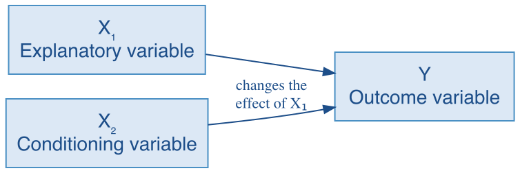

## Overview {#main-content}

Political relationships often depend on context. Economic growth may influence voting differently in prosperous and struggling communities. Trade openness may be associated with environmental performance differently in countries with strong and weak political rights. Education may shape political participation differently across social groups. When the relationship between one predictor and an outcome changes depending on another predictor, an additive model is no longer enough.

This tutorial introduces **interaction models**, which allow the slope of one predictor to vary across values or categories of another predictor. It extends the multiple regression framework from Tutorial 16 by replacing the assumption of a common slope with a model of conditional relationships.

In this tutorial you will learn:

* How to recognize when a relationship is likely to be conditional and what to ask before estimating an interaction model
* How to understand what interaction coefficients and conditional slopes mean, for both interval × interval and categorical × interval interactions
* How to include an interaction term in a regression formula using the `*` operator in `lm()`
* How to compute and interpret the conditional slope of one predictor at meaningful values of another, and how to read the model in both directions
* How to assess the statistical evidence for an interaction --- the test on a single interaction coefficient, and, when a factor contributes several interaction terms, a joint F-test comparing the additive and interaction models
* How to prepare a categorical predictor for an interaction, choosing the reference category so the comparison the hypothesis names appears in the output

::: {.important-note}
**Before you begin.** This tutorial follows the reading **Conditional Models**, which develops the algebra of conditional slopes and what an interaction coefficient does and does not mean. [Open the reading](qpa-readings/ConditionalModels.html){target="_blank"} in a new tab, or run `open_reading("conditional-models")` in the R console.
:::

```{r setup, include=FALSE}
# Make the packaged readings reachable from inside the tutorial
local({
  readings <- system.file("readings", package = "QPATutorialsCourse")
  if (nzchar(readings)) shiny::addResourcePath("qpa-readings", readings)
})
library(learnr)
library(gradethis)
tutorial_options(exercise.checker = gradethis::grade_learnr,
                 exercise.completion = FALSE)
options(lifecycle_verbosity = "quiet")
knitr::opts_chunk$set(error = TRUE)
data("counties", package = "QPATutorialsCourse")
data("qog", package = "QPATutorialsCourse")
qog$rights[qog$fh_pr <= 2] <- 0
qog$rights[qog$fh_pr > 2] <- 1
qog$rights_f <- factor(qog$rights, labels = c("Few Rights", "Many Rights"))
data("ipu", package = "QPATutorialsCourse")
ipu$electoral_f <- factor(ipu$electoral_system,
                          levels = c("plurality_majority",
                                     "proportional_representation",
                                     "mixed_system"),
                          labels = c("Plurality/Majority", "Proportional", "Mixed"))
ipu$quota_f <- factor(ipu$gender_quota, levels = c(FALSE, TRUE),
                      labels = c("No quota", "Quota"))
ipu$years_c <- ipu$years_since_first_woman -
               mean(ipu$years_since_first_woman, na.rm = TRUE)
model_rep_additive <- lm(women_percent ~ quota_f + electoral_f + years_c, data = ipu)
model_rep_int <- lm(women_percent ~ quota_f + electoral_f * years_c, data = ipu)
```

## What Is a Conditional Relationship?

Consider a simple question: does income predict voter turnout? The answer from an additive model is a single estimated slope that applies equally at every unemployment level. But you might reasonably expect the income-turnout relationship to look different when unemployment is high than when it is low. When unemployment is high, even relatively wealthy people may feel economically anxious --- narrowing the gap in turnout between high- and low-income residents. When unemployment is low, the association between income and turnout may be stronger --- income may be a better signal of who has the resources and motivation to vote. In an additive model with income entered as an interval predictor, the answer is a single slope --- an estimated income association that applies equally at every unemployment level. If the estimated income association changes depending on the level of unemployment, the relationship is conditional, and that single-slope model may miss what is actually happening.

More formally: if the estimated association of $X_1$ with $Y$ differs based on the value of $X_2$, the relationship is [conditional]{.important-text}, or equivalently interactive. $X_2$ conditions the association of $X_1$ --- and because the relationship is symmetric, $X_1$ conditions the association of $X_2$ at the same time.

```{r diagram-conditional-t18, echo=FALSE, out.width="55%", fig.align="center", fig.alt="A path diagram with three boxes. A box labeled X1, explanatory variable, at the upper left has an arrow to a box labeled Y, outcome variable, at the right. A box labeled X2, conditioning variable, at the lower left has an arrow meeting that path, annotated 'changes the effect of X1'."}

```

If you estimate a model that includes $X_1$ and $X_2$ as separate predictors but omits the interaction term $X_1 \times X_2$, the model forces $X_1$ to have the same estimated association at every value of $X_2$ --- which may badly misrepresent the pattern in the data. A model containing only the two constituent terms cannot estimate how one association changes across values of the other predictor. You need an interaction term to represent that pattern.

::: {.tip}
**A note on the word "conditional."** In Tutorial 16, coefficients described partial associations while holding the other variables in the model constant. Here, "conditional" has a more specific meaning: the estimated association itself changes depending on the value of another variable. Both uses are standard, but they are distinct. In this tutorial, a [conditional effect]{.important-text} is the conventional statistical term for an estimated association at a particular value of another predictor. It describes a model-implied relationship and does not by itself imply a causal effect. When one predictor is interval, we will often call it a conditional slope to emphasize what is being calculated --- the two terms refer to the same thing.
:::

This tutorial covers two of the three possible interaction types: interval × interval (Example 1) and categorical × interval (Examples 2 and 3). A third type --- two categorical variables interacting --- is also possible and follows the same conceptual logic. You would ask how the association between one categorical variable and the outcome differs across categories of the other. In practice, you would compute predicted outcomes for each combination of categories and compare them to see where the associations differ. We do not cover this case in detail because working through all category combinations simultaneously requires care, but the approach should be familiar once you have worked through the examples here.

## Understanding Interaction Coefficients and Conditional Slopes

Both interaction types covered in this tutorial follow the same underlying structure. Before studying the examples, it helps to see that structure clearly.

### The Common Logic

Two quantities to keep distinct --- this distinction is the most important idea in the tutorial:

[Interaction coefficient]{.important-text}: the estimated difference in one predictor's slope across values or categories of the other predictor. It is a rate of change in a slope, or a difference between slopes.

[Conditional slope]{.important-text} (also called a **conditional effect**): the estimated slope of one predictor at a specific value or category of another predictor.

The interaction coefficient is not itself a slope. It is what you add to a baseline slope to get the conditional slope at a different value or category. Confusing these two quantities is the most common error students make in this topic.

In both interaction types the logic is the same: begin with a baseline slope and add the contribution represented by the interaction term. The baseline slope is the main-effect coefficient on the interval predictor. The interaction term adjusts that baseline for different values or categories of the other variable.

### Interval × Interval Interactions

Suppose the slope of $X_1$ changes as $X_2$ increases. The interaction coefficient tells us how much that slope changes for each one-unit increase in $X_2$, while the conditional-slope formula gives the slope of $X_1$ at any particular value of $X_2$.

For an [interval × interval]{.important-text} model --- two interval predictors and an interaction term:

$$Y = \hat{\alpha} + \hat{\beta}_1 X_1 + \hat{\beta}_2 X_2 + \hat{\beta}_3 X_1 X_2 + \ldots + \varepsilon$$

the coefficients are interpreted as follows:

1. $\hat{\beta}_1$ is the slope of $X_1$ **when $X_2 = 0$**.
2. $\hat{\beta}_2$ is the slope of $X_2$ **when $X_1 = 0$**.
3. $\hat{\beta}_3$ is the estimated change in the slope of $X_1$ for a one-unit increase in $X_2$ --- and equivalently, the estimated change in the slope of $X_2$ for a one-unit increase in $X_1$.
4. The **conditional slope of $X_1$** at any given value of $X_2$ is: $\hat{\beta}_1 + \hat{\beta}_3 X_2$.
5. The **conditional slope of $X_2$** at any given value of $X_1$ is: $\hat{\beta}_2 + \hat{\beta}_3 X_1$.

In most applications, begin with the conditional-slope formula for whichever predictor your research question is primarily about --- but remember that the interaction is symmetric and the model can be read in either direction. Rule 1 is the special case of Rule 4 when $X_2 = 0$: the slope of $X_1$ at that value is simply $\hat{\beta}_1$. Whether zero is a substantively meaningful value depends on the observed range of each predictor.

### Categorical × Interval Interactions

When one predictor is categorical and the other is interval, the same baseline-plus-adjustment logic applies --- but now the adjustment is determined by category membership rather than a numerical value.

For a [categorical × interval]{.important-text} model --- a binary categorical variable $X_1$ (coded 0 for the reference category, 1 for the other) and an interval variable $X_2$:

$$Y = \hat{\alpha} + \hat{\beta}_1 X_1 + \hat{\beta}_2 X_2 + \hat{\beta}_3 X_1 X_2 + \ldots + \varepsilon$$

1. $\hat{\beta}_2$ is the slope of $X_2$ **for the reference category**.
2. $\hat{\beta}_2 + \hat{\beta}_3$ is the slope of $X_2$ **for the non-reference category**. This is the step most often missed: the coefficient on $X_2$ gives the reference-category slope; you must add the interaction coefficient to get the non-reference-category slope.
3. $\hat{\beta}_3$ is the difference between the two slopes --- how much steeper or shallower the non-reference slope is compared to the reference slope.
4. $\hat{\beta}_1$ is the gap between the two categories **when $X_2 = 0$.** Whether that is substantively meaningful depends on the scale and observed range of $X_2$.

A simple table summarizes the relationship:

| | Slope of $X_2$ |
|:--|:--|
| Reference-category slope | $\hat{\beta}_2$ |
| Non-reference-category slope | $\hat{\beta}_2 + \hat{\beta}_3$ |
| Difference between slopes | $\hat{\beta}_3$ |

A positive $\hat{\beta}_3$ means the non-reference category's slope is more positive than the reference category's slope. A negative $\hat{\beta}_3$ means it is more negative. To determine whether either slope is actually positive or negative, you must calculate the slopes themselves --- the sign of $\hat{\beta}_3$ alone does not tell you.

::: {.tip}
**Think of it this way.** In a model without an interaction, the two categories share the same slope on $X_2$; only the intercept differs. An interaction term lets the slopes differ too. Always compute both slopes before interpreting the interaction: the reference slope directly from the output, and the non-reference slope by adding the interaction coefficient. You cannot assess the pattern from the interaction coefficient alone.
:::

When the categorical predictor has more than two categories, the same logic extends: there is one interaction coefficient for each non-reference category, each giving the difference between that category's slope and the reference slope. You will see this in Example 3.

### What to Ask Before Estimating an Interaction

Before estimating an interaction model, think through how you expect the relationship between one predictor and the outcome to differ across values or categories of the other predictor.

**When both predictors are interval variables**, ask how you expect the slope of $X_1$ to change as $X_2$ increases. Three possibilities:

- The slope could become **more positive** as $X_2$ increases.
- The slope could become **more negative** as $X_2$ increases.
- The slope could remain roughly **unchanged**.

Depending on the slope's starting value, a changing slope may become stronger, weaker, or even reverse direction.

**When one predictor is categorical and the other is interval**, ask how you expect the interval slope to differ across categories. You may expect it to be steeper in one category, shallower in another, or even to change direction.

In either case, having an expectation gives you something concrete to check against the results. You may not have clear expectations. Your expectations may turn out to be wrong. When they are, report what you find honestly and think carefully about alternative explanations.

## Specifying Interaction Models in R

Adding an interaction to a regression model in R requires one new ingredient in the formula: a term that multiplies the two variables together. The `*` operator handles this automatically. Writing `X1 * X2` in a formula tells `lm()` to include both main effects and the interaction term --- it is exactly equivalent to writing `X1 + X2 + X1:X2`. The output will include a row labeled `X1:X2` for the interaction coefficient. Everything else --- `lm()`, `summary()`, `stargazer()` --- works exactly as before.

::: {.tip}
**Always include the constituent terms alongside the interaction.** If you omit either $X_1$ or $X_2$ while retaining the interaction term $X_1 \times X_2$, you impose strong restrictions on the model and the coefficients will no longer have the interpretations described above. The `*` operator handles this automatically. If you ever write an interaction by hand using `X1:X2`, you must add `+ X1 + X2` yourself.
:::

Across the three examples, we will use the same general logic: estimate the interaction model, identify the relevant conditional slopes, interpret what the interaction coefficient tells us about how those slopes differ, assess the evidence, and state the substantive conclusion. The examples emphasize different parts of this process as you move from observing the analysis to completing and then writing the code yourself.

## Does the Mortality Risk Association with Clinton's Vote Depend on Wage Growth?

County-level mortality risk and wage growth are both associated with Hillary Clinton's 2016 two-party vote share --- but does the association between mortality risk and the vote depend on local economic conditions? The theoretical argument is that mortality risk may carry different political meaning under different economic circumstances. In counties where wages are growing, residents may see economic opportunity as available to those willing to work, and attribute poor health outcomes to individual choices --- weakening the connection between community health and political backlash. In counties where wages are stagnant or declining, those same health outcomes may feel more like a structural failure that working people have no control over --- producing a stronger political response against the incumbent party's candidate. If this reasoning is right, the estimated association between mortality risk and Clinton's vote should vary with the level of wage growth.

The data frame **counties** describes every U.S. county as of 2016. Of its 3,112 counties, **dem2p_percent** has no missing values, **mortality_risk_25_45** is missing for 1, and **wage_growth** for 2. Three of its variables are central to this question:

- **dem2p_percent**: Clinton's percent of the two-party vote
- **mortality_risk_25_45**: the estimated percentage risk that a person who has reached age 25 will die before reaching age 45
- **wage_growth**: recent wage growth (percent)

Several demographic variables serve as controls: **college_grad_percent**, **hispanic_percent**, **white_percent**, and **Black_percent**. Each is missing for one county except **Black_percent**, which is missing for two.

That reasoning gives a direction, so the hypothesis states one. It is one plausible expectation rather than the only one the situation admits --- which is what makes stating it worthwhile. A directional hypothesis makes the more specific prediction: the relationship can vary as expected, fail to vary clearly, or vary in the opposite direction.

::: {.hypothesis}
In a comparison of counties, the negative association between mortality risk and Hillary Clinton's percent of the two-party vote is stronger where wage growth is lower.
:::

### Estimate the Regression

**Run and observe 1: Estimate the mortality risk × wage growth model**

```{r exercise-interaction-clintonvote, exercise=TRUE, exercise.cap="Run and observe 1"}
model_int <- lm(dem2p_percent ~ mortality_risk_25_45 * wage_growth +
                  college_grad_percent + hispanic_percent +
                  white_percent + Black_percent, data = counties)
summary(model_int)
```

Find the row labeled `mortality_risk_25_45:wage_growth` in the Coefficients table --- that is the interaction coefficient. Note its sign and magnitude before moving on.

### What the Interaction Coefficient Tells Us

The interaction coefficient measures how much the mortality-risk slope changes for each one-unit increase in wage growth. Before asking what it means substantively, read it numerically.

**Apply 2: Interpret the mortality risk × wage growth interaction**

```{r quiz-interaction-sign, echo=FALSE}
question("The interaction coefficient in the row labeled **mortality_risk_25_45**:**wage_growth** is -0.139. Which statement correctly describes what this number means?",
  correct = "Right. The interaction coefficient is a rate of change in a slope, not a slope itself.",
  answer("For each additional point of wage growth, the mortality-risk slope becomes 0.139 points more negative",
         correct = TRUE,
         message = "Because the mortality-risk slope is negative when wage growth equals zero, becoming more negative means that higher mortality risk predicts a larger drop in Clinton support as wage growth increases. How large that slope is depends on which value of wage growth you evaluate it at."),
  answer("The slope of mortality risk is -0.139 in counties with average wage growth",
         message = "-0.139 is the interaction coefficient, not the conditional slope of mortality risk at the mean. The conditional slope depends on the level of wage growth and is computed using the formula: coefficient on mortality risk + interaction coefficient * wage growth."),
  answer("For each additional percentage point of mortality risk, Clinton's vote falls by 0.139 percentage points, controlling for wage growth",
         message = "That would be the main-effect coefficient on mortality risk, which appears on its own separate row. The interaction coefficient (-0.139) tells you how the mortality-risk slope changes as wage growth changes, not what the slope itself is."),
  answer("This coefficient is the combined result of both mortality risk and wage growth when both are non-zero",
         message = "The interaction term is not a combined effect. The main-effect coefficients describe the relevant slope or category difference at the model's reference condition; the interaction term tells you how much one variable's slope changes with a one-unit increase in the other variable."),
  allow_retry = TRUE,
  random_answer_order = TRUE,
  try_again = "Hint: the interaction coefficient is a rate of change in a slope --- how much does the mortality-risk slope change for each one-unit increase in wage growth?"
)
```

### What the Constituent Coefficients Tell Us

From rule 1: the coefficient on **mortality_risk_25_45** (-2.494) is the slope of mortality risk when wage growth equals zero. From rule 2: the coefficient on **wage_growth** (0.753) is the slope of wage growth when mortality risk equals zero. These are anchor points for the formulas, not typical-county summaries. Wage growth of zero falls within the observed range (about −69 to +63) but is not representative; mortality risk of zero is outside the observed range entirely. Conditional slopes evaluated at meaningful or commonly observed values are more informative, as you will see in the next section.

**Apply 3: Interpret the constituent coefficients**

```{r quiz-interpret-maineffects, echo=FALSE}
question("Which statements correctly describe what the coefficients on **mortality_risk_25_45** and **wage_growth** tell us in this model? Select all that apply.",
  correct = "Right. Both main-effect coefficients are anchor points --- the slope of each variable when the other equals zero.",
  answer("The coefficient on **mortality_risk_25_45** (-2.494) is the slope of mortality risk when wage growth equals zero",
         correct = TRUE,
         message = "In a county with flat wages, each additional percentage point of mortality risk predicts about 2.5 fewer percentage points of Clinton's vote. Wage growth of zero is within the observed range and is substantively interpretable as flat wages --- but the mean is 4.3, so it is not a typical county. The conditional slope formula gives the slope at any specific value of wage growth."),
  answer("The coefficient on **wage_growth** (0.753) is the slope of wage growth when mortality risk equals zero",
         correct = TRUE,
         message = "Mortality risk ranges from about 1.1 to 8.4 in this dataset --- it is never zero. The coefficient on **wage_growth** is a mathematical anchor point, not a substantively meaningful prediction for any real county. The conditional slope formula is more useful."),
  answer("The coefficient on **mortality_risk_25_45** is the average slope of mortality risk across all counties in the sample",
         message = "In an interaction model, there is no single average slope --- the slope differs across counties depending on their wage growth level. The main-effect coefficient is the slope only when wage growth equals zero."),
  answer("The coefficient on **wage_growth** represents the direct effect of wage growth after removing the effect of mortality risk",
         message = "In an interaction model, the main-effect coefficient on wage growth is its slope when mortality risk equals zero --- not an average or a direct association across all mortality-risk levels. The interaction term means the slope changes with mortality risk."),
  allow_retry = TRUE,
  random_answer_order = TRUE,
  try_again = "Hint: in an interaction model, both main-effect coefficients are conditional on the other variable equaling zero."
)
```

### Conditional Slopes of Mortality Risk

Using the formula from the Understanding Interaction Coefficients section:

$$\text{Conditional slope of mortality risk} = -2.494 + (-0.139)(\text{wage growth})$$

| Wage growth | Calculation | Conditional slope of mortality risk |
|:------------|:------------|------------------------------------:|
| −4.7 (25th percentile) | $-2.494 + (-0.139)(-4.7)$ | -1.84 |
| 4.3 (mean) | $-2.494 + (-0.139)(4.3)$ | -3.09 |
| 12.7 (75th percentile) | $-2.494 + (-0.139)(12.7)$ | -4.26 |

The slope becomes more negative as wage growth increases. Mortality risk is more strongly associated with lower Clinton support in high-wage-growth counties than in low-wage-growth counties.

**Practice 4: Compute the conditional slope of mortality risk at high wage growth**

```{r quiz-conditional-mortality, echo=FALSE}
question("Using the formula $-2.494 + (-0.139)(\\text{wage growth})$, what is the conditional slope of a one-percentage-point increase in mortality risk in a county where wage growth is 8?",
  correct = "Right: -2.494 + (-0.139)(8) = -3.606.",
  answer("About -3.61 percentage points",
         correct = TRUE,
         message = "The mortality-risk slope is -3.61 in a strong-growth county, compared to -2.49 when wage growth is zero and -3.09 at the mean. The slope becomes more negative as wage growth increases --- mortality risk is more strongly associated with lower Clinton support in counties with stronger economic growth."),
  answer("About -2.494 percentage points",
         message = "That is the main-effect coefficient on mortality risk, which is its conditional slope only when wage growth equals zero --- the top row of the table. Substitute 8: -2.494 + (-0.139)(8)."),
  answer("About -1.382 percentage points",
         message = "Check the sign on the interaction term. The coefficient is -0.139, not +0.139. Substituting: -2.494 + (-0.139)(8) = -2.494 - 1.112 = -3.606, not -2.494 + 1.112."),
  answer("About -3.09 percentage points",
         message = "That is the conditional slope at the mean wage growth (4.3) --- the middle row of the table. Substitute 8, not 4.3: -2.494 + (-0.139)(8) = -3.606."),
  allow_retry = TRUE,
  random_answer_order = TRUE,
  try_again = "Hint: substitute 8 directly into the formula: $-2.494 + (-0.139)(8)$."
)
```

### Extension: Reading the Model in Reverse

Although we have been reading the model from the mortality risk perspective, the same model also tells us how the wage-growth slope changes with mortality risk --- a reminder that the interaction is symmetric.

The conditional slope of wage growth at a given level of mortality risk is $0.753 + (-0.139)(\text{mortality risk})$. At the mean mortality-risk value of 3.1: $0.753 + (-0.139)(3.1) = 0.753 - 0.431 = 0.322$. A one-point increase in wage growth predicts about a 0.32-point increase in Clinton's vote in a county at the mean mortality risk. As mortality risk rises, that estimated positive association becomes smaller.

::: {.tip}
**Extension: Where does the slope cross zero?** Setting $0.753 + (-0.139)(\text{mortality risk}) = 0$ gives a crossover at approximately 5.4. Above that value, the point estimates imply a negative wage-growth slope --- higher wage growth would predict lower rather than higher Clinton vote. This is near the upper end of the observed distribution (about 95% of counties fall below 5.4). This calculation uses point estimates only; Tutorial 19 will introduce prediction plots that help assess uncertainty around conditional relationships.
:::

### What We Learned About Mortality Risk, Wage Growth, and Clinton's Vote

The paragraph below is a write-up --- the way this result would be reported in a paper rather than worked through in a tutorial. Each example in this tutorial ends with one.

::: {.research-example}
The interaction term is statistically significant (p = .004), so the association does depend on wage growth. But it depends on it in the opposite direction from the one the hypothesis predicted. The negative interaction coefficient means the mortality-risk slope becomes more negative as wage growth rises: higher mortality risk predicts a larger drop in Clinton support in counties with *stronger* economic growth, not weaker.

The estimates run the other way. We expected economic hardship to amplify the political weight of poor health; instead the mortality association is strongest where wages are growing. Two explanations are worth considering. County wage growth is an average, so rising wages do not mean every resident is doing better --- high mortality alongside rising wages may identify places where the gains are concentrated and others are being left behind. Alternatively, growth may sharpen rather than soften the contrast: where the local economy is visibly improving, persistent poor health is more anomalous, and that dissonance may make it more politically salient.

Neither explanation is something this model tested. Both were suggested by the result rather than specified in advance, which is exactly why neither can be treated as supported by it --- they are candidate accounts that would need different evidence and a fresh test. What the regression shows is a statistically significant interaction that runs opposite to the argument that motivated it. That is a finding, and the useful response is a new question rather than a rewritten hypothesis.
:::

## Applying the Same Logic to a Categorical × Interval Interaction

In Example 1, the conditional slope was calculated by substituting a specific numerical value of wage growth into the formula. The same baseline-plus-adjustment logic applies when one predictor is categorical --- the difference is that category membership now determines which adjustment is added to the reference-category slope.

The reference category uses the interval predictor's main-effect coefficient as its slope directly. A comparison category adds its interaction coefficient to that baseline. The interaction coefficient remains a difference between slopes, not a slope itself. You will apply these rules immediately in the next example.

## Do Political Rights Condition the Relationship Between Trade Openness and Environmental Performance?

Does the estimated association between international trade and environmental performance depend on a country's political context? In countries with well-developed political rights, civil society organizations, free media, and political competition give citizens tools to hold governments and firms accountable for environmental outcomes --- regardless of how open the economy is to trade. Citizens can organize, advocate, and vote in ways that impose costs on environmentally destructive behavior. In countries where political rights are limited, those domestic accountability mechanisms are weak or absent. International economic integration may then serve as one of the few external pressures that can improve environmental behavior: firms seeking access to global markets face reputational and regulatory expectations from trading partners that domestic politics cannot enforce. If this argument is right, the estimated association between trade openness and environmental performance should be stronger in countries with fewer political rights, where trade exposure substitutes for missing domestic accountability.

::: {.hypothesis}
In a comparison of countries, the positive association between trade openness and environmental performance is stronger among countries with fewer political rights than among countries with more.
:::

The data frame **qog** is the January 2020 cross-section of the Quality of Government Basic Dataset, in which each variable takes its most recent available observation as of that release --- so they are not all measured in the same year. It contains **epi_epi**, the Environmental Performance Index, scaled 0 to 100 and observed from 27.4 to 87.4, where higher values indicate better performance. The predictors are:

- **rights**: a numeric variable coded 0 (few political rights) and 1 (many political rights) --- you will convert this to a labeled factor called **rights_f** in the next step
- **ipi_tradeopen**: the trade-openness component of the Index of Public Integrity, scored 1 to 10, with higher values indicating greater openness
- **hf_efiscore**: the Heritage Foundation Economic Freedom Index, on a theoretical scale of 0 to 100 and observed from 2.3 to 87.8, with higher values indicating greater economic freedom --- included as a control; we will not interpret its coefficient in detail

Missingness reduces the effective sample to 116 of the 194 countries. **ipi_tradeopen** is the binding constraint --- it is missing for 78 countries, against 17 for **hf_efiscore** and 14 for **epi_epi** --- so these results describe the countries for which trade-openness data exist rather than the world. Those 116 divide into 52 with limited political rights and 64 with broad political rights, and it is the difference between those two groups that the interaction estimates.

### Create the Factor Variable

Tutorial 16 introduced `factor()` and `levels()` for creating named factor variables --- the same approach applies here. The variable **rights** is coded 0 (few political rights) and 1 (many political rights). It is built in this tutorial's setup from **fh_pr**, the Freedom House political rights rating, which is recorded for all 194 countries --- so **rights** has no missing values either. We could wrap it in `factor()` directly inside the `lm()` formula --- Tutorial 16 also showed this approach --- but that produces output rows labeled `factor(rights)1` and `factor(rights)1:ipi_tradeopen`. Those are hard to track when you need to combine two rows to find the non-reference slope. Creating a named factor first means the output will show `rights_fMany Rights` and `rights_fMany Rights:ipi_tradeopen`, making the connection between them much clearer.

**Few Rights** becomes the reference category because it is coded 0 and therefore appears first in the factor levels --- and as you saw in the Understanding Interaction Coefficients section above, the reference category's slope on **ipi_tradeopen** appears directly as $\hat{\beta}_2$ in the output. Use `levels()` to confirm this before estimating the model.

**Practice 5: Create rights_f and check its levels**

**rights** is already coded 0 for countries with limited political rights and 1 for countries with broad political rights. Complete the code to turn it into a labeled factor called **rights_f**, using the labels \"Few Rights\" and \"Many Rights\", then add a line displaying its levels so you can see which category R will treat as the reference. Three hints are available. Click "Submit Answer" to check your work.

```{r exercise-factor-rights, exercise=TRUE, exercise.cap="Practice 5"}
qog$rights_f <- ___

levels(qog$rights_f)

```

```{r exercise-factor-rights-hint-1}
# Hint 1 of 3
# A factor stores a categorical variable by its category names
# rather than by the numbers standing in for them. The order of
# those names decides which category R treats as the reference,
# so you need a second line to see what that order turned out
# to be.
```

```{r exercise-factor-rights-hint-2}
# Hint 2 of 3
# The function that does the conversion is factor(), and the
# function that reports the result is levels(). levels() takes
# the factor itself and nothing else.
```

```{r exercise-factor-rights-hint-3}
# Hint 3 of 3
# The labels go in order from the smallest code to the largest,
# so the name for 0 comes first. Assign the factor back into the
# data frame, then call levels() on it.
```

```{r exercise-factor-rights-check}
grade_this({
  code <- paste(.user_code, collapse = "\n")
  code_nc <- gsub("#[^\r\n]*", "", code)
  if (!grepl("qog\\$rights_f\\s*(<-|=)\\s*factor\\s*\\(\\s*(x\\s*=\\s*)?qog\\$rights\\b", code_nc))
    fail("Build and assign in one step: `qog$rights_f` on the left, `factor()` applied to `qog$rights` on the right.")
  if (!grepl("labels\\s*=", code_nc))
    fail("Pass a labels argument to `factor()`, or the categories will print as 0 and 1.")
  if (!grepl("Few Rights", code_nc, fixed = TRUE) || !grepl("Many Rights", code_nc, fixed = TRUE))
    fail("Use the two labels exactly as written: \"Few Rights\" and \"Many Rights\".")
  if (!grepl("levels\\s*\\(", code_nc))
    fail("Add a line calling `levels()` on your new factor, so you can see the reference category.")
  if (is.null(.result))
    fail("Your code did not produce a result. Make sure the last line calls `levels()`.")
  if (!identical(as.character(.result), c("Few Rights", "Many Rights")))
    fail("The levels are not in the expected order. Labels are assigned from the smallest code upward, so the label for 0 comes first.")
  built <- factor(qog$rights, labels = c("Few Rights", "Many Rights"))
  if (!identical(as.character(qog$rights_f), as.character(built)))
    fail("`qog$rights_f` does not match `qog$rights` case for case. Build it from that variable rather than constructing the categories another way.")
  pass("Correct. \"Few Rights\" is listed first, so it is the reference category.")
})
```

**Few Rights** is listed first, so it is the reference category --- the one whose slope on **ipi_tradeopen** will appear directly as the main-effect coefficient $\hat{\beta}_2$ in the output.

### Estimate the Regression

**Practice 6: Estimate the environmental performance model**

The model uses **epi_epi** as the outcome, **rights_f** and **ipi_tradeopen** as the interacting predictors, and **hf_efiscore** as a control.

Complete the code to estimate the model, assigning it to **model_env**, then display the results. Two hints are available. Click "Submit Answer" to check your work.

```{r exercise-regression-env-interaction, exercise=TRUE, exercise.cap="Practice 6"}
model_env <- ___
summary(model_env)
```

```{r exercise-regression-env-interaction-hint-1}
# Hint 1 of 2
# Look back at the hypothesis. Which variable is the outcome?
# Which two variables are interacting, and which is the control?
# The outcome goes on the left of ~; predictors go on the right.
```

```{r exercise-regression-env-interaction-hint-2}
# Hint 2 of 2
# Use the * operator between rights_f and the trade openness
# variable --- the same * syntax as in Example 1. Add the
# economic freedom control as a separate + term after the
# interaction. The outcome goes on the left of ~.
```

```{r exercise-regression-env-interaction-check}
grade_this({
  code <- paste(.user_code, collapse = "\n")
  code_no_comments <- gsub("#[^\r\n]*", "", code)
  if (!grepl("lm\\s*\\(", code_no_comments)) {
    fail("Use `lm()` to estimate the regression.")
  }
  if (!grepl("model_env\\s*(<-|=)", code_no_comments)) {
    fail("Assign your model to an object called **model_env**.")
  }
  if (!grepl("epi_epi\\s*~", code_no_comments)) {
    fail("The outcome variable should be **epi_epi** --- environmental performance is what we are trying to explain.")
  }
  if (!grepl("rights_f\\s*\\*\\s*ipi_tradeopen|ipi_tradeopen\\s*\\*\\s*rights_f", code_no_comments)) {
    fail("Use `rights_f * ipi_tradeopen` to include both constituent terms and the interaction term.")
  }
  if (!grepl("hf_efiscore", code_no_comments)) {
    fail("Include **hf_efiscore** as a control variable.")
  }
  if (!grepl("data\\s*=\\s*qog", code_no_comments)) {
    fail("Set `data = qog` so R knows where to find the variables.")
  }
  if (!grepl("summary\\s*\\(", code_no_comments)) {
    fail("Call `summary()` on your saved model object to display the results.")
  }
  expected <- lm(epi_epi ~ rights_f * ipi_tradeopen + hf_efiscore, data = qog)
  if (!inherits(.result, "summary.lm")) {
    fail("The last line should display the summary. Save the model, then call `summary()` on it so the summary is what prints.")
  }
  result_coef <- setNames(.result$coefficients[, "Estimate"], rownames(.result$coefficients))
  if (is.null(result_coef)) {
    fail("Make sure you display the results by calling `summary()` on your model object.")
  }
  if (!isTRUE(all.equal(
    sort(as.numeric(result_coef)),
    sort(as.numeric(coef(expected))),
    tolerance = 1e-6))) {
    fail("Check your formula. The model should regress **epi_epi** on `rights_f * ipi_tradeopen + hf_efiscore` using the **qog** data.")
  }
  pass("Correct! Your output carries an interaction row alongside the two constituent terms. That extra row is the whole difference between this model and the additive one.")
})
```

### Identify the Two Conditional Slopes

With the model estimated, the first task is to identify the slope of trade openness for each group. The `ipi_tradeopen` coefficient gives the Few Rights slope directly. To get the Many Rights slope, find the `rights_fMany Rights:ipi_tradeopen` row and combine it with `ipi_tradeopen` using the rule from the Understanding Interaction Coefficients section above. Note that if you wrote the formula as `ipi_tradeopen * rights_f` rather than `rights_f * ipi_tradeopen`, the interaction row may instead be labeled `ipi_tradeopen:rights_fMany Rights` --- the coefficient value is identical either way.

**Practice 7: Compute the slope of trade openness for Many Rights countries**

```{r quiz-env-slopes, echo=FALSE}
question("Using the coefficients in your output, what is the slope of **ipi_tradeopen** for countries with Many Rights?",
  correct = "Right. The two slopes are strikingly different.",
  answer("About 0.12 --- the estimated trade-openness slope is close to zero in Many Rights countries",
         correct = TRUE,
         message = "For Few Rights countries the slope is 4.750: each additional point of trade openness predicts about 4.75 more points on the EPI. For Many Rights countries the slope is 4.750 + (-4.629) = 0.121 --- close to zero. The two estimated slopes differ substantially."),
  answer("About 4.750 --- the **ipi_tradeopen** coefficient is the slope for all countries regardless of **rights** status",
         message = "In an interaction model, the **ipi_tradeopen** coefficient is the slope only for the reference category (Few Rights). To find the Many Rights slope, add the interaction coefficient to that value."),
  answer("About -4.629 --- the interaction coefficient is the slope for Many Rights countries",
         message = "The interaction coefficient is the difference between the two slopes, not the Many Rights slope itself. Add the interaction coefficient to the Few Rights slope: 4.750 + (-4.629) = 0.121."),
  answer("About 9.38 --- the Many Rights slope is the sum of the **ipi_tradeopen** and interaction coefficients added to the Few Rights reference-category slope",
         message = "The Many Rights slope on **ipi_tradeopen** is simply the **ipi_tradeopen** coefficient plus the interaction coefficient: 4.750 + (-4.629) = 0.121. The rights_fMany Rights coefficient is the intercept gap between groups when trade openness is zero --- it is not part of the slope calculation."),
  allow_retry = TRUE,
  random_answer_order = TRUE,
  try_again = "Hint: Few Rights slope = **ipi_tradeopen** coefficient directly. Many Rights slope = **ipi_tradeopen** coefficient + interaction coefficient."
)
```

### What the Interaction Coefficient Tells Us

Now that you have both slopes, the interaction coefficient has a clear interpretation: it is the difference between the Many Rights slope and the Few Rights slope.

| Political rights category | Trade openness slope |
|:--------------------------|---------------------:|
| Few Rights (reference) | 4.750 |
| Many Rights | $4.750 + (-4.629) = 0.121$ |

The interaction coefficient also tells you the direction and size of that difference. A large negative value means the Many Rights slope is substantially smaller (less positive or more negative) than the Few Rights slope. Here the near-cancellation is the key finding: the interaction coefficient (-4.629) is almost equal in magnitude to the Few Rights reference-category slope (4.750), which is why the resulting Many Rights slope is close to zero.

**Apply 8: Interpret the rights × trade openness interaction**

```{r quiz-env-interaction-sign, echo=FALSE}
question("The interaction coefficient in the row labeled **rights_fMany Rights**:**ipi_tradeopen** is -4.629. Which statement correctly describes what this number means?",
  correct = "Right. The interaction coefficient is the difference between the two groups' slopes.",
  answer("The Many Rights slope on trade openness is 4.629 points smaller than the Few Rights slope",
         correct = TRUE,
         message = "The Few Rights slope is 4.750 and the Many Rights slope is 0.121 --- a difference of -4.629. The interaction coefficient measures that difference directly. Trade openness has a relatively large estimated slope in Few Rights countries and a slope close to zero in Many Rights countries."),
  answer("This coefficient is the slope of trade openness for Many Rights countries, controlling for economic freedom",
         message = "The interaction coefficient is the difference between the two slopes, not the Many Rights slope itself. The Many Rights slope is the **ipi_tradeopen** coefficient plus the interaction coefficient: 4.750 + (-4.629) = 0.121."),
  answer("This coefficient means trade openness reduces environmental performance by 4.629 points for Many Rights countries",
         message = "The interaction coefficient is not a slope for any group. It is the difference between the Many Rights slope and the Few Rights slope. The Many Rights slope itself is 4.750 + (-4.629) = 0.121 --- positive but nearly zero, not negative."),
  answer("This coefficient is the combined effect of having both many political **rights** and high trade openness, compared to having neither",
         message = "The interaction term is not a combined effect. The main-effect coefficients describe the relevant slope or category difference at the model's reference condition; the interaction term tells us how much the trade openness slope differs between the two groups."),
  allow_retry = TRUE,
  random_answer_order = TRUE,
  try_again = "Hint: you have already computed both slopes. The interaction coefficient is simply the difference: Many Rights slope minus Few Rights slope."
)
```

### Interpret the Category Gap

The **rights_fMany Rights** coefficient (29.226) is the gap between Many Rights and Few Rights countries when **ipi_tradeopen** equals zero --- outside the observed range of the data (trade openness runs from 1 to 10). This coefficient is a mathematical anchor rather than a substantively meaningful prediction. The pattern at observed values is more informative.

**Apply 9: Interpret the conditional relationship at observed trade levels**

```{r quiz-env-interpretation, echo=FALSE}
question("Based on the model's point estimates, at low trade openness (**ipi_tradeopen** = 2), Many Rights countries are predicted to have a higher EPI score than Few Rights countries. At high trade openness (**ipi_tradeopen** = 8), Few Rights countries are predicted to have a higher EPI score. Which statement correctly describes why the predicted gap between the two groups changes as trade openness increases?",
  correct = "Right: the changing gap follows directly from the different slopes.",
  answer("The trade-openness slope is substantially larger for Few Rights countries, so the gap between the groups narrows and eventually reverses",
         correct = TRUE,
         message = "This is the conditional pattern the interaction captures. The predicted EPI score rises more steeply with trade openness for Few Rights countries (4.75 points per unit) than for Many Rights countries (0.12 points per unit), so the gap between them changes as trade openness increases. The model does not establish why trade openness has different estimated associations across the two political-**rights** categories."),
  answer("Many Rights countries always have higher predicted EPI scores regardless of trade openness",
         message = "At high trade openness, Few Rights countries are predicted to have a higher EPI score. The gap between the groups changes direction across the observed range."),
  answer("The interaction term is too small to be meaningful even though it is statistically significant",
         message = "The interaction coefficient (-4.629) is actually large relative to the Few Rights reference-category slope on **ipi_tradeopen** (4.750) --- it nearly cancels the slope for Many Rights countries. A small p-value and a large estimated difference go together here."),
  answer("Trade openness has the same positive estimated association with environmental performance in both Few Rights and Many Rights countries --- the interaction term just adjusts the magnitude slightly",
         message = "The interaction coefficient (-4.629) nearly equals the Few Rights reference-category slope on **ipi_tradeopen** (4.750) in magnitude, so the resulting Many Rights slope is close to zero. This is not a small adjustment."),
  allow_retry = TRUE,
  random_answer_order = TRUE,
  try_again = "Hint: compare the two slopes and think about what different slopes imply for how the predicted gap between the groups changes as trade openness rises."
)
```

**Apply 10: Test the interaction term**

```{r quiz-env-hypothesistest, echo=FALSE}
question("Based on the t-statistic and p-value for the interaction term **rights_fMany Rights**:**ipi_tradeopen** in your output, what conclusion do we draw?",
  correct = "Right. We reject the null hypothesis that the two groups' slopes are equal.",
  answer("We reject the null that the trade openness slope is the same in both **rights** groups",
         correct = TRUE,
         message = "The t-statistic is -4.533 and the p-value is 1.48e-05 --- strong evidence against equal slopes. The data provide strong evidence that the trade openness slope differs substantially between the two groups."),
  answer("We fail to reject the null hypothesis --- the interaction is not statistically significant",
         message = "Look at the t-statistic and p-value in the **rights_fMany Rights**:**ipi_tradeopen** row. A p-value well below 0.05 means we reject the null hypothesis."),
  answer("The significant interaction proves that political **rights** cause trade openness to have less association with environmental performance",
         message = "The small p-value indicates that a slope difference this large would be unlikely under the null hypothesis of equal slopes. It does not establish causation --- countries with many **rights** may differ from those with few **rights** in other ways that also affect how trade relates to environmental outcomes."),
  answer("A p-value this small means there is essentially zero probability the null hypothesis is true",
         message = "The p-value gives the probability of observing a difference in slopes this large if the null were true --- not the probability that the null is true. A very small p-value means the data would be highly surprising under the null, not that the null is certainly false."),
  allow_retry = TRUE,
  random_answer_order = TRUE,
  try_again = "Hint: the null hypothesis for an interaction term is that the two groups' slopes are equal --- that the difference is zero."
)
```

### Assess Model Fit

With the interaction term statistically significant and the estimated conditional slopes substantially different, how well does the model capture overall variation in environmental performance?

**Apply 11: Assess the fit of the environmental performance model**

```{r quiz-env-modelfit, echo=FALSE}
question("Look at the Multiple R-squared, Adjusted R-squared, and the residual standard error in your output. Which statements are true? Select all that apply.",
  correct = "Right. The model explains a substantial share of the variation in environmental performance.",
  answer("The Multiple R-squared tells us the model explains about 60.7% of the variation in environmental performance across the 116 countries with complete data",
         correct = TRUE,
         message = "78 countries were excluded due to missing data --- a limitation worth keeping in mind when assessing how broadly these results generalize."),
  answer("The residual standard error of about 8.6 means that observed EPI values typically differ from their fitted values by roughly 8.6 points",
         correct = TRUE,
         message = "Given that the EPI ranges from about 27 to 87, an 8.6-point typical error means the model captures broad patterns but leaves substantial country-specific variation unexplained."),
  answer("The Adjusted R-squared of 0.599 tells us the interaction term explains 59.9% of the variation in environmental performance",
         message = "The Adjusted R-squared reflects the combined explanatory power of all predictors in this interaction model --- **rights_f**, **ipi_tradeopen**, their interaction, and **hf_efiscore** --- not the interaction term alone."),
  answer("Because the Adjusted R-squared is only 0.599, this interaction model does not fit the data well enough to draw conclusions",
         message = "The interaction p-value directly tests whether the two estimated slopes differ, whereas R-squared summarizes the model's overall explanatory fit. They answer different questions --- a significant coefficient can coexist with weak overall fit."),
  allow_retry = TRUE,
  random_answer_order = TRUE,
  try_again = "Hint: make sure to select all true statements."
)
```

### What We Learned About Trade Openness, Political Rights, and Environmental Performance

::: {.research-example}
The interaction term is statistically significant (p < .001). The estimated slope of trade openness is 4.750 for countries with limited political rights and 0.121 for countries with broad political rights --- a difference of -4.629, which is the interaction coefficient. The point estimate is large and positive in the limited-rights group but close to zero in the broad-rights group. The interaction test provides strong evidence that these two slopes differ. Whether the mechanism producing this difference involves international exposure, domestic accountability channels, or something else entirely is a question the regression cannot answer.
:::

## Extending the Logic to a Multicategory Factor

Nothing fundamentally changes when the categorical variable has three or more groups. The model still estimates a separate slope of the interval predictor for each category; the output now has one interaction row for each non-reference category instead of one --- each giving the difference between that category's slope and the reference slope. You will apply the same three-step approach: identify each category's slope, interpret each interaction coefficient as a slope difference, and assess statistical support using both individual interaction coefficients and a joint F-test.

With more than two categories, individual p-values test whether each non-reference category's slope differs from the reference slope, but they do not jointly test whether the slopes are all equal across groups. The joint F-test --- comparing the additive and interaction models using `anova()` --- answers that broader question. Both tests are needed for a complete assessment.

## Does a Longer History of Women in Parliament Matter More Under Some Electoral Rules?

Tutorial 16 asked whether proportional electoral systems seat more women than plurality systems, holding quotas and the length of women's parliamentary history constant. That model was additive: it assumed the relationship between history and representation was the same whatever the electoral system.

There is a reason to doubt that. The institutional argument says proportional systems provide shortcuts --- party lists, multimember districts, centralized candidate selection --- that let representation rise without waiting for parties to build constituency-level pipelines. If that is right, history should matter *more* where those shortcuts are absent. Under plurality rules, progress depends on the slow accumulation the shortcuts bypass.

That is a claim about a slope depending on a category, which is what an interaction tests.

::: {.hypothesis}
In a comparison of countries, the relationship between the length of women's parliamentary history and women's representation will be stronger under plurality electoral systems than under proportional systems, controlling for electoral gender quotas.
:::

The data frame **ipu** contains one row for each of 193 national legislatures, with chamber composition current as of August 2026. Of the 193, **electoral_system** is missing for 15, **women_percent** for 8, **gender_quota** for 1, and **years_since_first_woman** for none. It holds **women_percent**, the percentage of seats held by women, and **electoral_f**, the three-category factor from Tutorial 16 with "Plurality/Majority" as the reference category. **quota_f** indicates whether the country has an electoral gender quota.

**years_c** needs a moment, because it is centered. It is the number of years since a woman first entered that parliament, with its mean subtracted. Zero is the average, about 60 years --- a parliament that first seated a woman around 1966. Negative values are parliaments that seated their first woman more recently, positive values are ones that did so earlier. The range runs from about -55, a first woman in 2021, to about +59, a first woman in 1907.

Because **electoral_f** has three categories, `electoral_f * years_c` will produce two interaction rows in the output:

| Row label | Meaning |
|:----------|:--------|
| `electoral_fProportional:years_c` | Difference between the Proportional slope and the Plurality slope |
| `electoral_fMixed:years_c` | Difference between the Mixed slope and the Plurality slope |

### Estimate the Regression

**Practice 12: Estimate the additive and interaction models**

Write both models from scratch. The additive model regresses **women_percent** on **quota_f**, **electoral_f** and **years_c**; the interaction model is the same except that **electoral_f** and **years_c** interact. Assign them to **model_rep_additive** and **model_rep_int** --- both names are used again in the joint test below --- then display the results of the interaction model. Three hints are available. Click "Submit Answer" to check your work.

```{r exercise-ipu-models, exercise=TRUE, exercise.cap="Practice 12"}

```

```{r exercise-ipu-models-hint-1}
# Hint 1 of 3
# The two models differ in one character. An additive model lists
# its predictors separated by +; an interaction model joins the
# two interacting predictors with * instead, which tells R to
# estimate their product term as well as each on its own.
```

```{r exercise-ipu-models-hint-2}
# Hint 2 of 3
# Both are lm() calls with a formula and data = ipu, each
# assigned to a named object. quota_f is a control in both
# models, so it stays joined by + in each.
```

```{r exercise-ipu-models-hint-3}
# Hint 3 of 3
# Only the interaction model is displayed. Pass it to summary()
# on a third line. The additive model is estimated here but not
# printed --- the joint test below compares the two.
```

```{r exercise-ipu-models-check}
grade_this({
  code <- paste(.user_code, collapse = "\n")
  code_nc <- gsub("#[^\r\n]*", "", code)
  n_lm <- lengths(regmatches(code_nc, gregexpr("lm\\s*\\(", code_nc)))
  if (n_lm < 2)
    fail("Estimate both models --- the additive one and the interaction one.")
  if (!grepl("model_rep_additive\\s*(<-|=)", code_nc))
    fail("Assign the additive model to **model_rep_additive**.")
  if (!grepl("model_rep_int\\s*(<-|=)", code_nc))
    fail("Assign the interaction model to **model_rep_int**.")
  if (!grepl("women_percent\\s*~", code_nc))
    fail("**women_percent** is the outcome in both models.")
  if (!grepl("electoral_f\\s*\\*\\s*years_c|years_c\\s*\\*\\s*electoral_f", code_nc))
    fail("The interaction model joins **electoral_f** and **years_c** with *, not +.")
  if (!grepl("quota_f", code_nc))
    fail("**quota_f** is a control in both models.")
  if (!grepl("data\\s*=\\s*ipu", code_nc))
    fail("Set `data = ipu` in both calls.")
  if (!grepl("summary\\s*\\(", code_nc))
    fail("Display the interaction model with `summary()`.")

  if (!inherits(.result, "summary.lm"))
    fail("The last line should display the interaction model. Call `summary(model_rep_int)` so the summary is what prints.")
  want_add <- lm(women_percent ~ quota_f + electoral_f + years_c, data = ipu)
  want_int <- lm(women_percent ~ quota_f + electoral_f * years_c, data = ipu)
  est <- function(m) {
    cf <- coef(m)
    if (is.matrix(cf)) setNames(cf[, "Estimate"], rownames(cf)) else cf
  }
  same <- function(a, b) {
    ca <- est(a); cb <- est(b)
    setequal(names(ca), names(cb)) &&
      isTRUE(all.equal(as.numeric(ca[order(names(ca))]),
                       as.numeric(cb[order(names(cb))]), tolerance = 1e-6))
  }
  if (!same(model_rep_additive, want_add))
    fail("**model_rep_additive** is not the additive model. Regress **women_percent** on **quota_f**, **electoral_f** and **years_c** joined with `+`, using the **ipu** data.")
  if (!same(model_rep_int, want_int))
    fail("**model_rep_int** is not the interaction model. It is the additive model with **electoral_f** and **years_c** joined by `*` instead of `+`.")
  if (!same(.result, want_int))
    fail("The summary displayed is not **model_rep_int**. Call `summary(model_rep_int)` on the last line.")

  pass("Correct. The additive model constrains the history slope to be the same in every electoral system; the interaction model lets it vary.")
})
```

Before answering the questions below, locate the two interaction rows in your output and note their signs and magnitudes.

### Identify the Three Conditional Slopes

Applying the categorical × interval rules to three groups:

**Practice 13: Identify the three history slopes**

```{r quiz-ipu-slopes, echo=FALSE}
question("Using the coefficients in your output, which statement correctly identifies the three conditional slopes of **years_c**?",
  correct = "Right. The Plurality slope is the reference-category slope; the other two add the relevant interaction coefficient.",
  answer("Plurality: the **years_c** coefficient; Proportional and Mixed: that coefficient plus their own interaction term",
         correct = TRUE,
         message = "This is the three-category extension of the rule you applied in Example 2. The Plurality slope is the baseline (the coefficient on **years_c**). Each other category's slope adds that category's interaction coefficient. Compute all three before interpreting the pattern."),
  answer("All three slopes equal the coefficient on **years_c** because the interaction coefficients adjust the intercepts, not the slopes",
         message = "In an interaction model, the interaction coefficients adjust the slopes, not the intercepts. The coefficient on **years_c** is the Plurality slope only; the other categories have different slopes."),
  answer("Plurality: the interaction coefficient for Proportional; Proportional: the coefficient on **years_c**; Mixed: the interaction coefficient for Mixed",
         message = "The coefficient on **years_c** is always the reference category's slope (Plurality here). The interaction coefficients are differences from that baseline, not the slopes themselves for other categories."),
  answer("Each electoral system's slope equals its interaction coefficient with **years_c**",
         message = "The interaction coefficients are differences between each non-reference slope and the Plurality slope --- not the non-reference slopes themselves. Add the interaction coefficient to the Plurality slope to get each other category's slope."),
  allow_retry = TRUE,
  random_answer_order = TRUE,
  try_again = "Hint: use the same rule as Example 2 --- the reference category (Plurality/Majority) uses the coefficient on **years_c** directly; add the interaction coefficient for each other category."
)
```

### What the Interaction Coefficients Tell Us

Read the three slopes carefully, because the variable runs backwards in time. A positive slope on **years_c** means that the *earlier* a parliament first seated a woman, the more women it is predicted to seat today.

**Apply 14: Interpret the interaction coefficients**

```{r quiz-ipu-interaction, echo=FALSE}
question("Your output gives a **years_c** coefficient of 0.194, a Proportional interaction coefficient of -0.102, and a Mixed interaction coefficient of -0.232. Which statement correctly describes the three conditional slopes and what they mean?",
  correct = "Right: Plurality 0.194, Proportional 0.091, Mixed -0.038 --- and the Mixed slope runs the other way.",
  answer("Plurality: 0.194; Proportional: 0.194 + (-0.102) = 0.091; Mixed: 0.194 + (-0.232) = -0.038",
         correct = TRUE,
         message = "History matters roughly twice as much under plurality rules as under proportional ones: for each year earlier that a parliament first seated a woman, a plurality system is predicted to seat about 0.19 percentage points more women today, and a proportional system about 0.09. That is the direction the institutional argument predicted. The Mixed slope is the surprise --- at -0.038 it runs the other way, so the earlier the first woman arrived, the slightly fewer women are predicted now."),
  answer("Plurality: 0.194; Proportional: -0.102; Mixed: -0.232",
         message = "The interaction coefficients are differences from the Plurality slope, not the slopes themselves. The Proportional slope is 0.194 + (-0.102) = 0.091, and the Mixed slope is 0.194 + (-0.232) = -0.038."),
  answer("Plurality: 0.194; Proportional: 0.194 - (-0.102) = 0.296; Mixed: 0.194 - (-0.232) = 0.426",
         message = "Add the interaction coefficients, do not subtract them. The Proportional slope is 0.194 + (-0.102) = 0.091; the Mixed slope is 0.194 + (-0.232) = -0.038."),
  answer("All three slopes are positive, since both interaction coefficients are smaller in absolute value than the **years_c** coefficient",
         message = "Check the Mixed calculation: 0.194 + (-0.232) = -0.038, which is negative. The Mixed interaction coefficient is larger in absolute value than the **years_c** coefficient, so it flips the sign of that slope."),
  allow_retry = TRUE,
  random_answer_order = TRUE,
  try_again = "Hint: Plurality slope = coefficient on **years_c**. Each other slope = Plurality slope + that category's interaction coefficient. Then check the sign of each."
)
```

### Test the Interaction as a Whole

With two interaction terms, individual p-values test whether each non-reference slope differs from the Plurality slope. But they do not jointly test whether the history slope varies across all three electoral systems simultaneously. The joint F-test compares the additive and interaction models.

::: {.caution}
**A note on power.** An interaction term is estimated from differences between subgroups, so it carries less information than a main effect. That is a reason to read a null result carefully --- failing to reject tells you the data could not distinguish the slopes, not that the slopes are equal --- but it is not a reason to move the threshold. A lower bar does not recover power --- it just accepts more false positives in exchange, and the threshold stays at $\alpha = .05$ here as everywhere else in the course.
:::

**Practice 15: Joint F-test for the history × electoral system interaction**

Write the call that compares the two models you just estimated: **model_rep_additive** and **model_rep_int**. Two hints are available. Click "Submit Answer" to check your work.

```{r exercise-ipu-anova, exercise=TRUE, exercise.cap="Practice 15"}

```

```{r exercise-ipu-anova-hint-1}
# Hint 1 of 2
# The test compares a model without the interaction terms against
# the same model with them. Both objects already exist. The
# function takes them as its two arguments, simpler model first.
```

```{r exercise-ipu-anova-hint-2}
# Hint 2 of 2
# The function is anova(). Give it model_rep_additive and then
# model_rep_int, in that order --- the order decides which model
# is treated as the restricted one.
```

```{r exercise-ipu-anova-check}
grade_this({
  code <- paste(.user_code, collapse = "\n")
  code_nc <- gsub("#[^\r\n]*", "", code)
  if (!grepl("anova\\s*\\(", code_nc))
    fail("Use `anova()` to compare the two models.")
  if (!grepl("model_rep_additive", code_nc))
    fail("Include **model_rep_additive** as the first argument.")
  if (!grepl("model_rep_int", code_nc))
    fail("Include **model_rep_int** as the second argument.")
  if (!grepl("anova\\s*\\(\\s*model_rep_additive\\s*,\\s*model_rep_int\\s*\\)", code_nc)) {
    if (grepl("anova\\s*\\(\\s*model_rep_int\\s*,\\s*model_rep_additive\\s*\\)", code_nc))
      fail("Put the additive model first. `anova()` treats the first model as the restricted one, and reversing them reverses the sign of the reported change.")
    fail("Pass both models to one `anova()` call, additive first: `anova(model_rep_additive, model_rep_int)`.")
  }
  if (is.null(.result))
    fail("Your code did not produce a result. The `anova()` call should be the last line.")
  want <- anova(model_rep_additive, model_rep_int)
  if (!isTRUE(all.equal(as.numeric(want$F[2]), as.numeric(.result$F[2]), tolerance = 1e-6)))
    fail("The comparison does not match the expected one. Check that both objects are the models you fitted in Practice 12.")
  pass("Correct. The F-statistic tests the two interaction terms together, which is a different question from either individual p-value.")
})
```

The F-statistic asks whether adding the two interaction terms produces a statistically significant improvement in fit over the additive model.

### Assess the Evidence for the Interaction

**Apply 16: Evaluate whether the interaction is supported**

```{r quiz-ipu-evidence, echo=FALSE}
question("The joint F-test gives F = 2.49 with p = .086. The Proportional interaction coefficient has p = .224 and the Mixed interaction coefficient has p = .027. Which statement best describes what the data tell us?",
  correct = "Right. The joint test does not clear .05, and the one contrast that does is not the contrast the hypothesis is about.",
  answer("The joint test does not clear .05, and the one contrast that does is not the one the hypothesis names",
         correct = TRUE,
         message = "The joint test at p = .086 does not provide sufficient evidence to reject equal slopes at .05, and the two kinds of test answer different questions. The joint test at p = .086 does not let us reject equal slopes at .05. Yet the Mixed coefficient at p = .027 does clear it --- a single contrast can be statistically distinguishable even when the two interaction terms are not jointly distinguishable. The joint F-test evaluates both interaction terms simultaneously, whereas each coefficient test evaluates one specific contrast. And the contrast the hypothesis actually names, Proportional versus Plurality, has p = .224."),
  answer("The interaction is confirmed and the hypothesis supported, because one interaction coefficient is significant",
         message = "A significant coefficient tells you that one slope differs from the reference slope. It does not confirm the hypothesis, which names the Proportional-versus-Plurality contrast --- and that one has p = .224. The significant contrast is the Mixed one, which the argument did not predict."),
  answer("The slopes are equal across electoral systems, because the joint test does not clear .05",
         message = "Failing to reject is not the same as establishing equality. The joint test says the data cannot distinguish the three slopes at .05. Failing to reject does not establish that the slopes are equal. The estimates themselves --- 0.194, 0.091 and -0.038 --- are not identical; the question is whether the evidence is strong enough to distinguish those differences from sampling variation."),
  answer("Because the Mixed interaction coefficient is significant, mixed systems must have the strongest relationship between history and representation",
         message = "Significance says the Mixed slope differs from the Plurality slope, not that it is larger. The Mixed slope is -0.038, the weakest of the three in magnitude --- and it points in the opposite direction. What is significant is the difference, not the strength."),
  allow_retry = TRUE,
  random_answer_order = TRUE,
  try_again = "Hint: the joint test and the individual tests answer different questions. Which contrast does the hypothesis name, and what is its p-value?"
)
```

### What We Learned About History, Electoral Systems, and Representation

::: {.research-example}
The joint test does not clear .05: F = 2.49, p = .086, though the model's R-squared rises from .307 to .327. Under plurality rules, for each year earlier that a parliament first seated a woman, it is predicted to seat 0.194 percentage points more women today. Under proportional rules that figure is 0.091 --- less than half. Under mixed rules it is -0.038, essentially nothing.

The institutional argument anticipated the first two. What it did not anticipate is that the only contrast the data distinguish clearly is the one it says least about. Plurality against proportional --- the comparison the theory is built on --- gives p = .224. Plurality against mixed gives p = .027. So the pattern points the way the theory predicts while the evidence for the specific claim is weak, and the evidence that *is* strong concerns a category the theory treats as a residual. Whether the mixed and plurality slopes running in opposite directions produces a visible reversal inside the range of the data --- and where --- is a question about predicted values across the whole scale rather than about coefficients, and Tutorial 19 takes it up.

:::

That last paragraph is worth noticing as a piece of writing. The point estimates can follow the pattern a hypothesis predicts while the evidence for its central comparison remains weak, and saying so is more useful than reporting only the parts that worked.


## Check Your Understanding

These exercises ask you to apply the interpretation skills from this tutorial to new scenarios, without running any new code.

**Apply 17: Interpret a categorical × interval interaction**

A researcher models support for immigration policy reform ($Y$) as a function of contact with immigrants ($X_1$, a binary factor: **No Contact** as reference, **Contact**) and economic anxiety ($X_2$, a continuous scale from 0 to 10). The fitted equation is:

$$\hat{Y} = 4.2 + 2.8 \, X_1 + 0.6 \, X_2 - 0.9 \, X_1 X_2$$

```{r quiz-cyu-catint, echo=FALSE}
question("Which statements correctly interpret this equation? Select all that apply.",
  correct = "Right. The Contact group has higher predicted support when anxiety is low, but the predicted gap shrinks as anxiety rises.",
  answer("Among people with no contact, a one-unit rise in economic anxiety is associated with 0.6 points more support",
         correct = TRUE,
         message = "The X2 coefficient (0.6) is the slope for the reference category, No Contact. From rule 1: it is the slope when X1 = 0."),
  answer("Among people with contact, a one-unit rise in economic anxiety is associated with 0.3 points less support",
         correct = TRUE,
         message = "The Contact slope is 0.6 + (-0.9) = -0.3. As economic anxiety rises, support for reform falls among people with contact --- the opposite direction from those without contact."),
  answer("The interaction coefficient (-0.9) is the slope of economic anxiety for people with contact",
         message = "-0.9 is not the Contact slope. It is the difference between the two slopes. The Contact slope is 0.6 + (-0.9) = -0.3."),
  answer("At economic anxiety = 0, people with contact are expected to score 2.8 points higher",
         correct = TRUE,
         message = "The X1 coefficient (2.8) is the gap between categories when X2 = 0. Because zero is an observed and meaningful endpoint of the scale (no economic anxiety), this coefficient gives the predicted category gap among people reporting no economic anxiety."),
  allow_retry = TRUE,
  random_answer_order = TRUE,
  try_again = "Hint: identify the reference category's slope, then add the interaction coefficient to get the non-reference slope. The X1 coefficient is the category gap when X2 = 0."
)
```

**Apply 18: Compute a conditional slope**

A different study models voter turnout in a district as a function of the district's unemployment rate, the average years of education among its residents, and the interaction of the two. Education ranges from 8 to 16 years across the districts in the sample, and the conditional slope of unemployment at a given level of education works out to $-1.8 + 0.4(\text{education})$.

```{r quiz-cyu-condslope, echo=FALSE}
question("Using the formula $-1.8 + 0.4(\\text{education})$, what are the conditional slopes at education = 8 and at education = 16?",
  correct = "Right: the estimated unemployment slope is positive at both values and becomes more positive as education increases.",
  answer("At education = 8: 1.4 percentage points; at education = 16: 4.6 percentage points --- positive at both, and stronger with education",
         correct = TRUE,
         message = "The estimated unemployment slope is 1.4 at education = 8 and 4.6 at education = 16. The estimated slope is positive at both values and grows larger with education --- the positive association between unemployment and turnout is larger in districts with more education."),
  answer("At education = 8: -1.8 percentage points; at education = 16: -1.8 percentage points --- the category coefficient applies regardless of education",
         message = "-1.8 is the conditional slope only when education equals zero, which is outside the observed range. At observed values, the interaction term changes the slope substantially. Substitute 8 and 16 into the formula: -1.8 + 0.4(education)."),
  answer("At education = 8: 0.4 percentage points; at education = 16: 0.4 percentage points --- the interaction coefficient is the same at every value",
         message = "0.4 is the interaction coefficient --- the rate at which the unemployment slope changes, not the conditional slope itself. Compute the conditional slope at each value: -1.8 + 0.4(8) and -1.8 + 0.4(16)."),
  answer("At education = 8: 1.4 percentage points; at education = 16: -1.4 percentage points --- unemployment has opposite estimated associations at the two extremes",
         message = "Check the calculation at education = 16: -1.8 + 0.4(16) = -1.8 + 6.4 = 4.6, not -1.4. The positive interaction coefficient means the slope becomes more positive as education increases, not more negative."),
  allow_retry = TRUE,
  random_answer_order = TRUE,
  try_again = "Hint: substitute 8 and 16 separately into the formula $-1.8 + 0.4(\\text{education})$."
)
```

**Apply 19: Decide when an interaction is warranted**

```{r quiz-cyu-judgment, echo=FALSE}
question("A researcher estimates a model with two predictors and finds both are statistically significant. A colleague suggests adding an interaction term. Which of the following most directly supplies an expectation about the form the interaction should take?",
  correct = "Right: theory is the primary justification for specifying an interaction.",
  answer("Theory gives a reason to expect one predictor's association to depend on the other",
         correct = TRUE,
         message = "A substantive expectation that one slope varies with another predictor is the strongest justification. Exploratory interactions can also be examined, but they should be identified as exploratory rather than selected only because they improve fit or produce a small p-value."),
  answer("The adjusted R-squared of the additive model is low, suggesting the model is missing something",
         message = "A low R-squared might mean any number of things --- an omitted variable, a nonlinear relationship, measurement error --- most of which an interaction term would not fix. Low R-squared alone is not a reason to add an interaction."),
  answer("One predictor is statistically significant and the other is not, suggesting their estimated associations may depend on each other",
         message = "A difference in significance between two predictors does not imply that their estimated associations are conditional on each other. Significance depends on effect size, sample size, and standard error --- none of which tell you whether a slope varies across values of another variable. That requires a theoretical expectation."),
  answer("An interaction between these two predictors was statistically significant in a previous study, though that study offers no account of why",
         message = "A prior result is a legitimate reason to test whether an interaction replicates, and that is worth doing. But a finding without an account of why tells you nothing about the form to expect --- which slope should be larger, and where. Only a substantive expectation does that, and it is what lets you say in advance what would count as support."),
  allow_retry = TRUE,
  random_answer_order = TRUE,
  try_again = "Hint: think about what distinguishes a principled reason to add an interaction term from a purely statistical one."
)
```

## The Takeaways

[Conditional]{.important-text} relationships arise when the estimated association of one predictor with the outcome changes across values or categories of another. Estimating them requires adding a term multiplying the two predictors together, created with the `*` operator in R.

::: {.tip}
**Always include the constituent terms alongside the interaction.** The `*` operator handles this automatically --- `X1 * X2` expands to `X1 + X2 + X1:X2`. Retaining both constituent terms allows the interaction coefficient to represent how a slope changes across values of the other predictor. If you omit a constituent term, the coefficients will no longer have the interpretations described in this tutorial.
:::

Both interaction types follow the same underlying logic: begin with a baseline slope and add the contribution represented by the interaction term.

Two quantities to keep distinct:

- The [interaction coefficient]{.important-text} tells you how much the slope of one predictor differs across values or categories of the other. It is a difference between slopes, not a slope itself.
- The [conditional slope]{.important-text} (or [conditional effect]{.important-text}) tells you what the slope actually is at a specific value or category: for interval × interval, $\hat{\beta}_1 + \hat{\beta}_3 X_2$; for categorical × interval, $\hat{\beta}_2$ (reference) or $\hat{\beta}_2 + \hat{\beta}_3$ (non-reference).

The interpretation rules by type:

For [interval × interval]{.important-text} interactions, each main-effect coefficient is the slope of that variable *when the other equals zero* --- an anchor point for the conditional slope formula, not necessarily a substantively useful summary. Use the conditional slope formula to find the slope at any meaningful value. A table of conditional slopes at several values, as in Example 1, often communicates the pattern more clearly than any single number.

For [categorical × interval]{.important-text} interactions, the interval main-effect coefficient is the slope for the *reference category*. Every non-reference category's slope is that coefficient plus the relevant interaction coefficient. Always compute all slopes before interpreting. For a factor with more than two categories, use both a joint F-test and the individual interaction coefficients: the joint test evaluates whether the slopes are all equal across groups; the individual coefficients evaluate specific contrasts with the reference category.

**A significant interaction does not always produce a large improvement in fit**, as Example 1 showed. Assess evidence that slopes differ using the test of the interaction coefficient --- or a joint F-test when the interaction contributes multiple coefficients --- rather than judging the interaction from the size of the $R^2$ change alone. And **an interaction predicted by theory may not be clearly supported by the available evidence**, as Example 3 showed --- report uncertainty honestly rather than forcing a yes-or-no conclusion.

Tutorial 19 introduces prediction plots that visualize these conditional associations across the full observed range of the predictors. After working through three examples numerically, you now have the foundation to read those plots meaningfully.

## Submit Your Work

When you have completed all exercises in this tutorial, generate your submission code using the button below. Copy the full code that appears and paste it into the Canvas submission box for this tutorial.

```{r encode-logic-18, context="server"}
learnrhash::encoder_logic()
```

```{r encode-ui-18, echo=FALSE}
learnrhash::encoder_ui(
  ui_before = shiny::div(
    shiny::p("Click the button below to generate your submission code.
              Copy the full code and paste it into Canvas.")
  )
)
```

```{r tutorial-success-banner-18, results="asis", echo=FALSE}
cat('
<p class="tutorial-complete"
   role="status"
   aria-label="Excellent work! You can now estimate and interpret conditional relationships in multiple regression.">
  <span aria-hidden="true">🔀</span>
  Excellent work! You can now estimate and interpret conditional relationships in multiple regression.
</p>
')
```
