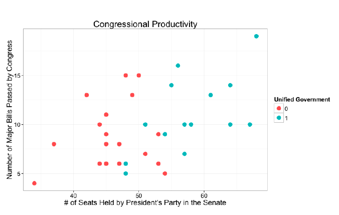
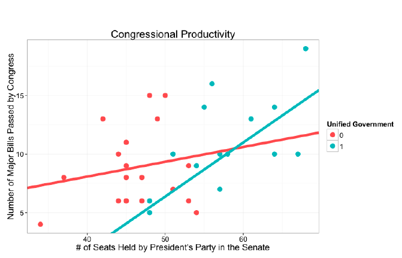
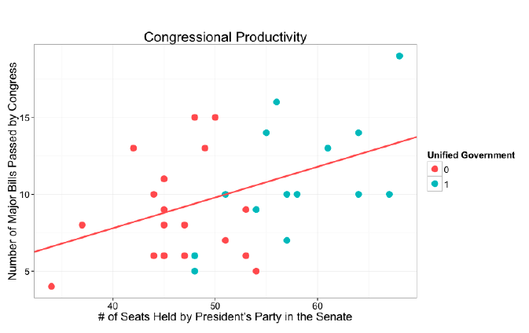

## Learning Objectives

Additive multiple regression assumes that each predictor has the same slope across values of the other predictors. This reading introduces conditional models, in which the relationship between one predictor and the outcome depends on another predictor. After reading this material you should be able to:

- Explain why a pooled additive slope can conceal a conditional relationship
- Specify an interaction model and identify its constituent terms
- Interpret interactions between a categorical and an interval predictor
- Interpret interactions between two interval predictors
- Calculate conditional slopes from interaction coefficients

## Conditional or Interactive Relationships

Sometimes, the relationship between $X_1$ and $Y$ varies based on the value of $X_2$.

Consider that the effect of the number of Senate seats held by the president's party, **pptysen**, on the number of major **bills** passed may differ depending on whether government is unified or divided, i.e., depending on the value of **filunif**.

The plot below presents a scatter plot illustrating the relationship between **pptysen** and **bills** in which the points are colored based on whether government is unified or divided.

{fig-alt="Scatterplot of major bills passed by Congress against the number of seats held by the president's party in the Senate. Points are colored by whether government is unified or divided. The pattern suggests that the relationship between Senate seats and major bills may differ across the two types of government." width="75%"}

The plot suggests that the relationship between **pptysen** and **bills** is different depending on the value of **filunif**. In fact, if you estimate a regression line for the red points denoting divided government and the greenish points denoting unified government and add these to our plot, you can see that the slopes are different. The number of seats held by the president's party more strongly predicts the number of major bills passed when government is unified (the slope is steeper).

{fig-alt="Scatterplot of major bills passed by Congress against the number of seats held by the president's party in the Senate, with separate regression lines for unified and divided government. The line for unified government is steeper, showing that additional Senate seats held by the president's party are associated with a larger increase in major bills when government is unified." width="75%"}

When the slope of the regression line varies across values of another variable, an interaction model is appropriate. A single pooled regression line averages across the different slopes and obscures how the relationship between **pptysen** and **bills** differs under unified and divided government.

{fig-alt="Scatterplot of major bills passed by Congress against the number of seats held by the president's party in the Senate, with one pooled regression line for all observations. The single line averages over unified and divided government and hides the fact that the relationship is steeper under unified government." width="75%"}

In this example, the relationship between the number of seats held by the president's party and major bills depends on whether government is unified or divided. It is equally true that the difference between unified and divided government depends on the number of seats held by the president's party. *In an interaction, the relationship involving either variable depends on the value taken by the other.*

## Specifying Conditional Relationships

To deal with conditional relationships like the one illustrated above, you include a multiplicative interaction between $X_1$ and $X_2$ in the regression model. In other words, you add $X_1 \times X_2$ to the model. *Always include the constituent terms that make up the interaction in the model in addition to the interaction term!* The coefficients on those constituent terms are also called the **main effects**, and you will meet both names in published work.

$$Y_i = \alpha + \beta_1 X_{1,i} + \beta_2 X_{2,i} + \beta_3 X_{1,i}X_{2,i} + \cdots + \epsilon_i.$$

In words, this model includes $X_1$, $X_2$, and their product. The product term allows the slope for $X_1$ to differ depending on the value of $X_2$. The individual terms, $X_1$ and $X_2$, still belong in the model because the interaction coefficient captures how the slope changes.

## Interpreting Conditional Relationships

::: {.tip}
**A note on the word effect.** Throughout this reading, the *effect* of $X_1$ on $Y$ means the estimated association between them implied by the model --- the change in the predicted value of $Y$ that goes with a one-unit change in $X_1$. That is the conventional statistical term, and it does not by itself mean that changing $X_1$ would cause $Y$ to change.
:::

Interpretation of conditional relationships depends on the level of measurement of the constituent variables -- the two variables involved in the interaction.

### $X_1$ Is a Binary Categorical Variable and $X_2$ Is Measured at the Interval Level

Consider the following regression where:

$$\hat{Y}_i = \hat{\alpha} + \hat{\beta}_1 X_{1,i} + \hat{\beta}_2 X_{2,i} + \hat{\beta}_3 X_{1,i}X_{2,i} + \cdots.$$

How do you interpret the conditional relationship if $X_1$ is a binary categorical variable and $X_2$ is an interval-level variable?

1. $\hat{\alpha}$ tells you the expected value of $Y$ when all the predictors, including the interaction term, are zero. Thus it gives us the expected value for the **reference category** --- the category of $X_1$ coded 0 --- when $X_2$ and all other variables have a value of zero.
2. $\hat{\beta}_1$ is the difference in the expected value of $Y$ between the category coded 1 and the reference category when $X_2=0$.
3. $\hat{\alpha} + \hat{\beta}_1$ is the expected value of $Y$ for the category coded 1 when $X_2=0$ and all other predictors are zero.
4. $\hat{\beta}_2$ is the effect of $X_2$ on $Y$ when $X_1=0$, i.e., when the case is in the reference category.
5. $\hat{\beta}_3$ is the **additional** effect of $X_2$ on $Y$ when $X_1=1$. Thus it is the amount by which the slope for $X_2$ changes for the category coded 1. The difference in the expected value of $Y$ between the two categories widens or shrinks as the value of the interval-level variable increases.

This case matches the example presented above. The estimated regression model is given by:

$$\widehat{\textbf{bills}}_i  =  3.01 - 19.68\,\textbf{filunif}_i + 0.13\,\textbf{pptysen}_i + 0.33\,(\textbf{filunif}_i \times \textbf{pptysen}_i).$$

Let's interpret our results:

- 3.01 is the expected number of **bills** when government is divided (**filunif** = 0) and the president's party has no seats (**pptysen** = 0).
- -19.68 is the *difference* in the expected number of **bills** when government is unified compared to when it is divided when the president's party has no seats.
- 3.01 - 19.68 is the expected number of **bills** when government is unified and the president's party has no seats.
- 0.13 is the effect of each additional seat held by the president's party on the average number of major **bills** passed when there is not unified government.
- 0.33 is the **additional** effect of each additional POTUS seat when government is unified.

As in simple regression, the first three quantities describe the model at **pptysen** $= 0$, which no Congress approaches --- the president's party has never held fewer than about 30 Senate seats. Note that 3.01 $-$ 19.68 is negative, and a Congress cannot pass a negative number of bills. The intercept and the category difference at zero are parts of the equation rather than substantive predictions.

Thus, each additional seat held by the president's party is associated with about 0.13 additional bills when government is divided and about $0.13 + 0.33 = 0.46$ additional bills when government is unified. Those two numbers are **conditional slopes**: the slope for one predictor calculated at a particular value or category of the other. The interaction coefficient, 0.33, is not itself a conditional slope and it is not the total effect under unified government. It is the amount by which the slope changes under unified government.

::: {.caution}
**The central rule for interactions.** Do not interpret the interaction coefficient by itself as "the effect" of either variable. The interaction coefficient tells you how an effect changes. To get the relevant effect, calculate the conditional slope for the specific value or category you care about.
:::

### $X_1$ Is a Categorical Variable with More Than Two Categories

Nothing new happens when the categorical variable has more than two categories. There is simply more of it. A variable with $k$ categories enters the model as $k-1$ binary variables, one for every category except the reference, so interacting it with an interval variable produces $k-1$ product terms.

Suppose we replace **filunif** with a three-category measure of party control: divided government, unified Democratic government, and unified Republican government, with divided government as the reference category. Suppose the estimated model is

$$\begin{aligned}
\widehat{\textbf{bills}}_i = {} & 3.01 - 19.68\,\textbf{UnifiedDem}_i - 12.40\,\textbf{UnifiedRep}_i + 0.13\,\textbf{pptysen}_i \\
& + 0.33\,(\textbf{UnifiedDem}_i \times \textbf{pptysen}_i) + 0.21\,(\textbf{UnifiedRep}_i \times \textbf{pptysen}_i).
\end{aligned}$$

The interpretation follows the binary case term by term:

1. $3.01$ is the expected number of **bills** for the reference category, divided government, when **pptysen** $= 0$.
2. $-19.68$ and $-12.40$ are the differences in expected **bills** between each unified-government category and divided government when **pptysen** $= 0$.
3. $0.13$ is the slope of **pptysen** for the reference category.
4. $0.33$ and $0.21$ each say how much that category's slope differs from the reference category's slope.
5. A category's conditional slope is $0.13$ plus its own interaction coefficient.

So the three conditional slopes are $0.13$ under divided government, $0.13 + 0.33 = 0.46$ under unified Democratic government, and $0.13 + 0.21 = 0.34$ under unified Republican government.

One comparison is missing, and it is the one people most often want. Every interaction coefficient here compares a category to the *reference* category. The difference between unified Democratic and unified Republican government --- $0.46 - 0.34 = 0.12$ --- appears nowhere in the output, because neither is the reference. To put that comparison in the output, make one of them the reference category and re-estimate.

### Both $X_1$ and $X_2$ Are Measured at the Interval Level

Consider again the regression where:

$$\hat{Y}_i = \hat{\alpha} + \hat{\beta}_1 X_{1,i} + \hat{\beta}_2 X_{2,i} + \hat{\beta}_3 X_{1,i}X_{2,i} + \cdots.$$

If both $X_1$ and $X_2$ are interval-level variables then:

1. $\hat{\beta}_1$ is the effect of $X_1$ on $Y$ when $X_2=0$.
2. $\hat{\beta}_2$ is the effect of $X_2$ on $Y$ when $X_1=0$.
3. $\hat{\beta}_3$ tells us how the effect of $X_1$ changes as $X_2$ increases by one unit, and equivalently how the effect of $X_2$ changes as $X_1$ increases by one unit.
4. The effect of $X_1$ on $Y$ at a specific value of $X_2$ is $\hat{\beta}_1 + \hat{\beta}_3 X_2$.
5. The effect of $X_2$ on $Y$ at a specific value of $X_1$ is $\hat{\beta}_2 + \hat{\beta}_3 X_1$.

Suppose we think the relationship between the number of seats held by the president's party and the number of major bills passed depends on how popular the president is. A president with strong public support may be able to convert a given number of seats into more legislation than an unpopular president can. That is a claim about a slope depending on another variable, so it calls for an interaction.

Suppose the estimated model is

$$\widehat{\textbf{bills}}_i = -2.50 + 0.06\,\textbf{pptysen}_i - 0.08\,\textbf{approval}_i + 0.004\,(\textbf{pptysen}_i \times \textbf{approval}_i),$$

where **approval** is the president's approval rating in percentage points.

The interaction coefficient, 0.004, says that each additional point of approval adds 0.004 to the slope of **pptysen**. Rule 4 turns that into something we can read. The conditional slope of **pptysen** is $0.06 + 0.004 \times \textbf{approval}$:

- At 40 percent approval: $0.06 + 0.004 \times 40 = 0.22$ bills per seat.
- At 60 percent approval: $0.06 + 0.004 \times 60 = 0.30$ bills per seat.

So an additional Senate seat is worth about 0.22 major bills when the president is at 40 percent approval and about 0.30 when he is at 60 percent. Twenty points of approval change what a Senate seat is worth by $20 \times 0.004 = 0.08$ bills.

The relationship runs the other way as well, and rule 5 gives it. The conditional slope of **approval** is $-0.08 + 0.004 \times \textbf{pptysen}$:

- With 30 seats: $-0.08 + 0.004 \times 30 = 0.04$ bills per point of approval.
- With 55 seats: $-0.08 + 0.004 \times 55 = 0.14$ bills per point of approval.

Approval buys more legislation when the president's party holds more seats. Setting that conditional slope to zero shows where it changes sign: $-0.08 + 0.004 \times \textbf{pptysen} = 0$ when **pptysen** $= 20$, so in this model approval is associated with more legislation only once the president's party holds more than 20 Senate seats. This is the same interaction read from the other side, not a second finding.

Notice the negative coefficient on **approval**, $-0.08$. It is tempting to read it as saying that a more popular president passes fewer bills. It says nothing of the kind. By rule 2 it is the slope of **approval** when **pptysen** $= 0$ --- in a Congress where the president's party holds no Senate seats at all. No such Congress exists, so the number describes a case the data never contain. The same warning applies to 0.06, the slope of **pptysen** when approval is zero. **In an interaction model with two interval predictors, neither constituent coefficient is "the effect" of its variable.** Each is a conditional slope evaluated at zero on the other, and zero is often nowhere near the data.

### Both $X_1$ and $X_2$ Are Binary Categorical Variables

Consider again the following regression:

$$\hat{Y}_i = \hat{\alpha} + \hat{\beta}_1 X_{1,i} + \hat{\beta}_2 X_{2,i} + \hat{\beta}_3 X_{1,i}X_{2,i} + \cdots.$$

How do you interpret interactions if both $X_1$ and $X_2$ are binary (2-category) variables?

1. The intercept gives the expected value of $Y$ when $X_1$ and $X_2$ are both zero.
2. $\hat{\beta}_1$ is the difference in the expected value of $Y$ when $X_1=1$ and $X_2=0$, compared to when both are zero.
3. $\hat{\beta}_2$ is the difference in the expected value of $Y$ when $X_1=0$ and $X_2=1$, compared to when both are zero.
4. $\hat{\beta}_3$ is the **additional** effect when $X_1$ and $X_2$ are both equal to one.
5. $\hat{\beta}_1 + \hat{\beta}_2 + \hat{\beta}_3$ is the difference in the expected value of $Y$ when $X_1$ and $X_2$ are both 1, compared to when both are zero.

This case is included for reference. The tutorials work through the categorical-by-interval and interval-by-interval cases.

## Testing the Interaction

Testing an interaction is mechanically no different from testing any other coefficient. Suppose that in the model above the interaction coefficient of 0.33 has a standard error of 0.12. The t-statistic is $0.33 / 0.12 = 2.75$, with a p-value of about .008, so we reject the null hypothesis at the .05 level. Be clear about what that null says: $H_0: \beta_3 = 0$ states that the slope of $X_1$ does not depend on $X_2$ --- that the additive model, without the product term, is adequate. Rejecting it is evidence that the relationship is conditional. By itself it says nothing about the size of either conditional slope, and nothing about whether either one is significant.

Making sense of the results is the harder part, and the same questions come up every time.

**What if the interaction is significant but a constituent term is not?** This is not a contradiction. Suppose that in the unified-versus-divided example above the coefficient on **pptysen**, 0.13, is not significant while the interaction, 0.33, is. Remember what 0.13 is: the slope of **pptysen** for the reference category, divided government. So the two results say that we cannot distinguish the seats--bills relationship from zero under divided government, and that we can distinguish the unified-government slope from the divided-government slope. Read together, they point to a relationship that holds under unified government and not under divided government. That is a substantive finding, not a flaw in the model.

**Does the output tell you whether the other category's slope is significant?** No. The table reports a test of $\hat{\beta}_2$, the slope for the reference category, and a test of $\hat{\beta}_3$, the difference between the two slopes. It reports no test of $\hat{\beta}_2 + \hat{\beta}_3$, the slope for the other category. That quantity has a standard error of its own, which depends on the variability of both estimates and on how they vary together, and it cannot be recovered from the numbers printed in the table. The practical solution is to choose the reference category so that the comparison your hypothesis names is the one the output tests, and to re-estimate the model with a different reference category when you need a different comparison.

**What if some interaction terms are significant and others are not?** With a $k$-category predictor the model contains $k-1$ interaction coefficients, and each one tests that category's slope against the *reference category's* slope --- nothing else. If two of three are significant, that means two categories' slopes differ detectably from the reference category's. It does not mean those two are the largest, and it does not tell you whether they differ from each other. Change which category serves as the reference and the pattern of significant terms will change, even though the model, its fitted values and every conditional slope are exactly the same. The pattern of asterisks describes a set of comparisons to one chosen category. It is not a ranking.

**How do you test whether the slopes differ across the groups at all?** Because the individual tests only make comparisons to the reference, none of them answers that question. It requires testing all $k-1$ interaction coefficients together, which is an F-test comparing the model with the interaction to the model without it. A significant F says the slopes are not all equal; it does not say which pair differs. Where there is only one interaction term, the joint test adds nothing, because it asks exactly what the t-statistic already answered.

**What if the interaction is not significant?** Read a null result carefully. An interaction is estimated from differences between subgroups rather than from the sample as a whole, so it carries less information than a main effect and is estimated less precisely. Failing to reject tells you that the data could not distinguish the slopes. It does not establish that the slopes are equal.

## The Takeaways

An **interaction** allows the relationship between one predictor and the outcome to depend on another predictor. A pooled additive model imposes a common slope and can therefore conceal substantively important differences across contexts or groups.

Always include the two constituent predictors along with their product term. The interaction coefficient does not give the full slope for either predictor. It tells you how a slope or category difference changes. To interpret the model, combine the relevant constituent coefficient with the interaction coefficient at the value or category of interest --- that combination is the **conditional slope**, and it is the quantity worth reporting.

Be careful with the constituent coefficients themselves. Each one describes the relationship between its predictor and the outcome when the *other* predictor equals zero. With a categorical predictor, zero is the reference category and that reading is straightforward. With two interval predictors, zero may be a value the data never contain, and the coefficient then describes a case that does not exist.

Which comparisons you can see, and which you can test, both depend on the reference category. Every interaction coefficient in a model with a categorical predictor compares one category to the reference, so the difference between two non-reference categories appears nowhere in the output and no p-value tests it. Choose the reference category so that the comparison your hypothesis names is the one the model reports.

Testing an interaction asks whether the relationship is conditional at all. Rejecting the null says the slopes differ; it says nothing about the size or significance of any particular conditional slope. Failing to reject is weaker evidence than it looks, because interactions are estimated from differences between subgroups and are estimated imprecisely. When a categorical predictor has more than two categories, only a joint F-test asks whether the slopes differ across all of the groups.

Because interaction coefficients are difficult to understand in isolation, conditional slopes, predicted values, and plots are usually the clearest way to communicate what the model implies.
