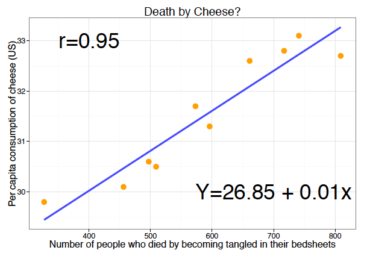
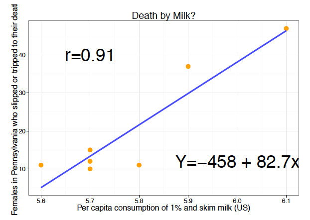
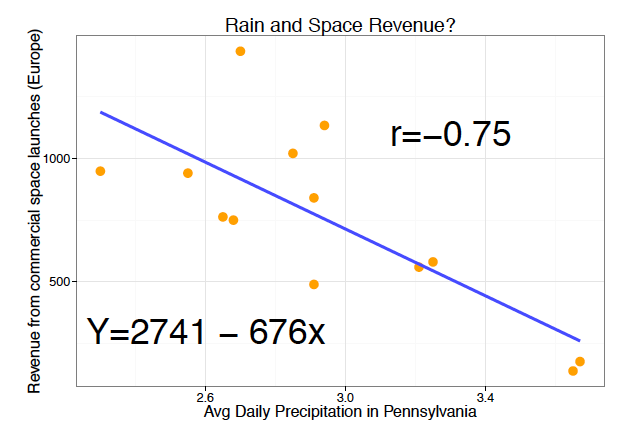

## Learning Objectives

In this lesson you will extend your understanding of regression to models with multiple predictors. The discussion begins with why and when additional variables belong in a model, followed by coefficient interpretation, hypothesis testing, model fit, and nominal predictors with more than two categories. After reading this material you should be able to:

- List the conditions necessary for a causal relationship to exist
- Explain when spurious relationships and multiple correlated causes require additional variables in a regression model
- Correctly interpret coefficients in a multiple regression model for interval and categorical predictors
- Correctly specify a regression model in which the outcome is a function of a nominal predictor with more than two categories
- Assess model fit in a multiple regression model
- Explain why some relationships may be conditional rather than additive

You should also be thinking about control variables that you will want to include in the analysis of your research question conducted in the problem sets.

In this reading we will move in four steps. First, we will review why a relationship between two variables is not enough to establish causation. Second, we will identify situations in which omitting another variable creates a problem. Third, we will learn how to interpret and assess multiple regression models. Finally, we will look at nominal predictors with more than two categories and briefly consider relationships that may differ across contexts.

## Multiple Regression

The previous lesson introduced regression analysis in the context of a single explanatory variable, or **predictor**. Typically you will want and need to include several predictors in your model. This lesson introduces the concept of "control" in regression analysis and explains how to interpret results from multiple regression analysis.

Just because two variables are related does not imply one causes the other! Lots of weird things correlate. Consider some comical examples below based on real data.

::: {layout-ncol=3}
{fig-alt="Scatterplot titled Death by Cheese? showing a strong positive correlation between per capita cheese consumption and the number of people who died by becoming tangled in their bedsheets."}

{fig-alt="Scatterplot titled Death by Milk? showing a strong positive correlation between per capita milk consumption and females in Pennsylvania who slipped or tripped to their death."}

{fig-alt="Scatterplot titled Rain and Space Revenue? showing a strong negative correlation between average daily precipitation in Pennsylvania and revenue from commercial space launches in Europe."}
:::

No one believes cheese or milk cause death or that rainfall causes revenue for the space program to fall. So what must be true for a causal relationship?

1. There must be a logical expectation that $X$ causes $Y$. In other words, you need to have a theoretical expectation that one variable causes another.
2. There must be an association between variables.
3. $X$ must come before $Y$ temporally (often tricky to determine).
4. There must be no alternative (confounding) explanations that you have ignored. This condition cannot be verified --- only argued for.

If these criteria are not met, an observed association is not sufficient evidence that $X$ causes $Y$. A simple regression with one predictor often leaves plausible alternative explanations unaccounted for, especially when political and social outcomes have multiple causes. Multiple regression lets us ask whether the relationship of interest persists once the alternatives we thought of, and were able to measure, are included in the model.

Be clear about what that does and does not buy. Adding controls addresses the rival explanations you happened to think of. It does nothing about the ones you did not, and no statistical test will tell you whether they exist. Causal inference is a central preoccupation of contemporary political science, and the standard of evidence is demanding: what clears it are designs that create a credible comparison, such as an experiment that assigns the treatment at random. A regression fitted to observational data, with control variables chosen by the analyst, almost never clears that bar. That is not a reason to skip the controls --- a relationship that survives them is more credible than one that does not --- but it does determine what you may claim at the end. You will be reporting evidence consistent with your explanation, not a demonstration that $X$ causes $Y$.

None of this makes regression on observational data useless, and it is worth resisting that conclusion. For most questions worth asking there is no experiment to run --- you cannot randomly assign a country's electoral system or a state's unemployment rate --- and the alternative to imperfect evidence about important questions is not better evidence but anecdote. Regression also earns its keep in ways that do not require clearing the causal bar. It establishes whether the pattern your theory predicts is present at all and how large it is, and a theory whose predicted relationship fails to appear, once the obvious alternatives are included, has been given a real test and has failed it. Negative results of that kind are among the most informative things an observational analysis produces. And the designs that do clear the bar are themselves regressions with a research design attached; you do not reach them by skipping this.

The next section explains which alternative explanations need to be considered when specifying a regression model.

## For What Explanations Must You Control?

There are three scenarios that necessitate you include control variables in your regression model or you risk making incorrect inferences -- drawing the wrong conclusions -- about the relationships in your data.

### Spurious Relationships

The first scenario gives rise to a **spurious relationship**. A spurious relationship is one that appears to be true but is not, in fact, true. It arises because you have omitted some variable, call it $X_2$, that causes both the predictor included in the regression and also the outcome variable. In the diagram below, $Y$ is the outcome variable in the regression and $X_1$ is the predictor. If an arrow goes from one variable to another, it signifies that there is a causal relationship from one variable to the other. If there is no arrow, then there is no causal link between the two variables. In the diagram below, the predictor, $X_1$, has no effect on $Y$. Instead, $X_2$ causes both $X_1$ and $Y$. If this is the true state of the world, a simple regression of $Y$ on $X_1$ will indicate that there is a relationship between $X_1$ and $Y$, but what appears to be a relationship between $X_1$ and $Y$ in a simple regression is spurious (not true).

```{mermaid}
%%| fig-cap: "A spurious relationship. X2 causes both X1 and Y. X1 does not cause Y."
flowchart LR
  X2["X₂<br/>Omitted cause"] --> X1["X₁<br/>Predictor"]
  X2 --> Y["Y<br/>Outcome variable"]
```

As an example, consider what would happen if you estimated a regression in which **Fire Damage** was the outcome variable and **Number of Firemen** was your only predictor. You would find that the more firemen at a blaze, the worse the damage. Of course, this is because **Severity of the fire** determines both **Number of Firemen** and **Fire Damage** and not because firemen cause fire damage.

```{mermaid}
%%| fig-cap: "Fire severity creates a spurious relationship between the number of firemen and fire damage."
flowchart LR
  X2["X₂<br/>Severity of fire"] --> X1["X₁<br/>Number of firemen"]
  X2 --> Y["Y<br/>Fire damage"]
```

To guard against a spurious conclusion, think carefully about whether another variable might cause both the predictor and the outcome. If so, include that variable in the model. If the apparent $X_1$-$Y$ relationship is genuinely spurious and $X_2$ captures the common cause, the coefficient on $X_1$ should disappear or substantially weaken after $X_2$ is added.

### Multiple, Correlated Predictors

The second case represents the most common situation you will encounter in your analysis, when you have omitted variables that are correlated with the variables in your model and that also cause $Y$. This situation is represented in the diagram below.

$X_1$ and $X_2$ are correlated (here $X_1$ causes $X_2$, as indicated by the arrow from $X_1$ to $X_2$) and both $X_1$ and $X_2$ cause $Y$. In this situation, omitting either $X_1$ or $X_2$ can distort the coefficient on the included predictor because that coefficient may also capture part of the relationship involving the omitted predictor. The coefficient may become larger or smaller depending on how the two predictors are related to each other and to $Y$.

```{mermaid}
%%| fig-cap: "Multiple, correlated predictors. X1 and X2 are related to each other, and both cause Y."
flowchart LR
  X1["X₁<br/>Predictor"] --> X2["X₂<br/>Correlated cause"]
  X1 --> Y["Y<br/>Outcome variable"]
  X2 --> Y
```

As an example, consider that the **restrictiveness of a state's gun laws** and the **gun ownership rate** are likely to both influence the **homicide rate** in a state. The **restrictiveness of a state's gun laws** and the **gun ownership rate** are also likely to be negatively correlated. If you omit either of these variables from the regression model of homicide rates, the estimated effect of the included variable may be too large or too small because that coefficient may also capture part of the relationship involving the omitted variable.

```{mermaid}
%%| fig-cap: "Gun law restrictiveness and gun ownership are correlated, and both may affect homicide rates. The undirected line means the two are related without a claim about which causes which."
flowchart LR
  X1["X₁<br/>Restrictiveness of state gun laws"] --- X2["X₂<br/>Gun ownership rate"]
  X1 --> Y["Y<br/>Homicide rate"]
  X2 --> Y
```

In this case you can address the problem by including both variables in the model. Often you will have hypotheses about one predictor but know that it is correlated with other variables that also help explain the outcome. You should include those variables when theory identifies them as competing explanations and they are correlated with the predictor of interest. Doing so separates the predictor's estimated relationship with $Y$ from the overlapping relationships involving those measured controls. It does not rule out distortion from other omitted variables or from a poorly specified model.

### Conditional or Interactive Relationships

Multiple regression usually assumes that the relationship between each predictor and the outcome is the same across values of the other predictors. Sometimes that assumption is too restrictive. The relationship may instead be **conditional**: the slope of one predictor may differ depending on the value or category of another predictor.

For example, the relationship between **education** and **income** may differ by age. If additional education predicts a larger income difference for younger workers than for older workers, one common slope cannot describe both groups accurately. Interaction models allow the relationship between one predictor and the outcome to depend on another predictor. The separate reading on conditional models develops the equations and interpretation for these models.

### To Summarize

The table below summarizes the different types of relationships that may be involved between three variables. The three covered above are given in the first, fifth, and third rows of the table, respectively, with the word **Yes** in the first column. This indicates that these are situations in which the model must account for $X_2$, even if you care only about the effect of $X_1$ on $Y$. For the first and fifth rows that means including $X_2$ as a control; for the interaction row it means including the product term as well.

The remaining rows of the table, indicated with **No**, represent cases for which you do not need to control for $X_2$. In the first of these (row 2), there is a chain relationship: $X_1$ causes $X_2$, which causes $Y$. Thus $X_2$ is the proximate cause of $Y$. However, it is still true that $X_1$ has an effect on $Y$. $X_2$ is called an intervening variable. Often there is reason to suspect that there may be an intervening variable. For example, education may affect an individual's level of political tolerance because education exposes people to a larger variety of people and information. In many cases you simply cannot measure intervening variables.

The final type of relationship occurs when both $X_1$ and $X_2$ cause $Y$ (row 4) but $X_1$ and $X_2$ are not correlated. In this case, you can accurately estimate the effect of either variable even if you omit the other from the regression model. You can think of it this way: $X_1$ will not take credit for explaining variation in $Y$ due to $X_2$ if they are not correlated with each other.

<div class="table-container">
<table class="reading-table">
<caption>Table 1: Some Three-Variable Relationships</caption>
<thead>
<tr>
<th scope="col">Must the model account for $X_2$?</th>
<th scope="col">Relationship</th>
<th scope="col">What happens after controlling for $X_2$?</th>
</tr>
</thead>
<tbody>
<tr>
<td><strong>Yes</strong></td>
<td>Spurious $X_1$-$Y$ association: $X_2$ causes both $X_1$ and $Y$.</td>
<td>The association between $X_1$ and $Y$ disappears or substantially weakens.</td>
</tr>
<tr>
<td><strong>No</strong></td>
<td>Chain relationship: $X_1 \rightarrow X_2 \rightarrow Y$; $X_2$ intervenes.</td>
<td>The association between $X_1$ and $Y$ disappears, but $X_1$ still indirectly causes $Y$.</td>
</tr>
<tr>
<td><strong>Yes</strong></td>
<td>Interaction: the effect of $X_1$ on $Y$ varies by $X_2$.</td>
<td>The association between $X_1$ and $Y$ varies according to the value of $X_2$. The model must include $X_1$, $X_2$ <em>and</em> their product --- adding $X_2$ alone is not enough.</td>
</tr>
<tr>
<td><strong>No</strong></td>
<td>Multiple causes: $X_1$ and $X_2$ both cause $Y$, but $X_1$ and $X_2$ are not correlated.</td>
<td>The association between $X_1$ and $Y$ does not change.</td>
</tr>
<tr>
<td><strong>Yes</strong></td>
<td>Multiple, correlated predictors: $X_1$ causes $X_2$, and both cause $Y$, so $X_1$ has both a direct and an indirect effect on $Y$.</td>
<td>The association between $X_1$ and $Y$ changes, but does not disappear. Controlling for $X_2$ leaves the direct relationship only; the indirect path running through $X_2$ is no longer part of the $X_1$ coefficient.</td>
</tr>
</tbody>
</table>
</div>

## Estimating a Model with Correlated Predictors

Let's return to the case where there are multiple, correlated predictors. In this case you must include each of the correlated variables in the model if you want to separate their individual relationships with $Y$. If that means you have to include two predictors you write the population regression equation as:

$$Y_i = \alpha + \beta_1 X_{1,i} + \beta_2 X_{2,i} + \epsilon_i.$$

In words, this equation says that the value of $Y$ for observation $i$ is a function of the intercept, the value of the first predictor for observation $i$, the value of the second predictor for observation $i$, and an error term. The error term captures the part of $Y$ not explained by the variables in the model.

### Interpreting Multiple Regression

Very little changes in the analysis you undertake when there are multiple predictors; only the interpretation of the coefficients changes.

- The intercept, $\hat{\alpha}$, is now the expected value of $Y$ when **all predictors equal 0**.
- The slope, $\hat{\beta}_k$, tells us how much the predicted value of $Y$ changes, on average, for a one-unit increase in $X_k$, **holding all other predictors constant**.

One caution: including correlated predictors is often necessary, but if two predictors are extremely highly correlated, it can be difficult for the model to estimate their separate effects precisely. This problem is called **multicollinearity**. Multicollinearity does not mean the model is useless, and it does not change the basic logic of control variables. It means we should be cautious about interpreting the individual coefficients for variables that are so closely related that the model has trouble separating their effects. This course does not go further than that. We will not diagnose or correct multicollinearity, and the tutorials do not return to it. What matters here is knowing that the problem exists, and that very highly correlated predictors are a reason to read individual coefficients cautiously.

Consider the regression table below, which presents results for a regression analysis in which the number of major bills passed in a Congress, **bills**, is the outcome variable and the predictors are the number of seats held by the president's party in the Senate (POTUS Senate Seats, **pptysen**) and the **Congress Number**. The analysis covers 34 Congresses, spanning the Truman through Obama administrations.

<div class="table-container narrow-table">
<table class="regression-table">
<caption>Table 2: Models of Number of Major Bills Passed</caption>
<thead>
<tr><th scope="col"></th><th scope="col">Model 1</th></tr>
</thead>
<tbody>
<tr><th scope="row">Intercept</th><td>-13.08*</td></tr>
<tr class="se-row"><th scope="row"></th><td>(6.48)</td></tr>
<tr><th scope="row">POTUS Senate Seats</th><td>0.20*</td></tr>
<tr class="se-row"><th scope="row"></th><td>(0.07)</td></tr>
<tr><th scope="row">Congress Number</th><td>0.13*</td></tr>
<tr class="se-row"><th scope="row"></th><td>(0.06)</td></tr>
<tr class="summary-row"><th scope="row">N</th><td>34</td></tr>
<tr><th scope="row">$R^2$</th><td>0.31</td></tr>
<tr><th scope="row">Residual standard error</th><td>3.16</td></tr>
</tbody>
</table>
<p class="table-note">Standard errors in parentheses. * indicates significance at $p < 0.05$.</p>
</div>

**Interpreting the intercept.** The intercept, $\hat{\alpha}$, is the expected value of **bills** when **all predictors equal 0**, so when the number of seats held by the president's party, **pptysen**, is 0 and the **Congress Number** is 0:

$$\widehat{\textbf{bills}}_i = \hat{\alpha} + \hat{\beta}_1 \times 0 + \hat{\beta}_2 \times 0.$$

In this case, you infer that $\hat{\alpha}= -13.08$ major **bills** are expected to be passed. Generally the intercept value will not be an interesting (or even meaningful) quantity because the predictors in our sample data (or in the population) do not take zero values -- this is the case here.

**Interpreting the slope.** Holding **Congress Number** constant, each additional Senate seat held by the president's party predicts 0.20 more major bills, on average.

Similarly, holding **pptysen** constant, each additional **Congress Number** predicts 0.13 more major bills, on average. More bills have been passed over time.

::: {.callout-note appearance="minimal" title="Pause and check"}
What does **holding Congress Number constant** mean in the interpretation of the **pptysen** coefficient? It does not mean Congress Number is unimportant. It means we are comparing Congresses with the same value of Congress Number and asking how the expected number of major bills changes as the president's party holds more Senate seats.
:::

### Calculating Predicted Values

As in simple regression, the fitted equation predicts a value of the outcome for any case we care to describe. The only thing that changes is that we now have to supply a value for *every* predictor in the model, not just one.

Take a Congress in which the president's party held 55 Senate seats, and set the **Congress Number** to 110. Substituting both into the fitted equation:

$$\widehat{\textbf{bills}} = -13.08 + (0.20 \times 55) + (0.13 \times 110) = 12.22.$$

The model predicts about 12 major bills for a Congress with those two characteristics.

Now change one predictor and leave the other alone. With 56 Senate seats and the **Congress Number** still at 110, the prediction becomes $-13.08 + (0.20 \times 56) + (0.13 \times 110) = 12.42$. The difference between the two predictions is 0.20 --- the slope on **pptysen**. That is what "holding **Congress Number** constant" means in arithmetic: we moved one predictor by a single unit, left the other where it was, and got the coefficient back. As in the previous lesson, be wary of predictions built from values far outside the range the data actually cover.

### Comparing Predictors

A natural question about any multiple regression is which predictor matters most. It is tempting to answer by looking for the largest coefficient, but that comparison is not valid. A slope is expressed in the units of its own predictor, and two predictors are rarely measured on the same scale.

Table 2 makes the problem visible. The slope on **pptysen** is 0.20 and the slope on **Congress Number** is 0.13, which look close. But one describes what happens when the president's party gains a single Senate seat, and the other describes what happens between one Congress and the next. Those are not comparable units, so the two numbers cannot be ranked against each other. The problem is sharper when the scales differ wildly: in a model of infant mortality, a slope on GDP per capita measured in dollars will be a tiny number and a slope on physicians per 1,000 people will be a large one, and neither fact tells us anything about which matters more.

What makes a slope large or small in practice is what a one-unit difference represents relative to the variation we actually observe. A one-dollar difference in GDP per capita is nothing; a one-physician difference per 1,000 people is a great deal. To put predictors on a common footing, multiply each slope by the standard deviation of its own predictor. The standard deviation is a natural anchor because it summarizes what a typical difference between cases looks like --- a one-standard-deviation difference is common but not extreme. The result answers the same question for every predictor in the model: how much does the predicted outcome change for a typical difference in this variable, holding the others constant?

This is a special case of something you already know. For a difference of any size $c$, the predicted change in the outcome is $c \times \hat{\beta}$. Setting $c$ to the predictor's standard deviation is simply a useful choice of $c$, because it means the same amount of "typical variation" is being fed into every predictor.

Two cautions. First, this is a statement about the size of estimated relationships, not about which variable is causally more important --- the conditions for causation from the beginning of this reading still apply. Second, size and significance are separate questions: a predictor can move the outcome substantially across a typical difference and still be statistically insignificant, and a predictor with a small effect can be highly significant if it is precisely estimated.

### Hypothesis Testing in Multiple Regression

Hypothesis testing works exactly the same way as in simple regression. You follow the same five steps in identical fashion to test hypotheses about the intercept and slope: 1. State the null hypothesis; 2. State the alternative hypothesis; 3. Compute the test statistic; 4. Translate the test statistic to a p-value; and 5. Draw a conclusion. Like in the case of simple regression, the information for steps 3 and 4 can be read from the regression output by noting the t-value and the p-value for the estimate of interest in the output. In the tutorial, you will practice finding these values in R output. In the reading, we will focus on what the results mean.

Recall that a p-value tells us the probability of observing a result as extreme as ours -- or more extreme -- **if the null hypothesis were true**. It does not tell us the probability that the null hypothesis is true.

### The F-Statistic

At the bottom of R's regression output, below the fit statistics, is a line reporting an F-statistic, two degrees of freedom, and a p-value. It tests a different null hypothesis from the ones in the coefficients table. Each t-test above it asks whether one particular slope is zero in the population. The F-test asks whether *all* of the slopes are zero at once: $H_0: \beta_1 = \beta_2 = \cdots = \beta_k = 0$. Rejecting that null means the model as a whole predicts the outcome better than no predictors would --- better, that is, than simply guessing the mean of $Y$ for every case.

The two degrees of freedom R reports are the number of predictors, $k$, and the residual degrees of freedom, $n - k - 1$. Read the p-value the same way as any other: below 0.05, we reject the null that the model explains nothing.

In simple regression the F-test tells us nothing new, because with one predictor "all the slopes are zero" and "this slope is zero" are the same hypothesis. The F-test and the slope's t-test always agree there. The F-test becomes a test of its own only once a model has more than one predictor.

A significant F is a low bar. With a reasonable number of cases, a model can clear it comfortably while still leaving most of the variation in the outcome unexplained, which is why we report $R^2$ and the residual standard error rather than treating a significant F as evidence that a model is good. Regression tables, including the ones in this reading, often omit the F-statistic for that reason. This course does not go further with it than reading it off the output.

### Model Fit in Multiple Regression

Model fit is *almost* the same as in simple regression. The $R^2$ and residual standard error mean the same thing as in the bivariate case. But there are now two versions of $R^2$ to keep distinct.

The **Multiple $R^2$** has the cleanest interpretation: it is the proportion of the variation in the outcome that the model explains. An $R^2$ of 0.60 means the model explains about 60% of the variation in the outcome variable. Use this when describing how well a model fits.

The **Adjusted $R^2$** is a corrected version that penalizes for the number of predictors. Every variable you add to a regression model, even a useless one, will mechanically increase the Multiple $R^2$ at least a tiny bit, just because the model has more flexibility to fit the data. The formula for the Adjusted $R^2$ subtracts a penalty that grows with the number of predictors:

$$\text{Adjusted } R^2 = 1 - \left[ \frac{(1-R^2)(n-1)}{n-k-1} \right]$$

where $k$ is the number of predictors in the model. The Adjusted $R^2$ will be smaller than or equal to the Multiple $R^2$, and will increase only when an added variable improves fit enough to outweigh the penalty.

You do not have to memorize this formula. What matters is when to use each: use the **Multiple $R^2$** to describe the proportion of variation explained by the model; use the **Adjusted $R^2$** when comparing models that differ in the number of predictors, where the Multiple $R^2$ would mechanically favor the model with more variables regardless of whether they improve fit enough to justify their inclusion. Remember also that you cannot compare either $R^2$ across models unless the models use the exact same set of observations and the same outcome variable. **That last condition is easier to violate than it sounds:** R estimates a regression using only the cases with a recorded value for the outcome and for every predictor in the model, dropping the rest --- a rule called **listwise deletion**. Adding a predictor can therefore shrink the sample, so two models of the same outcome may rest on different sets of cases, which is why their $R^2$ values are not comparable and why you should report how many cases a model actually used.

## Nominal Predictors with Multiple Categories

In a multiple regression world, you can include nominal variables with more than one category and ordinal variables. When you do so, you include a binary variable for each category --- these are often called dummy variables --- but you include one fewer than you have categories. **The reason is the multicollinearity problem above in its most severe form:** a full set of binary variables sums to 1 for every case, exactly matching the column of 1s that produces the intercept, so a model containing all of them has no way to estimate a separate coefficient for each. Leaving one out resolves it. The omitted category is the **reference category**, sometimes called the baseline, and the coefficients for the included categories are interpreted relative to it. *Each coefficient is the difference between a given category and the reference category.*

Continuing with our example, assume you have a nominal variable that gives the president in office for each Congress. To determine whether the expected number of bills passed per Congress is different under different presidents, you need to create separate binary variables for each president *minus one president*. Each is coded 1 when that president is in office and 0 when he is not. The table below contains results for a regression model in which **bills** is our outcome variable and there is a binary variable for each president except Jimmy Carter, although our sample includes Congresses when he is in office. His presidency is the omitted, reference category, and is given by the intercept. Note that this example is overly simplified -- because it does not include any other predictors -- to focus on the interpretation of the effects of a nominal variable with multiple categories. You would want to include additional predictors if your goal was to estimate a fuller model of **bills** that accounts for competing explanations.

<div class="table-container">
<table class="regression-table categorical-table">
<caption>Table 3: Model of Major Bills Passed by President. Carter is the reference category.</caption>
<thead>
<tr><th scope="col"></th><th scope="col">Estimate</th><th scope="col">Standard Error</th></tr>
</thead>
<tbody>
<tr><th scope="row">Intercept</th><td>11.50*</td><td>(1.91)</td></tr>
<tr><th scope="row">Clinton</th><td>1.50</td><td>(2.34)</td></tr>
<tr><th scope="row">Eisenhower</th><td>-5.50*</td><td>(2.34)</td></tr>
<tr><th scope="row">Ford</th><td>-3.50</td><td>(3.31)</td></tr>
<tr><th scope="row">G. W. Bush</th><td>1.50</td><td>(2.34)</td></tr>
<tr><th scope="row">H. W. Bush</th><td>-4.50</td><td>(2.71)</td></tr>
<tr><th scope="row">Johnson</th><td>5.00</td><td>(2.71)</td></tr>
<tr><th scope="row">Kennedy</th><td>-1.50</td><td>(2.71)</td></tr>
<tr><th scope="row">Nixon</th><td>0.50</td><td>(2.47)</td></tr>
<tr><th scope="row">Obama</th><td>0.00</td><td>(2.71)</td></tr>
<tr><th scope="row">Reagan</th><td>-3.75</td><td>(2.34)</td></tr>
<tr><th scope="row">Truman</th><td>-4.75</td><td>(2.34)</td></tr>
</tbody>
</table>
<p class="table-note">Standard errors in parentheses. * indicates significance at $p < 0.05$.</p>
</div>

**Interpreting the intercept.** In this simplified model, the intercept, 11.50, represents the average number of major **bills** passed when Jimmy Carter was president because Carter is the omitted, reference category and there are no other predictors in the model. Thus, on average, 11.50 major bills were passed when Jimmy Carter was president. In a model with additional predictors, the intercept would represent the expected number of major **bills** for the reference category when the other variables in the model equal zero.

**Interpreting the slopes.** You interpret the slope coefficients on the binary variables with reference to the reference category. For example, the slope for **Clinton** = 1.50. This tells us that 1.50 *more* bills were passed when Clinton was president than when Jimmy Carter was president. Likewise, the slope for **Eisenhower**, -5.50, tells us that on average 5.50 *fewer* bills were passed per Congress when Eisenhower was president than when Jimmy Carter was president, and so on.

## Levels of Measurement and Predictors

To summarize what has been covered so far, if your predictor(s) are measured at the interval level, you include them "as is" in the regression. If a predictor is measured at the nominal level, you include it as a series of binary variables for all but one category. That omitted category becomes the reference category. Interpretation of the slopes on each of these variables is made relative to the reference category. Which category you choose as the reference will thus determine whether the slopes are significant (if any are). This may occur, for example, because the average value of $Y$ may be similar for the reference category and one other category but the average value of $Y$ for two further categories may be quite different. Generally the modal category is chosen as the reference, but it is up to you.

What if the predictor is measured at the ordinal level? Typically, if you are willing to assume the distances between categories are (approximately) the same, you treat the variable as if it were measured at the interval level. If it is not reasonable to assume the distances between categories are the same, however, you need to treat the variable as if it were nominal.

## The Takeaways

A simple regression can describe and test a bivariate relationship, but it is rarely sufficient by itself to support a causal conclusion. When the goal is to evaluate a causal explanation, you must consider competing explanations, possible confounders, and whether the relationship is conditional.

When another variable causes both the predictor and the outcome, the apparent relationship may be spurious. If the proposed common cause is measured appropriately and added to the model, the coefficient on the original predictor should disappear or substantially weaken. When multiple correlated variables help explain the outcome, including the theoretically relevant predictors allows the model to separate their overlapping relationships with $Y$. What it cannot do is account for variables you did not include, which is why a multiple regression on observational data supports a claim about association rather than a demonstration of cause.

In an additive multiple regression model, the slope for an interval predictor tells us how much the predicted value of the outcome changes for a one-unit increase in that predictor, **holding the other predictors constant**. A nominal predictor with more than two categories is represented by a set of binary indicators, with one category omitted as the reference category. Each included-category coefficient is interpreted relative to it.

Some relationships are conditional: the slope of one predictor differs across values or categories of another predictor. An additive model assumes a common slope, whereas an interaction model allows the slope to change. The separate reading on conditional models develops how to specify and interpret those models.

At this point in the semester, you should be thinking about the variables you need to include when estimating a model for the research question you proposed in the problem sets. What does your theory identify as competing explanations for the outcome? Which of those variables are likely to be related to your central predictor? There is no single correct number of controls. Include variables because the theoretical logic of the model calls for them, not simply because they are available.
