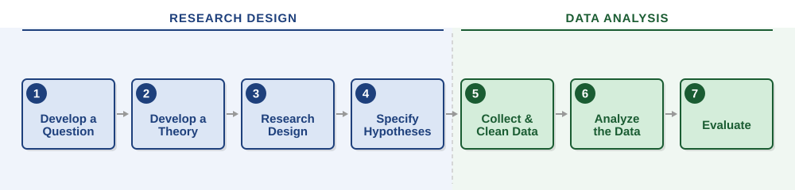
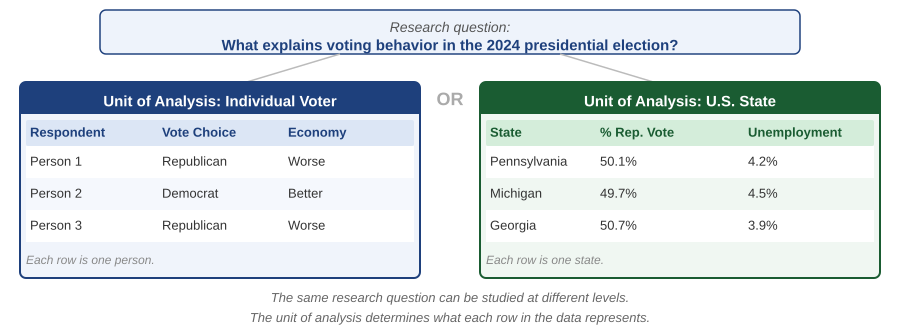

## How to Use This Reading

This reading provides an overview of the research process used in quantitative political analysis. You are not expected to master every step at once. The goal is to give you a big-picture understanding of how research works so that, as we move through the semester, you can see how each skill you are learning fits into the larger process. You will return to this document as you work through your problem sets.

---

## Learning Objectives

After reading this material you should be able to:

- Describe the steps in the research design process
- Describe the characteristics of a good theory
- Define a unit of analysis
- Explain the key criteria for selecting a sample
- Explain the role of the research method and provide some examples
- State a hypothesis using the template introduced in this course
- Explain the difference between primary and secondary data
- Explain why the appropriate tool for analyzing a relationship depends on the levels of measurement of the variables involved
- Describe what each stage of data analysis can and cannot tell you about the relationship between your variables
- Explain what it means to evaluate a hypothesis, including the difference between statistical and substantive significance

---

## Overview of the Research Process

The research process is the foundation of scientific inquiry across disciplines. Whether you are a biologist, economist, or political scientist, the core steps used to answer questions are the same. Although different fields use different tools and terminology, the underlying logic of research is shared.

We can think of this process as consisting of two broad components: **research design** and **data analysis**. Research design involves identifying a question, developing a theoretical explanation, selecting an appropriate research strategy, and deriving hypotheses. Data analysis involves collecting and preparing data, analyzing it, and evaluating whether the evidence supports the proposed explanation.

{fig-alt="Flowchart of the research process. Research Design phase: step 1 Develop a Question, step 2 Develop a Theory, step 3 Research Design, step 4 Specify Hypotheses. Data Analysis phase: step 5 Collect and Clean Data, step 6 Analyze the Data, step 7 Evaluate. Arrows connect each step in sequence." width="100%"}

In practice, these stages are closely connected. Decisions made during research design shape the kinds of data that can be collected and the conclusions that can be drawn. Likewise, the results of data analysis often lead researchers to refine their questions or revise their theoretical explanations.

In a full research project, every step demands substantial work. In this course, some of that work has been done for you: the data are collected, cleaned, and ready for analysis, and the unit of analysis is fixed by the dataset each problem set provides. What remains — and it is the heart of the enterprise — is the intellectual work: developing a question worth asking, constructing a theoretical argument for why you expect what you expect, deriving testable hypotheses, and evaluating what you find. This is how most political scientists actually work. Secondary data analysis is the dominant mode of research in the discipline, and the skills you develop here transfer directly to that broader practice.

Research design is the primary focus of PLSC 300H, PLSC 308, and SODA 308, and it occupies the center of an honors thesis. In this course, we move through it more quickly so we can focus on the analytical skills that make it work. We will cover enough of steps 1 through 4 for you to understand the questions and hypotheses you encounter in your problem sets, and spend most of our time on steps 5 through 7.

---

## Step 1: Develop a Question

The research process begins with a question or puzzle — something you want to understand or explain. At its core, a research question identifies an outcome of interest and asks why it occurs or what explains variation in it.

Students often begin with descriptive questions: How polarized are voters? How does turnout vary across states? These are valuable starting points because they help you identify patterns and phenomena worth investigating. But descriptive questions alone are not sufficient for this course.

A strong research question must go further by asking *why* an outcome occurs. In other words, your question should be **causal**. Rather than asking how polarized voters are, a causal question asks what factors increase or decrease political polarization. Rather than describing turnout rates, you ask how changes in voting laws influence turnout.

The questions you work on in this course are causal rather than descriptive. *A good research question asks whether and how some explanatory factor or factors influence some outcome.*

Two pairs of names for these appear throughout political science and throughout this course. The thing you are trying to explain is the **outcome variable**, also called the **dependent variable**. A factor you think helps explain it is an **explanatory variable**, also called an **independent variable**. The regression readings later in the semester introduce a third name for the second of these, the **predictor**.

Research questions arise naturally from curiosity and skepticism. You read about a topic, hear competing explanations, and decide you want to investigate further. But in many professional settings, a research question will be given to you. If you work for a political campaign, you might be asked whether a particular message resonates with voters. If you work for a legislator, you might be asked whether a voter registration law affects turnout. If you work for a policy organization, you might be asked to evaluate the effectiveness of a program. The questions you might pursue in your own research are equally wide open: What factors contributed to the opioid crisis in America? Does an open carry law affect gun violence? How does a country's level of democracy influence economic outcomes?

In this course, the research questions are supplied. Each problem set poses one, and your work is to evaluate it with the tools you are learning.

---

## Step 2: Develop a Theoretical Explanation

Once you have identified a research question, the next step is to develop a theoretical explanation for the outcome you are interested in. *A theoretical explanation is a reasonable, precise, and plausible causal account of why that outcome occurs.*

Importantly, a theoretical explanation does more than assert that two variables are related. It must explain *why* that relationship exists. A useful way to think about this is that a theoretical explanation is a **"because" statement**. It is not enough to say that economic conditions affect voting behavior. A complete explanation argues that economic conditions affect voting behavior *because* voters hold incumbents accountable for economic performance. The "because" identifies the **causal mechanism** — the process that links cause and effect.

Theoretical arguments increase our understanding of the concepts related to our research question and of the relationships between them. They explain why causal relationships exist and how other variables may intervene or moderate those relationships. They also limit the scope of relevant data by highlighting which explanatory factors matter and how they should be measured. Students often struggle at this stage because it requires moving beyond identifying variables to articulating a logical argument. Stating that one factor influences another is not enough. A strong explanation says why.

### Thinking Broadly About Explanations

When developing a theoretical explanation, it is important to think broadly about all the factors that might influence the outcome of interest. Political phenomena are rarely explained by a single variable. Consider:

- **Primary explanatory factors:** The main variables you believe are most important in explaining the outcome.
- **Control variables:** Other factors that may also influence the outcome, even if they are not the primary focus. Including these helps isolate the effect of the main explanatory variables.
- **Competing explanations:** Alternative theories proposed by other researchers. How do these differ from your explanation?
- **Contextual factors:** Broader historical, cultural, or institutional elements that shape the relationship between your explanatory factors and the outcome.

### Criteria for a Good Theoretical Explanation

Good theoretical explanations meet the following criteria:

1. They propose a **causal mechanism** — a logically consistent causal story that explains how and why we expect the outcome to occur.
2. They assert a **direction** for the relationship that **can be stated as a hypothesis** and **tested with empirical data**. Your explanation should specify whether higher or lower values of an independent variable are associated with higher or lower values of the dependent variable, or whether they increase or decrease the likelihood of a particular outcome.
3. They are **falsifiable**. It must be possible to disprove your explanation with empirical evidence. You should be able to state what evidence would convince you that you were wrong.
4. They **account for previous findings**. A good explanation should do more than predict the result you expect to find. It should also be consistent with what other studies have already established, and ideally help make sense of them. If your argument implies something that well-supported findings contradict, that is a problem for the argument.
5. They are **parsimonious and generalizable**. As Stephen Hawking wrote in *A Brief History of Time*: "A theory is a good theory if it satisfies two requirements: it must accurately describe a large class of observations on the basis of a model that contains only a few arbitrary elements, and it must make definite predictions about the results of future observations."

### Constructing a Plausible Explanation

A well-crafted explanation draws on prior scientific research. As you become interested in a topic, you read about it, identify competing explanations, and begin to formulate your own. A thorough literature review is essential: it helps you identify the range of factors that influence your outcome, understand how other researchers have approached similar questions, recognize potential control variables, and develop a more nuanced understanding of your research question.

To illustrate, consider an example we will return to throughout this reading: why did Donald Trump win the 2024 presidential election?

One explanation draws on the theory of **retrospective economic voting**. The causal mechanism is that voters reward the incumbent party when they perceive the economy is improving and punish them when they perceive economic decline — much like fans hold a coaching staff accountable for a losing season. In 2024, persistent inflation and economic anxiety gave many voters reasons to hold the Democratic party accountable for economic conditions under the Biden administration, even though the Democratic nominee was Vice President Kamala Harris rather than the incumbent president himself.

This explanation specifies the **direction** of the relationship: voters who perceived economic deterioration should have shifted toward Trump; those who perceived improvement should have leaned toward Harris. The explanation is **falsifiable**: if Trump's support was concentrated among those who felt economically secure, or if economic perceptions bore no relationship to vote choice, the theory would be undermined. The explanation is consistent with **previous evidence** — in election after election, voters who perceive economic improvement tend to support the incumbent party. It does not explain Trump's 2024 victory in full, of course; we must also consider competing explanations involving candidate evaluations, policy preferences, and demographic shifts. Finally, the explanation is **parsimonious and generalizable**: it offers a simple theory of voter behavior that should apply across voters and elections.

Notice that this mechanism is about individuals: it says what a voter does when she perceives the economy getting worse. Studying it with state-level data --- asking whether states with worse economic conditions shifted further toward Trump --- is a related but different argument, and it needs its own justification and its own measures. Step 3 takes up that choice directly.

---

## Step 3: Research Design Decisions

After developing a theoretical explanation, the next step is to determine how the research will be conducted. This involves several interconnected decisions about the unit of analysis, the sample, the research method, and measurement.

::: {.callout-note appearance="minimal"}
## In this course

In this course, the research design decisions are made for you. Each problem set poses a question, supplies data, and names the variables, so the unit of analysis, the sample, and the research method are all settled before you begin. That is not how research works, but it lets you concentrate on the analysis rather than on the design — and it means the decisions themselves are worth noticing. Every problem set states its unit of analysis; ask yourself what the sample is and where it came from.
:::

### What a Causal Claim Requires

Step 1 asked you to frame your question in causal terms, and Step 2 asked you to explain why one thing should affect another. Before designing the study, it is worth being explicit about what would have to be true for a causal claim to hold. Four conditions must be met.

**First, there must be a logical expectation that $X$ causes $Y$.** This is what Step 2 provides. Without a mechanism, an association is a coincidence waiting to be explained by something else.

**Second, there must be an association between the variables.** If $X$ and $Y$ do not covary, $X$ cannot be causing $Y$. This is the condition your data analysis will test directly, and it is the only one of the four that a statistical result speaks to on its own.

**Third, $X$ must come before $Y$ in time.** A cause cannot follow its effect. This is often harder to establish than it sounds. If you measure a state's unemployment rate and its vote share in the same year, nothing in the data tells you which came first, and for some pairs of variables the influence plausibly runs both ways.

**Fourth, there must be no alternative explanation you have ignored.** Suppose some third variable causes both $X$ and $Y$. Cases with high values of $X$ will then tend to have high values of $Y$ as well --- not because $X$ moves $Y$, but because something else is moving both. States with higher unemployment rates, for instance, may also have older populations, and age may raise both measured unemployment and Republican vote share; the association between unemployment and voting would be exactly what the data show and still tell you nothing about whether unemployment moved any votes. This condition cannot be verified. You can address the alternative explanations you thought of and were able to measure, by including them in your model. You can say nothing about the ones you did not think of, or could not measure, and no statistical test will tell you whether they exist.

This is why a statistically significant result is not by itself evidence of causation: it establishes one of four conditions, and the least demanding one.

That limitation is not a technicality, and it is worth being blunt about where it leaves us. Causal inference is a central preoccupation of contemporary political science, and the standard of evidence is demanding. What clears it are designs that create a credible comparison --- an experiment that assigns the treatment at random, or an observational situation that mimics one closely enough to be convincing. A regression fitted to observational data, with control variables chosen by the analyst, almost never clears that bar. Adding controls does not make the unmeasured ones go away. It addresses the rival explanations you happened to think of, which is a weaker thing than it sounds.

So why insist, in Step 1, that your question be causal? Because the causal question is the one worth asking, and framing it that way disciplines everything downstream: it forces you to specify a mechanism, to identify what would have to be controlled, and to notice which of the four conditions your design actually satisfies. What changes is not the question you ask but the claim you make at the end.

Set against the four conditions, an analysis of observational data does real work on some and none on others. Your theory supplies the first. The analysis speaks directly to the second, whether the variables covary as the theory predicts. Regression addresses part of the fourth, by asking whether the relationship survives once the competing explanations you could measure are in the model. Temporal order and unmeasured alternatives it cannot settle.

That is why such an analysis cannot demonstrate causation, and also why it is worth doing. A theory that predicts a pattern which does not appear has failed a test it should have passed. A relationship that is present but small is a different finding from one that is large, whatever produces it. Both are conclusions about your explanation, reached with evidence, and they are what most published research in the discipline is built from.

::: {.callout-note appearance="minimal"}
## In this course

The data in a problem set typically describe a set of cases at a single point in time. That design cannot establish which variable moved first, and it cannot account for explanations you did not measure. Report what you find as an association consistent with your explanation, and say plainly what it does not settle.
:::

### Unit of Analysis

A key decision in any research project is identifying the **unit of analysis** — the entity being studied. Depending on the research question, the unit of analysis might be individuals, counties, states, countries, or events such as elections, congressional votes, or wars.

In many cases, the same research question can be examined using different units of analysis. If we want to understand voting behavior in the 2024 election, we might study choices made by individual voters, or we might analyze voting patterns across states. Each approach provides different insights and requires different types of data, as illustrated below.

{fig-alt="Diagram showing the research question 'What explains voting behavior in the 2024 presidential election?' studied at two levels. On the left, Unit of Analysis: Individual Voter, with a table showing columns Respondent, Vote Choice, and Economy with three rows. On the right, Unit of Analysis: U.S. State, with a table showing columns State, Percent Republican Vote, and Unemployment with rows for Pennsylvania, Michigan, and Georgia. A note at the bottom reads: the unit of analysis determines what each row in the data represents." width="100%"}

Choosing the unit of analysis is critical because it determines what your data represent and what kinds of conclusions you can draw. Confusing the unit of analysis — for example, drawing conclusions about individuals from state-level data — can lead to incorrect interpretations.

### Sampling

Once the unit of analysis is determined, the researcher must decide which cases to study. This involves identifying the **population** of interest and the **sample** that will actually be analyzed. Ideally, the sample should be representative of the population so that findings can be generalized.

**Random sampling** is particularly valuable because it ensures that the selection of cases is not systematically related to the variables being studied. When random sampling is not possible, researchers must carefully consider whether their sampling strategy introduces bias. To see why this matters, see this [short video on sampling bias](https://www.youtube.com/watch?v=p52Nep7CBdQ). Random sampling is a different thing from random assignment: sampling concerns how cases enter your study and bears on generalization, while assignment concerns who receives a treatment and bears on causal claims.

In some research it is possible to study every case rather than a sample. Some problem sets in this course work that way: when the data cover all fifty states and the District of Columbia, there was no sampling step at all, the cases were not drawn from a larger pool, and questions about sampling bias do not arise. Others do rest on a sample --- a survey of individuals, for instance, where the respondents stand in for a much larger public, or a set of countries that is not every country. The codebook will tell you which kind you have, and it changes what a hypothesis test is asking. Where the data are complete, that does not make the tests described in Step 6 pointless --- it means they are asking something other than whether a sample resembles a population, and Step 6 explains what.

### Research Method

Another key decision involves selecting a **research method** — the strategy used to collect data. Some methods involve **primary data collection**, such as experiments or surveys conducted by the researcher. Others rely on **secondary data** collected by governments, organizations, or other researchers — government statistics, publicly available surveys, or archival records.

Primary data collection allows researchers to tailor data to their specific question, but it is time-consuming and resource-intensive. Secondary data are often more readily available and may cover broader populations or longer time periods, but they limit researchers to existing measures. In this course we rely on secondary data, which is also the dominant approach in political science and in most professional research settings.

### Measurement

Finally, the researcher must determine how to measure the concepts in the theoretical explanation. **Measurement** involves translating abstract concepts into observable variables. Concepts such as inequality, polarization, or well-being must be represented using specific indicators that can be recorded in data.

Good measures are both **reliable** — they produce consistent results — and **valid** — they accurately capture the concept of interest. Researchers rarely get to measure a concept directly and usually work within the constraints of the data available. In this course the variables are named for you, but the question of whether a variable is a good measure of the concept it stands for is one you should keep asking.

---

## Step 4: Specify Hypotheses

With a research design in place, the next step is to specify one or more hypotheses. *A hypothesis is a testable statement about the empirical relationship between cause (independent variable) and effect (dependent variable).* It tells us what we should find when we look at the data.

In this course, we will use standard templates for writing hypotheses. The appropriate template depends on whether the outcome variable is binary or measured at the interval level.

::: {.callout-important appearance="minimal"}
## Hypothesis Templates

**When the outcome variable is binary** (e.g., voted Republican vs. Democrat; a state passed a law or did not):

> In a comparison of [units of analysis], those having [one value on the independent variable] will be more likely to [one value on the dependent variable] than will those having [a different value on the independent variable].

**When the outcome variable is measured at the interval level** (e.g., voter turnout rate; percent Republican vote; poverty rate):

> In a comparison of [units of analysis], those having [higher/lower values on the independent variable] will tend to have [higher/lower values on the dependent variable].

Both templates require you to identify the unit of analysis, specify values or directions for both variables, and state the expected relationship clearly.
:::

To illustrate: if we study individual voter choices, we might hypothesize:

::: {.hypothesis}
In a comparison of [voters], those having [experienced worse economic circumstances] will be more likely to [vote Republican] than will those having [experienced the same or better economic circumstances].
:::

If instead we study state-level outcomes and ask whether states with higher unemployment shifted more toward the Republican candidate, we might offer:

::: {.hypothesis}
In a comparison of [states], those having [higher unemployment rates] will tend to have [higher Republican vote shares].
:::

Notice that each hypothesis tells us what to compare and what we should find when we do. Writing clear hypotheses is essential because it forces you to translate your theoretical explanation into a form that can be tested with data.

---

## Step 5: Collect and Clean the Data

Once the research design is complete, the next step is to collect and prepare the data for analysis. **Data** refers to systematically collected information about the variables of interest.

Data in hand does not mean data ready to analyze. Considerable effort is often required to deal with missing values, recode variables, and check for errors or inconsistencies. Getting this step right matters: errors introduced here will propagate through every stage of analysis that follows.

::: {.callout-note appearance="minimal"}
## In this course

In this course, each problem set supplies its own data, chosen because it suits the technique you are practicing — countries, counties, survey respondents, or states, depending on the question. A codebook accompanies each one. Because the data arrive in largely analysis-ready form, you can focus on the analysis and interpretation, which is what this course is designed to teach. Collecting and cleaning data is real work, and you should not mistake its absence here for its being easy.
:::

---

## Step 6: Analyze the Data

With the data prepared, the researcher can begin analysis. The tools appropriate for any given stage depend on the levels of measurement of the variables involved and on the question being asked. Just as the right summary statistic for a single variable depends on whether it is nominal, ordinal, or interval, the right tool for examining a relationship depends on the levels of measurement of both variables in that relationship. Each stage of analysis also builds on the one before it: you cannot responsibly test a hypothesis before you understand what your variables look like, and you cannot responsibly interpret a regression model before you know whether the relationships you expect to find actually appear in the data. The stages described below follow that sequence.

### Univariate Description

The first step is to understand each variable on its own terms. What does the distribution look like? Where do most cases fall? Are there extreme values that might shape your conclusions? The appropriate tools depend on the variable's level of measurement. For nominal variables, frequency tables and bar plots show how cases are distributed across categories. For ordinal variables, the same tools apply, and the median gives a useful summary of the typical case. For interval variables, the mean, median, standard deviation, and range summarize the center and spread of the distribution, and a histogram reveals its shape.

This stage tells you what the landscape of variation looks like before you ask why it looks that way. A skewed distribution, an unexpected cluster of cases at one extreme, or a floor or ceiling effect can all change what a relationship means and how it should be analyzed. But univariate description cannot tell you whether your variables move together. For that, you need bivariate description.

### Bivariate Description

Once you understand your variables individually, you examine the relationships between them — in particular between each explanatory variable and your outcome. Does variation in your explanatory variables travel with variation in your outcome? The appropriate tools again depend on the levels of measurement involved. Two categorical variables call for a cross-tabulation, which shows how the distribution of one variable shifts across categories of the other, and a grouped bar plot to visualize that pattern. A categorical variable paired with an interval variable calls for a comparison of means — does the average value of the interval variable differ across categories? — and a plot of those means or distributions. Two interval variables call for a scatter plot, which shows the joint distribution of the two variables, and Pearson's correlation coefficient, which summarizes the strength and direction of the linear relationship between them.

Bivariate description tells you whether the pattern you expected appears in the data. Finding a clear relationship between your explanatory variable and your outcome is encouraging — it suggests your hypothesis is on the right track. Finding no relationship is also informative — it may mean the hypothesis is wrong, or that the relationship is more complicated than it first appeared. But bivariate description has an important limitation: it can only show you the relationship between two variables at a time. A relationship that looks strong in a bivariate description may reflect the influence of a third variable that is related to both. This is the problem of confounding, and it is why bivariate description, however careful, cannot tell you whether the association comes from your explanatory variable or from something else related to both.

### Hypothesis Testing

Description tells you what your cases look like. Hypothesis testing asks whether a pattern that appears in your data is large enough that chance variation is an unconvincing explanation for it. For example, if the mean poverty rate is higher in states with Republican governments than in states with Democratic governments, is that difference large enough that it would be surprising to see if there were no difference at all?

When your data include every case rather than a sample, that may seem beside the point: there is no sample, and no larger population to generalize to. The tests still ask something worth asking. Treat the cases you observe as one realization of a broader political process --- the outcome this particular set of cases produced under these conditions, when they could have come out somewhat differently. The question is then whether the pattern you see is consistent with a more general relationship, or whether it is the kind of thing that could easily have arisen without one.

The specific test depends on the variables involved. We will test whether means differ across groups, whether two categorical variables are related, and whether a correlation is distinguishable from zero. We will also test hypotheses within regression models that examine multiple variables simultaneously. But hypothesis testing, like bivariate description, examines relationships without fully accounting for the influence of other variables. Two variables may appear to be significantly related in a hypothesis test simply because both are driven by a third variable neither has controlled for. Addressing that possibility, for the competing explanations you can measure, requires regression.

### The Linear Model

The linear model — also called OLS regression — is the primary tool for estimating the relationship between a set of explanatory variables and an interval outcome. Its key advantage over bivariate description and simple hypothesis testing is that it allows you to examine the relationship between one explanatory variable and your outcome while holding other variables constant. This is how you begin to address confounding: by including competing explanations in the model alongside your primary explanatory variable, you can assess whether your hypothesis holds up once those alternatives are taken into account.

The linear model is appropriate when the outcome variable is measured at the interval level. When the outcome is binary — when it takes only two values — a different tool is needed.

### The Generalized Linear Model

When the outcome variable is binary, such as whether a state has adopted a particular policy or whether a voter turned out to vote, the linear model is not well suited to the task. The generalized linear model — specifically logistic regression — is designed for this situation. Rather than estimating the value of the outcome directly, logistic regression estimates how explanatory variables are associated with the *probability* that the outcome takes one value rather than the other. The logic of controlling for competing explanations is the same as in the linear model, but the interpretation of results differs, and we will spend time on what those results mean substantively.

---

## Step 7: Evaluate Your Explanation

At the conclusion of data analysis, you will have amassed evidence with which to evaluate your hypothesis and, by extension, your theoretical argument. The reliability and validity of your conclusions depend on how carefully you collected, measured, analyzed, and interpreted your data. But evaluation is not simply a matter of checking whether your results came out the way you expected. It requires judgment — about what the results mean, how much weight to place on them, and what they tell you about the theoretical explanation you developed in Step 2.

### Statistical and Substantive Significance

A strong evaluation goes beyond stating whether a result is statistically significant. Statistical significance tells you how hard the pattern you found would be to explain as chance variation if there were no underlying relationship. That matters. But a result can be statistically significant while being substantively trivial. Statistical significance depends not only on the size of a relationship but on the number of cases in the analysis, and with enough observations even a relationship too small to have any practical consequence will clear the significance threshold. We will spend considerable time on interpretation: what do the findings mean in substantive terms? How large or important is the relationship? What uncertainty surrounds our estimates? A relationship that is statistically significant but tiny in magnitude should make you revisit your theoretical argument — if your proposed mechanism is real, is it doing as much work as you argued it would? To help draw informative conclusions, you will learn to produce tables of results and graphical depictions of model predictions.

### Three Patterns of Results

When you evaluate your findings, you are likely to encounter one of three broad patterns, each of which requires a different kind of interpretation.

The clearest outcome is **support for your hypothesis**: the relationship is in the direction you predicted, is statistically significant, and holds up when the competing explanations you could measure are taken into account. This is encouraging, but it does not prove your theoretical explanation is correct. It means your explanation is consistent with the evidence — which is exactly what a good theoretical argument should be.

The second possibility is **evidence against your hypothesis**: the relationship runs in the opposite direction from what you predicted, or it disappears once the competing explanations you could measure are accounted for. This is uncomfortable, but it is scientifically valuable. It tells you something important — that your theoretical argument may be wrong, that your measures may not capture the concepts you intended, or that the relationship is more complicated than your theory suggested.

A relationship that is simply not statistically significant is a weaker case than this, and it is worth keeping the two apart. A nonsignificant result means the data cannot distinguish the relationship from zero. It does not show that there is no relationship: a small number of cases, a noisy measure, or a modest true relationship will all produce nonsignificant results when the relationship is really there. Report it as insufficient evidence rather than as disproof. Neither of these outcomes is a failure. They are findings, and they deserve honest interpretation.

The third and most common pattern is **partial support**: the relationship exists but is weaker than you expected, holds for some cases but not others, or weakens when the competing explanations you could measure are controlled for. This last possibility — a relationship that looked strong in bivariate description but shrinks in regression — is a sign that confounding was doing some of the work. Partial support is often the most interesting outcome, because it tells you precisely where your explanation succeeds and where it needs refinement.

### Connecting Results to Theory

Evaluation is complete only when you have connected your statistical results back to the theoretical argument you made in Step 2. Your argument did not merely predict a direction — it proposed a mechanism, a causal story about why your explanatory variable should influence your outcome. A strong evaluation asks whether the pattern of results is consistent with that story, not just with the direction you predicted. Other explanations might produce the same directional prediction; what distinguishes yours is the mechanism, and the evidence should speak to it.

### The Limits of a Single Study

No single study definitively confirms or refutes a theoretical explanation. Your analysis covers fifty-one cases at one point in time, using measures that approximate but cannot perfectly capture the concepts in your theory. Scientific knowledge advances through accumulation — when multiple studies using different data and different methods find consistent patterns, confidence grows; when results diverge, that divergence is itself a finding worth explaining. What your analysis contributes is one carefully reasoned piece of evidence. A strong evaluation states honestly what your results support, what they leave open, and what you would want to investigate next. That combination of rigor and intellectual humility is the hallmark of good empirical research — and it is what you are learning to practice.

---

## Bringing It All Together

This overview has introduced the major stages of the research process. Your problem sets concentrate on steps 5 through 7 — analyzing data and evaluating what the results say about an explanation. But each one begins with a question and a hypothesis, and the work of interpretation only makes sense against them. When a problem set asks what you expect and why, that is step 2; when it asks whether the evidence supports your hypothesis, that is step 7. Knowing where you are in this process is what turns a p-value into a finding.

You will revisit this document throughout the semester as your research develops. Each time you return to it, you will be further along in the process — and better placed to see how the stage you are working on connects to everything that came before and everything that follows.
