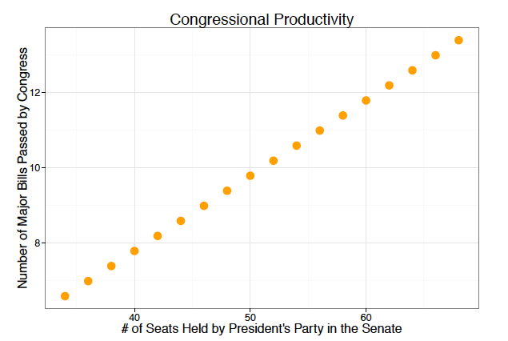
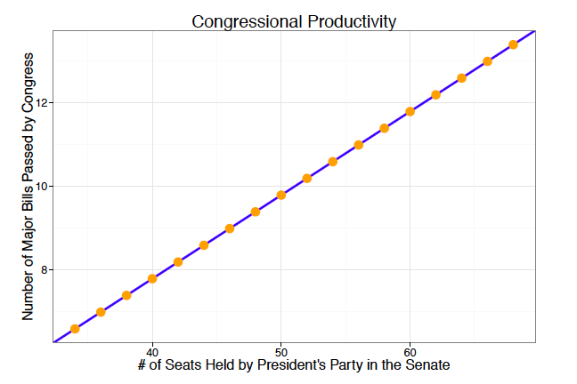
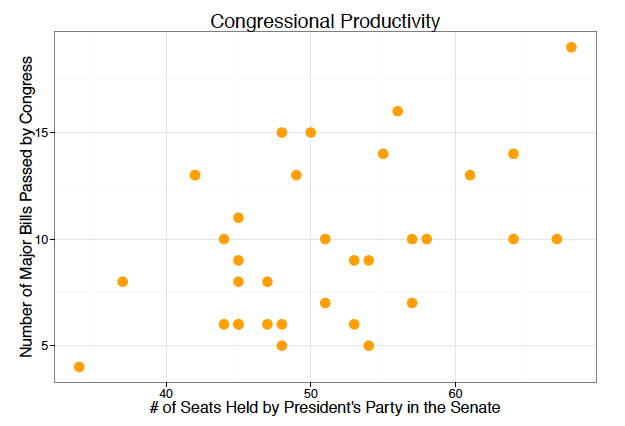
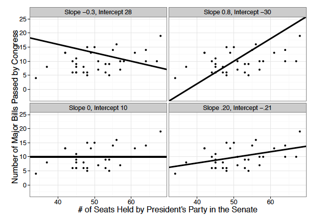
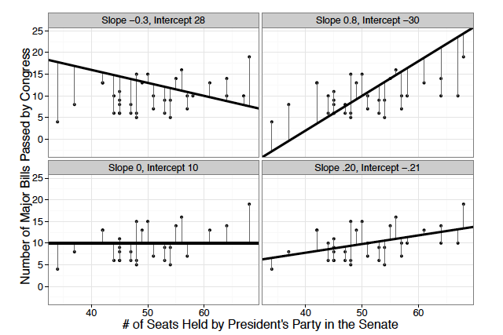
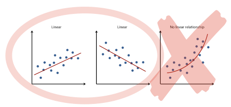
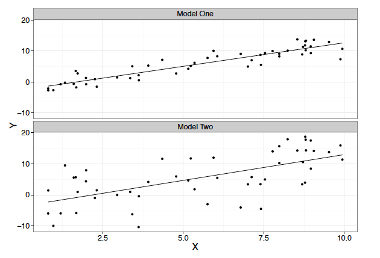

## Learning Objectives {#sec-objectives}

In this reading we introduce linear regression. After reading this material you should be able to:

- State the conditions under which linear regression is an appropriate statistical tool
- Interpret the intercept and slope of a simple linear regression model when (a) the predictor is interval-level and (b) when it is binary
- Calculate the predicted value of the outcome variable for any value of the predictor
- Define and explain how to calculate a residual
- Explain how to test hypotheses involving the intercept and slope and apply these tests to regression results
- Interpret measures of fit from regression analysis

We will build regression in four steps. First, we will use scatterplots and lines to think about relationships between variables. Second, we will define the regression equation, predicted values, and residuals. Third, we will use regression results to interpret intercepts, slopes, and hypothesis tests. Fourth, we will assess how well a model fits the data and see how regression works when the predictor has only two categories.

## Regression {#sec-regression}

Regression is a tool we use to understand the linear relationship between an interval-level **outcome variable** $(Y)$ and one or more explanatory variables $(X)$. The outcome variable is also called the dependent variable, and an explanatory variable the independent variable. In regression, explanatory variables are commonly called **predictors** because the model uses them to predict values of the outcome, and a slope is commonly called the **effect** of its predictor. We use *predictor*, *predicts* and *effect* in this statistical sense; none of them by itself implies that one variable causes the other. We use *predictor* from here on. Predictors may be measured at any level of measurement.

To introduce linear regression we will begin with a research question: Why does Congress pass more legislation in some times than at others? You can likely think of a number of reasons *legislative productivity* might be higher at some times than others.

- The more members of the president's party in the US Senate (and/or House of Representatives), the more productive Congress might be expected to be because they want to pass bills in line with the president's priorities and know they have a partisan advantage so that it would be easier to do so.
- Higher presidential approval ratings might also be expected to increase productivity as members of both parties may be more inclined to enact a president's agenda when the president is more popular.
- We might expect that divided government, on the other hand, would decrease productivity as the House and Senate are led by different parties and are less likely to come to agreement.

Let's say we measure legislative productivity with the variable **bills**, where **bills** is the number of major bills passed per Congress (a 2-year period). This is our outcome variable. And let's say, for now, that our predictor is **pptysen**, the number of members of the president's party in the Senate. Our theoretical expectation leads us to specify the following hypothesis:

::: {.hypothesis}
In a comparison of Congresses, those having more members of the president's party in the Senate will have more major bills passed than will those having fewer members of the president's party in the Senate.
:::

How can we test this hypothesis? We know that we can estimate the correlation between these two interval-level variables and test whether it is positive. But correlation does not tell us how much the predicted number of bills changes as the number of Senate seats held by the president's party changes. Regression provides that estimate. Multiple regression will later allow us to examine the relationship while holding other measured variables constant.

To see how regression analysis works, we'll begin by considering what the relationship between **pptysen** and **bills** would look like in an ideal world. The scatter plot below presents this hypothetical relationship. The predictor $X$, number of seats held by the president's party, is on the $x$-axis. The outcome variable $Y$, number of major bills, is on the $y$-axis. Each observation --- each Congress --- is represented by an ordered pair, $X, Y$, where $X$ denotes the location on the $x$-axis (number of seats held by the president's party in the Senate) and $Y$ denotes the location on the $y$-axis (number of major bills passed).

{fig-alt="Scatter plot of congressional productivity data. The x-axis shows the number of seats held by the president's party in the Senate, ranging from about 30 to 65. The y-axis shows the number of major bills passed by Congress, ranging from about 7 to 14. Points follow a tight upward trend from lower left to upper right, showing a near-perfect positive linear relationship." width="65%"}

We can conclude from the scatter plot that when fewer seats are held by the president's party in the Senate, a smaller number of major bills are passed and when more seats are held by the president's party in the Senate, more major bills are passed. In fact, there is a perfect correlation between the two. Each unit increase in **pptysen** is associated with exactly the same size increase in **bills**: when we draw a line through the cloud of points, all points fall on the line.

{fig-alt="The same congressional productivity scatter plot with a blue regression line added. All data points fall directly on the line, illustrating a perfect linear relationship between Senate seats held by the president's party and number of major bills passed." width="65%"}

We can write the formula for a straight line as

$$Y = \alpha + \beta X.$$

In words, the value of $Y$ is equal to the intercept plus the slope times the value of $X$.

In this equation $Y$ is the outcome variable, $X$ is the predictor, $\alpha$ is the intercept (also called a constant), and $\beta$ is the slope. The intercept gives the value of $Y$ when $X = 0$. The slope is the change in $Y$ when $X$ changes by 1 unit.

In the real world the data are messier. But this is to be expected. We know, for example, that other things also influence the number of important bills that are passed. There is also a *random component* influencing what we observe. Because many factors influence most things we care about, we will never see all the points in a scatter plot fall perfectly on a line. But it still looks like there is a positive relationship. In fact, we can still draw a line through the cloud of points.

{fig-alt="Scatter plot of actual congressional productivity data. The x-axis shows Senate seats held by the president's party, ranging from about 30 to 70. The y-axis shows major bills passed, ranging from about 4 to 19. Points are scattered widely with a weak positive trend, showing much more variation than the ideal-world version." width="65%"}

But how do we decide which line to draw?

The plot below contains four panels, each containing our real world scatter plot. Each panel contains a line with a given intercept and slope drawn through the points. How can we select the equation that describes the line of best fit through all the data points?

{fig-alt="Four scatter plots of actual congressional productivity data, each showing a different candidate regression line. Top left has a negative slope of -0.3 and intercept of 28. Top right has a positive slope of 0.8 and intercept of -30. Bottom left is a flat horizontal line with slope 0 and intercept 10. Bottom right has a small positive slope of 0.20 and intercept of -0.21." width="70%"}

The answer is that we look at the errors. We can draw a vertical line from each data point to the line. The length of this line --- the distance between each observed value of $Y$ and the value predicted by the line --- represents the error. The plot below draws a set of lines through the scatter plot. You can see that the average length of the lines, the size of the error, is larger in some of these examples than in others.

{fig-alt="Four scatter plots of congressional productivity data, each showing a different candidate regression line with vertical lines drawn from each data point to the line. These vertical lines represent the residuals. Lines are shorter when points are close to the regression line and longer when points are farther from it." width="70%"}

In fact, the line that best describes the relationship between seats and bills is the one that minimizes the sum of the squared errors. That is, the vertical distance between the data points and the line is as small as possible. We minimize the squares because if we added up the positive and negative errors they would cancel. (Taking the absolute value is also reasonable, but the math works best with squares.)

If you have a (really) good eye, you can tell that the line in the bottom right above is the best fitting line --- the one with the smallest sum of squared errors.

The equation for this line is given by:

$$\textbf{bills} = -0.21 + (0.20 \times \textbf{pptysen})$$

In words, the predicted number of major bills is equal to $-0.21$ plus $0.20$ times the number of Senate seats held by the president's party.

where **bills** is our outcome variable, $Y$; **pptysen** is our predictor, $X$; $-0.21$ is the estimated intercept; and $0.20$ is the estimated slope.

What does this regression equation tell us about the relationship between **pptysen** and **bills**? Using what we know about the formula for a line, we interpret $-0.21$ as the predicted number of major bills passed when **pptysen** $= 0$. Of course, there has never been a Congress in which the president's party held no seats, but the regression line must cross the $y$-axis somewhere. Notice that the value it predicts there, $-0.21$ bills, is impossible: no Congress can pass a negative number of bills. That is what happens when a line is read outside the range of the data it was fitted to, and it is a good reason to be careful about predictions far from the values actually observed. The slope is $0.20$: each additional Senate seat held by the president's party predicts an average increase of 0.20 major bills.

We can use the regression equation to predict the number of major bills for any given number of seats held by the president's party. All we have to do is replace **pptysen** with a particular value and do some simple algebra. Let's calculate the expected number of bills passed for a Congress when 50 seats are held by the president's party. We'll call it $\widehat{\textbf{bills}}$, where the hat denotes "predicted value of":

$$\widehat{\textbf{bills}} = -0.21 + (0.20 \times 50) = 9.79.$$

Now let's calculate the expected number of major bills for a Congress with 51 seats held by the president's party:

$$\widehat{\textbf{bills}} = -0.21 + (0.20 \times 51) = 9.99.$$

For this (and every other) one-unit change in **pptysen** ($X$), the equation predicts 0.20 more **bills** ($Y$). This is exactly our slope!

Of course we know that not every point falls on the regression line. Our predicted value of **bills** will not (typically) match the actual number of **bills** passed. The difference between the observed $Y$ and the predicted value $\hat{Y}$ is called the **residual**. The population error is denoted $\epsilon_i$; the sample residual is denoted $\hat{\epsilon}_i$ or sometimes $e_i$.

### The population regression line

We typically denote the *population* value for the intercept with $\alpha$ and the *population* value for the slope with $\beta$ and write the population regression line as:

$$Y_i = \alpha + \beta X_i + \epsilon_i.$$

::: {.tip}
**How to read the notation.** The subscript $i$ means "for observation $i$." In this example, each observation is one Congress. So $Y_i$ means the number of major bills passed in Congress $i$, and $X_i$ means the number of seats held by the president's party in the Senate in Congress $i$. A hat, as in $\hat{Y}_i$, means "estimated" or "predicted." A bar, as in $\bar{X}$, means "the sample average." The summation sign, $\sum$, means "add this up across all observations."
:::

In words, the value of $Y$ for observation $i$ is equal to the intercept, plus the slope times the value of $X$ for that observation, plus an error term representing the part of $Y$ not explained by $X$.

Notice that this equation looks a bit different from that above. First, we've added an error term, $\epsilon_i$, to the equation. We do so because even if the population regression line is true, we don't expect perfect predictions. There is a *random component* influencing what we observe, and there may be other factors affecting $Y$ that are not included in the model. Sampling variability is different: it refers to the fact that our estimates, $\hat{\alpha}$ and $\hat{\beta}$, would differ if we had a different sample of data. In addition, we also need to add $i$ subscripts to $Y$, $X$, and $\epsilon$. The $i$ subscript denotes an observation. We say that $i = 1, 2, \ldots, n$, where $n$ is the sample size. The first observation in the data set is $X_1, Y_1$, the second $X_2, Y_2$, etc. The parameters do not have subscripts because the slope and intercept do not vary across observations --- we estimate them from all cases.

### The sample regression line

We write the fitted regression line for the sample data as:

$$\hat{Y}_i = \hat{\alpha} + \hat{\beta} X_i.$$

In words, the predicted value of $Y$ for observation $i$ is equal to the estimated intercept plus the estimated slope times the value of $X$ for that observation. The $\hat{}$ denotes an estimated or predicted value.

We can also write the observed value of $Y_i$ as the fitted value plus the residual:

$$Y_i = \hat{\alpha} + \hat{\beta} X_i + \hat{\epsilon}_i.$$

In words, the observed value of $Y$ equals the value predicted by the regression line plus the prediction error for that observation.

### How do we obtain estimates of $\alpha$ and $\beta$?

Calculus is used to derive the formula for the parameters of the regression line. We won't derive them here, but note that our estimate of the slope is given by $\hat{\beta}$:

$$\hat{\beta} = \frac{\sum [(X_i - \bar{X})(Y_i - \bar{Y})]}{\sum (X_i - \bar{X})^2}.$$

This equation looks intimidating, but the idea is straightforward. The numerator adds up the extent to which $X$ and $Y$ move together. If observations with above-average $X$ also tend to have above-average $Y$, this quantity will be positive. The denominator adds up how much $X$ varies. The slope is therefore the amount of movement in $Y$ associated with movement in $X$, scaled by how much $X$ varies.

Given the slope, we can calculate an estimate of the intercept, $\hat{\alpha}$, by:

$$\hat{\alpha} = \bar{Y} - \hat{\beta}\bar{X}.$$

In words, the estimated intercept is the average value of $Y$ minus the estimated slope times the average value of $X$.

## Assumptions Needed for Linear Regression {#sec-assumptions}

In order to use a linear regression, $Y$ must be measured at the interval level. In addition, we have to make some assumptions. Some of these assumptions matter for whether the line is a useful description of the data. Others matter for whether our hypothesis tests and confidence intervals work well.

- We assume the variables are linearly related. In other words, a unit change in a predictor is associated with the same average change in the outcome variable, no matter what value the predictor takes: as $X$ increases by one unit, regardless of the value of $X$, $Y$ must increase or decrease by the same amount. This allows us to specify the relationship as a line.

  In the figure below the points in the scatter plot on the left increase in a linear fashion. In particular, it appears that as $X$ increases, $Y$ increases, on average, by the same amount. The relationship in the middle suggests a negative, linear relationship: as $X$ increases, $Y$ decreases by the same amount, on average. But in the scatter plot on the right we see that as $X$ increases, the value of $Y$ increases by larger amounts. This indicates a nonlinear relationship.

{fig-alt="Three small scatter plots. The first shows a clear positive linear trend and is labeled Linear. The second shows a clear negative linear trend and is labeled Linear. The third shows a curved, nonlinear relationship, is labeled No linear relationship, and is marked with a large red X indicating linear regression is not appropriate for this type of relationship." width="60%"}

  Before estimating a regression, always plot your data to check whether the linearity assumption is reasonable. A residual plot --- plotting residuals against fitted values --- can also reveal nonlinearity after estimation. If the assumption is violated, transformations of $X$ or $Y$ (such as taking the logarithm) may help.

- The model is appropriately specified for the question we are asking. In particular, we have not omitted any variables from the regression equation that are related to both the predictor and the outcome variable. This matters especially if we want to interpret the regression as evidence of a causal relationship. We'll consider how to determine what variables to include in our model in a later lesson.

- The errors have a mean of zero. This means the model does not systematically overpredict or underpredict $Y$ once we take $X$ into account.

- The errors are independent. This means that the error for one observation should not tell us the error for another observation. For example, if we are studying Congresses over time, we should worry if errors in one Congress are closely related to errors in the next Congress.

- The errors have constant variance. This means the size of the errors should be roughly similar across the range of $X$. We do not want very small errors for some values of $X$ and very large errors for others.

- The errors are normally distributed, especially when the sample size is small. When we say that errors are normally distributed, we mean that if you were to plot the distance from the actual $Y$-value to the expected $Y$-value based on the line, the resulting plot would be a normal distribution with a mean at 0 and a variance of $\sigma^2$:

$$\epsilon_i \sim N(0, \sigma^2).$$

In words, this says the error for observation $i$ is normally distributed with mean 0 and variance $\sigma^2$. The standard deviation of the errors is $\sigma$.

## An Example {#sec-example}

Consider a regression in which **bills** is a function of **Presidential Popularity**. Assume we've estimated this regression and have obtained the following estimates:

$$\widehat{\textbf{bills}}_i = 8.00 + 0.03 \times \textbf{Presidential Popularity}_i.$$

In words, the predicted number of major bills for Congress $i$ is equal to 8.00 plus 0.03 times presidential popularity in that Congress.

### Interpreting the intercept

Here the estimated intercept, $\hat{\alpha}$, is 8.00. Recall that the intercept tells us the expected value of the outcome variable when the predictor takes a value of zero. In this example, we interpret the intercept as follows: "When **Presidential Popularity** $= 0$, the number of **bills** we expect Congress to pass is 8.00."

Often the intercept will be of no interest to us because the predictor never takes the value of zero in the data. But we still need to estimate an intercept (otherwise it is by definition zero) as it ensures the residuals have a mean of zero.

### Interpreting the slope

In this example, the estimated slope, $\hat{\beta}$, equals 0.03. The slope tells us the expected change in the outcome variable for any one-unit increase in the predictor. Thus we conclude from this equation that "For every one-unit (percentage point) increase in presidential popularity, the number of bills we expect Congress to pass increases by 0.03."

Note the unit carefully. **Presidential Popularity** is measured in percentage points, so a one-unit increase is a one-*percentage-point* increase --- popularity moving from 40 to 41 --- not a one-*percent* relative increase, which would take it only to 40.4. The two are easy to confuse in writing and mean different things. Watch for this in any variable whose name ends in *percent* or *rate*.

::: {.caution}
**Association, not necessarily causation.** A regression slope tells us how $Y$ changes on average as $X$ changes. It does not automatically prove that changing $X$ would cause $Y$ to change. Causal interpretation requires a research design and assumptions about omitted variables, timing, and alternative explanations.
:::

### Calculating predicted values

We can calculate $\hat{Y}_i$, the predicted value of $Y_i$ based on $\hat{\alpha}$ and $\hat{\beta}$, by plugging in a given value of $X$ into the formula for the regression line:

$$\widehat{\textbf{bills}}_i = 8.00 + 0.03 \times \textbf{Presidential Popularity}_i.$$

In words, plug a value of presidential popularity into the equation, multiply it by 0.03, and add 8.00.

For example, if **Presidential Popularity** $= 40\%$ we have:

$$\widehat{\textbf{bills}}_i = 8.00 + 0.03 \times 40 = 9.2.$$

::: {.callout-note appearance="minimal" title="Pause and check"}
If **Presidential Popularity** were 60%, what would the model predict? Would that predicted value be higher or lower than the prediction when popularity is 40%?
:::

### Calculating the residual

A residual is the error in our predictions. We calculate it as the difference between the observed and predicted value of $Y$ for a sample observation. Assume that **Presidential Popularity** has a value of 40% for one Congress and that the actual number of bills passed in that Congress was 12. Then the residual is given by:

$$\hat{\epsilon}_i = \textbf{bills}_i - \widehat{\textbf{bills}}_i = 12 - 9.2 = 2.8.$$

In words, the residual is the actual value of **bills** minus the value predicted by the regression line.

The actual number of bills passed was 2.8 bills more than we predicted based on the model. We interpret this value to mean that we underpredicted the number of **bills** passed by Congress for this observation by 2.8 bills.

We can calculate the residual for all observations, $i$, in the data. Plots of the residuals are often used to diagnose whether or not we've met the regression assumptions listed above.

::: {.callout-note appearance="minimal" title="Pause and check"}
If the actual number of bills had been 7 instead of 12, would the residual have been positive or negative? What would that tell us about whether the model overpredicted or underpredicted for that observation?
:::

## Hypothesis Testing in Regression Analysis {#sec-hypothesis}

How do we determine whether $X$ significantly predicts $Y$? In a linear regression, the answer depends on whether the population slope differs from zero. If $\beta = 0$, the predicted value of $Y$ does not increase or decrease as $X$ increases. We therefore test the null hypothesis that $\beta = 0$.

In principle, we can test both the intercept ($H_0: \alpha = 0$) and the slope ($H_0: \beta = 0$) using the same procedure. In practice our substantive interest is almost always in the slope --- whether $X$ predicts $Y$ --- so we focus on it here. The same five steps apply to the intercept when needed. To test this hypothesis we follow the same steps as with all other hypothesis tests.

**Step 1. State the null hypothesis.** $H_0: \beta = 0$.

**Step 2. State the alternative hypothesis.** $H_A: \beta \ne 0$. While our hypothesis predicts the direction of the relationship, the norm is to do a two-tailed hypothesis test. We will always specify the alternative in this manner.

**Step 3. Compute the test statistic.** Our test statistic follows the same form as the other hypothesis tests we have conducted: the **estimated value** minus the **hypothesized value** divided by the **standard error of the estimate**. The test statistic follows a $t$ distribution.

$$t = \frac{\hat{\beta} - \beta_0}{SE(\hat{\beta})} = \frac{\hat{\beta}}{SE(\hat{\beta})}$$

In words, the $t$-statistic tells us how many standard errors the estimate is away from the value stated in the null hypothesis. When the null hypothesis is $\beta = 0$, the $t$-statistic is the estimated slope divided by its standard error.

**Step 4. Translate the test statistic into a p-value.** R will compute the p-value for us. In the R regression tutorial we will learn how to estimate the linear regression. The output will provide estimates of $\hat{\alpha}$ and $\hat{\beta}$ as well as the $t$-statistics and p-values. R also reports an F-statistic at the foot of the output; with a single predictor it tests the same thing as the slope's $t$-test, so we set it aside until the next lesson. We can also calculate an approximate confidence interval for the estimate as $\hat{\alpha} \pm 1.96 \times SE(\hat{\alpha})$ or $\hat{\beta} \pm 1.96 \times SE(\hat{\beta})$. The 1.96 rule is a useful approximation; R will use the appropriate $t$ distribution when it calculates the exact p-value and confidence interval.

**Step 5. Draw a conclusion.** Recall that in order to determine whether to reject or fail to reject the null hypothesis in favor of the alternative hypothesis, we compare the p-value in step four to a pre-selected significance level --- the probability of rejecting the null hypothesis when the null hypothesis is true. Assuming we set that level at 0.05, then if the p-value is less than 0.05 we reject $H_0$ --- the data are sufficiently surprising under the null that we conclude the true parameter value differs from zero. If the p-value is greater than 0.05, we fail to reject $H_0$. Similarly, if the absolute value of the $t$-statistic is greater than about 1.96 or the confidence interval does not include zero, we can reject the null hypothesis. You can use any of these decision rules; all will give the same result. If we can reject the null hypothesis, we conclude there is a statistically significant relationship between $X$ and $Y$.

One note on what these tests mean here. The 34 Congresses in these data are not a random sample drawn from some larger population of Congresses; they are all of the Congresses in the period studied. The hypothesis tests still ask a meaningful question: whether the observed pattern is consistent with a more general relationship that could recur across comparable periods. That interpretation treats the observed cases as one realization of a broader political process.

Below is a table summarizing the regression results. We will learn how to create tables like this in R. Notice how the results are presented. For each estimated coefficient, the estimate itself is presented with the standard error below it in parentheses. Also reported are the sample size, $N$, and measures of the fit of the model, to which we turn next.

<strong>Table 1: Regression Results</strong>

| | Model 1 |
|:--|--:|
| (Intercept) | −0.21 |
| | (3.74) |
| POTUS Party Senate Seats | 0.20\* |
| | (0.07) |
| | |
| N | 34 |
| $R^2$ | 0.18 |
| Residual standard error | 3.38 |

Standard errors in parentheses. \* indicates significance at $p < 0.05$.

It is possible to present the $t$-statistic or p-value in a regression table, but the norm is to report the standard errors of the estimated coefficients and to place symbols denoting the level of significance associated with the estimate next to the estimate in the table. Here one asterisk denotes the coefficient has a p-value less than 0.05.

## Assessing Model Fit {#sec-fit}

We want to know how well our regression line fits the data. There are two ways to assess model fit: the $R^2$ and the residual standard error, which is also called the residual standard deviation.

::: {.callout-note appearance="minimal"}
$R^2$ gives the **proportion of the variation in $Y$ explained by the model**.
:::

$R^2$ is calculated as:

$$R^2 = \frac{\sum (\hat{Y}_i - \bar{Y})^2}{\sum (Y_i - \bar{Y})^2}.$$

In words, $R^2$ compares the variation explained by the model to the total variation in $Y$.

The numerator is the sum of the squares explained by the model --- the sum of the distances between the estimated $\hat{Y}$ from the model and the mean value of $Y$, which is our best guess absent any predictors. The denominator is the sum of the squares in the data, or how far from the mean the raw data are. The more our predictor(s) help us predict $Y$, the better the model explains $Y$, the larger the numerator, and the larger $R^2$. An $R^2 = 0.18$ can be interpreted by saying "the model explains 18% of the variation in $Y$." $R^2$ is sample specific: **do not** compare $R^2$ across samples. Generally, *bigger* is better.

Just how big is big enough? The answer depends on how hard it is to explain $Y$. We might be satisfied with a fairly small value if $Y$ is intrinsically difficult to explain, usually when there is a lot of inherent randomness to the values $Y$ takes. But note that if you estimate a model with real applied social science data and $R^2 = 1.0$, you've done something wrong and need to recheck your model, your data, and your coding.

The residual standard error is another measure of fit. It is the standard deviation of the residuals, and some tables label it the residual standard deviation. It is calculated as:

$$\hat{\sigma} = \sqrt{\frac{\sum (Y_i - \hat{Y}_i)^2}{n - 2}} = \sqrt{\frac{\sum (Y_i - (\hat{\alpha} + \hat{\beta} X_i))^2}{n - 2}}.$$

In words, this takes each prediction error, squares it, adds those squared errors together, divides by the degrees of freedom, and then takes the square root so the result is back in the units of $Y$. A closely related quantity, the root mean squared error, divides by $n$ rather than by the degrees of freedom.

The formula illustrates that if our predicted values of $Y$ from the model are close to the observed values, the numerator will be smaller. Thus a smaller value of the residual standard error indicates a better model fit. If the residuals are approximately normally distributed, we interpret the residual standard error just like any other standard deviation: roughly 68% of the errors fall within 1 residual standard deviation of the regression line and roughly 95% of the errors fall within 2 residual standard deviations of the regression line. Generally, *smaller* is better as this means the $Y$ are closer to the regression line and the residuals are on average smaller.

In the plot below, the $R^2$ in the top panel is larger and the residual standard error is smaller than in the bottom panel --- the errors are on average closer to the line in the top panel, indicating the better fit of the top regression.

{fig-alt="Two scatter plots stacked vertically, both showing a positive linear relationship between X and Y with a regression line. In the top panel labeled Model One, the data points cluster tightly around the regression line, indicating a good fit. In the bottom panel labeled Model Two, the data points are more spread out from the regression line, indicating a poorer fit." width="60%"}

Let's look at some regression output tables and compare model fit. In Table 2 we have two different bivariate regression models with the same outcome variable **bills**. In model 1, the regression includes **pptysen**, the number of Senate seats held by the president's party, labeled here as "POTUS Party Senate Seats." In model 2, the regression includes "POTUS Party House Seats." Model 1 has an $R^2 = 0.18$. Model 2 has an $R^2 = 0.24$. Thus model 1 explains 18% of the variation in **bills** while model 2 explains slightly more at 24%. We can also see model 2 has a smaller residual standard error, 3.27, compared to model 1, which has a residual standard error of 3.38. Thus model 2 has a bigger $R^2$ and a smaller residual standard error, and thus a better fit than model 1. In short, the House model accounts for somewhat more of the variation in **bills** than the Senate model does. That is a statement about how well each model fits these data, not a ranking of which chamber matters more. 

Adjusted $R^2$ is a version of $R^2$ that accounts for the number of predictors in the model. We will return to adjusted $R^2$ when we discuss multiple regression.

<strong>Table 2: Models of Number of Major Bills Passed</strong>

| | Model 1 | Model 2 |
|:--|--:|--:|
| (Intercept) | −0.21 | −0.01 |
| | (3.74) | (3.16) |
| POTUS Party Senate Seats | 0.20\* | |
| | (0.07) | |
| POTUS Party House Seats | | 0.05\* |
| | | (0.01) |
| | | |
| N | 34 | 34 |
| $R^2$ | 0.18 | 0.24 |
| Adjusted $R^2$ | 0.16 | 0.21 |
| Residual standard error | 3.38 | 3.27 |

Standard errors in parentheses. \* indicates significance at $p < 0.05$.

Consider a second example given in the table below. Here we model $Y$ as a function of the predictor $X_1$ in model 1 and as a function of $X_2$ in model 2. Which model fits the data better?

<strong>Table 3: Model Fit Comparison</strong>

| | Model 1 | Model 2 |
|:--|--:|--:|
| (Intercept) | −2.56\* | −3.66\* |
| | (0.58) | (1.79) |
| $X_1$ | 1.52\* | |
| | (0.09) | |
| $X_2$ | | 1.66\* |
| | | (0.29) |
| | | |
| N | 50 | 50 |
| $R^2$ | 0.85 | 0.41 |
| Residual standard error | 1.94 | 6.00 |

Standard errors in parentheses. \* indicates significance at $p < 0.05$.

Clearly $R^2$ is much bigger in model 1 ($0.85 > 0.41$) and the residual standard error is much smaller ($1.94 < 6.00$). Thus we know model 1 fits the data better. We can say more. Model 1 explains 85% of the variation in $Y$, and the typical distance between an observed $Y$ and the regression line is about 1.94 units.

::: {.callout-note appearance="minimal" title="Pause and check"}
If two models have the same outcome variable and are estimated using the same data, which model fits better: the one with the larger $R^2$, the one with the smaller residual standard error, or both?
:::

## Simple Regression with Binary Predictors {#sec-dichotomous}

What if our predictors are not interval-level? Linear regression can be used even when the predictor is not interval. Often, our variables have only two categories --- the sex of an individual (male or female), the presence (or absence) of a particular voter identification law in a state, or whether a county is or is not in "the south." A predictor like that goes by several names --- *dichotomous*, *dummy*, and **binary** --- all three of which appear in published work. We use *binary* from here on.

We will consider the binary predictor **filunif**, which is 0 if government is divided and 1 if it is unified (the House, Senate, and presidency are all held by the same party). We state the following hypothesis:

::: {.hypothesis}
In a comparison of Congresses, those in which government is unified will have more major bills passed than will those in which government is divided.
:::

In a simple regression model with a single binary predictor, the slope estimates the same comparison a difference-of-means test makes. The interpretation depends on how the variable is coded. The group coded 0 is the **reference category**: it is the group the intercept describes, and the group the other one is compared against.

We will learn to read the full R output in the tutorial. For the reading, it is more useful to present the same information in cleaner tables. First, compare the mean number of major bills passed under divided and unified government.

<strong>Table 4: Average Number of Major Bills by Type of Government</strong>

| Type of Government | Value of **filunif** | Mean Number of Major Bills |
|:--|--:|--:|
| Divided government | 0 | 9.14 |
| Unified government | 1 | 13.20 |
| Difference: Unified $-$ Divided | | 4.06 |

The p-value for the difference in means is 0.020.

We see that the mean under divided government was 9.14 major bills and under unified government it was 13.20 major bills. In words, Congresses with unified government passed about 4.06 more major bills, on average, than Congresses with divided government. The difference of 4.06 is statistically significant because the p-value is less than $\alpha = 0.05$.

Now consider the same relationship as a regression in which **bills** is a function of **filunif**.

<strong>Table 5: Regression of Major Bills on Unified Government</strong>

| | Model 1 |
|:--|--:|
| (Intercept) | 9.14\* |
| | (0.64) |
| Unified Government | 4.06\* |
| | (1.66) |
| | |
| N | 34 |
| $R^2$ | 0.16 |
| Residual standard error | 3.44 |

Standard errors in parentheses. \* indicates significance at $p < 0.05$.

The slope estimate for **filunif** is exactly the same as the mean difference above, 4.06, and here the p-value matches too, 0.020. This is why a regression with one binary predictor gives us the same substantive conclusion as a difference of means test.

### Interpreting a binary predictor

Interpreting the effect of a binary predictor is straightforward. As usual, $\hat{\alpha}$ is the average or expected value of $Y$ when $X = 0$ --- in this case, the expected number of major bills passed under divided government. We can interpret $\hat{\alpha} + \hat{\beta}$ as the average value of $Y$ when $X = 1$, that is, the expected number of bills under unified government. And $\hat{\beta}$ is the difference in the average value of $Y$ between the two groups: when $X = 0$ versus $X = 1$.

Let's interpret the results from our regression above. What is the average number of bills passed in Congress under divided government? We can write the fitted regression line as

$$\widehat{\textbf{bills}} = \hat{\alpha} + \hat{\beta} \times \textbf{filunif}$$

which we know from Table 5 is

$$\widehat{\textbf{bills}} = 9.14 + 4.06 \times \textbf{filunif}.$$

In words, the predicted number of major bills is equal to 9.14 plus 4.06 times the value of **filunif**.

Because **filunif** $= 0$ when there is divided government, we calculate the expected number of bills passed when there is divided government by substituting 0 for **filunif**:

$$\widehat{\textbf{bills}} = 9.14 + 4.06 \times 0 = 9.14$$

which is $\hat{\alpha}$.

What is the average number of bills passed in Congress under unified government? **filunif** $= 1$ when there is unified government, so now we replace **filunif** with 1:

$$\widehat{\textbf{bills}} = 9.14 + 4.06 \times 1 = 13.20$$

which is $\hat{\alpha} + \hat{\beta}$.

Finally, what is the difference in the average number of bills passed in Congress under unified and divided government? It is the difference in the average value of $\widehat{\textbf{bills}}$ when **filunif** $= 0$ and **filunif** $= 1$: $13.20 - 9.14 = \hat{\beta} = 4.06$.

::: {.callout-note appearance="minimal" title="Coding matters"}
The interpretation depends on the coding. If **filunif** were coded the other way, so that unified government were 0 and divided government were 1, the intercept and slope would change. The underlying group means would not change, but the slope would describe the difference in the opposite direction.
:::

## The Takeaways {#sec-takeaways}

Linear regression is the workhorse model for explaining the variation in a variable measured at the interval level. In this overview of regression, we have focused on the simplest case where there is one predictor. In future lessons we will illustrate how to use linear regression with multiple predictors. At this stage, you should be able to interpret the results from a regression table, including interpreting the substantive meaning of the intercept and slope estimates; conduct hypothesis tests as to the statistical significance of the intercept and slope; and assess model fit using both $R^2$ and the residual standard error. You should also be able to calculate predicted values from the regression model and to calculate the prediction error for any given observation, which is the residual value for that observation. To summarize:

The estimated intercept, $\hat{\alpha}$, gives the expected value of $Y$, $E(Y)$, when $X = 0$. This quantity will not always be substantively meaningful as $X$ may not equal zero in the data, but it is a necessary part of the regression equation.

The estimated slope, $\hat{\beta}$, for an interval-level predictor tells us how much the predicted value of $Y$ changes, on average, for a one-unit increase in $X$. Always interpret the slope using the actual units of the variables. For example, say, “Each additional Senate seat held by the president's party predicts 0.20 more major bills, on average,” rather than referring only to a “one-unit change.” Be careful not to reverse the relationship: the slope tells us the predicted change in $Y$ for a one-unit increase in $X$, not the change in $X$ for a one-unit increase in $Y$.

The estimated slope for a binary predictor tells us the *difference* between the expected value of $Y$ when that variable takes a value of one compared to when it takes a value of zero.

Hypothesis testing can be conducted on both the intercept and slope in three different ways. If the t-statistic is greater than 1.96 in absolute value, the p-value is less than 0.05, or the confidence interval around the estimate does not include zero, then we reject the null hypothesis that the estimated coefficient equals zero. Recall that a p-value tells us the probability of observing a result as extreme as ours --- or more extreme --- if the null hypothesis were true. It is not the probability that the null hypothesis is true.

We assess the fit of our model to know how well our model does at accounting for the variation in the outcome variable. $R^2$ tells us the proportion of the variation in $Y$ accounted for by the model. Often we multiply it by 100 and state "$X$% of the variation in the outcome variable is accounted for by the model." The residual standard error, also called the residual standard deviation, tells us the typical size of our prediction error, or the typical size of the residuals, measured in units of the outcome variable. We want to have a model with a larger $R^2$ and a smaller residual standard error. Keep in mind that a statistically significant slope and a large $R^2$ are answering different questions. A relationship can be statistically distinguishable from zero and precisely estimated --- and therefore highly significant --- while the model still leaves most of the variation in $Y$ unexplained. A significant slope tells you the relationship is statistically distinguishable from zero; $R^2$ tells you how much of the outcome's total variation that relationship accounts for.

We can calculate the predicted value of the outcome variable for a given value of the predictor from the regression line by substituting the value of $X$ into the equation and solving. If we want to know the expected value of $Y$ when $X = 10$ and our regression line is given by $Y = 5 + 2X$ then $\hat{Y} = 5 + 2(10) = 25$.

The sample residual, $\hat{\epsilon}_i$ or $e_i$, gives the error in our prediction: $Y_i - \hat{Y}_i = \hat{\epsilon}_i$. The population error term is $\epsilon_i$.
